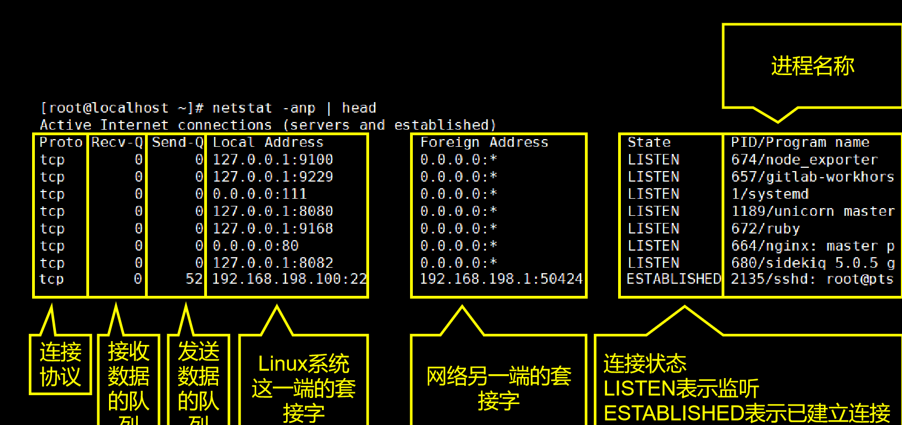

# 第一章 目录和文本文件相关命令

## 1.1 Linux文件系统

Linux 系统环境下的文件系统和 Windows 有很大区别。 Linux 系统中不管创建了多少个硬盘分区都只有一个文件系统，整个文件系统的根目录是 `/` ，从 `/` 出发可以找到 Linux 系统中的所有目录和文件。

|     目录名     | 是否重要 |                             作用                             |
| :------------: | :------: | :----------------------------------------------------------: |
|      /bin      |          |     bin是binary的缩写，这个目录存放着最经常使用的命令。      |
|     /boot      |          |         这里存放的是启动Linux时用到的引导程序文件。          |
|      /dev      |          |    device(设备)的缩写，该目录下存放的是Linux的外部设备。     |
|      /etc      |    ⭐     |             存放系统和第三方应用程序的配置文件。             |
|     /home      |    ⭐     |                     存放普通用户家目录。                     |
| /lib 和 /lib64 |          |            系统开机所需要最基本的动态连接共享库。            |
|     /media     |          |       挂载Linux系统会自动识别的设备，例如U盘、光驱等。       |
|      /mnt      |          |                   专门用于挂载操作的目录。                   |
|      /opt      |    ⭐     |          存放安装第三方应用程序时使用的压缩包文件。          |
|     /proc      |          |        这个目录是一个虚拟的目录，它是系统内存的映射。        |
|     /root      |    ⭐     |                 超级管理员root用户的家目录。                 |
|      /run      |          |          存放进程产生的临时文件，关机重启后会消失。          |
|     /sbin      |          | s是Super User的意思，这里存放的是系统管理员使用的系统管理程序。 |
|      /srv      |          |   service缩写，该目录存放一些服务启动之后需要提取的数据。    |
|      /sys      |          |      该目录下安装了2.6内核中新出现的一个文件系统sysfs。      |
|      /tmp      |          |                        存放临时文件。                        |
|      /usr      |    ⭐     | 应用程序的默认安装目录，类似于Windows下的program files目录。 |
|      /var      |    ⭐     |              存放经常变化的内容，例如日志文件。              |

假设当前登录用户为zhangsan, 请写出张三的宿主目录 —— /home/zhangsan   ==    ~

请使用两种方式来表示一个用户的宿主目录，如itcast用户 —— /home/itcast   或 ~

什么是绝对路径，从跟目录开始   /home/itcast

什么是相对路径，相对于当前目录来说的     ../itcast    ./itcat    itcast/aa/bb

在linux中 . 表示当前目录

在linxu中 .. 表示当前目录的上一级目录

怎么切换临近两个目录？cd -

Linux终端中的提示字符串：itcast@itcast:~$   第一个itcast表示当前登录的用户，第二个itcast表示什么主机名，~表示什么当前所在的目录位置，$表示普通用户，如果该字符换成#表示超级用户  -- root

## 1.2 快捷键

- 命令行环境下快捷键：

|      按键      |       作用       |
| :------------: | :--------------: |
|    Ctrl + l    |       清屏       |
|    Ctrl + c    |   强制终止程序   |
| Ctrl + Insert  |       复制       |
| Shift + Insert |       粘贴       |
|    Ctrl + s    |       锁屏       |
|    Ctrl + q    |     解除锁屏     |
|      tab       |     自动补全     |
|     whoami     | 查看当前登录用户 |

## 1.3 chmod

Linux/Unix 的文件调用权限分为三级 : 文件所有者（Owner）、用户组（Group）、其它用户（Other Users）。


```shell
# 修改文件访问权限的命令是 chmod
# 文件权限分别是哪几个，这几个权限对应的数字是几？
	R – 4
	W – 2
	X – 1
	- - 0
# 使用文字设定法给hello.c文件的所属用户itcast添加执行权限,u 表示该文件的拥有者，g 表示与该文件的拥有者属于同一个群体(group)者，o 表示其他以外的人，a 表示这三者皆是。+ 表示增加权限、- 表示取消权限、= 表示唯一设定权限。
chmod u+x hello.c
其他参数说明：
-c : 若该文件权限确实已经更改，才显示其更改动作
-f : 若该文件权限无法被更改也不要显示错误讯息
-v : 显示权限变更的详细资料
-R : 对目前目录下的所有文件与子目录进行相同的权限变更(即以递归的方式逐个变更)
--help : 显示辅助说明
--version : 显示版本
# 示例
# 文件 file1.txt 设为所有人皆可读取 :
chmod ugo+r file1.txt 或 chmod a+r file1.txt
# 将目前目录下的所有文件与子目录皆设为任何人可读取 :
chmod -R a+r *
# 将文件 file1.txt 与 file2.txt 设为该文件拥有者，与其所属同一个群体者可写入，但其他以外的人则不可写入 
chmod ug+w,o-w file1.txt file2.txt
# 也可用数字表示权限和，例如对file的所有者和用户组设置读写权限, 为其其他用户设置读权限
chmod 664 file.txt
```

## 1.4 chown

chown（英文全拼：**change owner**）命令用于设置文件所有者和文件关联组的命令。chown 需要超级用户 **root** 的权限才能执行此命令。只有超级用户和属于组的文件所有者才能变更文件关联组。非超级用户如需要设置关联组可能需要使用 [chgrp](https://www.runoob.com/linux/linux-comm-chgrp.html) 命令。

```shell
chown [-cfhvR] [--help] [--version] user[:group] file...
参数 :
user : 新的文件拥有者的使用者 ID
group : 新的文件拥有者的使用者组(group)
-c : 显示更改的部分的信息
-f : 忽略错误信息
-h :修复符号链接
-v : 显示详细的处理信息
-R : 处理指定目录以及其子目录下的所有文件
--help : 显示辅助说明
--version : 显示版本
# 把 /var/run/httpd.pid 的所有者设置 root
chown root /var/run/httpd.pid
# 将文件 file1.txt 的拥有者设为 runoob，所属组 runoobgroup :
chown runoob:runoobgroup file1.txt
# 将当前前目录下的所有文件与子目录的拥有者皆设为 runoob，所属组 runoobgroup
chown -R runoob:runoobgroup *
# 把 /home/runoob 的关联组设置为 512 （关联组ID），不改变所有者：
chown :512 /home/runoob
```

## 1.5 mkdir

```shell
mkdir [-pv] 新目录的路径
●  参数 -pv 表示创建多层目录。 
●  作用：创建目录。 
# 示例：创建单层目录 
mkdir aaa
# 示例：创建多层目录
mkdir -pv bbb/ccc
```

## 1.6 ls

```shell
ls [-l][-A][-R] 文件或目录的路径
● 参数 -l 以详细信息形式显示资源。 
●  参数 -A 显示目录内容时把隐藏资源也显示出来。 
●  参数 -R 递归查看目录内容。 
●  命令的参数既可以单独使用也可以组合使用。同时 ls -l 可以简写为 ll 。 
●  作用：列出目录中的内容，这里所说的目录可以是当前目录也可以是其他目录（需要指定路径）。 
```

## 1.7 touch

```
touch 新建文件的路径
作用：创建空文件。 
```

## 1.8 cp

```shell
# 复制文件命令：
cp 被复制的文件的路径 目标目录的路径
# 复制目录命令：参数 -r 等同于 -R 
cp -r 被复制的目录的路径 目标目录的路径
```

## 1.9 mv

```
mv 被移动的文件或目录的路径 目标目录
# 将目录或文件在当前位置移动可以起到重命名的作用。
```

## 1.10 rm

```shell
# 删除文件命令：
rm 被删除文件的路径
# 强制删除文件命令：
rm -f 被删除文件的路径
# 递归删除目录：
rm -r 被删除的目录的路径
# 强制删除目录：
rm -rf 被删除的目录的路径
```

## 1.11 vim

### 1.11.1 简介

```shell
# 作用：在命令行环境下编辑文本文件
# 打开一个文件（文本不存在则新建一个文件）
vim content.txt
```

### 1.11.2 三种模式


### 1.11.3 基本操作

```shell
# 1、新建一个文件
vim content.txt
# 2、进入编辑模式（按一下 i 键）
i
# 3、随意输入一些内容
# 4、按 Esc 键回到一般模式
Esc
# 5、显示行号：在一般模式，输入英文冒号（:），然后输入 set nu 就可以显示行号了。
:set nu
# 6、保存已修改的内容（执行完 :set nu 指令后，vim 又回到一般模式，使用 :w 指令可以保存文件）：
:w
# 7、退出（使用 :q 指令就可以退出 vim 了）：
:q
# 8、保存退出
:wq
# 9、不保存退出
:q!
```

### 1.11.4 看

① 上下左右移动光标

方法一：上下左右键移动光标。

方法二：就在基准键上。h—向左移动光标，j—向下移动光标，k—向上移动光标，l—向右移动光标。

② 前往指定行：

- 第一行：

```shell
gg
```

```shell
1 + shift + g
```

- 最后一行：

```shell
shift + g
```

- 指定行号（n 表示行号）：

```shell
n + shift + g
```

### 1.11.5 改

这里我们说的是在一般模式下通过按键来编辑文件，并不是进入编辑模式

|   按键   |                             效果                             |
| :------: | :----------------------------------------------------------: |
|    dd    |                   删除（剪切）光标所在的行                   |
|   ddp    |                          交换上下行                          |
|   d5d    | 从光标所在行开始，向下连续删除（剪切）5行（包括光标所在行）  |
|    u     |                        撤销刚才的操作                        |
| Ctrl + r |                      重做刚才撤销的操作                      |
|    yy    |                       复制光标所在的行                       |
|    p     |           将当前复制的行粘贴到光标所在位置的下一行           |
|    P     |           将当前复制的行粘贴到光标所在位置的前一行           |
|   y5y    |     从光标所在行开始，向下连续复制5行（包括光标所在行）      |
|    r     | 替换光标所在位置的一个字符。第一步：按一下 r 键 第二步：输入新的字符 |
|    >>    |                        将整行向右缩进                        |
|    <<    |                        将整行向左退回                        |

### 1.11.6 编

看看有哪些方法可以进入编辑模式

| 按键 | 大小写说明 |                           光标动作                           |
| :--: | :--------: | :----------------------------------------------------------: |
|  i   |    小写    |               不动，就在 `当前位置` ，开始输入               |
|  I   |    大写    |                 移动到 `行的开头` ，开始输入                 |
|  a   |    小写    |              光标 `向后移动一格` ，然后开始输入              |
|  A   |    大写    |             光标移动到 `行的末尾` ，然后开始输入             |
|  o   |    小写    | 先在光标所在行的 `下面插入空行` ，然后把光标移动到空行的开头，再开始输入 |

### 1.11.7 搜

```shell
# 1、初始状态（一般模式）
# 2、进入指令模式（专门用于搜索关键词的指令模式）：
/
# 3、输入关键词（比如搜java这个词）：
java
# 4、回车执行搜索（关键词匹配到的内容会高亮显示）
# 5、遍历匹配内容（在匹配到搜索结果后，可以逐个遍历各个匹配内容）：
# 向下找
n
# 向上找
shift + n
# 6、取消高亮显示：
:noh
# 7、将文件另存为其它文件名
:w newFileName
# 8、使本行内容居中
:ce
# 9、使本行内容靠右
:ri
# 10、使本行内容靠左
:le
```

### 1.11.8 替

1、准备文件内容如下：

```shell
Oh,hello tom!Do you think this is a good time for me to say hello to Lily?
Oh,hello tom!Do you think this is a good time for me to say hello to Lily?
Oh,hello tom!Do you think this is a good time for me to say hello to Lily?
Oh,hello tom!Do you think this is a good time for me to say hello to Lily?
Oh,hello tom!Do you think this is a good time for me to say hello to Lily?
Oh,hello tom!Do you think this is a good time for me to say hello to Lily?
Oh,hello tom!Do you think this is a good time for me to say hello to Lily?
Oh,hello tom!Do you think this is a good time for me to say hello to Lily?
Oh,hello tom!Do you think this is a good time for me to say hello to Lily?
```

2、执行替换：

```shell
:%s/hello/hi
```

命令解释：


> 注意：这时每一行只有第一个匹配到的内容被替换了，后面的没有被替换。这是因为对正则表达式来说，它是以行为单位查找匹配的内容。每一行只要找到第一个匹配那么就可以判断这一行就是匹配的，没有必要继续向后查找了。如果我们需要将一行中的每一个匹配都替换，可以在指令后加 `/g` 。

3、全部替换：

```
:%s/hello/hi/g
```

## 1.12 more

```shell
# 从前向后分页显示文件内容
more 文件路径
```

| 按键   | 效果             |
| ------ | ---------------- |
| 回车   | 向下滚动一行     |
| 空格   | 向下滚动一页     |
| Ctrl+B | 向上滚动一页     |
|        | 输出当前行的行号 |
| q      | 退出more         |

## 1.13 less

```
# 分屏查看文件内容，与more命令相似，less可以随意浏览文件，more仅能向前移动，不能向后移动
less 文件路径
```

| 按键    | 效果                 |
| ------- | -------------------- |
| 空格    | 向下滚动一屏         |
| b       | 向上滚动一屏         |
| 回车    | 向下滚动一行         |
| y       | 向上滚动一行         |
| q       | 退出                 |
| /关键词 | 搜索 n向下找 N向上找 |
| =       | 显示详细的文件信息   |

## 1.14 head

```shell
# 查看文件开头指定行数的内容
head [参数] [文件]
# 示例
head -5 content.txt
```

| 参数       | 说明                                    |
| ---------- | --------------------------------------- |
| -n[行数]   | 显示开头指定行的文件内容，默认为10      |
| -c[字符数] | 显示开头指定个数的字符数                |
| -q         | 显示多个文件的前十行，可以在q前指定行数 |

## 1.15 tail

```shell
# 查看文件的后N行或持续刷新内容
tail [参数] [文件]
# 示例
tail -n 5 content.txt
```

| 参数       | 说明                       |
| :--------- | -------------------------- |
| -f         | 显示文件最新追加的内容     |
| -q         | 显示多个文件，不输出文件名 |
| -v         | 显示多个文件，输出文件名   |
| -c[字节数] | 显示文件的尾部n个字节内容  |
| -n[行数]   | 显示文件的尾部n行内容      |

## 1.16 stat

```shell
# 用来显示文件的详细信息
# 示例 查看/etc/passwd文件的详细信息
stat /etc/passwd
```

## 1.17 wc

```shell
# 用于统计指定文本的行数、字数、字节数
wc [参数] [文件]
# 示例 统计/etc/passwd的行数
wc -l /etc/passwd
```

| 参数 | 说明         |
| ---- | ------------ |
| -l   | 只显示行数   |
| -w   | 只显示单词数 |
| -c   | 只显示字节数 |

## 1.18 file

```shell
# 用于辨识文件类型
file [参数] [文件]
```

| 参数     |                                                              |
| -------- | ------------------------------------------------------------ |
| -b       | 列出辨识结果时，不显示文件名称                               |
| -c       | 详细显示指令执行过程，便于排错或分析程序执行的情形           |
| -f[文件] | 指定名称文件，有一个或多个文件名称时，依次辨识这些文件，格式为每列一个文件名称 |
| -L       | 直接显示符号连接所指向的文件类别                             |

## 1.19 diff

```shell
# 用于比较文件的差异
# 示例
# 1、构造两个相似文件
echo -e "第一行\n第二行\n我是log1第三行\n第四行\n第五行\n第六行" > 1.log
echo -e "第一行\n第二行\n我是log2第三行\n第四行" > 2.log
# 2、使用diff查看两个文件的差异
diff 1.log 2.log
3c3
< 我是log1第三行
---
> 我是log2第三行
5,6d4
< 第五行
< 第六行
# 对比结果中的3c3代表两个文件在第3行有不同，5,6d4表示2.log文件比1.log文件在第4行处开始少了1.log文件的第5和第6行。
```

## 1.20 find

```shell
 # 命令
 find 查找范围 参数 表达式
 # 示例
 find /root -name "*.txt"
```

## 1.21 locate

locate（中文翻译为：定位） 命令同样用来查询文件或目录，但是它是基于索引查询，速度快很多。

其原理如下：

- 系统启动的时候会将每一个目录、每一个文件的完整路径保存到索引库中，使用 locate 命令搜索关键词时，就使用关键词查询索引库，将匹配的路径字符串返回。

- 但是，新建的文件或目录不会被系统将路径存入索引库中，那么使用 locate 命令就搜索不到，此时使用 updatedb 命令更新一下索引库即可。

```
# 示例 使用 locate 命令搜索文件
locate boot.log
```

## 1.22 tar

```shell
# 命令
tar -zxvf tar包的路径 -C 需要解压的目录路径
# 示例
tar -zxvf apache-tomcat-8.5.73.tar.gz
```

参数说明：

| 参数名称 | 作用                              |
| -------- | --------------------------------- |
| -z       | 用 gzip 对存档压缩或解压          |
| -x       | 解压                              |
| -v       | 详细显示处理的文件                |
| -f       | 指定存档或设备 (缺省为 /dev/rmt0) |

# 第二章 文本文件处理命令

## 2.1 grep

```shell
# 用于查找文件里符合条件的字符串
# 在shell脚本里，grep通过返回一个状态值来表示搜索的状态：
  0：匹配成功
  1：匹配失败
  2：搜索的文件不存在
# 命令 查找内容可以是正则表达式。
grep 参数 查找内容 文件路径
# 示例 找到并显示content.txt所有的Java关键字
grep Java content.txt
```

| 参数         | 说明                                     |
| ------------ | ---------------------------------------- |
| -c           | 计算符合样式的列数                       |
| -r           | 指定要查找的为目录                       |
| -e[范本样式] | 指定字符串作为查找文件内容的样式         |
| -E           | 将样式视为延申的正则表达式来使用         |
| -F           | 将样式视为固定字符串的列表               |
| -G           | 将样式视为普通的表示法来使用             |
| -i           | 忽略大小写                               |
| -n           | 在显示符合样式的那一行前，标出改行的行号 |
| -v           | 显示不包含匹配文本的所有行               |

```shell
# 使用示例 
# 查看sshd服务配置文件中监听端口配置所在行并显示行号
grep -n Port /etc/ssh/ssh_config
# 查询字符串在文本中出现的列数
grep -c localhost /etc/hosts
# 以递归方式查找目录下含有关键字的文件
grep -r *.sh /etc
# 使用正则表达式匹配httpd配置文件中异常状态码响应的相关配置
grep 'ntp[0-9].aliyun.com' /etc/ntp.conf
```

## 2.2 sed

一种流编辑器，文本处理常用工具，能完美配合正则表达式使用

1、处理时，把当前处理的行存在临时缓冲区（pattern space）
2、接着sed处理缓冲区内容，处理完毕，将缓冲区内容送往屏幕
3、接着处理下一行，直到文件末尾
注意：

- sed命令不会修改源文件
- 如果要改变 源文件，需要加上 -i 

```shell
# 命令
sed [参数] [动作] [文件]
```

参数说明：

| 参数           | 说明                       |
| -------------- | -------------------------- |
| -e[script]     | 执行多个script             |
| -f[script文件] | 执行指定script文件         |
| -n             | 仅显示script处理后的结果   |
| -i             | 输出到源文件（修改源文件） |

动作说明：

| 参数 | 说明             |
| ---- | ---------------- |
| a    | 在行后面增加内容 |
| c    | 提换行           |
| d    | 删除行           |
| i    | 在行前面插入     |
| p    | 打印相关的行     |
| s    | 替换内容         |

```shell
# 使用示例
# 删除第3行到最后一行内容
sed '3,$d' /etc/passwd
# 在最后一行新增行
sed '$a admin:x:1000:1000:admin:/home/admin:/bin/bash' /etc/passwd
# 替换内容
sed 's/SELINUX=disabled/SELINUX=enforcing/' /etc/selinux/config
# 提换行
sed '1c abcdefg' /etc/passwd
```

## 2.3 awk

与sed命令类似，awk也是逐行扫描文件，寻找含有目标文本的行，匹配成功，则执行用户想要的操作；反之，不做任何处理。

```shell
# 命令
awk [参数] [脚本] [文件]
```

参数说明：

| 参数       | 说明                                                        |
| ---------- | ----------------------------------------------------------- |
| -F fs      | 指定以fs作为输入行的分隔符，awk命令默认分隔符为空格后制表符 |
| -f file    | 读取脚本                                                    |
| -v var=val | 在执行处理过程之前，设置一个变量var，并设置初始值val        |

内置变量：

| 变量 | 用途                                                |
| ---- | --------------------------------------------------- |
| FS   | 字段分隔符                                          |
| $n   | 指定分隔的第n个字段，如$1，$3分别表示第一列、第三列 |
| $0   | 当前读入的整行文本内容                              |
| NF   | 记录当前处理行的字段个数（列数）                    |
| NR   | 记录当前已读入的行数                                |
| FNR  | 当前行在源文件中的行号                              |

awk还可以指定脚本命令的运行时机，有时在处理数据之前需要运行一些脚本命令，这是就用到BEGIN关键字，BEGIN会在awk读取数据前执行该关键字后面的脚本命令。同样还有END关键字。

```shell
# 使用示例
# 查看本机IP地址(输出第二列包含 "inet"，并打印第二列)
ifconfig eth0 | awk '/inet/{print $2}'
# 查看本机剩余磁盘容量
df -h | awk '/V$/{print $4}'
# 统计系统用户个数
awk -F: '$3<1000{x++}END{print x}' /etc/passwd
# 输出其中登录shell不以nologin结尾（对第7个字段做!~反向匹配）的用户名、登录shell的信息
awk -F: '$7!~/nologin$/{print $1,$7}' /etc/passwd
# 输出/etc/passwd中前三行记录的用户名和用户uid
head -3 /etc/passwd | awk 'BEGIN{FS=":";print "name\tuid"}{print $1,"\t"$3}END{print "sumlines"NR}'
# 查看tcp连接数
netstat -na | awk '/^tcp/{++S[$NF]}END{for(a in S) print a,S[a]}'
# 关闭指定服务的相关进程
ps -ef | grep httpd | awk {'print $2'} | xargs kill -9
```

## 2.4 sort

```shell
# 将文件或内容进行排序，并将排序结果标准输出。
sort [参数] [文件路径]
```

- 参数：

| 参数名 | 作用                     |
| ------ | ------------------------ |
| -n     | 依照数值大小排序         |
| -r     | 相反顺序排序             |
| -t     | 设置排序时使用的分隔字符 |
| -k     | 指定需要排序的列         |

```shell
# 创建脚本
vim sort.sh
bb:40:5.4
bd:20:4.2
xz:50:2.3
cls:10:3.5
ss:30:1.6

# 根据第 3 列数据进行排序：
sort -t : -nrk 3 sort.sh
```

## 2.5 xargs

```shell
xargs 命令的作用：将管道符号提供的 stdin 数据转换为后面命令的命令行参数。
```

```shell
# 示例：
# 1、初始化
mkdir test
cd test
touch happy happy01 happy02 happy03 sad01 sad02 sad03
# 2、需求：将所有名称中包含 sad 的资源删除，但是保留 sad02 
# 先筛选出要删除的sad01、sad03
ls | grep sad | grep -v sad02
# 此时最终筛选的结果打印到了标准输出：standard output。通过管道符号可以将标准输出转换为标准输入：standard input。但是删除命令 rm 不接受标准输入作为参数，只接受命令行参数。
ls | grep sad | grep -v sad02 | rm # 提示rm缺少参数
# rm 命令前面的管道符号把前面的 stdout 转换为了 stdin 再传输给 rm 命令，这种方式对于有些命令可以，但是有些命令不行。例如：mkdir、ls、rm 等命令都是。
# 使用 xargs 命令将 stdin 转换为命令行参数：
ls | grep sad | grep -v sad02 | xargs rm
```

# 第三章 进程相关命令

## 3.1 ps

ps命令主要用于查看系统中的进程状态。

```shell
# 命令
ps [参数]
# 示例
ps -ef | grep sshd
```

参数说明：

| 参数 |                                                     |
| ---- | --------------------------------------------------- |
| -a   | 显示终端机下的所有程序，包括其它用户的程序          |
| -u   | 以用户为主的格式来显示进程信息                      |
| -x   | 显示没有控制终端的j进程，同时显示各个命令的具体路径 |
| -e   | （entire，表示全部）指显示系统中全部的进程信息。    |
| -f   | （full-formate）表示完整格式。                      |
| -t   | 指定终端机编号，列出属于该终端机的程序的状态        |

进程信息中各列数据说明：

| 列名   | 含义                                                     |
| ------ | -------------------------------------------------------- |
| UID    | 进程的用户信息                                           |
| `PID`  | 进程id。由系统分配，不会重复。                           |
| `PPID` | 父进程的id。父进程和子进程的关系是：父进程启动了子进程。 |
| `CMD`  | 当前进程所对应的程序。                                   |
| C      | 用整数表示的CPU使用率                                    |
| STIME  | 进程启动时间                                             |
| TTY    | 进程所在终端。所谓终端就是用户输入命令的操作界面。       |
| TIME   | 进程所占用的CPU时间                                      |

父进程和子进程的关系是：父进程启动了子进程，可以使用 pstree 命令查看整个进程数。 

-  示例： 

```shell
pstree
```

和其它命令配合使用：

① 分屏查看进程信息：全部进程的信息太多了，一屏无法全部显示，所以我们希望可以分屏显示并由我们来控制翻页。为了达到这个目标，我们可以使用管道符号将 ps -ef 命令的输出数据传送给 less 命令。

```shell
ps -ef | less
```

② 精确查询一个具体进程信息：我们通过 Xshell 远程连接 Linux 系统，靠的是 sshd 这个服务。这个服务如果正在运行中，那么一定会有这个服务对应的进程。所以下面我们来查询一下 sshd 这个命令的进程。 

```
ps -ef | grep -i sshd | grep -v grep
```

## 3.2 top

动态监视进程活动与系统负载等信息。

```shell
# 命令 
top
```

操作控制：

| 按键 | 功能                             |
| ---- | -------------------------------- |
| P    | 默认值，根据CPU使用率排序        |
| M    | 以内存的使用率排序               |
| N    | 以PID排序                        |
| d    | 设置数据刷新的时间间隔，单位是秒 |
| q    | 退出                             |

输出结果：


命令输出参数解释：

输出视图分两个区域，一个统计信息区，一个进程信息区。

- 统计信息区：
  - 第一行信息依次为：系统时间、运行时间、登录终端数、系统负载（三个数值分别为1分钟、5分钟、15分钟内的平均值，数值越小则负载越低）。
  - 第二行信息依次为：进程总数、运行中的进程数、睡眠中的进程数、停止的进程数、僵死的进程数。
  - 第三行信息依次为：用户占用资源百分比、系统内核占用资源百分比、改变过优先级的进程资源百分比、空闲的资源百分比等。
  - 第四行信息依次为：物理内存总量、内存使用量、内存空闲量、作为内核缓存的内存量。
  - 第五行信息依次为：虚拟内存总量、虚拟内存使用量、虚拟内存空闲量、预加载内存量。

- 进程信息区：

| 列名    |                                                              |
| ------- | ------------------------------------------------------------ |
| PID     | 进程ID                                                       |
| USER    | 进程所有者的用户名                                           |
| PR      | 进程优先级                                                   |
| NI      | nice值，负值表示高优先级，正值表示低优先级                   |
| VIRT    | 进程使用的虚拟内存总量，单位kb                               |
| RES     | 进程使用的、未被换出的物理内存大小，单位kb                   |
| SHR     | 共享内存大小，单位kb                                         |
| S       | 进程状态 D：不可中断的睡眠状态 R：正在运行 S：睡眠 T：停止 Z：僵尸进程 |
| %CPU    | 上次更新到现在的CPU时间占用百分比                            |
| %MEM    | 进程使用的物理内存百分比                                     |
| TIME+   | 进程使用的CPU时间z总计，单位1/100秒                          |
| COMMAND | 命令名                                                       |

## 3.3 kill

```shell
kill -9 进程id
```

## 3.4 netstat

查看网络状态

```shell
参数名	作用
-a	显示所有正在或不在侦听的套接字。
-n	显示数字形式地址而不是去解析主机、端口或用户名。
-p	显示套接字所属进程的 PID 和名称。
# 命令
netstat -anp
```

- netstat 命令显示的网络状态信息包含两部分内容：

- ① 本机和外部的连接状态信息。



② 本机系统内部进程间通信信息。


和其他命令配合使用：

```shell
# 分屏查看
netstat -anp | less
# 根据进程名查看网络状态
netstat -anp | grep sshd
# 根据端口号查看网络状态
netstat -anp | grep :22
```

# 第四章 辅助命令

## 4.1 history

```shell
history
```

> 技巧：将命令运行的结果写入文件
>
> - 覆盖写：命令 > 文件路径。
>
> - 追加写：命令 >> 文件路径。
>
> 注意：/dev/null，被称为 Linux 的黑洞，因为不管写入多少数据到这个文件，数据都会被销毁。

## 4.2 echo

```shell
# 用于在终端输出字符串或变量提取后的值
# 命令
echo [字符串 | $变量]
# 示例
# 1、显示普通字符串
echo "hello world"

# 2、显示变量
# 首先在shell环境中定义一个临时变量name
export name="Tom"
echo $name

# 3、显示命令执行结果 反引号包裹
echo `pwd`
# 使用$(command)可以达到同样效果
echo $(pwd)
```

## 4.3 backslash（\，不是命令）

```shell
# 符号
\
# 作用：如果一个命令特别长，那么可以使用反斜杠表示到下一行继续输入。 
```

## 4.4 curl

```shell
curl [-X] [GET|POST...] 资源的URL地址
# 示例
curl www.baidu.com
```

- 作用：通过命令给服务器发送请求。

> 官方文档：curl is a tool to transfer data from or to a server, using one of the supported protocols (DICT, FILE, FTP, FTPS, GOPHER,  `HTTP` , HTTPS, IMAP, IMAPS, LDAP, LDAPS, POP3, POP3S, RTMP, RTSP, SCP, SFTP, SMTP, SMTPS, TELNET and TFTP). The command is designed to work without user interaction. 

> 从文档中我们可以看到 curl 命令支持的通信协议非常丰富，其中我们最常用的还是 HTTP 协议。如果有需要 curl 可以通过参数详细设置请求消息头。 

## 4.5 nohub

例如将一个 SpringBoot 工程导出为 jar 包，jar 包上传到阿里云 ECS 服务器上，使用 java -jar xxx-xxx-xxx.jar 命令启动这个 SpringBoot 程序，此时我们本地的 Xshell 客户端必须一直开着，一旦 Xshell 客户端关闭，java -jar xxx-xxx-xxx.jar 进程就会结束，SpringBoot 程序也就访问不了。

所以，我们希望启动 SpringBoot 的 jar 包之后，对应的进程可以一直运行，不会因为 Xshell 客户端关闭而被结束。

默认情况下，Linux 命令都是前台执行的，前台运行的特点就是前面命令不执行完，命令行就一直被前面的命令占用，不能再输入、执行新的命令。

```shell
#!/bin/bash
echo "hello before sleep"
sleep 20
echo "hello after sleep"
```

- 前台（默认情况）运行上面脚本的效果是：

```shell
sh demo.sh
```


- 后台运行上面的脚本的效果是：

```shell
sh demo.sh &
```


但是以后台方式运行并不能解决前面提出的问题：我们的 shell 客户端（例如：xshell）和服务器断开连接后，SpringBoot 进程会随之结束，这显然不满足我们部署运行项目的初衷。

- nohup 命令就是 `no hang up` 的缩写，中文翻译为 `不挂断` ，指客户端断开连接后，命令启动的进程仍然运行。

- 使用 nohup 命令启动 SpringBoot 微服务工程的完整写法是：

```shell
nohup java -jar spring-boot-demo.jar > springboot.log 2 > &1 &
```


## 4.6 wget

```shell
# 命令
wget [-P 指定目标目录] 目标文件的在 web 上的地址
#示例
wget -P /opt https://dlcdn.apache.org/tomcat/tomcat-8/v8.5.73/bin/apache-tomcat-8.5.73.tar.gz --no-check-certificate
```

# 第五章 字符串处理命令

## 5.1 正则表达式常用符号

| 符号     | 含义                        |
| -------- | --------------------------- |
| ^        | 匹配字符串开始位置的字符    |
| $        | 匹配字符串结束位置的字符    |
| .        | 匹配任何一个字符            |
| *        | 匹配前面的字符出现 0 ~ n 次 |
| [a,m,u]  | 匹配字符 a 或 m 或 u        |
| [a-z]    | 匹配所有小写字母            |
| [A-Z]    | 匹配所有大写字母            |
| [a-zA-Z] | 匹配所有字母                |
| [0-9]    | 匹配所有数字                |
| \        | 特殊符号转义                |

## 5.2 basename

```shell
# 返回路径字符串中的资源（文件或目录本身）部分：
basename /aa/bb/cc/dd
返回dd

# 如果指定了后缀，basename会帮我们把后缀部分也去掉
basename /aa/bb/cc/dd.txt .txt
返回dd
```

## 5.3 dirname

```shell
# 返回路径字符串中的目录部分：
dirname /aa/bb/cc/dd
返回/aa/bb/cc

dirname /aa/bb/cc/dd.txt
返回/aa/bb/cc
```

## 5.4 cut

```shell
# 用于切分字符串
# 命令
cut [参数] [文件]
# 示例
cut -d xxx -f n 字符串
```

参数说明：

- 参数 `-d` 指定拆分依据的字符，默认根据 `\t` 拆分。

- 参数 `-f` 指定要提取的列。

- 参数  -b  以字节为单位分割
- 参数  -c   以字符为单位分割

```shell
# 示例
touch cut.txt
vim cut.txt
##########
dong shen
guan zhen
wo  wo
lai  lai
le  le
##########
# 切割提取第一列：
cut -d " " -f 1 cut.txt
# 切割提取第二列和第三列：
cut -d " " -f 2,3 cut.txt
# 在 cut.txt 中切出 guan :
cut -d " " -f 1 cut.txt | grep -i guan
cat cut.txt | grep -i guan | cut -d " " -f 1
# 选取系统 PATH 变量值，第 2 个 : 开始后的所有路径：
echo $PATH | cut -d : -f 2-
```

# 第六章 crontab实现定时任务

## 6.1 crontab 的基本介绍

crontab 是用来定期执行程序的命令，当安装完成操作系统之后，默认便会启动此任务调度命令。

Crond 命令会在后台每分钟定期检查是否有要执行的工作，如果有要执行的工作便会自动执行该工作。

在实际使用过程中，我们有四个常用的命令介绍：

**① crontab-I 列出目前的日程表**

**② Crontab-e 编辑当前日程表**

**③ Crontab-r 删除当前日程表**

**④ Crontab-u xx -I 列出xx用户的日程表**

可以根据自己的使用需要去编辑自己的命令。

## 6.2 crontab 语法

crontab 作为一个定时任务调度的程序，就存在着定时任务调度的语法。在实际使用过程中，它的语法是以定义分钟、小时、一个月中的第几天、月份、星期，并附上对应的命令（program)，来完成对应的定义。

如果说在分钟定义的是0，在小时定义的是0，在一个月中的第几天定义的是1，在月份中也定义1，在星期中定义*（代表所有可能的值），最后输入一个echo hello，这就代表着在1月的1时的0时0分去执行echo hello。

常用语法：

①星号(*):代表所有可能的值，例如month字段如果是星号，则表示在满足其它字段的 执行该命令操作。

② 逗号(,):可以用逗号隔开的值指定一个列表范围，例如，“1,2,5,7,8.9

③中杠(-):可以用整数之间的中杠表示一个整数范围，例如“2-6”表示“2,3,4,5,6"

④正斜线(/):可以用正斜线指定时间的问隔频率，例如“0-23/2”表示每两小时执行一次。同时正斜线可以和星号一起使用，例如*/10，如果用在minute字段，表示每十分钟执行一次。

 时间格式：

```shell
f1 f2 f3 f4 f5 program
```

- 其中 f1 是表示分钟，f2 表示小时，f3 表示一个月份中的第几日，f4 表示月份，f5 表示一个星期中的第几天。program 表示要执行的程序。
- 当 f1 为 * 时表示每分钟都要执行 program，f2 为 * 时表示每小时都要执行程序，其馀类推
- 当 f1 为 a-b 时表示从第 a 分钟到第 b 分钟这段时间内要执行，f2 为 a-b 时表示从第 a 到第 b 小时都要执行，其馀类推
- 当 f1 为 */n 时表示每 n 分钟个时间间隔执行一次，f2 为 */n 表示每 n 小时个时间间隔执行一次，其馀类推
- 当 f1 为 a, b, c,... 时表示第 a, b, c,... 分钟要执行，f2 为 a, b, c,... 时表示第 a, b, c...个小时要执行，其馀类推

```shell
*    *    *    *    *
-    -    -    -    -
|    |    |    |    |
|    |    |    |    +----- 星期中星期几 (0 - 6) (星期天 为0)
|    |    |    +---------- 月份 (1 - 12) 
|    |    +--------------- 一个月中的第几天 (1 - 31)
|    +-------------------- 小时 (0 - 23)
+------------------------- 分钟 (0 - 59)
```

在实际使用过程中我们如何编辑crontab：

首先，登陆服务器以后，其实看不到crontab 列表，这时可以执行crontab-I 来查看调度表，这里显示当前用户是没有crontab 任务的，接下来可以使用crontab-e 进入编辑模式，去定义定时任务，先用* * * * *表示任意分钟任意小时任意天任意月份以及任意星期，用五个*号表示在任意时间都要执行。然后可以执行一个命令：echo“123/r/n” >>  /tmp/crontabtest（输出tmp目录下的crontabtest文件），然后保存并退出，这样就会在tmp目录下出现一个对应的生成的文件，这时就可以使用crontab-l来查看我们的服务。这时再去看刚刚所介绍分钟、小时、天、月份以及星期，就知道具体的它们其实都是哪些命令，代表着什么样的时长。

在实际使用过程中，我们就可以根据我们的需要去调整我们实际看到的效果。或者我们直接使用ls/tmp，目前我们还没有启用我们的定时任务，这时我们可以使用systemctl statsus crond.service， 就可以看到我们服务的运行状况，当我们重启我们的服务之后，再看一下我们的tmp 目录，就可以看到crontabtest文件。

查看crontabtest 文件，就会显示刚刚输入的信息，这时crontab 就已经执行成功了。再输入crontab-l 显示命令，用crontab-r 去清空。当重新输入crontab-l，就会发现刚刚的任务没有了。

```shell
0 */2 * * * /sbin/service httpd restart  意思是每两个小时重启一次apache 

50 7 * * * /sbin/service sshd start  意思是每天7：50开启ssh服务 

50 22 * * * /sbin/service sshd stop  意思是每天22：50关闭ssh服务 

0 0 1,15 * * fsck /home  每月1号和15号检查/home 磁盘 

1 * * * * /home/bruce/backup  每小时的第一分执行 /home/bruce/backup这个文件 

00 03 * * 1-5 find /home "*.xxx" -mtime +4 -exec rm {} \;  每周一至周五3点钟，在目录/home中，查找文件名为*.xxx的文件，并删除4天前的文件。

30 6 */10 * * ls  意思是每月的1、11、21、31日是的6：30执行一次ls命令
```

> **注意：**当程序在你所指定的时间执行后，系统会发一封邮件给当前的用户，显示该程序执行的内容，若是你不希望收到这样的邮件，请在每一行空一格之后加上 **> /dev/null 2>&1** 即可，如：
>
> ```shell
> 20 03 * * * . /etc/profile;/bin/sh /var/www/runoob/test.sh > /dev/null 2>&1 
> # 解释：1>/dev/null 首先表示标准输出重定向到空设备文件，也就是不输出任何信息到终端，说白了就是不显示任何信息。 2>&1 接着，标准错误输出重定向等同于 标准输出，因为之前标准输出已经重定向到了空设备文件，所以标准错误输出也重定向到空设备文件。 
> ```

## 6.3 crontab 的常用工具

当觉得很困惑时，可以使用crontab guru 这个工具快速的理解crontab 的语法，可以把看到的命令规则填写在此工具的输入框中，工具就会告诉我们这个命令会在什么样的情况下执行。

例如:当输入 * * * * *，这个工具就会告诉我们，这个命令在每个分钟都会执行。当输入*/2 * * * *，这个工具就会告诉我们，这个命令会在每一个第二分钟执行。当输入0-30/2 * * * * ，工具会告诉我们，这个命令在0-30分钟之间每隔一个执行一次。

有了这个工具，就可以很快速的了解命令在下一个什么时间点执行。

## 6.4 crontab 的坑

- ①新创建的cron 任务，不会马上执行，至少要过2分钟后才可以，当然可以重启cron 来马上执行

- ②crontab 中的命令需要写成绝对路径

第①点是因为crontab 会有一个加载的机制，我们编写的命令需要加载到crontab 的整个进程当中，需要等下一次执行的时候才能够加载进去。

第②点的绝对路径是因为crontab 有他自己的用户信息，与所配置的用户信息不符，就会没有办法执行，所以写成绝对路径，确保我们的命令可以被执行

### 脚本无法执行问题

如果我们使用 crontab 来定时执行脚本，无法执行，但是如果直接通过命令（如：./test.sh)又可以正常执行，这主要是因为无法读取环境变量的原因。

**解决方法：**

1、所有命令需要写成绝对路径形式，如: **/usr/local/bin/docker**。

2、在 shell 脚本开头使用以下代码：

```shell
#!/bin/sh

. /etc/profile
. ~/.bash_profile
```

3、在 **/etc/crontab** 中添加环境变量，在可执行命令之前添加命令 **. /etc/profile;/bin/sh**，使得环境变量生效，例如：

```
20 03 * * * . /etc/profile;/bin/sh /var/www/runoob/test.sh
```