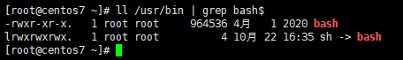

# shell编程

## 1.1 简介

- Shell 是一个命令行解释器，它接收应用程序或用户的命令，然后调用操作系统内核。
- Shell 还是一个功能强大的编程语言，易编写、易调试、灵活性强。

```shell
# 查看 Linux 系统提供的 Shell 解析器
cat /etc/shells
```

- 其中，最常用的是 `/bin/sh` 和 `/bin/bash` 。

```shell
# bash 和 sh 的关系：
ll /usr/bin | grep bash$
```



- sh 是 bash 的软链接。

```shell
# 查看Linux默认的解析器
echo $SHELL
```

## 1.2 入门案例

步骤：

- ① 创建脚本文件：通常以 `.sh` 作为扩展名。 

-  ② 脚本内容： 

- - 第一行指定当前脚本的解析器：

```shell
#!/bin/bash
```

- - 实现具体功能：

```shell
echo "hello world"
```

- ③ Shell 脚本的运行方式： 

|       命令名       | 在当前进程运行 | 新建子进程运行 |
| :----------------: | :------------: | :------------: |
|       source       |       √        |                |
|         .          |       √        |                |
|         sh         |                |       √        |
|        bash        |                |       √        |
| chmod +x后直接运行 |                |       √        |

> 其中，`.` 是 source 的另一种写法，在当前进程中发布的全局变量可以在当前进程的其他脚本中继续沿用，也可以在子进程中使用；但是，子进程 export 发布的变量仅限于子进程内部使用。

## 1.3 变量

### 1.3.1 系统变量

常用的系统变量包括：`$USER` 、`$HOME` 、`$PWD` 、`$SHELL` 等，可以使用 echo 命令输出它们的值。 

```shell
echo $USER
```

### 1.3.2 使用set命令查看所有变量

```shell
# 示例
set | less
```

### 1.3.3 自定义变量

```shell
# 1、定义变量
USER_NAME=tom
# 示例
USER_NAME=tom
echo $USER_NAME

# 2、撤销变量
unset USER_NAME
# 示例
USER_NAME=tom
echo $USER_NAME
unset USER_NAME
echo $USER_NAME

# 3、声明静态变量（不能修改、不能撤销）
readonly SCHOOL=suzhoudaxue
# 示例
readonly SCHOOL=suzhoudaxue
echo $SCHOOL
```

### 1.3.4 自定义变量的语法规则

-  变量名称可以由字母、数字和下划线组成，但是不能以数字开头，环境变量名建议大写。

-  等号两侧不能有空格，衍生规则就是变量声明时必须初始化。

-  在 bash 中，变量默认类型都是字符串类型，无法直接进行数值运算。

-  变量的值如果有空格，需要使用双引号或单引号括起来。

-  变量名区分大小写。

### 1.3.5 特殊变量 $n

- n 是数字，`$0` 表示当前脚本的名称，从 `$1` 开始代表对应的脚本参数，从   `${10}` 开始数字需要使用 `{}` 括起来。 

- 示例：

```shell
vim parameter.sh
```

```shell
#!/bin/bash
echo "$0 $1 $2"
```

```shell
chmod 777 parameter.sh
```

```shell
./parameter.sh cls xz
```


### 1.3.6 特殊变量 $#

- 返回输入参数的个数。 

```shell
#!/bin/bash
echo "$0 $1 $2"
echo "$#"
```


### 1.3.7 特殊变量 $* 和 $@

- 都能够返回全部参数，但是只有在循环中且放在引号中能够体现出它们的区别。 当 $* 和 $@ 不被双引号

  包围时，它们之间没有任何区别，都是将接收到的每个参数看做一份数据，彼此之间以空格来分隔。

  但是当它们被双引号包含时，就会有区别了：

  - `"$*"`会将所有的参数从整体上看做一份数据，而不是把每个参数都看做一份数据。
  - `"$@"`仍然将每个参数都看作一份数据，彼此之间是独立的。

  比如传递了 5 个参数，那么对于

  ```
  "$*"
  ```

  来说，这 5 个参数会合并到一起形成一份数据，它们之间是无法分割的；而对于

  ```
  "$@"
  ```

  来说，这 5 个参数是相互独立的，它们是 5 份数据。

  如果使用 echo 直接输出 "$*" 和 "$@" 做对比，是看不出区别的；但如果使用 for 循环来逐个输出数据，立即就能看出区别来。

```shell
#!/bin/bash
echo "$0 $1 $2"
echo "$#"
echo "$*"
echo $@
```


### 1.3.8 特殊变量 $?

- 返回上一条命令的返回结果。

- 条件判断语句： 

- - 返回 0 表示 true 。

- - 返回 1 表示 false 。

- 普通语句： 

- - 返回 0 表示成功 。

- - 返回非 0 数表示失败 。

## 1.4 运算符

`$((表达式))` 或 `$[表达式]` 

```shell
# 示例
echo $((1+2))
```

```shell
# 示例
echo $[1+2]
```

## 1.5 条件判断

```shell
# 基本语法1
test condition

# 基本语法2 condition 前后有空格
# 空字符串视为 false， 非空字符串视为 true
[ condition ]
```

常用判断条件：

| 数据类型 | 写法 | 单词          | 含义                                     |
| -------- | ---- | ------------- | ---------------------------------------- |
| 数值     | -lt  | less than     | 小于                                     |
| 数值     | -le  | less equal    | 小于等于                                 |
| 数值     | -eq  | equal         | 等于                                     |
| 数值     | -gt  | greater than  | 大于                                     |
| 数值     | -ge  | greater equal | 大于等于                                 |
| 数值     | -ne  | not equal     | 不等于                                   |
| 文件     | -r   | read          | 判断当前用户是否可以读取该文件           |
| 文件     | -w   | write         | 判断当前用户是否可以修改该文件           |
| 文件     | -x   | execute       | 判断当前用户对该文件是否有执行权限       |
| 文件     | -f   | file          | 判断当前文件是否存在并且是一个常规的文件 |
| 文件     | -e   | existence     | 判断文件是否存在                         |
| 文件     | -d   | directory     | 判断是否存在并且是一个目录               |

示例：

```shell
vim demo.sh
```

```shell
#!/bin/bash

# 条件判断表达式写法一：test
test 10 -gt 7

# 使用$?获取上一条语句的执行结果
echo $?

# 使用$?获取上一条语句的执行结果
test 10 -lt 7
echo $?

# 条件判断表达式写法二：[ condition ]
# 注意：condition两边要有空格
[ 10 -gt 7 ]
echo $?

[ 10 -lt 7 ]
echo $?

# 专门针对文件进行操作的运算符
[ -e aaa.txt ]
echo $?

[ -r aaa.txt ]
echo $?

[ -w aaa.txt ]
echo $?
```

## 1.6 流程控制

### 1.6.1 三目运算符

```shell
# 语法
条件 && 表达式1 : 表达式2
# 示例
 [ 10 -gt 5 ] && echo "10大于5" || echo "10小于5"
```

### 1.6.2 单if 判断

```shell
# 语法
if [ ... ]
then
...
fi
# 示例
#!/bin/bash
if [ 10 -gt 5 ]
then
echo "10 大于 5"
fi
```

> 注意：if 后面有空格

### 1.6.3 if...else

```shell
# 语法
if [ ... ]
then
...
else 
...
fi
# 示例
#!/bin/bash
if [ 10 -gt 5 ]
then
echo "10 大于 5"
else 
echo "10 小于 5"
fi
```

### 1.6.4 if...elif...else

```shell
# 语法
if [ ... ]
then
...
elif [ ... ]
then 
...
else 
...
fi
# 示例
#!/bin/bash
if [ 10 -eq 5 ]
then
echo "10 等于 5"
elif [ 10 -gt 5 ]
then
echo "10 大于 5"
else 
echo "10 小于 5"
fi
```

### 1.6.5 for循环

```shell
# 语法
for (( i =1;i<=10;i++ ))
do
	echo $i
done;

# 示例
#!/bin/bash
# 如果要使用外部数据，则需要将外部数据赋值给一个变量，不能在for语句中直接使用
len=$1
for (( i=1;i<=len;i++ ))
# 从do关键字开始是循环体开始
do
echo $i
# 到done关键字为止是循环体结束
done
```

### 1.6.6 for...in循环

```shell
# 语法
for i in $*
do 
echo $i
done

# 示例
#!/bin/bash
for i in $*
do
echo $i
done
```

### 3.6.7 while循环

```shell
# 语法
while [ ... ]
do
...
done

# 示例
#!/bin/bash
s=0
i=1
while [ $i -le 100 ]
do
	s=$[$s+$i]
	i=$[$i+1]
done

echo $s
```

## 1.7 函数

- Shell 编程中的函数和我们以前熟悉的函数最大的区别是：Shell 编程中的要求函数的返回值只能是整数，且只能通过 `$?` 的方式获取。可以显示加：return 返回，如果不加，将以最后一条命令运行结果，作为返回值，return 后跟数值 n（0 - 255）。

```shell
#!/bin/bash
function sum() {
    # 使用$1、$2引用函数传入的参数
    echo $[$1+$2]
}
# 调用函数，传入参数
sum 10 20
# 使用$?获取函数执行结果
echo "sum 10 20执行的结果是$?"
```

- 在函数体中，`$1` 和 `$2` 等是对函数参数的引用。

## 1.8 获取脚本外部数据

① 获取参数：通过 `$1` 和 `$2` 等方式获取，从 `${10}` 开始需要使用大括号。 

 ② 使用 read 读取用户输入，read 命令有两个常用参数： 

- - 参数 `-t` 用于指定输入等待时间，单位是秒。

- - 参数 `-p` 用于指定提示文字。

```shell
#!/bin/bash
read -t 10 -p "please enter:" NAME
echo $NAME
```

## 1.9 应用案例—归档文件

需求：实现一个每天对指定目录下的文件进行归档的脚本。输入一个目录名称（末尾不带/），将目录下的所有文件按天归档保存，并将归档日期附加在归档文件名称上，放在/root/archive下。

这里用到归档命令：tar，后面加-c表示归档，加-z表示同时进行压缩，得到的文件后缀名为.tar.gz。

脚本实现：

```shell
#!/bin/bash

# 首先判断输入参数是否为1
if [ $# -ne 1 ]
then
	echo "参数个数错误！用输入一个参数作为归档目录名"
	exit
fi
# 从参数中获取目录名称
if [ -d $1 ]
then 
	echo
	echo "目录不存在！"
	exit
fi
# 获取当前日期
DATE=$(date + %y%m%d)
# 定义生成的归档文件名称
FILE=archive_$DIR_NAME_$DATE.tar.gz
DEST=/root/archive/$FILE
# 开始归档
echo "开始归档..."
echo
tar -czf #DEST $DIR_PATH/$DIR_NAME

if [ $? -eq 0 ]
then
	echo 
	echo "归档完成！"
	echo "归档文件为：$DEST"
	echo
else
	echo "归档出错！"
	echo
fi
exit
```

可以配合crontab定时执行脚本实现自动化：

```shell
# 编辑定时任务
crontab -e
```

```shell
# 时间格式
0 2 * * * /root/scripts/archive.sh /root/scripts
```

