Kubernetes详细教程

### 1. Kubernetes介绍

#### 1.1 应用部署方式演变

在部署应用程序的方式上，主要经历了三个时代：

- **传统部署**：互联网早期，会直接将应用程序部署在物理机上

  > 优点：简单，不需要其它技术的参与
  >
  > 缺点：不能为应用程序定义资源使用边界，很难合理地分配计算资源，而且程序之间容易产生影响

- **虚拟化部署**：可以在一台物理机上运行多个虚拟机，每个虚拟机都是独立的一个环境

  > 优点：程序环境不会相互产生影响，提供了一定程度的安全性
  >
  > 缺点：增加了操作系统，浪费了部分资源

- **容器化部署**：与虚拟化类似，但是共享了操作系统

  > 优点：
  >
  > 可以保证每个容器拥有自己的文件系统、CPU、内存、进程空间等
  >
  > 运行应用程序所需要的资源都被容器包装，并和底层基础架构解耦
  >
  > 容器化的应用程序可以跨云服务商、跨Linux操作系统发行版进行部署


容器化部署方式给带来很多的便利，但是也会出现一些问题，比如说：

- 一个容器故障停机了，怎么样让另外一个容器立刻启动去替补停机的容器
- 当并发访问量变大的时候，怎么样做到横向扩展容器数量

这些容器管理的问题统称为**容器编排**问题，为了解决这些容器编排问题，就产生了一些容器编排的软件：

- **Swarm**：Docker自己的容器编排工具
- **Mesos**：Apache的一个资源统一管控的工具，需要和Marathon结合使用
- **Kubernetes**：Google开源的的容器编排工具


#### 1.2 kubernetes简介

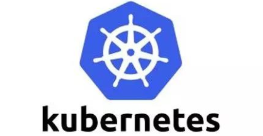

 

kubernetes，是一个全新的基于容器技术的分布式架构领先方案，是谷歌严格保密十几年的秘密武器----Borg系统的一个开源版本，于2014年9月发布第一个版本，2015年7月发布第一个正式版本。

kubernetes的本质是**一组服务器集群**，它可以在集群的每个节点上运行特定的程序，来对节点中的容器进行管理。目的是实现资源管理的自动化，主要提供了如下的主要功能：

- **自我修复**：一旦某一个容器崩溃，能够在1秒中左右迅速启动新的容器
- **弹性伸缩**：可以根据需要，自动对集群中正在运行的容器数量进行调整
- **服务发现**：服务可以通过自动发现的形式找到它所依赖的服务
- **负载均衡**：如果一个服务起动了多个容器，能够自动实现请求的负载均衡
- **版本回退**：如果发现新发布的程序版本有问题，可以立即回退到原来的版本
- **存储编排**：可以根据容器自身的需求自动创建存储卷

#### 1.3 kubernetes组件

一个kubernetes集群主要是由**控制节点(master)**、**工作节点(node)**构成，每个节点上都会安装不同的组件。

**master：集群的控制平面，负责集群的决策 ( 管理 )**

> **ApiServer** : 资源操作的唯一入口，接收用户输入的命令，提供认证、授权、API注册和发现等机制
>
> **Scheduler** : 负责集群资源调度，按照预定的调度策略将Pod调度到相应的node节点上
>
> **ControllerManager** : 负责维护集群的状态，比如程序部署安排、故障检测、自动扩展、滚动更新等
>
> **Etcd** ：负责存储集群中各种资源对象的信息

**node：集群的数据平面，负责为容器提供运行环境 ( 干活 )**

> **Kubelet** : 负责维护容器的生命周期，即通过控制docker，来创建、更新、销毁容器
>
> **KubeProxy** : 负责提供集群内部的服务发现和负载均衡
>
> **Docker** : 负责节点上容器的各种操作


下面，以部署一个nginx服务来说明kubernetes系统各个组件调用关系：

1. 首先要明确，一旦kubernetes环境启动之后，master和node都会将自身的信息存储到etcd数据库中

2. 一个nginx服务的安装请求会首先被发送到master节点的apiServer组件

3. apiServer组件会调用scheduler组件来决定到底应该把这个服务安装到哪个node节点上

   在此时，它会从etcd中读取各个node节点的信息，然后按照一定的算法进行选择，并将结果告知apiServer

4. apiServer调用controller-manager去调度Node节点安装nginx服务

5. kubelet接收到指令后，会通知docker，然后由docker来启动一个nginx的pod

   pod是kubernetes的最小操作单元，容器必须跑在pod中至此，

6. 一个nginx服务就运行了，如果需要访问nginx，就需要通过kube-proxy来对pod产生访问的代理

这样，外界用户就可以访问集群中的nginx服务了

#### 1.4 kubernetes概念

**Master**：集群控制节点，每个集群需要至少一个master节点负责集群的管控

**Node**：工作负载节点，由master分配容器到这些node工作节点上，然后node节点上的docker负责容器的运行

**Pod**：kubernetes的最小控制单元，容器都是运行在pod中的，一个pod中可以有1个或者多个容器

**Controller**：控制器，通过它来实现对pod的管理，比如启动pod、停止pod、伸缩pod的数量等等

**Service**：pod对外服务的统一入口，下面可以维护者同一类的多个pod

**Label**：标签，用于对pod进行分类，同一类pod会拥有相同的标签

**NameSpace**：命名空间，用来隔离pod的运行环境

### 2. kubernetes集群环境搭建

#### 2.1 前置知识点

目前生产部署Kubernetes 集群主要有两种方式：

**kubeadm**

Kubeadm 是一个K8s 部署工具，提供kubeadm init 和kubeadm join，用于快速部署Kubernetes 集群。

官方地址：https://kubernetes.io/docs/reference/setup-tools/kubeadm/kubeadm/

**二进制包**

从github 下载发行版的二进制包，手动部署每个组件，组成Kubernetes 集群。

Kubeadm 降低部署门槛，但屏蔽了很多细节，遇到问题很难排查。如果想更容易可控，推荐使用二进制包部署Kubernetes 集群，虽然手动部署麻烦点，期间可以学习很多工作原理，也利于后期维护。


#### 2.2 kubeadm 部署方式介绍

kubeadm 是官方社区推出的一个用于快速部署kubernetes 集群的工具，这个工具能通过两条指令完成一个kubernetes 集群的部署：

- 创建一个Master 节点kubeadm init
- 将Node 节点加入到当前集群中$ kubeadm join <Master 节点的IP 和端口>

#### 2.3 安装要求

在开始之前，部署Kubernetes 集群机器需要满足以下几个条件：

- 一台或多台机器，操作系统CentOS7.x-86_x64
- 硬件配置：2GB 或更多RAM，2 个CPU 或更多CPU，硬盘30GB 或更多
- 集群中所有机器之间网络互通
- 可以访问外网，需要拉取镜像
- 禁止swap 分区

#### 2.4 最终目标

- 在所有节点上安装Docker 和kubeadm
- 部署Kubernetes Master
- 部署容器网络插件
- 部署Kubernetes Node，将节点加入Kubernetes 集群中
- 部署Dashboard Web 页面，可视化查看Kubernetes 资源

#### 2.5 准备环境

 


| 角色     | IP地址      | 组件                              |
| :------- | :---------- | :-------------------------------- |
| master01 | 192.168.5.3 | docker，kubectl，kubeadm，kubelet |
| node01   | 192.168.5.4 | docker，kubectl，kubeadm，kubelet |
| node02   | 192.168.5.5 | docker，kubectl，kubeadm，kubelet |

#### 2.6 环境初始化

##### 2.6.1 检查操作系统的版本

```powershell
# 此方式下安装kubernetes集群要求Centos版本要在7.5或之上
[root@master ~]# cat /etc/redhat-release
Centos Linux 7.5.1804 (Core)
```

##### 2.6.2 主机名解析

为了方便集群节点间的直接调用，在这个配置一下主机名解析，企业中推荐使用内部DNS服务器

```powershell
# 主机名成解析 编辑三台服务器的/etc/hosts文件，添加下面内容
192.168.90.100 master
192.168.90.106 node1
192.168.90.107 node2
```

##### 2.6.3 时间同步

kubernetes要求集群中的节点时间必须精确一直，这里使用chronyd服务从网络同步时间

企业中建议配置内部的会见同步服务器

```powershell
# 启动chronyd服务
[root@master ~]# systemctl start chronyd
[root@master ~]# systemctl enable chronyd
[root@master ~]# date
```

##### 2.6.4  禁用iptable和firewalld服务

kubernetes和docker 在运行的中会产生大量的iptables规则，为了不让系统规则跟它们混淆，直接关闭系统的规则

```powershell
# 1 关闭firewalld服务
[root@master ~]# systemctl stop firewalld
[root@master ~]# systemctl disable firewalld
# 2 关闭iptables服务
[root@master ~]# systemctl stop iptables
[root@master ~]# systemctl disable iptables
```

##### 2.6.5 禁用selinux

selinux是linux系统下的一个安全服务，如果不关闭它，在安装集群中会产生各种各样的奇葩问题

```powershell
# 编辑 /etc/selinux/config 文件，修改SELINUX的值为disable
# 注意修改完毕之后需要重启linux服务
SELINUX=disabled
```

##### 2.6.6 禁用swap分区

swap分区指的是虚拟内存分区，它的作用是物理内存使用完，之后将磁盘空间虚拟成内存来使用，启用swap设备会对系统的性能产生非常负面的影响，因此kubernetes要求每个节点都要禁用swap设备，但是如果因为某些原因确实不能关闭swap分区，就需要在集群安装过程中通过明确的参数进行配置说明

```powershell
# 编辑分区配置文件/etc/fstab，注释掉swap分区一行
# 注意修改完毕之后需要重启linux服务
vim /etc/fstab
注释掉 /dev/mapper/centos-swap swap
# /dev/mapper/centos-swap swap
```

##### 2.6.7 修改linux的内核参数

```powershell
# 修改linux的内核采纳数，添加网桥过滤和地址转发功能
# 编辑/etc/sysctl.d/kubernetes.conf文件，添加如下配置：
net.bridge.bridge-nf-call-ip6tables = 1
net.bridge.bridge-nf-call-iptables = 1
net.ipv4.ip_forward = 1

# 重新加载配置
[root@master ~]# sysctl -p
# 加载网桥过滤模块
[root@master ~]# modprobe br_netfilter
# 查看网桥过滤模块是否加载成功
[root@master ~]# lsmod | grep br_netfilter
```

##### 2.6.8 配置ipvs功能

在Kubernetes中Service有两种带来模型，一种是基于iptables的，一种是基于ipvs的两者比较的话，ipvs的性能明显要高一些，但是如果要使用它，需要手动载入ipvs模块

```powershell
# 1.安装ipset和ipvsadm
[root@master ~]# yum install ipset ipvsadm sysstat conntrack libseccomp -y
# 2.添加需要加载的模块写入脚本文件
[root@master ~]# cat <<EOF> /etc/sysconfig/modules/ipvs.modules
#!/bin/bash
modprobe -- ip_vs
modprobe -- ip_vs_rr
modprobe -- ip_vs_wrr
modprobe -- ip_vs_sh
modprobe -- nf_conntrack_ipv4
EOF
# 3.为脚本添加执行权限
[root@master ~]# chmod +x /etc/sysconfig/modules/ipvs.modules
# 4.执行脚本文件
[root@master ~]# /bin/bash /etc/sysconfig/modules/ipvs.modules
# 5.查看对应的模块是否加载成功
[root@master ~]# lsmod | grep -e ip_vs -e nf_conntrack_ipv4
```

##### 2.6.9 安装docker

```powershell
# 1、切换镜像源
[root@master ~]# wget https://mirrors.aliyun.com/docker-ce/linux/centos/docker-ce.repo -O /etc/yum.repos.d/docker-ce.repo

# 2、查看当前镜像源中支持的docker版本
[root@master ~]# yum list docker-ce --showduplicates

# 3、安装特定版本的docker-ce
# 必须制定--setopt=obsoletes=0，否则yum会自动安装更高版本
[root@master ~]# yum install --setopt=obsoletes=0 docker-ce-18.06.3.ce-3.el7 -y

# 4、添加一个配置文件
#Docker 在默认情况下使用Vgroup Driver为cgroupfs，而Kubernetes推荐使用systemd来替代cgroupfs
[root@master ~]# mkdir /etc/docker
[root@master ~]# cat <<EOF> /etc/docker/daemon.json
{
	"exec-opts": ["native.cgroupdriver=systemd"],
	"registry-mirrors": ["https://kn0t2bca.mirror.aliyuncs.com"]
}
EOF

# 5、启动dokcer
[root@master ~]# systemctl restart docker
[root@master ~]# systemctl enable docker
```

##### 2.6.10 安装Kubernetes组件

```powershell
# 1、由于kubernetes的镜像在国外，速度比较慢，这里切换成国内的镜像源
# 2、编辑/etc/yum.repos.d/kubernetes.repo,添加下面的配置
[kubernetes]
name=Kubernetes
baseurl=http://mirrors.aliyun.com/kubernetes/yum/repos/kubernetes-el7-x86_64
enabled=1
gpgchech=0
repo_gpgcheck=0
gpgkey=http://mirrors.aliyun.com/kubernetes/yum/doc/yum-key.gpg
			http://mirrors.aliyun.com/kubernetes/yum/doc/rpm-package-key.gpg

# 3、安装kubeadm、kubelet和kubectl
[root@master ~]# yum install --setopt=obsoletes=0 kubeadm-1.17.4-0 kubelet-1.17.4-0 kubectl-1.17.4-0 -y

# 4、配置kubelet的cgroup
#编辑/etc/sysconfig/kubelet, 添加下面的配置
KUBELET_CGROUP_ARGS="--cgroup-driver=systemd"
KUBE_PROXY_MODE="ipvs"

# 5、设置kubelet开机自启
[root@master ~]# systemctl enable kubelet
```

##### 2.6.11 准备集群镜像

```powershell
# 在安装kubernetes集群之前，必须要提前准备好集群需要的镜像，所需镜像可以通过下面命令查看
[root@master ~]# kubeadm config images list

# 下载镜像
# 此镜像kubernetes的仓库中，由于网络原因，无法连接，下面提供了一种替换方案
# 1、先定义需要下载的镜像列表
images=(
	kube-apiserver:v1.21.11
	kube-controller-manager:v1.21.11
	kube-scheduler:v1.21.11
	kube-proxy:v1.21.11
	pause:3.4.1
	etcd:3.4.13-0
	coredns:v1.8.0
)
# 2、循环列表
for imageName in ${images[@]};do
	# 从阿里仓库拉取每一个镜像
	docker pull registry.cn-hangzhou.aliyuncs.com/google_containers/$imageName
	# 把镜像tag改掉，改成k8s.gcr.io开头
	docker tag registry.cn-hangzhou.aliyuncs.com/google_containers/$imageName k8s.gcr.io/$imageName
	# 把原镜像删掉
	docker rmi registry.cn-hangzhou.aliyuncs.com/google_containers/$imageName 
done
```

##### 2.6.12 集群初始化

><u>**下面的操作只需要在master节点上执行即可**</u>

```powershell
# 创建集群
[root@master ~]# kubeadm init \
	--apiserver-advertise-address=8.142.21.209 \
	--kubernetes-version=v1.17.4 \
	--service-cidr=10.96.0.0/12 \
	--pod-network-cidr=10.244.0.0/16
	# 注意：
	#  1、apiserver-advertise-address一定是master的ip地址
	#  2、apiserver-advertise-address、service-cidr和pod-network-cidr不能在同一个网络
	#  3、docker版本与kubenetes版本要匹配，还有镜像源的设置是否正确，每次执行kubeadm init初始化k8s集群之前，先执行kubeadm reset指令，如若不执行，会出现额外的错误比如xxx already exists和Port xxx is in use
# 创建必要文件
[root@master ~]# mkdir -p $HOME/.kube
[root@master ~]# sudo cp -i /etc/kubernetes/admin.conf $HOME/.kube/config
[root@master ~]# sudo chown $(id -u):$(id -g) $HOME/.kube/config
```

> 下面的操作只需要在node节点上执行即可

```powershell
# 部署Node节点
kubeadm join 192.168.0.100:6443 --token awk15p.t6bamck54w69u4s8 \
    --discovery-token-ca-cert-hash sha256:a94fa09562466d32d29523ab6cff122186f1127599fa4dcd5fa0152694f17117 
```

在master上查看节点信息，之所以是NotReady状态是因为网络插件未部署，三个节点之间无法通信

```powershell
[root@master ~]# kubectl get nodes
NAME    STATUS   ROLES     AGE   VERSION
master  NotReady  master   6m    v1.17.4
node1   NotReady   <none>  22s   v1.17.4
node2   NotReady   <none>  19s   v1.17.4
```

##### 2.6.13 安装网络插件，只在master节点操作即可

Kubernetes 支持多种网络插件，比如 flannel、calico、canal 等，任选一种即可，本次选用flannel

> 下面的操作依旧只需要在master节点上执行即可，插件使用的是DaemonSet的控制器，它会在每个节点上都运行

```powershell
# 获取flannel的配置文件
[root@master ~]# wget https://raw.githubusercontent.com/coreos/flannel/master/Documentation/kube-flannel.yml

# 修改配置文件中quay.io仓库为quay-mirror.qiniu.com

# 使用配置文件启动flannel
[root@master ~]# kubectl apply -f kube-flannel.yml

# 启动之后稍等一会，再次查看集群的状态
[root@master ~]# kubectl get nodes
NAME    STATUS   ROLES     AGE   VERSION
master  NotReady  master   6m    v1.17.4
node1   NotReady   <none>  22s   v1.17.4
node2   NotReady   <none>  19s   v1.17.4
```

**至此，Kubernetes的集群环境搭建完成。**

由于外网不好访问，如果出现上面wget无法访问的情况，可以直接访问下面的地址下载kube-flannel.yml，按照上面方式修改后上传到master服务器上

```powershell
https://github.com/flannel-io/flannel/tree/master/Documentation/kube-flannel.yml
```
```个人笔记```
若是集群状态一直是 notready,用下面语句查看原因，
journalctl -f -u kubelet.service
若原因是： cni.go:237] Unable to update cni config: no networks found in /etc/cni/net.d
mkdir -p /etc/cni/net.d                    #创建目录给flannel做配置文件
vim /etc/cni/net.d/10-flannel.conf         #编写配置文件

```powershell

{
 "name":"cbr0",
 "cniVersion":"0.3.1",
 "type":"flannel",
 "deledate":{
    "hairpinMode":true,
    "isDefaultGateway":true
  }

}

```

#### 2.7 集群测试，服务部署 

##### 2.7.1 创建一个nginx服务

```powershell
[root@master ~]# kubectl create deployment nginx  --image=nginx:1.14-alpine
```

##### 2.7.2 暴露端口

```powershell
[root@master ~]# kubectl expose deploy nginx  --port=80  --type=NodePort
```

##### 2.7.3 查看服务

```powershell
[root@master ~]# kubectl get pod,svc  # 31191就是外部访问nginx的端口
```

##### 2.7.4 查看pod

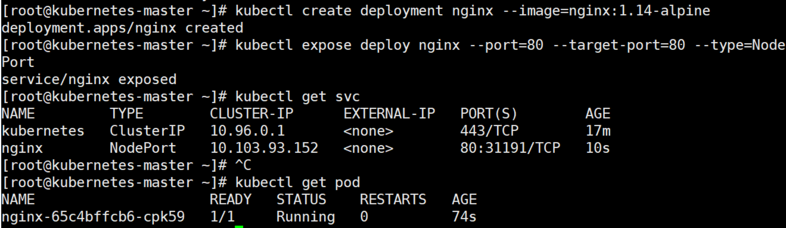

浏览器测试结果：


### 3. 资源管理

#### 3.1 资源管理介绍

在kubernetes中，所有的内容都抽象为资源，用户需要通过操作资源来管理kubernetes。

> kubernetes的本质上就是一个集群系统，用户可以在集群中部署各种服务，所谓的部署服务，其实就是在kubernetes集群中运行一个个的容器，并将指定的程序跑在容器中。
>
> kubernetes的最小管理单元是pod而不是容器，所以只能将容器放在`Pod`中，而kubernetes一般也不会直接管理Pod，而是通过`Pod控制器`来管理Pod的。
>
> Pod可以提供服务之后，就要考虑如何访问Pod中服务，kubernetes提供了`Service`资源实现这个功能。
>
> 当然，如果Pod中程序的数据需要持久化，kubernetes还提供了各种`存储`系统。


> 学习kubernetes的核心，就是学习如何对集群上的`Pod、Pod控制器、Service、存储`等各种资源进行操作

#### 3.2 YAML语言介绍

YAML是一个类似 XML、JSON 的标记性语言。它强调以**数据**为中心，并不是以标识语言为重点。因而YAML本身的定义比较简单，号称"一种人性化的数据格式语言"。

```
<heima>
    <age>15</age>
    <address>Beijing</address>
</heima>
```

```
heima:
  age: 15
  address: Beijing
```

YAML的语法比较简单，主要有下面几个：

- 大小写敏感
- 使用缩进表示层级关系
- 缩进不允许使用tab，只允许空格( 低版本限制 )
- 缩进的空格数不重要，只要相同层级的元素左对齐即可
- '#'表示注释

YAML支持以下几种数据类型：

- 纯量：单个的、不可再分的值
- 对象：键值对的集合，又称为映射（mapping）/ 哈希（hash） / 字典（dictionary）
- 数组：一组按次序排列的值，又称为序列（sequence） / 列表（list）

```yml
# 纯量, 就是指的一个简单的值，字符串、布尔值、整数、浮点数、Null、时间、日期
# 1 布尔类型
c1: true (或者True)
# 2 整型
c2: 234
# 3 浮点型
c3: 3.14
# 4 null类型 
c4: ~  # 使用~表示null或者不写留空也代表null
# 5 日期类型
c5: 2018-02-17    # 日期必须使用ISO 8601格式，即yyyy-MM-dd
# 6 时间类型
c6: 2018-02-17T15:02:31+08:00  # 时间使用ISO 8601格式，时间和日期之间使用T连接，最后使用+代表时区
# 7 字符串类型
c7: heima     # 简单写法，直接写值 , 如果字符串中间有特殊字符，必须使用双引号或者单引号包裹 
c8: line1
    line2     # 字符串过多的情况可以拆成多行，每一行会被转化成一个空格
```

```yaml
# 对象
# 形式一(推荐):
heima:
  age: 15
  address: Beijing
# 形式二(了解):
heima: {age: 15,address: Beijing}
```

```yaml
# 数组
# 形式一(推荐):
address:
  - 顺义
  - 昌平  
# 形式二(了解):
address: [顺义,昌平]
```

> 小提示：
>
> 1 书写yaml切记`:` 后面要加一个空格
>
> 2 如果需要将多段yaml配置放在一个文件中，中间要使用`---`分隔
>
> 3 下面是一个yaml转json的网站，可以通过它验证yaml是否书写正确
>
> https://www.json2yaml.com/convert-yaml-to-json

#### 3.3 资源管理方式

- 命令式对象管理：直接使用命令去操作kubernetes资源

  ``` powershell
  kubectl run nginx-pod --image=nginx:1.17.1 --port=80
  ```

- 命令式对象配置：通过命令配置和配置文件去操作kubernetes资源

  ```powershell
  kubectl create/patch -f nginx-pod.yaml
  ```

- 声明式对象配置：通过apply命令和配置文件去操作kubernetes资源

  ```powershell
  kubectl apply -f nginx-pod.yaml # apply只用于创建和更新资源
  ```


| 类型           | 操作对象 | 适用环境 | 优点           | 缺点                             |
| :------------- | :------- | :------- | :------------- | :------------------------------- |
| 命令式对象管理 | 对象     | 测试     | 简单           | 只能操作活动对象，无法审计、跟踪 |
| 命令式对象配置 | 文件     | 开发     | 可以审计、跟踪 | 项目大时，配置文件多，操作麻烦   |
| 声明式对象配置 | 目录     | 开发     | 支持目录操作   | 意外情况下难以调试               |

##### 3.3.1 命令式对象管理

**kubectl命令**

kubectl是kubernetes集群的命令行工具，通过它能够对集群本身进行管理，并能够在集群上进行容器化应用的安装部署。kubectl命令的语法如下：

```
kubectl [command] [type] [name] [flags]
```

**comand**：指定要对资源执行的操作，例如create、get、delete

**type**：指定资源类型，比如deployment、pod、service

**name**：指定资源的名称，名称大小写敏感

**flags**：指定额外的可选参数

```shell
# 查看所有pod
kubectl get pod 

# 查看某个pod
kubectl get pod pod_name

# 查看某个pod,以yaml格式展示结果
kubectl get pod pod_name -o yaml
```

**资源类型**

kubernetes中所有的内容都抽象为资源，可以通过下面的命令进行查看:

```
kubectl api-resources
```

经常使用的资源有下面这些：

| 资源分类      | 资源名称                 | 缩写    | 资源作用        |
| :------------ | :----------------------- | :------ | :-------------- |
| 集群级别资源  | nodes                    | no      | 集群组成部分    |
| namespaces    | ns                       | 隔离Pod |                 |
| pod资源       | pods                     | po      | 装载容器        |
| pod资源控制器 | replicationcontrollers   | rc      | 控制pod资源     |
|               | replicasets              | rs      | 控制pod资源     |
|               | deployments              | deploy  | 控制pod资源     |
|               | daemonsets               | ds      | 控制pod资源     |
|               | jobs                     |         | 控制pod资源     |
|               | cronjobs                 | cj      | 控制pod资源     |
|               | horizontalpodautoscalers | hpa     | 控制pod资源     |
|               | statefulsets             | sts     | 控制pod资源     |
| 服务发现资源  | services                 | svc     | 统一pod对外接口 |
|               | ingress                  | ing     | 统一pod对外接口 |
| 存储资源      | volumeattachments        |         | 存储            |
|               | persistentvolumes        | pv      | 存储            |
|               | persistentvolumeclaims   | pvc     | 存储            |
| 配置资源      | configmaps               | cm      | 配置            |
|               | secrets                  |         | 配置            |

**操作**

kubernetes允许对资源进行多种操作，可以通过--help查看详细的操作命令

```
kubectl --help
```

经常使用的操作有下面这些：

| 命令分类   | 命令         | 翻译                        | 命令作用                     |
| :--------- | :----------- | :-------------------------- | :--------------------------- |
| 基本命令   | create       | 创建                        | 创建一个资源                 |
|            | edit         | 编辑                        | 编辑一个资源                 |
|            | get          | 获取                        | 获取一个资源                 |
|            | patch        | 更新                        | 更新一个资源                 |
|            | delete       | 删除                        | 删除一个资源                 |
|            | explain      | 解释                        | 展示资源文档                 |
| 运行和调试 | run          | 运行                        | 在集群中运行一个指定的镜像   |
|            | expose       | 暴露                        | 暴露资源为Service            |
|            | describe     | 描述                        | 显示资源内部信息             |
|            | logs         | 日志输出容器在 pod 中的日志 | 输出容器在 pod 中的日志      |
|            | attach       | 缠绕进入运行中的容器        | 进入运行中的容器             |
|            | exec         | 执行容器中的一个命令        | 执行容器中的一个命令         |
|            | cp           | 复制                        | 在Pod内外复制文件            |
|            | rollout      | 首次展示                    | 管理资源的发布               |
|            | scale        | 规模                        | 扩(缩)容Pod的数量            |
|            | autoscale    | 自动调整                    | 自动调整Pod的数量            |
| 高级命令   | apply        | rc                          | 通过文件对资源进行配置       |
|            | label        | 标签                        | 更新资源上的标签             |
| 其他命令   | cluster-info | 集群信息                    | 显示集群信息                 |
|            | version      | 版本                        | 显示当前Server和Client的版本 |

下面以一个namespace / pod的创建和删除简单演示下命令的使用：

```shell
# 创建一个namespace
[root@master ~]# kubectl create namespace dev
namespace/dev created

# 获取namespace
[root@master ~]# kubectl get ns
NAME              STATUS   AGE
default           Active   21h
dev               Active   21s
kube-node-lease   Active   21h
kube-public       Active   21h
kube-system       Active   21h

# 在此namespace下创建并运行一个nginx的Pod
[root@master ~]# kubectl run pod --image=nginx:latest -n dev
kubectl run --generator=deployment/apps.v1 is DEPRECATED and will be removed in a future version. Use kubectl run --generator=run-pod/v1 or kubectl create instead.
deployment.apps/pod created

# 查看新创建的pod
[root@master ~]# kubectl get pod -n dev
NAME  READY   STATUS    RESTARTS   AGE
pod   1/1     Running   0          21s

# 删除指定的pod
[root@master ~]# kubectl delete pod pod-864f9875b9-pcw7x -n dev
pod "pod" deleted

# 删除指定的namespace
[root@master ~]# kubectl delete ns dev
namespace "dev" deleted
```

### 3.3.2 命令式对象配置

命令式对象配置就是使用命令配合配置文件一起来操作kubernetes资源。

1） 创建一个nginxpod.yaml，内容如下：

```yaml
apiVersion: v1
kind: Namespace
metadata:
  name: dev

---

apiVersion: v1
kind: Pod
metadata:
  name: nginxpod
  namespace: dev
spec:
  containers:
  - name: nginx-containers
    image: nginx:latest
```

2）执行create命令，创建资源：

```powershell
[root@master ~]# kubectl create -f nginxpod.yaml
namespace/dev created
pod/nginxpod created
```

此时发现创建了两个资源对象，分别是namespace和pod

3）执行get命令，查看资源：

```shell
[root@master ~]#  kubectl get -f nginxpod.yaml
NAME            STATUS   AGE
namespace/dev   Active   18s

NAME            READY   STATUS    RESTARTS   AGE
pod/nginxpod    1/1     Running   0          17s
```

这样就显示了两个资源对象的信息

4）执行delete命令，删除资源：

```shell
[root@master ~]# kubectl delete -f nginxpod.yaml
namespace "dev" deleted
pod "nginxpod" deleted
```

此时发现两个资源对象被删除了

```
总结:
    命令式对象配置的方式操作资源，可以简单的认为：命令  +  yaml配置文件（里面是命令需要的各种参数）
```

### 3.3.3 声明式对象配置

声明式对象配置跟命令式对象配置很相似，但是它只有一个命令apply。

```shell
# 首先执行一次kubectl apply -f yaml文件，发现创建了资源
[root@master ~]#  kubectl apply -f nginxpod.yaml
namespace/dev created
pod/nginxpod created

# 再次执行一次kubectl apply -f yaml文件，发现说资源没有变动
[root@master ~]#  kubectl apply -f nginxpod.yaml
namespace/dev unchanged
pod/nginxpod unchanged
```

```powershell
总结:
    其实声明式对象配置就是使用apply描述一个资源最终的状态（在yaml中定义状态）
    使用apply操作资源：
        如果资源不存在，就创建，相当于 kubectl create
        如果资源已存在，就更新，相当于 kubectl patch
```

> 扩展：kubectl可以在node节点上运行吗 ?

kubectl的运行是需要进行配置的，它的配置文件是$HOME/.kube，如果想要在node节点运行此命令，需要将master上的.kube文件复制到node节点上，即在master节点上执行下面操作：

```shell
scp  -r  HOME/.kube   node1: HOME/
```

> 使用推荐: 三种方式应该怎么用 ?

创建/更新资源 使用声明式对象配置 kubectl apply -f XXX.yaml

删除资源 使用命令式对象配置 kubectl delete -f XXX.yaml

查询资源 使用命令式对象管理 kubectl get(describe) 资源名称

### 4. 实战入门

本章节将介绍如何在kubernetes集群中部署一个nginx服务，并且能够对其进行访问。

#### 4.1 Namespace

Namespace是kubernetes系统中的一种非常重要资源，它的主要作用是用来实现**多套环境的资源隔离**或者**多租户的资源隔离**。

默认情况下，kubernetes集群中的所有的Pod都是可以相互访问的。但是在实际中，可能不想让两个Pod之间进行互相的访问，那此时就可以将两个Pod划分到不同的namespace下。kubernetes通过将集群内部的资源分配到不同的Namespace中，可以形成逻辑上的"组"，以方便不同的组的资源进行隔离使用和管理。

可以通过kubernetes的授权机制，将不同的namespace交给不同租户进行管理，这样就实现了多租户的资源隔离。此时还能结合kubernetes的资源配额机制，限定不同租户能占用的资源，例如CPU使用量、内存使用量等等，来实现租户可用资源的管理。


kubernetes在集群启动之后，会默认创建几个namespace


```shell
[root@master ~]# kubectl  get namespace
NAME              STATUS   AGE
default           Active   45h     #  所有未指定Namespace的对象都会被分配在default命名空间
kube-node-lease   Active   45h     #  集群节点之间的心跳维护，v1.13开始引入
kube-public       Active   45h     #  此命名空间下的资源可以被所有人访问（包括未认证用户）
kube-system       Active   45h     #  所有由Kubernetes系统创建的资源都处于这个命名空间
```

下面来看namespace资源的具体操作：

##### 4.1.1 **查看**

```shell
# 1 查看所有的ns  命令：kubectl get ns
[root@master ~]# kubectl get ns
NAME              STATUS   AGE
default           Active   45h
kube-node-lease   Active   45h
kube-public       Active   45h     
kube-system       Active   45h     

# 2 查看指定的ns   命令：kubectl get ns ns名称
[root@master ~]# kubectl get ns default
NAME      STATUS   AGE
default   Active   45h

# 3 指定输出格式  命令：kubectl get ns ns名称  -o 格式参数
# kubernetes支持的格式有很多，比较常见的是wide、json、yaml
[root@master ~]# kubectl get ns default -o yaml
apiVersion: v1
kind: Namespace
metadata:
  creationTimestamp: "2021-05-08T04:44:16Z"
  name: default
  resourceVersion: "151"
  selfLink: /api/v1/namespaces/default
  uid: 7405f73a-e486-43d4-9db6-145f1409f090
spec:
  finalizers:
  - kubernetes
status:
  phase: Active
  
# 4 查看ns详情  命令：kubectl describe ns ns名称
[root@master ~]# kubectl describe ns default
Name:         default
Labels:       <none>
Annotations:  <none>
Status:       Active  # Active 命名空间正在使用中  Terminating 正在删除命名空间

# ResourceQuota 针对namespace做的资源限制
# LimitRange针对namespace中的每个组件做的资源限制
No resource quota.
No LimitRange resource.
```

##### 4.1.2 **创建**

```shell
# 创建namespace
[root@master ~]# kubectl create ns dev
namespace/dev created
```

##### 4.1.3 **删除**

```shell
# 删除namespace
[root@master ~]# kubectl delete ns dev
namespace "dev" deleted
```

##### 4.1.4 **配置方式**

首先准备一个yaml文件：ns-dev.yaml

```yaml
apiVersion: v1
kind: Namespace
metadata:
  name: dev
```

然后就可以执行对应的创建和删除命令了：

创建：kubectl create -f ns-dev.yaml

删除：kubectl delete -f ns-dev.yaml

#### 4.2 Pod

Pod是kubernetes集群进行管理的最小单元，程序要运行必须部署在容器中，而容器必须存在于Pod中。

Pod可以认为是容器的封装，一个Pod中可以存在一个或者多个容器。


kubernetes在集群启动之后，集群中的各个组件也都是以Pod方式运行的。可以通过下面命令查看： 

```shell
[root@master ~]# kubectl get pod -n kube-system
NAMESPACE     NAME                             READY   STATUS    RESTARTS   AGE
kube-system   coredns-6955765f44-68g6v         1/1     Running   0          2d1h
kube-system   coredns-6955765f44-cs5r8         1/1     Running   0          2d1h
kube-system   etcd-master                      1/1     Running   0          2d1h
kube-system   kube-apiserver-master            1/1     Running   0          2d1h
kube-system   kube-controller-manager-master   1/1     Running   0          2d1h
kube-system   kube-flannel-ds-amd64-47r25      1/1     Running   0          2d1h
kube-system   kube-flannel-ds-amd64-ls5lh      1/1     Running   0          2d1h
kube-system   kube-proxy-685tk                 1/1     Running   0          2d1h
kube-system   kube-proxy-87spt                 1/1     Running   0          2d1h
kube-system   kube-scheduler-master            1/1     Running   0          2d1h
```

##### 4.2.1 创建并运行

kubernetes没有提供单独运行Pod的命令，都是通过Pod控制器来实现的

```shell
# 命令格式： kubectl run (pod控制器名称) [参数] 
# --image  指定Pod的镜像
# --port   指定端口
# --namespace  指定namespace
[root@master ~]# kubectl run nginx --image=nginx:latest --port=80 --namespace dev 
deployment.apps/nginx created
```

##### 4.2.2 查看pod信息

```shell
# 查看Pod基本信息
[root@master ~]# kubectl get pods -n dev
NAME    READY   STATUS    RESTARTS   AGE
nginx   1/1     Running   0          43s

# 查看Pod的详细信息
[root@master ~]# kubectl describe pod nginx -n dev
Name:         nginx
Namespace:    dev
Priority:     0
Node:         node1/192.168.5.4
Start Time:   Wed, 08 May 2021 09:29:24 +0800
Labels:       pod-template-hash=5ff7956ff6
              run=nginx
Annotations:  <none>
Status:       Running
IP:           10.244.1.23
IPs:
  IP:           10.244.1.23
Controlled By:  ReplicaSet/nginx
Containers:
  nginx:
    Container ID:   docker://4c62b8c0648d2512380f4ffa5da2c99d16e05634979973449c98e9b829f6253c
    Image:          nginx:latest
    Image ID:       docker-pullable://nginx@sha256:485b610fefec7ff6c463ced9623314a04ed67e3945b9c08d7e53a47f6d108dc7
    Port:           80/TCP
    Host Port:      0/TCP
    State:          Running
      Started:      Wed, 08 May 2021 09:30:01 +0800
    Ready:          True
    Restart Count:  0
    Environment:    <none>
    Mounts:
      /var/run/secrets/kubernetes.io/serviceaccount from default-token-hwvvw (ro)
Conditions:
  Type              Status
  Initialized       True
  Ready             True
  ContainersReady   True
  PodScheduled      True
Volumes:
  default-token-hwvvw:
    Type:        Secret (a volume populated by a Secret)
    SecretName:  default-token-hwvvw
    Optional:    false
QoS Class:       BestEffort
Node-Selectors:  <none>
Tolerations:     node.kubernetes.io/not-ready:NoExecute for 300s
                 node.kubernetes.io/unreachable:NoExecute for 300s
Events:
  Type    Reason     Age        From               Message
  ----    ------     ----       ----               -------
  Normal  Scheduled  <unknown>  default-scheduler  Successfully assigned dev/nginx-5ff7956ff6-fg2db to node1
  Normal  Pulling    4m11s      kubelet, node1     Pulling image "nginx:latest"
  Normal  Pulled     3m36s      kubelet, node1     Successfully pulled image "nginx:latest"
  Normal  Created    3m36s      kubelet, node1     Created container nginx
  Normal  Started    3m36s      kubelet, node1     Started container nginx
```

##### 4.2.3 访问Pod

```shell
# 获取podIP
[root@master ~]# kubectl get pods -n dev -o wide
NAME    READY   STATUS    RESTARTS   AGE    IP             NODE    ... 
nginx   1/1     Running   0          190s   10.244.1.23   node1   ...

#访问POD
[root@master ~]# curl http://10.244.1.23:80
<!DOCTYPE html>
<html>
<head>
	<title>Welcome to nginx!</title>
</head>
<body>
	<p><em>Thank you for using nginx.</em></p>
</body>
</html>
```

##### 4.2.4 删除指定Pod

```shell
# 删除指定Pod
[root@master ~]# kubectl delete pod nginx -n dev
pod "nginx" deleted

# 此时，显示删除Pod成功，但是再查询，发现又新产生了一个 
[root@master ~]# kubectl get pods -n dev
NAME    READY   STATUS    RESTARTS   AGE
nginx   1/1     Running   0          21s

# 这是因为当前Pod是由Pod控制器创建的，控制器会监控Pod状况，一旦发现Pod死亡，会立即重建
# 此时要想删除Pod，必须删除Pod控制器

# 先来查询一下当前namespace下的Pod控制器
[root@master ~]# kubectl get deploy -n  dev
NAME    READY   UP-TO-DATE   AVAILABLE   AGE
nginx   1/1     1            1           9m7s

# 接下来，删除此PodPod控制器
[root@master ~]# kubectl delete deploy nginx -n dev
deployment.apps "nginx" deleted

# 稍等片刻，再查询Pod，发现Pod被删除了
[root@master ~]# kubectl get pods -n dev
No resources found in dev namespace.
```

##### 4.2.5 配置操作

创建一个pod-nginx.yaml，内容如下：

```yaml
apiVersion: v1
kind: Pod
metadata:
  name: nginx # 看上面kind是Pod,所以这里nginx就是pod的名字，不是pod控制器的名字，yaml方式是可以单独起pod的
  namespace: dev
spec:
  containers:
  - image: nginx:latest
    name: pod
    ports:
    - name: nginx-port
      containerPort: 80
      protocol: TCP
```

然后就可以执行对应的创建和删除命令了：

创建：kubectl create -f pod-nginx.yaml

删除：kubectl delete -f pod-nginx.yaml

#### 4.3 Label

Label是kubernetes系统中的一个重要概念。它的作用就是在资源上添加标识，用来对它们进行区分和选择。

Label的特点：

- 一个Label会以key/value键值对的形式附加到各种对象上，如Node、Pod、Service等等
- 一个资源对象可以定义任意数量的Label ，同一个Label也可以被添加到任意数量的资源对象上去
- Label通常在资源对象定义时确定，当然也可以在对象创建后动态添加或者删除 

可以通过Label实现资源的多维度分组，以便灵活、方便地进行资源分配、调度、配置、部署等管理工作。

> 一些常用的Label 示例如下：
>
> - 版本标签："version":"release", "version":"stable"......
> - 环境标签："environment":"dev"，"environment":"test"，"environment":"pro"
> - 架构标签："tier":"frontend"，"tier":"backend"

标签定义完毕之后，还要考虑到标签的选择，这就要使用到Label Selector，即：

Label用于给某个资源对象定义标识

Label Selector用于查询和筛选拥有某些标签的资源对象

当前有两种Label Selector：

- 基于等式的Label Selector

  name = slave: 选择所有包含Label中key="name"且value="slave"的对象

  env != production: 选择所有包括Label中的key="env"且value不等于"production"的对象

- 基于集合的Label Selector

  name in (master, slave): 选择所有包含Label中的key="name"且value="master"或"slave"的对象

  name not in (frontend): 选择所有包含Label中的key="name"且value不等于"frontend"的对象

标签的选择条件可以使用多个，此时将多个Label Selector进行组合，使用逗号","进行分隔即可。例如：

name=slave，env!=production

name not in (frontend)，env!=production

##### 4.3.1 命令方式

```shell
# 为pod资源打标签
[root@master ~]# kubectl label pod nginx-pod version=1.0 -n dev
pod/nginx-pod labeled

# 为pod资源更新标签
[root@master ~]# kubectl label pod nginx-pod version=2.0 -n dev --overwrite
pod/nginx-pod labeled

# 查看标签
[root@master ~]# kubectl get pod nginx-pod  -n dev --show-labels
NAME        READY   STATUS    RESTARTS   AGE   LABELS
nginx-pod   1/1     Running   0          10m   version=2.0

# 筛选标签
[root@master ~]# kubectl get pod -n dev -l version=2.0  --show-labels
NAME        READY   STATUS    RESTARTS   AGE   LABELS
nginx-pod   1/1     Running   0          17m   version=2.0
[root@master ~]# kubectl get pod -n dev -l version!=2.0 --show-labels
No resources found in dev namespace.

#删除标签
[root@master ~]# kubectl label pod nginx-pod tier- -n dev
pod/nginx-pod labeled
```

##### 4.3.2 配置方式

```yaml
apiVersion: v1
kind: Pod
metadata:
  name: nginx
  namespace: dev
  labels:
    version: "3.0" 
    env: "test"
spec:
  containers:
  - image: nginx:latest
    name: pod
    ports:
    - name: nginx-port
      containerPort: 80
      protocol: TCP
```

然后就可以执行对应的更新命令了：kubectl apply -f pod-nginx.yaml

#### 4.4 Deployment

在kubernetes中，Pod是最小的控制单元，但是kubernetes很少直接控制Pod，一般都是通过Pod控制器来完成的。Pod控制器用于pod的管理，确保pod资源符合预期的状态，当pod的资源出现故障时，会尝试进行重启或重建pod。

在kubernetes中Pod控制器的种类有很多，本章节只介绍一种：Deployment。


##### 4.4.1 命令操作

```shell
# 命令格式: kubectl create deployment 名称  [参数] 
# --image  指定pod的镜像
# --port   指定端口
# --replicas  指定创建pod数量
# --namespace  指定namespace
[root@master ~]# kubectl run nginx --image=nginx:latest --port=80 --replicas=3 -n dev
deployment.apps/nginx created
# 新版本run已经创建不了deployment了，使用kubectl create deployment，命令如下：
kubectl create deployment my-nginx --image=nginx --replicas=3 --port=80 -n dev

# 查看创建的Pod
[root@master ~]# kubectl get pods -n dev
NAME                     READY   STATUS    RESTARTS   AGE
nginx-5ff7956ff6-6k8cb   1/1     Running   0          19s
nginx-5ff7956ff6-jxfjt   1/1     Running   0          19s
nginx-5ff7956ff6-v6jqw   1/1     Running   0          19s

# 查看deployment的信息
[root@master ~]# kubectl get deploy -n dev
NAME    READY   UP-TO-DATE   AVAILABLE   AGE
nginx   3/3     3            3           2m42s

# UP-TO-DATE：成功升级的副本数量
# AVAILABLE：可用副本的数量
[root@master ~]# kubectl get deploy -n dev -o wide
NAME    READY UP-TO-DATE  AVAILABLE   AGE     CONTAINERS   IMAGES              SELECTOR
nginx   3/3     3         3           2m51s   nginx        nginx:latest        run=nginx

# 查看deployment的详细信息
[root@master ~]# kubectl describe deploy nginx -n dev
Name:                   nginx
Namespace:              dev
CreationTimestamp:      Wed, 08 May 2021 11:14:14 +0800
Labels:                 run=nginx
Annotations:            deployment.kubernetes.io/revision: 1
Selector:               run=nginx
Replicas:               3 desired | 3 updated | 3 total | 3 available | 0 unavailable
StrategyType:           RollingUpdate
MinReadySeconds:        0
RollingUpdateStrategy:  25% max unavailable, 25% max surge
Pod Template:
  Labels:  run=nginx
  Containers:
   nginx:
    Image:        nginx:latest
    Port:         80/TCP
    Host Port:    0/TCP
    Environment:  <none>
    Mounts:       <none>
  Volumes:        <none>
Conditions:
  Type           Status  Reason
  ----           ------  ------
  Available      True    MinimumReplicasAvailable
  Progressing    True    NewReplicaSetAvailable
OldReplicaSets:  <none>
NewReplicaSet:   nginx-5ff7956ff6 (3/3 replicas created)
Events:
  Type    Reason             Age    From                   Message
  ----    ------             ----   ----                   -------
  Normal  ScalingReplicaSet  5m43s  deployment-controller  Scaled up replicaset nginx-5ff7956ff6 to 3
  
# 删除 
[root@master ~]# kubectl delete deploy nginx -n dev
deployment.apps "nginx" deleted
```

##### 4.4.2 配置操作

创建一个deploy-nginx.yaml，内容如下：

```yaml
apiVersion: apps/v1
kind: Deployment # 类型是控制器
metadata:
  name: nginx
  namespace: dev
spec:
  replicas: 3
  selector:
    matchLabels:
      run: nginx #deployment和pod通过这个标签联系 新版本应该是app: nginx
  template: #创建pod的模板
    metadata:
      labels:
        run: nginx #deployment和pod通过这个标签联系 新版本应该是app: nginx
    spec:
      containers:
      - image: nginx:latest
        name: nginx
        ports:
        - containerPort: 80
          protocol: TCP
```

然后就可以执行对应的创建和删除命令了：

创建：kubectl create -f deploy-nginx.yaml

删除：kubectl delete -f deploy-nginx.yaml

#### 4.5 Service

通过上节课的学习，已经能够利用Deployment来创建一组Pod来提供具有高可用性的服务。

虽然每个Pod都会分配一个单独的Pod IP，然而却存在如下两问题：

- Pod IP 会随着Pod的重建产生变化
- Pod IP 仅仅是集群内可见的虚拟IP，外部无法访问

这样对于访问这个服务带来了难度。因此，kubernetes设计了Service来解决这个问题。

Service可以看作是一组同类Pod**对外的访问接口**。借助Service，应用可以方便地实现服务发现和负载均衡。


##### 4.5.1 创建集群内部可访问的Service

```shell
# 暴露Service
[root@master ~]# kubectl expose deploy nginx --name=svc-nginx1 --type=ClusterIP --port=80 --target-port=80 -n dev
service/svc-nginx1 exposed

# 查看service
[root@master ~]# kubectl get svc svc-nginx1 -n dev -o wide
NAME         TYPE        CLUSTER-IP       EXTERNAL-IP   PORT(S)   AGE     SELECTOR
svc-nginx1   ClusterIP   10.109.179.231   <none>        80/TCP    3m51s   run=nginx

# 这里产生了一个CLUSTER-IP，这就是service的IP，在Service的生命周期中，这个地址是不会变动的
# 可以通过这个IP访问当前service对应的POD
[root@master ~]# curl 10.109.179.231:80
<!DOCTYPE html>
<html>
<head>
<title>Welcome to nginx!</title>
</head>
<body>
<h1>Welcome to nginx!</h1>
.......
</body>
</html>
```

##### 4.5.2 创建集群外部也可访问的Service

```shell
# 上面创建的Service的type类型为ClusterIP，这个ip地址只用集群内部可访问
# 如果需要创建外部也可以访问的Service，需要修改type为NodePort
[root@master ~]# kubectl expose deploy nginx --name=svc-nginx2 --type=NodePort --port=80 --target-port=80 -n dev
service/svc-nginx2 exposed

# 此时查看，会发现出现了NodePort类型的Service，而且有一对Port（80:31928/TC）
[root@master ~]# kubectl get svc  svc-nginx2  -n dev -o wide
NAME          TYPE        CLUSTER-IP       EXTERNAL-IP   PORT(S)        AGE    SELECTOR
svc-nginx2    NodePort    10.100.94.0      <none>        80:31928/TCP   9s     run=nginx

# 接下来就可以通过集群外的主机访问 节点IP:31928访问服务了
# 例如在的电脑主机上通过浏览器访问下面的地址
http://192.168.90.100:31928/
```

##### 4.5.3 删除Service

```shell
[root@master ~]# kubectl delete svc svc-nginx-1 -n dev 
service "svc-nginx-1" deleted
```

##### 4.5.4 配置方式

创建一个svc-nginx.yaml，内容如下：

```yaml
apiVersion: v1
kind: Service
metadata:
  name: svc-nginx
  namespace: dev
spec:
  clusterIP: 10.109.179.231 #固定svc的内网ip
  ports:
  - port: 80
    protocol: TCP
    targetPort: 80
  selector:
    run: nginx # service通过选择器筛选标签来寻找pod
  type: ClusterIP # 这里写了ClusterIP上面就写可不写了，写就自己指定ip，不写随机分配ip
```

然后就可以执行对应的创建和删除命令了：

创建：kubectl create -f svc-nginx.yaml

删除：kubectl delete -f svc-nginx.yaml

> **小结**
>
> 至此，已经掌握了Namespace、Pod、Deployment、Service资源的基本操作，有了这些操作，就可以在kubernetes集群中实现一个服务的简单部署和访问了，但是如果想要更好的使用kubernetes，就需要深入学习这几种资源的细节和原理。

### 5. Pod详解

本章详细介绍Pod资源的各种配置（yaml）和原理

#### 5.1 Pod介绍

##### 5.1.1 Pod结构


每个Pod中都可以包含一个或者多个容器，这些容器可以分为两类：

- 用户程序所在的容器，数量可多可少

- Pause容器，这是每个Pod都会有的一个**根容器**，它的作用有两个：

  - 可以以它为依据，评估整个Pod的健康状态

  - 可以在根容器上设置Ip地址，其它容器都共享此Ip（Pod IP），以实现Pod内部的网路通信

    ```
    这里是Pod内部的通讯，Pod的之间的通讯采用虚拟二层网络技术来实现，我们当前环境用的是Flannel
    ```

##### 5.1.2 Pod定义

下面是Pod的资源清单（yaml配置）：

```shell
apiVersion: v1     #必选，版本号，例如v1
kind: Pod       　 #必选，资源类型，例如 Pod
metadata:       　 #必选，元数据
  name: string     #必选，Pod名称
  namespace: string  #Pod所属的命名空间,默认为"default"
  labels:       　　  #自定义标签列表
    - name: string      　          
spec:  #必选，Pod中容器的详细定义
  containers:  #必选，Pod中容器列表
  - name: string   #必选，容器名称
    image: string  #必选，容器的镜像名称
    imagePullPolicy: [ Always|Never|IfNotPresent ]  #获取镜像的策略 
    command: [string]   #容器的启动命令列表，如不指定，使用打包时使用的启动命令
    args: [string]      #容器的启动命令参数列表
    workingDir: string  #容器的工作目录
    volumeMounts:       #挂载到容器内部的存储卷配置
    - name: string      #引用pod定义的共享存储卷的名称，需用volumes[]部分定义的的卷名
      mountPath: string #存储卷在容器内mount的绝对路径，应少于512字符
      readOnly: boolean #是否为只读模式
    ports: #需要暴露的端口库号列表
    - name: string        #端口的名称
      containerPort: int  #容器需要监听的端口号
      hostPort: int       #容器所在主机需要监听的端口号，默认与Container相同
      protocol: string    #端口协议，支持TCP和UDP，默认TCP
    env:   #容器运行前需设置的环境变量列表
    - name: string  #环境变量名称
      value: string #环境变量的值
    resources: #资源限制和请求的设置
      limits:  #资源限制的设置
        cpu: string     #Cpu的限制，单位为core数，将用于docker run --cpu-shares参数
        memory: string  #内存限制，单位可以为Mib/Gib，将用于docker run --memory参数
      requests: #资源请求的设置
        cpu: string    #Cpu请求，容器启动的初始可用数量
        memory: string #内存请求,容器启动的初始可用数量
    lifecycle: #生命周期钩子
        postStart: #容器启动后立即执行此钩子,如果执行失败,会根据重启策略进行重启
        preStop: #容器终止前执行此钩子,无论结果如何,容器都会终止
    livenessProbe:  #对Pod内各容器健康检查的设置，当探测无响应几次后将自动重启该容器
      exec:       　 #对Pod容器内检查方式设置为exec方式
        command: [string]  #exec方式需要制定的命令或脚本
      httpGet:       #对Pod内个容器健康检查方法设置为HttpGet，需要制定Path、port
        path: string
        port: number
        host: string
        scheme: string
        HttpHeaders:
        - name: string
          value: string
      tcpSocket:     #对Pod内个容器健康检查方式设置为tcpSocket方式
         port: number
       initialDelaySeconds: 0       #容器启动完成后首次探测的时间，单位为秒
       timeoutSeconds: 0    　　    #对容器健康检查探测等待响应的超时时间，单位秒，默认1秒
       periodSeconds: 0     　　    #对容器监控检查的定期探测时间设置，单位秒，默认10秒一次
       successThreshold: 0
       failureThreshold: 0
       securityContext:
         privileged: false
  restartPolicy: [Always | Never | OnFailure]  #Pod的重启策略
  nodeName: <string> #设置NodeName表示将该Pod调度到指定到名称的node节点上
  nodeSelector: obeject #设置NodeSelector表示将该Pod调度到包含这个label的node上
  imagePullSecrets: #Pull镜像时使用的secret名称，以key：secretkey格式指定
  - name: string
  hostNetwork: false   #是否使用主机网络模式，默认为false，如果设置为true，表示使用宿主机网络
  volumes:   #在该pod上定义共享存储卷列表
  - name: string    #共享存储卷名称 （volumes类型有很多种）
    emptyDir: {}       #类型为emtyDir的存储卷，与Pod同生命周期的一个临时目录。为空值
    hostPath: string   #类型为hostPath的存储卷，表示挂载Pod所在宿主机的目录
      path: string      　　        #Pod所在宿主机的目录，将被用于同期中mount的目录
    secret:       　　　#类型为secret的存储卷，挂载集群与定义的secret对象到容器内部
      scretname: string  
      items:     
      - key: string
        path: string
    configMap:         #类型为configMap的存储卷，挂载预定义的configMap对象到容器内部
      name: string
      items:
      - key: string
        path: string
```

```shell
#小提示：
#   在这里，可通过一个命令来查看每种资源的可配置项
#   kubectl explain 资源类型         查看某种资源可以配置的一级属性
#   kubectl explain 资源类型.属性     查看属性的子属性
[root@k8s-master01 ~]# kubectl explain pod
KIND:     Pod
VERSION:  v1
FIELDS:
   apiVersion   <string>
   kind <string>
   metadata     <Object>
   spec <Object>
   status       <Object>

[root@k8s-master01 ~]# kubectl explain pod.metadata
KIND:     Pod
VERSION:  v1
RESOURCE: metadata <Object>
FIELDS:
   annotations  <map[string]string>
   clusterName  <string>
   creationTimestamp    <string>
   deletionGracePeriodSeconds   <integer>
   deletionTimestamp    <string>
   finalizers   <[]string>
   generateName <string>
   generation   <integer>
   labels       <map[string]string>
   managedFields        <[]Object>
   name <string>
   namespace    <string>
   ownerReferences      <[]Object>
   resourceVersion      <string>
   selfLink     <string>
   uid  <string>
```

在kubernetes中基本所有资源的一级属性都是一样的，主要包含5部分：

- apiVersion <string>      版本，由kubernetes内部定义，版本号必须可以用 kubectl api-versions 查询到
- kind <string>                 类型，由kubernetes内部定义，版本号必须可以用 kubectl api-resources 查询到
- metadata <Object>       元数据，主要是资源标识和说明，常用的有name、namespace、labels等
- spec <Object>                描述，这是配置中最重要的一部分，里面是对各种资源配置的详细描述
- status <Object>             状态信息，里面的内容不需要定义，由kubernetes自动生成

在上面的属性中，spec是接下来研究的重点，继续看下它的常见子属性:

- containers <[]Object>       容器列表，用于定义容器的详细信息
- nodeName <String>      根据nodeName的值将pod调度到指定的Node节点上
- nodeSelector <map[]>      根据NodeSelector中定义的信息选择将该Pod调度到包含这些label的Node 上
- hostNetwork <boolean> 是否使用主机网络模式，默认为false，如果设置为true，表示使用宿主机网络
- volumes <[]Object>            存储卷，用于定义Pod上面挂在的存储信息
- restartPolicy <string>     重启策略，表示Pod在遇到故障的时候的处理策略

##### 5.1.3 实际中如何创建 Kubernetes 对象的 yaml

- ① 如果 Kubernetes 集群中已经存在了要创建的对象，那么可以使用 `kubectl get` 直接输出 yaml ，然后去除 status 即可：

  ```shell
  kubectl get pod xxx -o yaml > demo.yaml
  ```

- ② 如果 Kubernetes 集群中不存在了要创建的对象，那么可以使用类似 `kubectl run xxx --dry-run=client`  输出 yaml ：

  ```shell
  # --dry-run=client 表示客户端干跑
  kubectl run nginx-pod --image=nginx --dry-run=client -o yaml > demo.yaml
  ```

#### 5.2 Pod配置

本小节主要来研究`pod.spec.containers`属性，这也是pod配置中最为关键的一项配置。


```shell
[root@k8s-master01 ~]# kubectl explain pod.spec.containers
KIND:     Pod
VERSION:  v1
RESOURCE: containers <[]Object>   # 数组，代表可以有多个容器
FIELDS:
   name  <string>     # 容器名称
   image <string>     # 容器需要的镜像地址
   imagePullPolicy  <string> # 镜像拉取策略 
   command  <[]string> # 容器的启动命令列表，如不指定，使用打包时使用的启动命令
   args     <[]string> # 容器的启动命令需要的参数列表
   env      <[]Object> # 容器环境变量的配置
   ports    <[]Object>     # 容器需要暴露的端口号列表
   resources <Object>      # 资源限制和资源请求的设置
```

##### 5.2.1 基本配置

创建pod-base.yaml文件，内容如下：


```yaml
apiVersion: v1
kind: Pod
metadata:
  name: pod-base
  namespace: dev
  labels:
    user: heima
spec:
  containers:
  - name: nginx
    image: nginx:1.17.1
  - name: busybox
    image: busybox:1.30
```

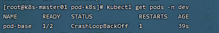

上面定义了一个比较简单Pod的配置，里面有两个容器：

- nginx：用1.17.1版本的nginx镜像创建，（nginx是一个轻量级web容器）
- busybox：用1.30版本的busybox镜像创建，（busybox是一个小巧的linux命令集合）


```shell
# 创建Pod
[root@k8s-master01 pod]# kubectl apply -f pod-base.yaml
pod/pod-base created

# 查看Pod状况
# READY 1/2 : 表示当前Pod中有2个容器，其中1个准备就绪，1个未就绪
# RESTARTS  : 重启次数，因为有1个容器故障了，Pod一直在重启试图恢复它
[root@k8s-master01 pod]# kubectl get pod -n dev
NAME       READY   STATUS    RESTARTS   AGE
pod-base   1/2     Running   4          95s

# 可以通过describe查看内部的详情
# 此时已经运行起来了一个基本的Pod，虽然它暂时有问题
[root@k8s-master01 pod]# kubectl describe pod pod-base -n dev
```

##### 5.2.2 镜像拉取

创建pod-imagepullpolicy.yaml文件，内容如下：

```yaml
apiVersion: v1
kind: Pod
metadata:
  name: pod-imagepullpolicy
  namespace: dev
spec:
  containers:
  - name: nginx
    image: nginx:1.17.1
    imagePullPolicy: Never # 用于设置镜像拉取策略
  - name: busybox
    image: busybox:1.30
```

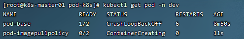

imagePullPolicy，用于设置镜像拉取策略，kubernetes支持配置三种拉取策略：

- Always：总是从远程仓库拉取镜像（一直远程下载）
- IfNotPresent：本地有则使用本地镜像，本地没有则从远程仓库拉取镜像（本地有就本地 本地没远程下载）
- Never：只使用本地镜像，从不去远程仓库拉取，本地没有就报错 （一直使用本地）

> 默认值说明：
>
> 如果镜像tag为具体版本号， 默认策略是：IfNotPresent
>
> 如果镜像tag为：latest（最终版本） ，默认策略是always


```shell
# 创建Pod
[root@k8s-master01 pod]# kubectl create -f pod-imagepullpolicy.yaml
pod/pod-imagepullpolicy created

# 查看Pod详情
# 此时明显可以看到nginx镜像有一步Pulling image "nginx:1.17.1"的过程
[root@k8s-master01 pod]# kubectl describe pod pod-imagepullpolicy -n dev
......
Events:
  Type     Reason     Age               From               Message
  ----     ------     ----              ----               -------
  Normal   Scheduled  <unknown>         default-scheduler  Successfully assigned dev/pod-imagePullPolicy to node1
  Normal   Pulling    32s               kubelet, node1     Pulling image "nginx:1.17.1"
  Normal   Pulled     26s               kubelet, node1     Successfully pulled image "nginx:1.17.1"
  Normal   Created    26s               kubelet, node1     Created container nginx
  Normal   Started    25s               kubelet, node1     Started container nginx
  Normal   Pulled     7s (x3 over 25s)  kubelet, node1     Container image "busybox:1.30" already present on machine
  Normal   Created    7s (x3 over 25s)  kubelet, node1     Created container busybox
  Normal   Started    7s (x3 over 25s)  kubelet, node1     Started container busybox
```

下载私有仓库的镜像

我们在使用阿里云容器镜像的私有仓库的使用，阿里云要求我们进行登录，如果是 docker 拉取镜像，那么只需要 docker login 之类的就可以了；但是，如果使用 Kubernetes 该怎么办？

① 创建 secret ：

```shell
# -n demo ：表示该密钥将只在指定的名称空间 demo 中生效
# docker-registry aliyun ：指定 Docker 镜像仓库的名称
# --docker-server：Docker 镜像仓库的地址
# --docker-username：Docker 镜像仓库的用户名
# --docker-password：Docker 镜像仓库的密码
kubectl create secret -n demo docker-registry aliyun \
       --docker-server=registry.cn-shanghai.aliyuncs.com \
       --docker-username=xudaxian \
       --docker-password=123456
```

 ② 在 yaml 中拉取镜像的时候设置镜像拉取的密钥（secret）：

```yaml
apiVersion: v1
kind: Namespace
metadata:
  name:  demo 
spec: {} 
status: {} 

# 以上是 namespace 
---
apiVersion: v1
kind: Pod
metadata:
  name: demo-pod
  namespace: demo 
  labels:
    app: nginx
spec:
  containers:
  imagePullSecrets: # Pull镜像时使用的 secret 名称，以 key：secretkey 格式指定
    - name:  aliyun 
  - name: nginx
    image: nginx:1.20.2 # Docker 的镜像名称，和 Docker 命令一样，my-registry.example.com:5000/example/web-example:v1.0，实际开发中，建议锁定镜像的版本。
    imagePullPolicy: Always # 镜像拉取策略：IfNotPresent（默认）、Always、Never
  - name: arcgis
    image: registry.cn-shanghai.aliyuncs.com/xudaxian/arcgis/v1.0 
    imagePullPolicy: Always
```

> 注意：这个肯定运行不了，需要将 secret 的用户名和密码设置为自己的，而且在拉取阿里云私有镜像的时候设置为自己的镜像。

##### 5.2.3 启动命令

在前面的案例中，一直有一个问题没有解决，就是的busybox容器一直没有成功运行，那么到底是什么原因导致这个容器的故障呢？

原来busybox并不是一个程序，而是类似于一个工具类的集合，kubernetes集群启动管理后，它会自动关闭。解决方法就是让其一直在运行，这就用到了command配置。

创建pod-command.yaml文件，内容如下：


```yaml
apiVersion: v1
kind: Pod
metadata:
  name: pod-command
  namespace: dev
spec:
  containers:
  - name: nginx
    image: nginx:1.17.1
  - name: busybox
    image: busybox:1.30
    command: ["/bin/sh","-c","touch /tmp/hello.txt;while true;do /bin/echo $(date +%T) >> /tmp/hello.txt; sleep 3; done;"]
```


command，用于在pod中的容器初始化完毕之后运行一个命令。

> 稍微解释下上面命令的意思：
>
> "/bin/sh","-c", 使用sh执行命令 -c代表使用管理原身份运行
>
> touch /tmp/hello.txt; 创建一个/tmp/hello.txt 文件
>
> while true; 死循环
>
> do /bin/echo $(date +%T) >> /tmp/hello.txt; sleep 3; done; 每隔3秒向文件中写入当前时间


```shell
# 创建Pod
[root@k8s-master01 pod]# kubectl create  -f pod-command.yaml
pod/pod-command created

# 查看Pod状态
# 此时发现两个pod都正常运行了
[root@k8s-master01 pod]# kubectl get pods pod-command -n dev
NAME          READY   STATUS   RESTARTS   AGE
pod-command   2/2     Runing   0          2s

# 进入pod中的busybox容器，查看文件内容
# 补充一个命令: kubectl exec  pod名称 -n 命名空间 -it -c 容器名称 /bin/sh  在容器内部执行命令
# 使用这个命令就可以进入某个容器的内部，然后进行相关操作了
# 比如，可以查看txt文件的内容
[root@k8s-master01 pod]# kubectl exec pod-command -n dev -it -c busybox /bin/sh
                       # 或者kubectl exec -it pod-command -n dev -- /bin/bash
/ # tail -f /tmp/hello.txt
14:44:19
14:44:22
14:44:25
```

```
特别说明：
    通过上面发现command已经可以完成启动命令和传递参数的功能，为什么这里还要提供一个args选项，用于传递参数呢?这其实跟docker有点关系，kubernetes中的command、args两项其实是实现覆盖Dockerfile中ENTRYPOINT的功能。
 1 如果command和args均没有写，那么用Dockerfile的配置。
 2 如果command写了，但args没有写，那么Dockerfile默认的配置会被忽略，执行输入的command
 3 如果command没写，但args写了，那么Dockerfile中配置的ENTRYPOINT的命令会被执行，使用当前args的参数
 4 如果command和args都写了，那么Dockerfile的配置被忽略，执行command并追加上args参数
```

如果在 Kubernetes 的 yaml 中定义了 comand 和 args ，那么就会覆盖 Dockerfile 中的 ENTRPOINT 和 CMD 。示例：启动 MySQL 

```shell
vim k8s-mysql.yaml
```

```yaml
apiVersion: v1
kind: Pod
metadata:
  name: mysql-pod
  namespace: default
  labels:
    app: mysql-pod
spec:
  containers:
  - name: mysql-pod
    image: mysql:5.7
    env:
    - name: MYSQL_ROOT_PASSWORD
      value: "123456"
    - name: MYSQL_DATABASE
      value: ssm
    args:
      - "--lower_case_table_names=1"
      - "--character-set-server=utf8mb4"
      - "--collation-server=utf8mb4_general_ci"
      - "--default-authentication-plugin=mysql_native_password"    
    ports:
    - containerPort:  3306
  restartPolicy: Always
```

```shell
kubectl apply -f k8s-mysql.yaml
```

##### 5.2.4 环境变量

创建pod-env.yaml文件，内容如下：

```yaml
apiVersion: v1
kind: Pod
metadata:
  name: pod-env
  namespace: dev
spec:
  containers:
  - name: busybox
    image: busybox:1.30
    command: ["/bin/sh","-c","while true;do /bin/echo $(date +%T);sleep 60; done;"]
    env: # 设置环境变量列表
    - name: "username"
      value: "admin"
    - name: "password"
      value: "123456"
```

env，环境变量，用于在pod中的容器设置环境变量。

```shell
# 创建Pod
[root@k8s-master01 ~]# kubectl create -f pod-env.yaml
pod/pod-env created

# 进入容器，输出环境变量
[root@k8s-master01 ~]# kubectl exec pod-env -n dev -c busybox -it /bin/sh
/ # echo $username
admin
/ # echo $password
123456
```

这种方式不是很推荐，推荐将这些配置单独存储在配置文件中，这种方式将在后面介绍。

##### 5.2.5 端口设置

本小节来介绍容器的端口设置，也就是containers的ports选项。

首先看下ports支持的子选项：

```shell
[root@k8s-master01 ~]# kubectl explain pod.spec.containers.ports
KIND:     Pod
VERSION:  v1
RESOURCE: ports <[]Object>
FIELDS:
   name         <string>  # 端口名称，如果指定，必须保证name在pod中是唯一的		
   containerPort<integer> # 容器要监听的端口(0<x<65536)
   hostPort     <integer> # 容器要在主机上公开的端口，如果设置，主机上只能运行容器的一个副本(一般省略) 这个类似与docker中的host模式，将容器端口映射到主机同样的端口
   hostIP       <string>  # 要将外部端口绑定到的主机IP(一般省略)
   protocol     <string>  # 端口协议。必须是UDP、TCP或SCTP。默认为“TCP”。
```

接下来，编写一个测试案例，创建pod-ports.yaml

```yaml
apiVersion: v1
kind: Pod
metadata:
  name: pod-ports
  namespace: dev
spec:
  containers:
  - name: nginx
    image: nginx:1.17.1
    ports: # 设置容器暴露的端口列表
    - name: nginx-port
      containerPort: 80
      protocol: TCP
```

```shell
# 创建Pod
[root@k8s-master01 ~]# kubectl create -f pod-ports.yaml
pod/pod-ports created

# 查看pod
# 在下面可以明显看到配置信息
[root@k8s-master01 ~]# kubectl get pod pod-ports -n dev -o yaml
......
spec:
  containers:
  - image: nginx:1.17.1
    imagePullPolicy: IfNotPresent
    name: nginx
    ports:
    - containerPort: 80
      name: nginx-port
      protocol: TCP
......
```

访问容器中的程序需要使用的是`Podip:containerPort`

##### 5.2.6 资源配额

容器中的程序要运行，肯定是要占用一定资源的，比如cpu和内存等，如果不对某个容器的资源做限制，那么它就可能吃掉大量资源，导致其它容器无法运行。针对这种情况，kubernetes提供了对内存和cpu的资源进行配额的机制，这种机制主要通过resources选项实现，他有两个子选项：

- limits：用于限制运行时容器的最大占用资源，当容器占用资源超过limits时会被终止，并进行重启
- requests ：用于设置容器需要的最小资源，如果环境资源不够，容器将无法启动

可以通过上面两个选项设置资源的上下限。

接下来，编写一个测试案例，创建pod-resources.yaml

```yaml
apiVersion: v1
kind: Pod
metadata:
  name: pod-resources
  namespace: dev
spec:
  containers:
  - name: nginx
    image: nginx:1.17.1
    resources: # 资源配额
      limits:  # 限制资源（上限）
        cpu: "2" # CPU限制，单位是core数
        memory: "10Gi" # 内存限制
      requests: # 请求资源（下限）
        cpu: "1"  # CPU限制，单位是core数
        memory: "10Mi"  # 内存限制
```

在这对cpu和memory的单位做一个说明：

- cpu：core数，可以为整数或小数
- memory： 内存大小，可以使用Gi、Mi、G、M等形式

```shell
# 运行Pod
[root@k8s-master01 ~]# kubectl create  -f pod-resources.yaml
pod/pod-resources created

# 查看发现pod运行正常
[root@k8s-master01 ~]# kubectl get pod pod-resources -n dev
NAME            READY   STATUS    RESTARTS   AGE  
pod-resources   1/1     Running   0          39s   

# 接下来，停止Pod
[root@k8s-master01 ~]# kubectl delete  -f pod-resources.yaml
pod "pod-resources" deleted

# 编辑pod，修改resources.requests.memory的值为10Gi
[root@k8s-master01 ~]# vim pod-resources.yaml

# 再次启动pod
[root@k8s-master01 ~]# kubectl create  -f pod-resources.yaml
pod/pod-resources created

# 查看Pod状态，发现Pod启动失败
[root@k8s-master01 ~]# kubectl get pod pod-resources -n dev -o wide
NAME            READY   STATUS    RESTARTS   AGE          
pod-resources   0/1     Pending   0          20s    

# 查看pod详情会发现，如下提示
[root@k8s-master01 ~]# kubectl describe pod pod-resources -n dev
......
Warning  FailedScheduling  35s   default-scheduler  0/3 nodes are available: 1 node(s) had taint {node-role.kubernetes.io/master: }, that the pod didn't tolerate, 2 Insufficient memory.(内存不足)
```

#### 5.3 Pod生命周期

我们一般将pod对象从创建至终的这段时间范围称为pod的生命周期，它主要包含下面的过程：

- pod创建过程
- 运行初始化容器（init container）过程
- 运行主容器（main container）
  - 容器启动后钩子（post start）、容器终止前钩子（pre stop）
  - 容器的存活性探测（liveness probe）、就绪性探测（readiness probe）
- pod终止过程


在整个生命周期中，Pod会出现5种**状态**（**相位**），分别如下：

- 挂起（Pending）：apiserver已经创建了pod资源对象，但它尚未被调度完成或者仍处于下载镜像的过程中
- 运行中（Running）：pod已经被调度至某节点，并且所有容器都已经被kubelet创建完成
- 成功（Succeeded）：pod中的所有容器都已经成功终止并且不会被重启
- 失败（Failed）：所有容器都已经终止，但至少有一个容器终止失败，即容器返回了非0值的退出状态
- 未知（Unknown）：apiserver无法正常获取到pod对象的状态信息，通常由网络通信失败所导致

##### 5.3.1 创建和终止

**pod的创建过程**

1. 用户通过kubectl或其他api客户端提交需要创建的pod信息给apiServer

2. apiServer开始生成pod对象的信息，并将信息存入etcd，然后返回确认信息至客户端

3. apiServer开始反映etcd中的pod对象的变化，其它组件使用watch机制来跟踪检查apiServer上的变动

4. scheduler发现有新的pod对象要创建，开始为Pod分配主机并将结果信息更新至apiServer

5. node节点上的kubelet发现有pod调度过来，尝试调用docker启动容器，并将结果回送至apiServer

6. apiServer将接收到的pod状态信息存入etcd中

   

**pod的终止过程**

1. 用户向apiServer发送删除pod对象的命令
2. apiServcer中的pod对象信息会随着时间的推移而更新，在宽限期内（默认30s），pod被视为dead
3. 将pod标记为terminating状态
4. kubelet在监控到pod对象转为terminating状态的同时启动pod关闭过程
5. 端点控制器监控到pod对象的关闭行为时将其从所有匹配到此端点的service资源的端点列表中移除
6. 如果当前pod对象定义了preStop钩子处理器，则在其标记为terminating后即会以同步的方式启动执行
7. pod对象中的容器进程收到停止信号
8. 宽限期结束后，若pod中还存在仍在运行的进程，那么pod对象会收到立即终止的信号
9. kubelet请求apiServer将此pod资源的宽限期设置为0从而完成删除操作，此时pod对于用户已不可见

##### 5.3.2 初始化容器

初始化容器是在pod的主容器启动之前要运行的容器，主要是做一些主容器的前置工作，它具有两大特征：

1. 初始化容器必须运行完成直至结束，若某初始化容器运行失败，那么kubernetes需要重启它直到成功完成
2. 初始化容器必须按照定义的顺序执行，当且仅当前一个成功之后，后面的一个才能运行

初始化容器有很多的应用场景，下面列出的是最常见的几个：

- 提供主容器镜像中不具备的工具程序或自定义代码
- 初始化容器要先于应用容器串行启动并运行完成，因此可用于延后应用容器的启动直至其依赖的条件得到满足

接下来做一个案例，模拟下面这个需求：

假设要以主容器来运行nginx，但是要求在运行nginx之前先要能够连接上mysql和redis所在服务器

为了简化测试，事先规定好mysql`(192.168.90.14)`和redis`(192.168.90.15)`服务器的地址

创建pod-initcontainer.yaml，内容如下：

```yaml
apiVersion: v1
kind: Pod
metadata:
  name: pod-initcontainer
  namespace: dev
spec:
  containers:
  - name: main-container
    image: nginx:1.17.1
    ports: 
    - name: nginx-port
      containerPort: 80
  initContainers:
  - name: test-mysql
    image: busybox:1.30
    command: ['sh', '-c', 'until ping 192.168.90.14 -c 1 ; do echo waiting for mysql...; sleep 2; done;'] # 一直ping这个地址，-c 1代表ping一次，直到ping通结束退出，否则打印echo内容
  - name: test-redis
    image: busybox:1.30
    command: ['sh', '-c', 'until ping 192.168.90.15 -c 1 ; do echo waiting for reids...; sleep 2; done;']
```

```shell
# 创建pod
[root@k8s-master01 ~]# kubectl create -f pod-initcontainer.yaml
pod/pod-initcontainer created

# 查看pod状态
# 发现pod卡在启动第一个初始化容器过程中，后面的容器不会运行
root@k8s-master01 ~]# kubectl describe pod  pod-initcontainer -n dev
........
Events:
  Type    Reason     Age   From               Message
  ----    ------     ----  ----               -------
  Normal  Scheduled  49s   default-scheduler  Successfully assigned dev/pod-initcontainer to node1
  Normal  Pulled     48s   kubelet, node1     Container image "busybox:1.30" already present on machine
  Normal  Created    48s   kubelet, node1     Created container test-mysql
  Normal  Started    48s   kubelet, node1     Started container test-mysql

# 动态监听pod
[root@k8s-master01 ~]# kubectl get pods pod-initcontainer -n dev -w
NAME                             READY   STATUS     RESTARTS   AGE
pod-initcontainer                0/1     Init:0/2   0          15s
pod-initcontainer                0/1     Init:1/2   0          52s
pod-initcontainer                0/1     Init:1/2   0          53s
pod-initcontainer                0/1     PodInitializing   0          89s
pod-initcontainer                1/1     Running           0          90s

# 接下来新开一个shell，为当前服务器新增两个ip，观察pod的变化
[root@k8s-master01 ~]# ifconfig ens33:1 192.168.90.14 netmask 255.255.255.0 up
[root@k8s-master01 ~]# ifconfig ens33:2 192.168.90.15 netmask 255.255.255.0 up
```

##### 5.3.3 钩子函数

钩子函数能够感知自身生命周期中的事件，并在相应的时刻到来时运行用户指定的程序代码。

kubernetes在主容器的启动之后和停止之前提供了两个钩子函数：

- post start：容器创建之后执行，如果失败了会重启容器
- pre stop ：容器终止之前执行，执行完成之后容器将成功终止，在其完成之前会阻塞删除容器的操作

钩子处理器支持使用下面三种方式定义动作：

- Exec命令：在容器内执行一次命令

  ```yaml
  ……
    lifecycle:
      postStart: 
        exec:
          command:
          - cat
          - /tmp/healthy
  ……
  ```
  
- TCPSocket：在当前容器尝试访问指定的socket

  ```yaml
  ……      
    lifecycle:
      postStart:
        tcpSocket:
          port: 8080
  ……
  ```
  
- HTTPGet：在当前容器中向某url发起http请求

  ```yaml
  ……
    lifecycle:
      postStart:
        httpGet:
          path: / #URI地址
          port: 80 #端口号
          host: 192.168.5.3 #主机地址
          scheme: HTTP #支持的协议，http或者https
  ……
  ```

接下来，以exec方式为例，演示下钩子函数的使用，创建pod-hook-exec.yaml文件，内容如下：

```yaml
apiVersion: v1
kind: Pod
metadata:
  name: pod-hook-exec
  namespace: dev
spec:
  containers:
  - name: main-container
    image: nginx:1.17.1
    ports:
    - name: nginx-port
      containerPort: 80
    lifecycle:
      postStart: 
        exec: # 在容器启动的时候执行一个命令，修改掉nginx的默认首页内容
          command: ["/bin/sh", "-c", "echo postStart... > /usr/share/nginx/html/index.html"]
      preStop:
        exec: # 在容器停止之前停止nginx服务
          command: ["/usr/sbin/nginx","-s","quit"]
```

```shell
# 创建pod
[root@k8s-master01 ~]# kubectl create -f pod-hook-exec.yaml
pod/pod-hook-exec created

# 查看pod
[root@k8s-master01 ~]# kubectl get pods  pod-hook-exec -n dev -o wide
NAME           READY   STATUS     RESTARTS   AGE    IP            NODE    
pod-hook-exec  1/1     Running    0          29s    10.244.2.48   node2   

# 访问pod
[root@k8s-master01 ~]# curl 10.244.2.48
postStart...
```

##### 5.3.4 容器探测

容器探测用于检测容器中的应用实例是否正常工作，是由 [kubelet](https://kubernetes.io/zh/docs/reference/command-line-tools-reference/kubelet/) 对容器执行的定期诊断，要执行诊断，kubelet 既可以在容器内执行代码，也可以发出一个网络请求。 是保障业务可用性的一种传统机制。如果经过探测，实例的状态不符合预期，那么kubernetes就会把该问题实例" 摘除 "，不承担业务流量。

针对运行中的容器，`kubelet` 可以选择是否执行以下三种探针，以及如何针对探测结果作出反应：

- startup probes：启动探针，来检测应用是否已经启动。如果启动就可以进行后续的探测检查。慢容器一定指定启动探针。一直在等待启动。启动探针一旦成功就不再执行（只会成功执行一次），存活探针和就绪探针将接着持续执行。

- liveness probes：存活性探针，用于检测应用实例当前是否处于正常运行状态，如果不是，k8s会重启容器。（有些容器可能产生死锁【应用程序在运行，但是无法继续执行后面的步骤】），如果检测失败就会重新启动这个容器。
- readiness probes：就绪性探针，用于检测应用实例当前是否可以接收请求，如果不能，k8s不会转发流量。当一个 Pod 内的所有容器都准备好了，才能把这个 Pod 看作就绪了。用途就是：Service后端负载均衡多个Pod，如果某个Pod还没就绪，就会从service负载均衡里面剔除。

> livenessProbe 决定是否重启容器，readinessProbe 决定是否将请求转发给容器。

Probe 的配置项： 

- - initialDelaySeconds：容器启动后要等待多少秒后存活和就绪探测器才被初始化，默认是 0 秒，最小值是 0。

- - periodSeconds：执行探测的时间间隔（单位是秒），默认是 10 秒，最小值是 1。

- - successThreshold：探测器在失败后，被视为成功的最小连续成功数，默认值是 1。存活和启动探针的这个值必须是 1。

- - failureThreshold：当探测失败时，Kubernetes 的重试次数，存活探测情况下的放弃就意味着重新启动容器， 就绪探测情况下的放弃 Pod 会被打上未就绪的标签。默认值是 3。

- - timeoutSeconds：探测的超时后等待多少秒，默认值是 1 秒，最小值是 1。

上面三种探针目前均支持三种探测方式：

- Exec命令：在容器内执行一次命令，如果命令执行的退出码为0，则认为程序正常，否则不正常

  ```yaml
  ……
    livenessProbe:
      exec:
        command:
        - cat
        - /tmp/healthy
  ……
  ```
  
- TCPSocket：将会尝试访问一个用户容器的端口，如果能够建立这条连接，则认为程序正常，否则不正常

  ```yaml
  ……      
    livenessProbe:
      tcpSocket:
        port: 8080
  ……
  ```
  
- HTTPGet：调用容器内Web应用的URL，如果返回的状态码在200和399之间，则认为程序正常，否则不正常

  ```yaml
  ……
    livenessProbe:
      httpGet:
        path: / #URI地址
        port: 80 #端口号
        host: 127.0.0.1 #主机地址
        scheme: HTTP #支持的协议，http或者https
  ……
  ```

下面以liveness probes为例，做几个演示：

**方式一：Exec**

创建pod-liveness-exec.yaml

```yaml
apiVersion: v1
kind: Pod
metadata:
  name: pod-liveness-exec
  namespace: dev
spec:
  containers:
  - name: nginx
    image: nginx:1.17.1
    ports: 
    - name: nginx-port
      containerPort: 80
    livenessProbe:
      exec:
        command: ["/bin/cat","/tmp/hello.txt"] # 执行一个查看文件的命令
```

创建pod，观察效果

```shell
# 创建Pod
[root@k8s-master01 ~]# kubectl create -f pod-liveness-exec.yaml
pod/pod-liveness-exec created

# 查看Pod详情
[root@k8s-master01 ~]# kubectl describe pods pod-liveness-exec -n dev
......
  Normal   Created    20s (x2 over 50s)  kubelet, node1     Created container nginx
  Normal   Started    20s (x2 over 50s)  kubelet, node1     Started container nginx
  Normal   Killing    20s                kubelet, node1     Container nginx failed liveness probe, will be restarted
  Warning  Unhealthy  0s (x5 over 40s)   kubelet, node1     Liveness probe failed: cat: can't open '/tmp/hello11.txt': No such file or directory
  
# 观察上面的信息就会发现nginx容器启动之后就进行了健康检查
# 检查失败之后，容器被kill掉，然后尝试进行重启（这是重启策略的作用，后面讲解）
# 稍等一会之后，再观察pod信息，就可以看到RESTARTS不再是0，而是一直增长
[root@k8s-master01 ~]# kubectl get pods pod-liveness-exec -n dev
NAME                READY   STATUS             RESTARTS   AGE
pod-liveness-exec   0/1     CrashLoopBackOff   2          3m19s

# 当然接下来，可以修改成一个存在的文件，比如/tmp/hello.txt，再试，结果就正常了......
```

```yaml
# 应用示例 以启动探针为例
apiVersion: v1
kind: Pod
metadata:
  name: nginx-prode
  labels:
    app: nginx-prode
spec:
  containers:
    - name: nginx
      image: nginx:1.20.2
      imagePullPolicy: IfNotPresent
      startupProbe: # 启动探针
        exec:
          command: # 返回不是 0 ，就是探测失败
            - /bin/sh
            - -c
            - sleep 30;abc
        initialDelaySeconds: 1 # 探测延迟，RUNNING 后指定 20 秒后才执行探测，默认为 0 秒。
        periodSeconds: 5 # 执行探测的时间间隔（单位是秒），默认为 10 秒。
        successThreshold: 1 # 成功阈值：连续几次成功才算成功。探测器在失败后，被视为成功的最小连续成功数。默认值是 1 ，存活和启动探针的这个值必须是 1。最小值是 1。
        failureThreshold: 3 # 失败阈值：连续几次失败才算失败。当探测失败时，Kubernetes 的重试次数。 存活探测情况下的放弃就意味着重新启动容器。 就绪探测情况下的放弃 Pod 会被打上未就绪的标签。默认值是 3。最小值是 1。
        timeoutSeconds: 5 # 探测的超时后等待多少秒。默认值是 1 秒。最小值是 1。
```

**方式二：TCPSocket**

创建pod-liveness-tcpsocket.yaml

```yaml
apiVersion: v1
kind: Pod
metadata:
  name: pod-liveness-tcpsocket
  namespace: dev
spec:
  containers:
  - name: nginx
    image: nginx:1.17.1
    ports: 
    - name: nginx-port
      containerPort: 80
    livenessProbe:
      tcpSocket:
        port: 8080 # 尝试访问8080端口
```

创建pod，观察效果

```shell
# 创建Pod
[root@k8s-master01 ~]# kubectl create -f pod-liveness-tcpsocket.yaml
pod/pod-liveness-tcpsocket created

# 查看Pod详情
[root@k8s-master01 ~]# kubectl describe pods pod-liveness-tcpsocket -n dev
......
  Normal   Scheduled  31s                            default-scheduler  Successfully assigned dev/pod-liveness-tcpsocket to node2
  Normal   Pulled     <invalid>                      kubelet, node2     Container image "nginx:1.17.1" already present on machine
  Normal   Created    <invalid>                      kubelet, node2     Created container nginx
  Normal   Started    <invalid>                      kubelet, node2     Started container nginx
  Warning  Unhealthy  <invalid> (x2 over <invalid>)  kubelet, node2     Liveness probe failed: dial tcp 10.244.2.44:8080: connect: connection refused
  
# 观察上面的信息，发现尝试访问8080端口,但是失败了
# 稍等一会之后，再观察pod信息，就可以看到RESTARTS不再是0，而是一直增长
[root@k8s-master01 ~]# kubectl get pods pod-liveness-tcpsocket  -n dev
NAME                     READY   STATUS             RESTARTS   AGE
pod-liveness-tcpsocket   0/1     CrashLoopBackOff   2          3m19s

# 当然接下来，可以修改成一个可以访问的端口，比如80，再试，结果就正常了......
```

**方式三：HTTPGet**

创建pod-liveness-httpget.yaml

```yaml
apiVersion: v1
kind: Pod
metadata:
  name: pod-liveness-httpget
  namespace: dev
spec:
  containers:
  - name: nginx
    image: nginx:1.17.1
    ports:
    - name: nginx-port
      containerPort: 80
    livenessProbe:
      httpGet:  # 其实就是访问http://127.0.0.1:80/hello  
        scheme: HTTP #支持的协议，http或者https
        port: 80 #端口号
        path: /hello #URI地址
```

创建pod，观察效果

```shell
# 创建Pod
[root@k8s-master01 ~]# kubectl create -f pod-liveness-httpget.yaml
pod/pod-liveness-httpget created

# 查看Pod详情
[root@k8s-master01 ~]# kubectl describe pod pod-liveness-httpget -n dev
.......
  Normal   Pulled     6s (x3 over 64s)  kubelet, node1     Container image "nginx:1.17.1" already present on machine
  Normal   Created    6s (x3 over 64s)  kubelet, node1     Created container nginx
  Normal   Started    6s (x3 over 63s)  kubelet, node1     Started container nginx
  Warning  Unhealthy  6s (x6 over 56s)  kubelet, node1     Liveness probe failed: HTTP probe failed with statuscode: 404
  Normal   Killing    6s (x2 over 36s)  kubelet, node1     Container nginx failed liveness probe, will be restarted
  
# 观察上面信息，尝试访问路径，但是未找到,出现404错误
# 稍等一会之后，再观察pod信息，就可以看到RESTARTS不再是0，而是一直增长
[root@k8s-master01 ~]# kubectl get pod pod-liveness-httpget -n dev
NAME                   READY   STATUS    RESTARTS   AGE
pod-liveness-httpget   1/1     Running   5          3m17s

# 当然接下来，可以修改成一个可以访问的路径path，比如/，再试，结果就正常了......
```

至此，已经使用liveness Probe演示了三种探测方式，但是查看livenessProbe的子属性，会发现除了这三种方式，还有一些其他的配置，在这里一并解释下：

```shell
[root@k8s-master01 ~]# kubectl explain pod.spec.containers.livenessProbe
FIELDS:
   exec <Object>  
   tcpSocket    <Object>
   httpGet      <Object>
   initialDelaySeconds  <integer>  # 容器启动后等待多少秒执行第一次探测
   timeoutSeconds       <integer>  # 探测超时时间。默认1秒，最小1秒
   periodSeconds        <integer>  # 执行探测的频率。默认是10秒，最小1秒
   failureThreshold     <integer>  # 连续探测失败多少次才被认定为失败。默认是3。最小值是1
   successThreshold     <integer>  # 连续探测成功多少次才被认定为成功。默认是1
```

下面稍微配置两个，演示下效果即可：

```yaml
[root@k8s-master01 ~]# more pod-liveness-httpget.yaml
apiVersion: v1
kind: Pod
metadata:
  name: pod-liveness-httpget
  namespace: dev
spec:
  containers:
  - name: nginx
    image: nginx:1.17.1
    ports:
    - name: nginx-port
      containerPort: 80
    livenessProbe:
      httpGet:
        scheme: HTTP
        port: 80 
        path: /
      initialDelaySeconds: 30 # 容器启动后30s开始探测
      timeoutSeconds: 5 # 探测超时时间为5s
```

##### 5.3.5 重启策略

在上一节中，一旦容器探测出现了问题，kubernetes就会对容器所在的Pod进行重启，其实这是由pod的重启策略决定的，pod的重启策略有 3 种，分别如下：

- Always ：容器失效时，自动重启该容器，这也是默认值。
- OnFailure ： 容器终止运行且退出码不为0时重启
- Never ： 不论状态为何，都不重启该容器

重启策略适用于pod对象中的所有容器，首次需要重启的容器，将在其需要时立即进行重启，随后再次需要重启的操作将由kubelet延迟一段时间后进行，且反复的重启操作的延迟时长以此为10s、20s、40s、80s、160s和300s，300s是最大延迟时长。

创建pod-restartpolicy.yaml：

```yaml
apiVersion: v1
kind: Pod
metadata:
  name: pod-restartpolicy
  namespace: dev
spec:
  containers:
  - name: nginx
    image: nginx:1.17.1
    ports:
    - name: nginx-port
      containerPort: 80
    livenessProbe:
      httpGet:
        scheme: HTTP
        port: 80
        path: /hello
  restartPolicy: Never # 设置重启策略为Never
```

运行Pod测试

```shell
# 创建Pod
[root@k8s-master01 ~]# kubectl create -f pod-restartpolicy.yaml
pod/pod-restartpolicy created

# 查看Pod详情，发现nginx容器失败
[root@k8s-master01 ~]# kubectl  describe pods pod-restartpolicy  -n dev
......
  Warning  Unhealthy  15s (x3 over 35s)  kubelet, node1     Liveness probe failed: HTTP probe failed with statuscode: 404
  Normal   Killing    15s                kubelet, node1     Container nginx failed liveness probe
  
# 多等一会，再观察pod的重启次数，发现一直是0，并未重启   
[root@k8s-master01 ~]# kubectl  get pods pod-restartpolicy -n dev
NAME                   READY   STATUS    RESTARTS   AGE
pod-restartpolicy      0/1     Running   0          5min42s
```

#### 5.4 Pod调度

在默认情况下，一个Pod在哪个Node节点上运行，是由Scheduler组件采用相应的算法计算出来的，这个过程是不受人工控制的。但是在实际使用中，这并不满足的需求，因为很多情况下，我们想控制某些Pod到达某些节点上，那么应该怎么做呢？这就要求了解kubernetes对Pod的调度规则，kubernetes提供了四大类调度方式：

- 自动调度：运行在哪个节点上完全由Scheduler经过一系列的算法计算得出
- 定向调度：NodeName、NodeSelector
- 亲和性调度：NodeAffinity、PodAffinity、PodAntiAffinity
- 污点（容忍）调度：Taints、Toleration

##### 5.4.1 定向调度

定向调度，指的是利用在pod上声明nodeName或者nodeSelector，以此将Pod调度到期望的node节点上。注意，这里的调度是强制的，这就意味着即使要调度的目标Node不存在，也会向上面进行调度，只不过pod运行失败而已。

**NodeName**

NodeName用于强制约束将Pod调度到指定的Name的Node节点上。这种方式，其实是直接跳过Scheduler的调度逻辑，直接将Pod调度到指定名称的节点。

接下来，实验一下：创建一个pod-nodename.yaml文件

```yaml
apiVersion: v1
kind: Pod
metadata:
  name: pod-nodename
  namespace: dev
spec:
  containers:
  - name: nginx
    image: nginx:1.17.1
  nodeName: node1 # 指定调度到node1节点上
```

```shell
#创建Pod
[root@k8s-master01 ~]# kubectl create -f pod-nodename.yaml
pod/pod-nodename created

#查看Pod调度到NODE属性，确实是调度到了node1节点上
[root@k8s-master01 ~]# kubectl get pods pod-nodename -n dev -o wide
NAME           READY   STATUS    RESTARTS   AGE   IP            NODE      ......
pod-nodename   1/1     Running   0          56s   10.244.1.87   node1     ......   

# 接下来，删除pod，修改nodeName的值为node3（并没有node3节点）
[root@k8s-master01 ~]# kubectl delete -f pod-nodename.yaml
pod "pod-nodename" deleted
[root@k8s-master01 ~]# vim pod-nodename.yaml
[root@k8s-master01 ~]# kubectl create -f pod-nodename.yaml
pod/pod-nodename created

#再次查看，发现已经向Node3节点调度，但是由于不存在node3节点，所以pod无法正常运行
[root@k8s-master01 ~]# kubectl get pods pod-nodename -n dev -o wide
NAME           READY   STATUS    RESTARTS   AGE   IP       NODE    ......
pod-nodename   0/1     Pending   0          6s    <none>   node3   ......           
```

**NodeSelector**

NodeSelector用于将pod调度到添加了指定标签的node节点上。它是通过kubernetes的label-selector机制实现的，也就是说，在pod创建之前，会由scheduler使用MatchNodeSelector调度策略进行label匹配，找出目标node，然后将pod调度到目标节点，该匹配规则是强制约束。

接下来，实验一下：

1 首先分别为node节点添加标签

```shell
[root@k8s-master01 ~]# kubectl label nodes node1 nodeenv=pro
node/node2 labeled
[root@k8s-master01 ~]# kubectl label nodes node2 nodeenv=test
node/node2 labeled
```

2 创建一个pod-nodeselector.yaml文件，并使用它创建Pod

```yaml
apiVersion: v1
kind: Pod
metadata:
  name: pod-nodeselector
  namespace: dev
spec:
  containers:
  - name: nginx
    image: nginx:1.17.1
  nodeSelector: 
    nodeenv: pro # 指定调度到具有nodeenv=pro标签的节点上
```

```shell
#创建Pod
[root@k8s-master01 ~]# kubectl create -f pod-nodeselector.yaml
pod/pod-nodeselector created

#查看Pod调度到NODE属性，确实是调度到了node1节点上
[root@k8s-master01 ~]# kubectl get pods pod-nodeselector -n dev -o wide
NAME               READY   STATUS    RESTARTS   AGE     IP          NODE    ......
pod-nodeselector   1/1     Running   0          47s   10.244.1.87   node1   ......

# 接下来，删除pod，修改nodeSelector的值为nodeenv: xxxx（不存在打有此标签的节点）
[root@k8s-master01 ~]# kubectl delete -f pod-nodeselector.yaml
pod "pod-nodeselector" deleted
[root@k8s-master01 ~]# vim pod-nodeselector.yaml
[root@k8s-master01 ~]# kubectl create -f pod-nodeselector.yaml
pod/pod-nodeselector created

#再次查看，发现pod无法正常运行,Node的值为none
[root@k8s-master01 ~]# kubectl get pods -n dev -o wide
NAME               READY   STATUS    RESTARTS   AGE     IP       NODE    
pod-nodeselector   0/1     Pending   0          2m20s   <none>   <none>

# 查看详情,发现node selector匹配失败的提示
[root@k8s-master01 ~]# kubectl describe pods pod-nodeselector -n dev
.......
Events:
  Type     Reason            Age        From               Message
  ----     ------            ----       ----               -------
  Warning  FailedScheduling  <unknown>  default-scheduler  0/3 nodes are available: 3 node(s) didn't match node selector.
```

##### 5.4.2 亲和性调度

上一节，介绍了两种定向调度的方式，使用起来非常方便，但是也有一定的问题，那就是如果没有满足条件的Node，那么Pod将不会被运行，即使在集群中还有可用Node列表也不行，这就限制了它的使用场景。

基于上面的问题，kubernetes还提供了一种亲和性调度（Affinity）。它在NodeSelector的基础之上的进行了扩展，可以通过配置的形式，实现优先选择满足条件的Node进行调度，如果没有，也可以调度到不满足条件的节点上，使调度更加灵活。

Affinity主要分为三类：

- nodeAffinity(node亲和性）: 以node为目标，解决pod可以调度到哪些node的问题
- podAffinity(pod亲和性) : 以pod为目标，解决pod可以和哪些已存在的pod部署在同一个拓扑域中的问题
- podAntiAffinity(pod反亲和性) : 以pod为目标，解决pod不能和哪些已存在pod部署在同一个拓扑域中的问题

> 关于亲和性(反亲和性)使用场景的说明：
>
> **亲和性**：如果两个应用频繁交互，那就有必要利用亲和性让两个应用的尽可能的靠近，这样可以减少因网络通信而带来的性能损耗。
>
> **反亲和性**：当应用的采用多副本部署时，有必要采用反亲和性让各个应用实例打散分布在各个node上，这样可以提高服务的高可用性。

**NodeAffinity**

首先来看一下`NodeAffinity`的可配置项：

```markdown
pod.spec.affinity.nodeAffinity
  requiredDuringSchedulingIgnoredDuringExecution  Node节点必须满足指定的所有规则才可以，相当于硬限制
    nodeSelectorTerms  节点选择列表
      matchFields   按节点字段列出的节点选择器要求列表
      matchExpressions   按节点标签列出的节点选择器要求列表(推荐)
        key    键
        values 值
        operat or 关系符 支持Exists, DoesNotExist, In, NotIn, Gt, Lt
  preferredDuringSchedulingIgnoredDuringExecution 优先调度到满足指定的规则的Node，相当于软限制 (倾向)
    preference   一个节点选择器项，与相应的权重相关联
      matchFields   按节点字段列出的节点选择器要求列表
      matchExpressions   按节点标签列出的节点选择器要求列表(推荐)
        key    键
        values 值
        operator 关系符 支持In, NotIn, Exists, DoesNotExist, Gt, Lt
	weight 倾向权重，在范围1-100。
```

```shell
关系符的使用说明:

- matchExpressions:
  - key: nodeenv              # 匹配存在标签的key为nodeenv的节点
    operator: Exists
  - key: nodeenv              # 匹配标签的key为nodeenv,且value是"xxx"或"yyy"的节点
    operator: In
    values: ["xxx","yyy"]
  - key: nodeenv              # 匹配标签的key为nodeenv,且value大于"xxx"的节点
    operator: Gt
    values: "xxx"
```

接下来首先演示一下`requiredDuringSchedulingIgnoredDuringExecution` ,

创建pod-nodeaffinity-required.yaml

```yaml
apiVersion: v1
kind: Pod
metadata:
  name: pod-nodeaffinity-required
  namespace: dev
spec:
  containers:
  - name: nginx
    image: nginx:1.17.1
  affinity:  #亲和性设置
    nodeAffinity: #设置node亲和性
      requiredDuringSchedulingIgnoredDuringExecution: # 硬限制
        nodeSelectorTerms:
        - matchExpressions: # 匹配env的值在["xxx","yyy"]中的标签
          - key: nodeenv
            operator: In
            values: ["xxx","yyy"]
```

```shell
# 创建pod
[root@k8s-master01 ~]# kubectl create -f pod-nodeaffinity-required.yaml
pod/pod-nodeaffinity-required created

# 查看pod状态 （运行失败）
[root@k8s-master01 ~]# kubectl get pods pod-nodeaffinity-required -n dev -o wide
NAME                        READY   STATUS    RESTARTS   AGE   IP       NODE    ...... 
pod-nodeaffinity-required   0/1     Pending   0          16s   <none>   <none>  ......

# 查看Pod的详情
# 发现调度失败，提示node选择失败
[root@k8s-master01 ~]# kubectl describe pod pod-nodeaffinity-required -n dev
......
  Warning  FailedScheduling  <unknown>  default-scheduler  0/3 nodes are available: 3 node(s) didn't match node selector.
  Warning  FailedScheduling  <unknown>  default-scheduler  0/3 nodes are available: 3 node(s) didn't match node selector.

#接下来，停止pod
[root@k8s-master01 ~]# kubectl delete -f pod-nodeaffinity-required.yaml
pod "pod-nodeaffinity-required" deleted

# 修改文件，将values: ["xxx","yyy"]------> ["pro","yyy"]
[root@k8s-master01 ~]# vim pod-nodeaffinity-required.yaml

# 再次启动
[root@k8s-master01 ~]# kubectl create -f pod-nodeaffinity-required.yaml
pod/pod-nodeaffinity-required created

# 此时查看，发现调度成功，已经将pod调度到了node1上
[root@k8s-master01 ~]# kubectl get pods pod-nodeaffinity-required -n dev -o wide
NAME                        READY   STATUS    RESTARTS   AGE   IP            NODE  ...... 
pod-nodeaffinity-required   1/1     Running   0          11s   10.244.1.89   node1 ......
```

接下来再演示一下`requiredDuringSchedulingIgnoredDuringExecution` ,

创建pod-nodeaffinity-preferred.yaml

```yaml
apiVersion: v1
kind: Pod
metadata:
  name: pod-nodeaffinity-preferred
  namespace: dev
spec:
  containers:
  - name: nginx
    image: nginx:1.17.1
  affinity:  #亲和性设置
    nodeAffinity: #设置node亲和性
      preferredDuringSchedulingIgnoredDuringExecution: # 软限制
      - weight: 1
        preference:
          matchExpressions: # 匹配env的值在["xxx","yyy"]中的标签(当前环境没有)
          - key: nodeenv
            operator: In
            values: ["xxx","yyy"]
```

```shell
# 创建pod
[root@k8s-master01 ~]# kubectl create -f pod-nodeaffinity-preferred.yaml
pod/pod-nodeaffinity-preferred created

# 查看pod状态 （运行成功）
[root@k8s-master01 ~]# kubectl get pod pod-nodeaffinity-preferred -n dev
NAME                         READY   STATUS    RESTARTS   AGE
pod-nodeaffinity-preferred   1/1     Running   0          40s
```

```
NodeAffinity规则设置的注意事项：
    1 如果同时定义了nodeSelector和nodeAffinity，那么必须两个条件都得到满足，Pod才能运行在指定的Node上
    2 如果nodeAffinity指定了多个nodeSelectorTerms，那么只需要其中一个能够匹配成功即可
    3 如果一个nodeSelectorTerms中有多个matchExpressions ，则一个节点必须满足所有的才能匹配成功
    4 如果一个pod所在的Node在Pod运行期间其标签发生了改变，不再符合该Pod的节点亲和性需求，则系统将忽略此变化
```

**PodAffinity**

PodAffinity主要实现以运行的Pod为参照，实现让新创建的Pod跟参照pod在一个区域的功能。

首先来看一下`PodAffinity`的可配置项：

```markdown
pod.spec.affinity.podAffinity
  requiredDuringSchedulingIgnoredDuringExecution  硬限制
    namespaces       指定参照pod的namespace
    topologyKey      指定调度作用域
    labelSelector    标签选择器
      matchExpressions  按节点标签列出的节点选择器要求列表(推荐)
        key    键
        values 值
        operator 关系符 支持In, NotIn, Exists, DoesNotExist.
      matchLabels    指多个matchExpressions映射的内容
  preferredDuringSchedulingIgnoredDuringExecution 软限制
    podAffinityTerm  选项
      namespaces      
      topologyKey
      labelSelector
        matchExpressions  
          key    键
          values 值
          operator
        matchLabels 
    weight 倾向权重，在范围1-100
```

```markdown
topologyKey用于指定调度时作用域,例如:
    如果指定为kubernetes.io/hostname，那就是以Node节点为区分范围
	如果指定为beta.kubernetes.io/os,则以Node节点的操作系统类型来区分
```

接下来，演示下`requiredDuringSchedulingIgnoredDuringExecution`,

1）首先创建一个参照Pod，pod-podaffinity-target.yaml：

```yaml
apiVersion: v1
kind: Pod
metadata:
  name: pod-podaffinity-target
  namespace: dev
  labels:
    podenv: pro #设置标签
spec:
  containers:
  - name: nginx
    image: nginx:1.17.1
  nodeName: node1 # 将目标pod名确指定到node1上
```

```shell
# 启动目标pod
[root@k8s-master01 ~]# kubectl create -f pod-podaffinity-target.yaml
pod/pod-podaffinity-target created

# 查看pod状况
[root@k8s-master01 ~]# kubectl get pods  pod-podaffinity-target -n dev
NAME                     READY   STATUS    RESTARTS   AGE
pod-podaffinity-target   1/1     Running   0          4s
```

2）创建pod-podaffinity-required.yaml，内容如下：

```yaml
apiVersion: v1
kind: Pod
metadata:
  name: pod-podaffinity-required
  namespace: dev
spec:
  containers:
  - name: nginx
    image: nginx:1.17.1
  affinity:  #亲和性设置
    podAffinity: #设置pod亲和性
      requiredDuringSchedulingIgnoredDuringExecution: # 硬限制
      - labelSelector:
          matchExpressions: # 匹配env的值在["xxx","yyy"]中的标签
          - key: podenv
            operator: In
            values: ["xxx","yyy"]
        topologyKey: kubernetes.io/hostname
```

上面配置表达的意思是：新Pod必须要与拥有标签nodeenv=xxx或者nodeenv=yyy的pod在同一Node上，显然现在没有这样pod，接下来，运行测试一下。

```shell
# 启动pod
[root@k8s-master01 ~]# kubectl create -f pod-podaffinity-required.yaml
pod/pod-podaffinity-required created

# 查看pod状态，发现未运行
[root@k8s-master01 ~]# kubectl get pods pod-podaffinity-required -n dev
NAME                       READY   STATUS    RESTARTS   AGE
pod-podaffinity-required   0/1     Pending   0          9s

# 查看详细信息
[root@k8s-master01 ~]# kubectl describe pods pod-podaffinity-required  -n dev
......
Events:
  Type     Reason            Age        From               Message
  ----     ------            ----       ----               -------
  Warning  FailedScheduling  <unknown>  default-scheduler  0/3 nodes are available: 2 node(s) didn't match pod affinity rules, 1 node(s) had taints that the pod didn't tolerate.

# 接下来修改  values: ["xxx","yyy"]----->values:["pro","yyy"]
# 意思是：新Pod必须要与拥有标签nodeenv=xxx或者nodeenv=yyy的pod在同一Node上
[root@k8s-master01 ~]# vim pod-podaffinity-required.yaml

# 然后重新创建pod，查看效果
[root@k8s-master01 ~]# kubectl delete -f  pod-podaffinity-required.yaml
pod "pod-podaffinity-required" de leted
[root@k8s-master01 ~]# kubectl create -f pod-podaffinity-required.yaml
pod/pod-podaffinity-required created

# 发现此时Pod运行正常
[root@k8s-master01 ~]# kubectl get pods pod-podaffinity-required -n dev
NAME                       READY   STATUS    RESTARTS   AGE   LABELS
pod-podaffinity-required   1/1     Running   0          6s    <none>
```

关于`PodAffinity`的 `preferredDuringSchedulingIgnoredDuringExecution`，这里不再演示。

**PodAntiAffinity**

PodAntiAffinity主要实现以运行的Pod为参照，让新创建的Pod跟参照pod不在一个区域中的功能。

它的配置方式和选项跟PodAffinty是一样的，这里不再做详细解释，直接做一个测试案例。

1）继续使用上个案例中目标pod

```shell
[root@k8s-master01 ~]# kubectl get pods -n dev -o wide --show-labels
NAME                     READY   STATUS    RESTARTS   AGE     IP            NODE    LABELS
pod-podaffinity-required 1/1     Running   0          3m29s   10.244.1.38   node1   <none>     
pod-podaffinity-target   1/1     Running   0          9m25s   10.244.1.37   node1   podenv=pro
```

2）创建pod-podantiaffinity-required.yaml，内容如下：

```yaml
apiVersion: v1
kind: Pod
metadata:
  name: pod-podantiaffinity-required
  namespace: dev
spec:
  containers:
  - name: nginx
    image: nginx:1.17.1
  affinity:  #亲和性设置
    podAntiAffinity: #设置pod亲和性
      requiredDuringSchedulingIgnoredDuringExecution: # 硬限制
      - labelSelector:
          matchExpressions: # 匹配podenv的值在["pro"]中的标签
          - key: podenv
            operator: In
            values: ["pro"]
        topologyKey: kubernetes.io/hostname
```

上面配置表达的意思是：新Pod必须要与拥有标签nodeenv=pro的pod不在同一Node上，运行测试一下。

```shell
# 创建pod
[root@k8s-master01 ~]# kubectl create -f pod-podantiaffinity-required.yaml
pod/pod-podantiaffinity-required created

# 查看pod
# 发现调度到了node2上
[root@k8s-master01 ~]# kubectl get pods pod-podantiaffinity-required -n dev -o wide
NAME                           READY   STATUS    RESTARTS   AGE   IP            NODE   .. 
pod-podantiaffinity-required   1/1     Running   0          30s   10.244.1.96   node2  ..
```

##### 5.4.3 污点和容忍

**污点（Taints）**

前面的调度方式都是站在Pod的角度上，通过在Pod上添加属性，来确定Pod是否要调度到指定的Node上，其实我们也可以站在Node的角度上，通过在Node上添加**污点**属性，来决定是否允许Pod调度过来。

Node被设置上污点之后就和Pod之间存在了一种相斥的关系，进而拒绝Pod调度进来，甚至可以将已经存在的Pod驱逐出去。

污点的格式为：`key=value:effect`, key和value是污点的标签，effect描述污点的作用，支持如下三个选项：

- PreferNoSchedule：kubernetes将尽量避免把Pod调度到具有该污点的Node上，除非没有其他节点可调度
- NoSchedule：kubernetes将不会把Pod调度到具有该污点的Node上，但不会影响当前Node上已存在的Pod
- NoExecute：kubernetes将不会把Pod调度到具有该污点的Node上，同时也会将Node上已存在的Pod驱离


使用kubectl设置和去除污点的命令示例如下：

```shell
# 设置污点
kubectl taint nodes node1 key=value:effect

# 去除污点
kubectl taint nodes node1 key:effect-

# 去除所有污点
kubectl taint nodes node1 key-
```

接下来，演示下污点的效果：

1. 准备节点node1（为了演示效果更加明显，暂时停止node2节点）
2. 为node1节点设置一个污点: `tag=heima:PreferNoSchedule`；然后创建pod1( pod1 可以 )
3. 修改为node1节点设置一个污点: `tag=heima:NoSchedule`；然后创建pod2( pod1 正常 pod2 失败 )
4. 修改为node1节点设置一个污点: `tag=heima:NoExecute`；然后创建pod3 ( 3个pod都失败 )

```shell
# 为node1设置污点(PreferNoSchedule)
[root@k8s-master01 ~]# kubectl taint nodes node1 tag=heima:PreferNoSchedule

# 创建pod1
[root@k8s-master01 ~]# kubectl run taint1 --image=nginx:1.17.1 -n dev
[root@k8s-master01 ~]# kubectl get pods -n dev -o wide
NAME                      READY   STATUS    RESTARTS   AGE     IP           NODE   
taint1-7665f7fd85-574h4   1/1     Running   0          2m24s   10.244.1.59   node1    

# 为node1设置污点(取消PreferNoSchedule，设置NoSchedule)
[root@k8s-master01 ~]# kubectl taint nodes node1 tag:PreferNoSchedule-
[root@k8s-master01 ~]# kubectl taint nodes node1 tag=heima:NoSchedule

# 创建pod2
[root@k8s-master01 ~]# kubectl run taint2 --image=nginx:1.17.1 -n dev
[root@k8s-master01 ~]# kubectl get pods taint2 -n dev -o wide
NAME                      READY   STATUS    RESTARTS   AGE     IP            NODE
taint1-7665f7fd85-574h4   1/1     Running   0          2m24s   10.244.1.59   node1 
taint2-544694789-6zmlf    0/1     Pending   0          21s     <none>        <none>   

# 为node1设置污点(取消NoSchedule，设置NoExecute)
[root@k8s-master01 ~]# kubectl taint nodes node1 tag:NoSchedule-
[root@k8s-master01 ~]# kubectl taint nodes node1 tag=heima:NoExecute

# 创建pod3
[root@k8s-master01 ~]# kubectl run taint3 --image=nginx:1.17.1 -n dev
[root@k8s-master01 ~]# kubectl get pods -n dev -o wide
NAME                      READY   STATUS    RESTARTS   AGE   IP       NODE     NOMINATED 
taint1-7665f7fd85-htkmp   0/1     Pending   0          35s   <none>   <none>   <none>    
taint2-544694789-bn7wb    0/1     Pending   0          35s   <none>   <none>   <none>     
taint3-6d78dbd749-tktkq   0/1     Pending   0          6s    <none>   <none>   <none>     
```

```
小提示：
    使用kubeadm搭建的集群，默认就会给master节点添加一个污点标记,所以pod就不会调度到master节点上.
```

**容忍（Toleration）**

上面介绍了污点的作用，我们可以在node上添加污点用于拒绝pod调度上来，但是如果就是想将一个pod调度到一个有污点的node上去，这时候应该怎么做呢？这就要使用到**容忍**。


> 污点就是拒绝，容忍就是忽略，Node通过污点拒绝pod调度上去，Pod通过容忍忽略拒绝

下面先通过一个案例看下效果：

1. 上一小节，已经在node1节点上打上了`NoExecute`的污点，此时pod是调度不上去的
2. 本小节，可以通过给pod添加容忍，然后将其调度上去

创建pod-toleration.yaml,内容如下

```yaml
apiVersion: v1
kind: Pod
metadata:
  name: pod-toleration
  namespace: dev
spec:
  containers:
  - name: nginx
    image: nginx:1.17.1
  tolerations:      # 添加容忍
  - key: "tag"        # 要容忍的污点的key
    operator: "Equal" # 操作符
    value: "heima"    # 容忍的污点的value
    effect: "NoExecute"   # 添加容忍的规则，这里必须和标记的污点规则相同
```

```shell
# 添加容忍之前的pod
[root@k8s-master01 ~]# kubectl get pods -n dev -o wide
NAME             READY   STATUS    RESTARTS   AGE   IP       NODE     NOMINATED 
pod-toleration   0/1     Pending   0          3s    <none>   <none>   <none>           

# 添加容忍之后的pod
[root@k8s-master01 ~]# kubectl get pods -n dev -o wide
NAME             READY   STATUS    RESTARTS   AGE   IP            NODE    NOMINATED
pod-toleration   1/1     Running   0          3s    10.244.1.62   node1   <none>        
```

下面看一下容忍的详细配置:

```shell
[root@k8s-master01 ~]# kubectl explain pod.spec.tolerations
......
FIELDS:
   key       # 对应着要容忍的污点的键，空意味着匹配所有的键
   value     # 对应着要容忍的污点的值
   operator  # key-value的运算符，支持Equal和Exists（默认）
   effect    # 对应污点的effect，空意味着匹配所有影响
   tolerationSeconds   # 容忍时间, 当effect为NoExecute时生效，表示pod在Node上的停留时间
```

 

### 6. Pod控制器详解

#### 6.1 Pod控制器介绍

Pod是kubernetes的最小管理单元，在kubernetes中，按照pod的创建方式可以将其分为两类：

- 自主式pod：kubernetes直接创建出来的Pod，这种pod删除后就没有了，也不会重建
- 控制器创建的pod：kubernetes通过控制器创建的pod，这种pod删除了之后还会自动重建

> **`什么是Pod控制器`**
>
> Pod控制器是管理pod的中间层，使用Pod控制器之后，只需要告诉Pod控制器，想要多少个什么样的Pod就可以了，它会创建出满足条件的Pod并确保每一个Pod资源处于用户期望的目标状态。如果Pod资源在运行中出现故障，它会基于指定策略重新编排Pod。

在kubernetes中，有很多类型的pod控制器，每种都有自己的适合的场景，常见的有下面这些：

- ReplicationController：比较原始的pod控制器，已经被废弃，由ReplicaSet替代
- ReplicaSet：保证副本数量一直维持在期望值，并支持pod数量扩缩容，镜像版本升级
- **Deployment**：通过控制ReplicaSet来控制Pod，并支持滚动升级、回退版本
- Horizontal Pod Autoscaler：可以根据集群负载自动水平调整Pod的数量，实现削峰填谷
- DaemonSet：在集群中的指定Node上运行且仅运行一个副本，一般用于守护进程类的任务
- Job：它创建出来的pod只要完成任务就立即退出，不需要重启或重建，用于执行一次性任务
- Cronjob：它创建的Pod负责周期性任务控制，不需要持续后台运行
- StatefulSet：管理有状态应用

#### 6.2 ReplicaSet(RS)

ReplicaSet的主要作用是**保证一定数量的pod正常运行**，它会持续监听这些Pod的运行状态，一旦Pod发生故障，就会重启或重建。同时它还支持对pod数量的扩缩容和镜像版本的升降级。


ReplicaSet的资源清单文件：

```yaml
apiVersion: apps/v1 # 版本号
kind: ReplicaSet # 类型       
metadata: # 元数据
  name: # rs名称 
  namespace: # 所属命名空间 
  labels: #标签
    controller: rs
spec: # 详情描述
  replicas: 3 # 副本数量
  selector: # 选择器，通过它指定该控制器管理哪些pod
    matchLabels:      # Labels匹配规则
      app: nginx-pod
    matchExpressions: # Expressions匹配规则
      - {key: app, operator: In, values: [nginx-pod]}
  template: # 模板，当副本数量不足时，会根据下面的模板创建pod副本
    metadata:
      labels:
        app: nginx-pod
    spec:
      containers:
      - name: nginx
        image: nginx:1.17.1
        ports:
        - containerPort: 80
```

在这里面，需要新了解的配置项就是`spec`下面几个选项：

- replicas：指定副本数量，其实就是当前rs创建出来的pod的数量，默认为1

- selector：选择器，它的作用是建立pod控制器和pod之间的关联关系，采用的Label Selector机制

  在pod模板上定义label，在控制器上定义选择器，就可以表明当前控制器能管理哪些pod了

- template：模板，就是当前控制器创建pod所使用的模板板，里面其实就是前一章学过的pod的定义

**创建ReplicaSet**

创建pc-replicaset.yaml文件，内容如下：

```yaml
apiVersion: apps/v1
kind: ReplicaSet   
metadata:
  name: pc-replicaset
  namespace: dev
spec:
  replicas: 3
  selector: 
    matchLabels:
      app: nginx-pod
  template:
    metadata:
      labels:
        app: nginx-pod
    spec:
      containers:
      - name: nginx
        image: nginx:1.17.1
```

```shell
# 创建rs
[root@k8s-master01 ~]# kubectl create -f pc-replicaset.yaml
replicaset.apps/pc-replicaset created

# 查看rs
# DESIRED:期望副本数量  
# CURRENT:当前副本数量  
# READY:已经准备好提供服务的副本数量
[root@k8s-master01 ~]# kubectl get rs pc-replicaset -n dev -o wide
NAME          DESIRED   CURRENT READY AGE   CONTAINERS   IMAGES             SELECTOR
pc-replicaset 3         3       3     22s   nginx        nginx:1.17.1       app=nginx-pod

# 查看当前控制器创建出来的pod
# 这里发现控制器创建出来的pod的名称是在控制器名称后面拼接了-xxxxx随机码
[root@k8s-master01 ~]# kubectl get pod -n dev
NAME                          READY   STATUS    RESTARTS   AGE
pc-replicaset-6vmvt   1/1     Running   0          54s
pc-replicaset-fmb8f   1/1     Running   0          54s
pc-replicaset-snrk2   1/1     Running   0          54s
```

**扩缩容**

```shell
# 编辑rs的副本数量，修改spec:replicas: 6即可
[root@k8s-master01 ~]# kubectl edit rs pc-replicaset -n dev
replicaset.apps/pc-replicaset edited

# 查看pod
[root@k8s-master01 ~]# kubectl get pods -n dev
NAME                          READY   STATUS    RESTARTS   AGE
pc-replicaset-6vmvt   1/1     Running   0          114m
pc-replicaset-cftnp   1/1     Running   0          10s
pc-replicaset-fjlm6   1/1     Running   0          10s
pc-replicaset-fmb8f   1/1     Running   0          114m
pc-replicaset-s2whj   1/1     Running   0          10s
pc-replicaset-snrk2   1/1     Running   0          114m

# 当然也可以直接使用命令实现
# 使用scale命令实现扩缩容， 后面--replicas=n直接指定目标数量即可
[root@k8s-master01 ~]# kubectl scale rs pc-replicaset --replicas=2 -n dev
replicaset.apps/pc-replicaset scaled

# 命令运行完毕，立即查看，发现已经有4个开始准备退出了
[root@k8s-master01 ~]# kubectl get pods -n dev
NAME                       READY   STATUS        RESTARTS   AGE
pc-replicaset-6vmvt   0/1     Terminating   0          118m
pc-replicaset-cftnp   0/1     Terminating   0          4m17s
pc-replicaset-fjlm6   0/1     Terminating   0          4m17s
pc-replicaset-fmb8f   1/1     Running       0          118m
pc-replicaset-s2whj   0/1     Terminating   0          4m17s
pc-replicaset-snrk2   1/1     Running       0          118m

#稍等片刻，就只剩下2个了
[root@k8s-master01 ~]# kubectl get pods -n dev
NAME                       READY   STATUS    RESTARTS   AGE
pc-replicaset-fmb8f   1/1     Running   0          119m
pc-replicaset-snrk2   1/1     Running   0          119m
```

**镜像升级**

```shell
# 编辑rs的容器镜像 - image: nginx:1.17.2
[root@k8s-master01 ~]# kubectl edit rs pc-replicaset -n dev
replicaset.apps/pc-replicaset edited

# 再次查看，发现镜像版本已经变更了
[root@k8s-master01 ~]# kubectl get rs -n dev -o wide
NAME                DESIRED  CURRENT   READY   AGE    CONTAINERS   IMAGES        ...
pc-replicaset       2        2         2       140m   nginx         nginx:1.17.2  ...

# 同样的道理，也可以使用命令完成这个工作
# kubectl set image rs rs名称 容器=镜像版本 -n namespace
[root@k8s-master01 ~]# kubectl set image rs pc-replicaset nginx=nginx:1.17.1  -n dev
replicaset.apps/pc-replicaset image updated

# 再次查看，发现镜像版本已经变更了
[root@k8s-master01 ~]# kubectl get rs -n dev -o wide
NAME                 DESIRED  CURRENT   READY   AGE    CONTAINERS   IMAGES            ...
pc-replicaset        2        2         2       145m   nginx        nginx:1.17.1 ... 
```

**删除ReplicaSet**

```shell
# 使用kubectl delete命令会删除此RS以及它管理的Pod
# 在kubernetes删除RS前，会将RS的replicasclear调整为0，等待所有的Pod被删除后，在执行RS对象的删除
[root@k8s-master01 ~]# kubectl delete rs pc-replicaset -n dev
replicaset.apps "pc-replicaset" deleted
[root@k8s-master01 ~]# kubectl get pod -n dev -o wide
No resources found in dev namespace.

# 如果希望仅仅删除RS对象（保留Pod），可以使用kubectl delete命令时添加--cascade=false选项（不推荐）。
[root@k8s-master01 ~]# kubectl delete rs pc-replicaset -n dev --cascade=false
replicaset.apps "pc-replicaset" deleted
[root@k8s-master01 ~]# kubectl get pods -n dev
NAME                  READY   STATUS    RESTARTS   AGE
pc-replicaset-cl82j   1/1     Running   0          75s
pc-replicaset-dslhb   1/1     Running   0          75s

# 也可以使用yaml直接删除(推荐)
[root@k8s-master01 ~]# kubectl delete -f pc-replicaset.yaml
replicaset.apps "pc-replicaset" deleted
```

#### 6.3 Deployment(Deploy)

为了更好的解决服务编排的问题，kubernetes在V1.2版本开始，引入了Deployment控制器。值得一提的是，这种控制器并不直接管理pod，而是通过管理ReplicaSet来间接管理Pod，即：Deployment管理ReplicaSet，ReplicaSet管理Pod。所以Deployment比ReplicaSet功能更加强大。


Deployment主要功能有下面几个：

- 支持ReplicaSet的所有功能
- 支持发布的停止、继续
- 支持滚动升级和回滚版本

Deployment的资源清单文件：

```yaml
apiVersion: apps/v1 # 版本号
kind: Deployment # 类型       
metadata: # 元数据
  name: # rs名称 
  namespace: # 所属命名空间 
  labels: #标签
    controller: deploy
spec: # 详情描述
  replicas: 3 # 副本数量
  revisionHistoryLimit: 3 # 保留历史版本以进行版本回退，默认10
  paused: false # 暂停部署，默认是false
  progressDeadlineSeconds: 600 # 部署超时时间（s），默认是600
  strategy: # 策略
    type: RollingUpdate # 滚动更新策略
    rollingUpdate: # 滚动更新
      maxSurge: 30% # 最大额外可以存在的副本数，可以为百分比，也可以为整数
      maxUnavailable: 30% # 最大不可用状态的 Pod 的最大值，可以为百分比，也可以为整数
  selector: # 选择器，通过它指定该控制器管理哪些pod
    matchLabels:      # Labels匹配规则
      app: nginx-pod
    matchExpressions: # Expressions匹配规则
      - {key: app, operator: In, values: [nginx-pod]}
  template: # 模板，当副本数量不足时，会根据下面的模板创建pod副本
    metadata:
      labels:
        app: nginx-pod
    spec:
      containers:
      - name: nginx
        image: nginx:1.17.1
        ports:
        - containerPort: 80
```

##### 6.3.1 创建deployment

创建pc-deployment.yaml，内容如下：

```yaml
apiVersion: apps/v1
kind: Deployment      
metadata:
  name: pc-deployment
  namespace: dev
spec: 
  replicas: 3
  selector:
    matchLabels:
      app: nginx-pod
  template:
    metadata:
      labels:
        app: nginx-pod
    spec:
      containers:
      - name: nginx
        image: nginx:1.17.1
```

```shell
# 创建deployment
[root@k8s-master01 ~]# kubectl create -f pc-deployment.yaml --record=true
deployment.apps/pc-deployment created

# 查看deployment
# UP-TO-DATE 最新版本的pod的数量
# AVAILABLE  当前可用的pod的数量
[root@k8s-master01 ~]# kubectl get deploy pc-deployment -n dev
NAME            READY   UP-TO-DATE   AVAILABLE   AGE
pc-deployment   3/3     3            3           15s

# 查看rs
# 发现rs的名称是在原来deployment的名字后面添加了一个10位数的随机串
[root@k8s-master01 ~]# kubectl get rs -n dev
NAME                       DESIRED   CURRENT   READY   AGE
pc-deployment-6696798b78   3         3         3       23s

# 查看pod
[root@k8s-master01 ~]# kubectl get pods -n dev
NAME                             READY   STATUS    RESTARTS   AGE
pc-deployment-6696798b78-d2c8n   1/1     Running   0          107s
pc-deployment-6696798b78-smpvp   1/1     Running   0          107s
pc-deployment-6696798b78-wvjd8   1/1     Running   0          107s
```

##### 6.3.2 扩缩容

```shell
# 变更副本数量为5个
[root@k8s-master01 ~]# kubectl scale deploy pc-deployment --replicas=5  -n dev
deployment.apps/pc-deployment scaled

# 查看deployment
[root@k8s-master01 ~]# kubectl get deploy pc-deployment -n dev
NAME            READY   UP-TO-DATE   AVAILABLE   AGE
pc-deployment   5/5     5            5           2m

# 查看pod
[root@k8s-master01 ~]#  kubectl get pods -n dev
NAME                             READY   STATUS    RESTARTS   AGE
pc-deployment-6696798b78-d2c8n   1/1     Running   0          4m19s
pc-deployment-6696798b78-jxmdq   1/1     Running   0          94s
pc-deployment-6696798b78-mktqv   1/1     Running   0          93s
pc-deployment-6696798b78-smpvp   1/1     Running   0          4m19s
pc-deployment-6696798b78-wvjd8   1/1     Running   0          4m19s

# 编辑deployment的副本数量，修改spec:replicas: 4即可
[root@k8s-master01 ~]# kubectl edit deploy pc-deployment -n dev
deployment.apps/pc-deployment edited

# 查看pod
[root@k8s-master01 ~]# kubectl get pods -n dev
NAME                             READY   STATUS    RESTARTS   AGE
pc-deployment-6696798b78-d2c8n   1/1     Running   0          5m23s
pc-deployment-6696798b78-jxmdq   1/1     Running   0          2m38s
pc-deployment-6696798b78-smpvp   1/1     Running   0          5m23s
pc-deployment-6696798b78-wvjd8   1/1     Running   0          5m23s
```

**镜像更新**

deployment支持两种更新策略:`重建更新`和`滚动更新`,可以通过`strategy`指定策略类型,支持两个属性:

```markdown
strategy：指定新的Pod替换旧的Pod的策略， 支持两个属性：
  type：指定策略类型，支持两种策略
    Recreate：在创建出新的Pod之前会先杀掉所有已存在的Pod
    RollingUpdate：滚动更新，就是杀死一部分，就启动一部分，在更新过程中，存在两个版本Pod
  rollingUpdate：当type为RollingUpdate时生效，用于为RollingUpdate设置参数，支持两个属性：
    maxUnavailable：用来指定在升级过程中不可用Pod的最大数量，默认为25%。
    maxSurge： 用来指定在升级过程中可以超过期望的Pod的最大数量，默认为25%。
```

重建更新

1) 编辑pc-deployment.yaml,在spec节点下添加更新策略

```yaml
spec:
  strategy: # 策略
    type: Recreate # 重建更新
```

2) 创建deploy进行验证

```shell
# 变更镜像
[root@k8s-master01 ~]# kubectl set image deployment pc-deployment nginx=nginx:1.17.2 -n dev
deployment.apps/pc-deployment image updated

# 观察升级过程
[root@k8s-master01 ~]#  kubectl get pods -n dev -w
NAME                             READY   STATUS    RESTARTS   AGE
pc-deployment-5d89bdfbf9-65qcw   1/1     Running   0          31s
pc-deployment-5d89bdfbf9-w5nzv   1/1     Running   0          31s
pc-deployment-5d89bdfbf9-xpt7w   1/1     Running   0          31s

pc-deployment-5d89bdfbf9-xpt7w   1/1     Terminating   0          41s
pc-deployment-5d89bdfbf9-65qcw   1/1     Terminating   0          41s
pc-deployment-5d89bdfbf9-w5nzv   1/1     Terminating   0          41s

pc-deployment-675d469f8b-grn8z   0/1     Pending       0          0s
pc-deployment-675d469f8b-hbl4v   0/1     Pending       0          0s
pc-deployment-675d469f8b-67nz2   0/1     Pending       0          0s

pc-deployment-675d469f8b-grn8z   0/1     ContainerCreating   0          0s
pc-deployment-675d469f8b-hbl4v   0/1     ContainerCreating   0          0s
pc-deployment-675d469f8b-67nz2   0/1     ContainerCreating   0          0s

pc-deployment-675d469f8b-grn8z   1/1     Running             0          1s
pc-deployment-675d469f8b-67nz2   1/1     Running             0          1s
pc-deployment-675d469f8b-hbl4v   1/1     Running             0          2s
```

滚动更新

1) 编辑pc-deployment.yaml,在spec节点下添加更新策略

```yaml
spec:
  strategy: # 策略
    type: RollingUpdate # 滚动更新策略
    rollingUpdate:
      maxSurge: 25% 
      maxUnavailable: 25%
```

2) 创建deploy进行验证

```shell
# 变更镜像
[root@k8s-master01 ~]# kubectl set image deployment pc-deployment nginx=nginx:1.17.3 -n dev 
deployment.apps/pc-deployment image updated

# 观察升级过程
[root@k8s-master01 ~]# kubectl get pods -n dev -w
NAME                           READY   STATUS    RESTARTS   AGE
pc-deployment-c848d767-8rbzt   1/1     Running   0          31m
pc-deployment-c848d767-h4p68   1/1     Running   0          31m
pc-deployment-c848d767-hlmz4   1/1     Running   0          31m
pc-deployment-c848d767-rrqcn   1/1     Running   0          31m

pc-deployment-966bf7f44-226rx   0/1     Pending             0          0s
pc-deployment-966bf7f44-226rx   0/1     ContainerCreating   0          0s
pc-deployment-966bf7f44-226rx   1/1     Running             0          1s
pc-deployment-c848d767-h4p68    0/1     Terminating         0          34m

pc-deployment-966bf7f44-cnd44   0/1     Pending             0          0s
pc-deployment-966bf7f44-cnd44   0/1     ContainerCreating   0          0s
pc-deployment-966bf7f44-cnd44   1/1     Running             0          2s
pc-deployment-c848d767-hlmz4    0/1     Terminating         0          34m

pc-deployment-966bf7f44-px48p   0/1     Pending             0          0s
pc-deployment-966bf7f44-px48p   0/1     ContainerCreating   0          0s
pc-deployment-966bf7f44-px48p   1/1     Running             0          0s
pc-deployment-c848d767-8rbzt    0/1     Terminating         0          34m

pc-deployment-966bf7f44-dkmqp   0/1     Pending             0          0s
pc-deployment-966bf7f44-dkmqp   0/1     ContainerCreating   0          0s
pc-deployment-966bf7f44-dkmqp   1/1     Running             0          2s
pc-deployment-c848d767-rrqcn    0/1     Terminating         0          34m

# 至此，新版本的pod创建完毕，旧版本的pod销毁完毕
# 中间过程是滚动进行的，也就是边销毁边创建
```

滚动更新的过程：


镜像更新中rs的变化

```shell
# 查看rs,发现原来的rs的依旧存在，只是pod数量变为了0，而后又新产生了一个rs，pod数量为4
# 其实这就是deployment能够进行版本回退的奥妙所在，后面会详细解释
[root@k8s-master01 ~]# kubectl get rs -n dev
NAME                       DESIRED   CURRENT   READY   AGE
pc-deployment-6696798b78   0         0         0       7m37s
pc-deployment-6696798b11   0         0         0       5m37s
pc-deployment-c848d76789   4         4         4       72s
```

##### 6.3.3 版本回退

deployment支持版本升级过程中的暂停、继续功能以及版本回退等诸多功能，下面具体来看.

kubectl rollout： 版本升级相关功能，支持下面的选项：

- status	显示当前升级状态
- history   显示 升级历史记录
- pause    暂停版本升级过程
- resume   继续已经暂停的版本升级过程
- restart    重启版本升级过程
- undo 回滚到上一级版本（可以使用--to-revision回滚到指定版本）

```shell
# 查看当前升级版本的状态
[root@k8s-master01 ~]# kubectl rollout status deploy pc-deployment -n dev
deployment "pc-deployment" successfully rolled out

# 查看升级历史记录
[root@k8s-master01 ~]# kubectl rollout history deploy pc-deployment -n dev
deployment.apps/pc-deployment
REVISION  CHANGE-CAUSE
1         kubectl create --filename=pc-deployment.yaml --record=true
2         kubectl create --filename=pc-deployment.yaml --record=true
3         kubectl create --filename=pc-deployment.yaml --record=true
# 可以发现有三次版本记录，说明完成过两次升级

# 版本回滚
# 这里直接使用--to-revision=1回滚到了1版本， 如果省略这个选项，就是回退到上个版本，就是2版本
[root@k8s-master01 ~]# kubectl rollout undo deployment pc-deployment --to-revision=1 -n dev
deployment.apps/pc-deployment rolled back

# 查看发现，通过nginx镜像版本可以发现到了第一版
[root@k8s-master01 ~]# kubectl get deploy -n dev -o wide
NAME            READY   UP-TO-DATE   AVAILABLE   AGE   CONTAINERS   IMAGES         
pc-deployment   4/4     4            4           74m   nginx        nginx:1.17.1   

# 查看rs，发现第一个rs中有4个pod运行，后面两个版本的rs中pod为运行
# 其实deployment之所以可是实现版本的回滚，就是通过记录下历史rs来实现的，
# 一旦想回滚到哪个版本，只需要将当前版本pod数量降为0，然后将回滚版本的pod提升为目标数量就可以了
[root@k8s-master01 ~]# kubectl get rs -n dev
NAME                       DESIRED   CURRENT   READY   AGE
pc-deployment-6696798b78   4         4         4       78m
pc-deployment-966bf7f44    0         0         0       37m
pc-deployment-c848d767     0         0         0       71m
```

##### 6.3.4 金丝雀发布

Deployment控制器支持更新过程中的控制，如“暂停(pause)”或“继续(resume)”更新操作。

比如有一批新的Pod资源创建完成后立即暂停更新过程，此时，仅存在一部分新版本的应用，主体部分还是旧的版本。然后，再筛选一小部分的用户请求路由到新版本的Pod应用，继续观察能否稳定地按期望的方式运行。确定没问题之后再继续完成余下的Pod资源滚动更新，否则立即回滚更新操作。这就是所谓的金丝雀发布。

```shell
# 更新deployment的版本，并配置暂停deployment
[root@k8s-master01 ~]#  kubectl set image deploy pc-deployment nginx=nginx:1.17.4 -n dev && kubectl rollout pause deployment pc-deployment  -n dev
deployment.apps/pc-deployment image updated
deployment.apps/pc-deployment paused

#观察更新状态
[root@k8s-master01 ~]# kubectl rollout status deploy pc-deployment -n dev　
Waiting for deployment "pc-deployment" rollout to finish: 2 out of 4 new replicas have been updated...

# 监控更新的过程，可以看到已经新增了一个资源，但是并未按照预期的状态去删除一个旧的资源，就是因为使用了pause暂停命令

[root@k8s-master01 ~]# kubectl get rs -n dev -o wide
NAME                       DESIRED   CURRENT   READY   AGE     CONTAINERS   IMAGES         
pc-deployment-5d89bdfbf9   3         3         3       19m     nginx        nginx:1.17.1   
pc-deployment-675d469f8b   0         0         0       14m     nginx        nginx:1.17.2   
pc-deployment-6c9f56fcfb   2         2         2       3m16s   nginx        nginx:1.17.4   
[root@k8s-master01 ~]# kubectl get pods -n dev
NAME                             READY   STATUS    RESTARTS   AGE
pc-deployment-5d89bdfbf9-rj8sq   1/1     Running   0          7m33s
pc-deployment-5d89bdfbf9-ttwgg   1/1     Running   0          7m35s
pc-deployment-5d89bdfbf9-v4wvc   1/1     Running   0          7m34s
pc-deployment-6c9f56fcfb-996rt   1/1     Running   0          3m31s
pc-deployment-6c9f56fcfb-j2gtj   1/1     Running   0          3m31s

# 确保更新的pod没问题了，继续更新
[root@k8s-master01 ~]# kubectl rollout resume deploy pc-deployment -n dev
deployment.apps/pc-deployment resumed

# 查看最后的更新情况
[root@k8s-master01 ~]# kubectl get rs -n dev -o wide
NAME                       DESIRED   CURRENT   READY   AGE     CONTAINERS   IMAGES         
pc-deployment-5d89bdfbf9   0         0         0       21m     nginx        nginx:1.17.1   
pc-deployment-675d469f8b   0         0         0       16m     nginx        nginx:1.17.2   
pc-deployment-6c9f56fcfb   4         4         4       5m11s   nginx        nginx:1.17.4   

[root@k8s-master01 ~]# kubectl get pods -n dev
NAME                             READY   STATUS    RESTARTS   AGE
pc-deployment-6c9f56fcfb-7bfwh   1/1     Running   0          37s
pc-deployment-6c9f56fcfb-996rt   1/1     Running   0          5m27s
pc-deployment-6c9f56fcfb-j2gtj   1/1     Running   0          5m27s
pc-deployment-6c9f56fcfb-rf84v   1/1     Running   0          37s
```

**删除Deployment**

```shell
# 删除deployment，其下的rs和pod也将被删除
[root@k8s-master01 ~]# kubectl delete -f pc-deployment.yaml
deployment.apps "pc-deployment" deleted
```

#### 6.4 Horizontal Pod Autoscaler(HPA)

在前面的课程中，我们已经可以实现通过手工执行`kubectl scale`命令实现Pod扩容或缩容，但是这显然不符合Kubernetes的定位目标--自动化、智能化。 Kubernetes期望可以实现通过监测Pod的使用情况，实现pod数量的自动调整，于是就产生了Horizontal Pod Autoscaler（HPA）这种控制器。

HPA可以获取每个Pod利用率，然后和HPA中定义的指标进行对比，同时计算出需要伸缩的具体值，最后实现Pod的数量的调整。其实HPA与之前的Deployment一样，也属于一种Kubernetes资源对象，它通过追踪分析RC控制的所有目标Pod的负载变化情况，来确定是否需要针对性地调整目标Pod的副本数，这是HPA的实现原理。


接下来，我们来做一个实验

##### 6.4.1 安装metrics-server

metrics-server可以用来收集集群中的资源使用情况

```shell
# 安装git
[root@k8s-master01 ~]# yum install git -y
# 获取metrics-server, 注意使用的版本
[root@k8s-master01 ~]# git clone -b v0.3.6 https://github.com/kubernetes-incubator/metrics-server
# 修改deployment, 注意修改的是镜像和初始化参数
[root@k8s-master01 ~]# cd /root/metrics-server/deploy/1.8+/
[root@k8s-master01 1.8+]# vim metrics-server-deployment.yaml
按图中添加下面选项
hostNetwork: true
image: registry.cn-hangzhou.aliyuncs.com/google_containers/metrics-server-amd64:v0.3.6
args:
- --kubelet-insecure-tls
- --kubelet-preferred-address-types=InternalIP,Hostname,InternalDNS,ExternalDNS,ExternalIP
```


```shell
# 安装metrics-server
[root@k8s-master01 1.8+]# kubectl apply -f ./

# 查看pod运行情况
[root@k8s-master01 1.8+]# kubectl get pod -n kube-system
metrics-server-6b976979db-2xwbj   1/1     Running   0          90s

# 使用kubectl top node 查看资源使用情况
[root@k8s-master01 1.8+]# kubectl top node
NAME           CPU(cores)   CPU%   MEMORY(bytes)   MEMORY%
k8s-master01   289m         14%    1582Mi          54%       
k8s-node01     81m          4%     1195Mi          40%       
k8s-node02     72m          3%     1211Mi          41%  
[root@k8s-master01 1.8+]# kubectl top pod -n kube-system
NAME                              CPU(cores)   MEMORY(bytes)
coredns-6955765f44-7ptsb          3m           9Mi
coredns-6955765f44-vcwr5          3m           8Mi
etcd-master                       14m          145Mi
...
# 至此,metrics-server安装完成
```

##### 6.4.2 准备deployment和servie

创建pc-hpa-pod.yaml文件，内容如下：

```yaml
apiVersion: apps/v1
kind: Deployment
metadata:
  name: nginx
  namespace: dev
spec:
  strategy: # 策略
    type: RollingUpdate # 滚动更新策略
  replicas: 1
  selector:
    matchLabels:
      app: nginx-pod
  template:
    metadata:
      labels:
        app: nginx-pod
    spec:
      containers:
      - name: nginx
        image: nginx:1.17.1
        resources: # 资源配额
          limits:  # 限制资源（上限）
            cpu: "1" # CPU限制，单位是core数
          requests: # 请求资源（下限）
            cpu: "100m"  # CPU限制，单位是core数
```

```shell
# 创建deployment
[root@k8s-master01 1.8+]# kubectl run nginx --image=nginx:1.17.1 --requests=cpu=100m -n dev
# 创建service
[root@k8s-master01 1.8+]# kubectl expose deployment nginx --type=NodePort --port=80 -n dev
```

```shell
# 查看
[root@k8s-master01 1.8+]# kubectl get deployment,pod,svc -n dev
NAME                    READY   UP-TO-DATE   AVAILABLE   AGE
deployment.apps/nginx   1/1     1            1           47s

NAME                         READY   STATUS    RESTARTS   AGE
pod/nginx-7df9756ccc-bh8dr   1/1     Running   0          47s

NAME            TYPE       CLUSTER-IP      EXTERNAL-IP   PORT(S)        AGE
service/nginx   NodePort   10.101.18.29   <none>        80:31830/TCP   35s
```

##### 6.4.3 部署HPA

创建pc-hpa.yaml文件，内容如下：

```yaml
apiVersion: autoscaling/v1
kind: HorizontalPodAutoscaler
metadata:
  name: pc-hpa
  namespace: dev
spec:
  minReplicas: 1  #最小pod数量
  maxReplicas: 10 #最大pod数量
  targetCPUUtilizationPercentage: 3 # CPU使用率指标
  scaleTargetRef:   # 指定要控制的nginx信息
    apiVersion:  /v1
    kind: Deployment
    name: nginx
```

```shell
# 创建hpa
[root@k8s-master01 1.8+]# kubectl create -f pc-hpa.yaml
horizontalpodautoscaler.autoscaling/pc-hpa created

# 查看hpa
    [root@k8s-master01 1.8+]# kubectl get hpa -n dev
NAME     REFERENCE          TARGETS   MINPODS   MAXPODS   REPLICAS   AGE
pc-hpa   Deployment/nginx   0%/3%     1         10        1          62s
```

##### 6.4.4 测试

使用压测工具对service地址`192.168.5.4:31830`进行压测，然后通过控制台查看hpa和pod的变化

hpa变化

```shell
[root@k8s-master01 ~]# kubectl get hpa -n dev -w
NAME   REFERENCE      TARGETS  MINPODS  MAXPODS  REPLICAS  AGE
pc-hpa  Deployment/nginx  0%/3%   1     10     1      4m11s
pc-hpa  Deployment/nginx  0%/3%   1     10     1      5m19s
pc-hpa  Deployment/nginx  22%/3%   1     10     1      6m50s
pc-hpa  Deployment/nginx  22%/3%   1     10     4      7m5s
pc-hpa  Deployment/nginx  22%/3%   1     10     8      7m21s
pc-hpa  Deployment/nginx  6%/3%   1     10     8      7m51s
pc-hpa  Deployment/nginx  0%/3%   1     10     8      9m6s
pc-hpa  Deployment/nginx  0%/3%   1     10     8      13m
pc-hpa  Deployment/nginx  0%/3%   1     10     1      14m
```

deployment变化

```shell
[root@k8s-master01 ~]# kubectl get deployment -n dev -w
NAME    READY   UP-TO-DATE   AVAILABLE   AGE
nginx   1/1     1            1           11m
nginx   1/4     1            1           13m
nginx   1/4     1            1           13m
nginx   1/4     1            1           13m
nginx   1/4     4            1           13m
nginx   1/8     4            1           14m
nginx   1/8     4            1           14m
nginx   1/8     4            1           14m
nginx   1/8     8            1           14m
nginx   2/8     8            2           14m
nginx   3/8     8            3           14m
nginx   4/8     8            4           14m
nginx   5/8     8            5           14m
nginx   6/8     8            6           14m
nginx   7/8     8            7           14m
nginx   8/8     8            8           15m
nginx   8/1     8            8           20m
nginx   8/1     8            8           20m
nginx   1/1     1            1           20m
```

pod变化

```
[root@k8s-master01 ~]# kubectl get pods -n dev -w
NAME                     READY   STATUS    RESTARTS   AGE
nginx-7df9756ccc-bh8dr   1/1     Running   0          11m
nginx-7df9756ccc-cpgrv   0/1     Pending   0          0s
nginx-7df9756ccc-8zhwk   0/1     Pending   0          0s
nginx-7df9756ccc-rr9bn   0/1     Pending   0          0s
nginx-7df9756ccc-cpgrv   0/1     ContainerCreating   0          0s
nginx-7df9756ccc-8zhwk   0/1     ContainerCreating   0          0s
nginx-7df9756ccc-rr9bn   0/1     ContainerCreating   0          0s
nginx-7df9756ccc-m9gsj   0/1     Pending             0          0s
nginx-7df9756ccc-g56qb   0/1     Pending             0          0s
nginx-7df9756ccc-sl9c6   0/1     Pending             0          0s
nginx-7df9756ccc-fgst7   0/1     Pending             0          0s
nginx-7df9756ccc-g56qb   0/1     ContainerCreating   0          0s
nginx-7df9756ccc-m9gsj   0/1     ContainerCreating   0          0s
nginx-7df9756ccc-sl9c6   0/1     ContainerCreating   0          0s
nginx-7df9756ccc-fgst7   0/1     ContainerCreating   0          0s
nginx-7df9756ccc-8zhwk   1/1     Running             0          19s
nginx-7df9756ccc-rr9bn   1/1     Running             0          30s
nginx-7df9756ccc-m9gsj   1/1     Running             0          21s
nginx-7df9756ccc-cpgrv   1/1     Running             0          47s
nginx-7df9756ccc-sl9c6   1/1     Running             0          33s
nginx-7df9756ccc-g56qb   1/1     Running             0          48s
nginx-7df9756ccc-fgst7   1/1     Running             0          66s
nginx-7df9756ccc-fgst7   1/1     Terminating         0          6m50s
nginx-7df9756ccc-8zhwk   1/1     Terminating         0          7m5s
nginx-7df9756ccc-cpgrv   1/1     Terminating         0          7m5s
nginx-7df9756ccc-g56qb   1/1     Terminating         0          6m50s
nginx-7df9756ccc-rr9bn   1/1     Terminating         0          7m5s
nginx-7df9756ccc-m9gsj   1/1     Terminating         0          6m50s
nginx-7df9756ccc-sl9c6   1/1     Terminating         0          6m50s
```

#### 6.5 DaemonSet(DS)

DaemonSet类型的控制器可以保证在集群中的每一台（或指定）节点上都运行一个副本。一般适用于日志收集、节点监控等场景。也就是说，如果一个Pod提供的功能是节点级别的（每个节点都需要且只需要一个），那么这类Pod就适合使用DaemonSet类型的控制器创建。

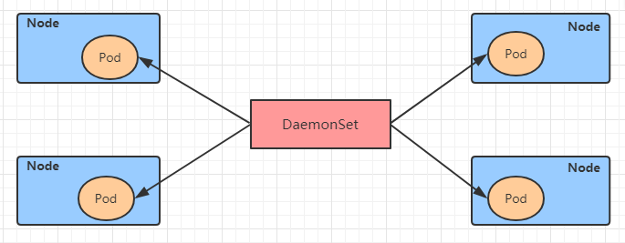

DaemonSet控制器的特点：

- 每当向集群中添加一个节点时，指定的 Pod 副本也将添加到该节点上
- 当节点从集群中移除时，Pod 也就被垃圾回收了

下面先来看下DaemonSet的资源清单文件

```yaml
apiVersion: apps/v1 # 版本号
kind: DaemonSet # 类型       
metadata: # 元数据
  name: # rs名称 
  namespace: # 所属命名空间 
  labels: #标签
    controller: daemonset
spec: # 详情描述
  revisionHistoryLimit: 3 # 保留历史版本
  updateStrategy: # 更新策略
    type: RollingUpdate # 滚动更新策略
    rollingUpdate: # 滚动更新
      maxUnavailable: 1 # 最大不可用状态的 Pod 的最大值，可以为百分比，也可以为整数
  selector: # 选择器，通过它指定该控制器管理哪些pod
    matchLabels:      # Labels匹配规则
      app: nginx-pod
    matchExpressions: # Expressions匹配规则
      - {key: app, operator: In, values: [nginx-pod]}
  template: # 模板，当副本数量不足时，会根据下面的模板创建pod副本
    metadata:
      labels:
        app: nginx-pod
    spec:
      containers:
      - name: nginx
        image: nginx:1.17.1
        ports:
        - containerPort: 80
```

创建pc-daemonset.yaml，内容如下：

```yaml
apiVersion: apps/v1
kind: DaemonSet      
metadata:
  name: pc-daemonset
  namespace: dev
spec: 
  selector:
    matchLabels:
      app: nginx-pod
  template:
    metadata:
      labels:
        app: nginx-pod
    spec:
      containers:
      - name: nginx
        image: nginx:1.17.1
```

```shell
# 创建daemonset
[root@k8s-master01 ~]# kubectl create -f  pc-daemonset.yaml
daemonset.apps/pc-daemonset created

# 查看daemonset
[root@k8s-master01 ~]#  kubectl get ds -n dev -o wide
NAME        DESIRED  CURRENT  READY  UP-TO-DATE  AVAILABLE   AGE   CONTAINERS   IMAGES         
pc-daemonset   2        2        2      2           2        24s   nginx        nginx:1.17.1   

# 查看pod,发现在每个Node上都运行一个pod
[root@k8s-master01 ~]#  kubectl get pods -n dev -o wide
NAME                 READY   STATUS    RESTARTS   AGE   IP            NODE    
pc-daemonset-9bck8   1/1     Running   0          37s   10.244.1.43   node1     
pc-daemonset-k224w   1/1     Running   0          37s   10.244.2.74   node2      

# 删除daemonset
[root@k8s-master01 ~]# kubectl delete -f pc-daemonset.yaml
daemonset.apps "pc-daemonset" deleted
```

#### 6.6 Job

Job，主要用于负责**批量处理(一次要处理指定数量任务)**短暂的**一次性(每个任务仅运行一次就结束)**任务。Job特点如下：

- 当Job创建的pod执行成功结束时，Job将记录成功结束的pod数量
- 当成功结束的pod达到指定的数量时，Job将完成执行


Job的资源清单文件：


```yaml
apiVersion: batch/v1 # 版本号
kind: Job # 类型       
metadata: # 元数据
  name: # rs名称 
  namespace: # 所属命名空间 
  labels: #标签
    controller: job
spec: # 详情描述
  completions: 1 # 指定job需要成功运行Pods的次数。默认值: 1
  parallelism: 1 # 指定job在任一时刻应该并发运行Pods的数量。默认值: 1
  activeDeadlineSeconds: 30 # 指定job可运行的时间期限，超过时间还未结束，系统将会尝试进行终止。
  backoffLimit: 6 # 指定job失败后进行重试的次数。默认是6
  manualSelector: true # 是否可以使用selector选择器选择pod，默认是false
  selector: # 选择器，通过它指定该控制器管理哪些pod
    matchLabels:      # Labels匹配规则
      app: counter-pod
    matchExpressions: # Expressions匹配规则
      - {key: app, operator: In, values: [counter-pod]}
  template: # 模板，当副本数量不足时，会根据下面的模板创建pod副本
    metadata:
      labels:
        app: counter-pod
    spec:
      restartPolicy: Never # 重启策略只能设置为Never或者OnFailure
      containers:
      - name: counter
        image: busybox:1.30
        command: ["bin/sh","-c","for i in 9 8 7 6 5 4 3 2 1; do echo $i;sleep 2;done"]
```

```markdown
关于重启策略设置的说明：
    如果指定为OnFailure，则job会在pod出现故障时重启容器，而不是创建pod，failed次数不变
    如果指定为Never，则job会在pod出现故障时创建新的pod，并且故障pod不会消失，也不会重启，failed次数加1
    如果指定为Always的话，就意味着一直重启，意味着job任务会重复去执行了，当然不对，所以不能设置为Always
```

创建pc-job.yaml，内容如下：

```yaml
apiVersion: batch/v1
kind: Job      
metadata:
  name: pc-job
  namespace: dev
spec:
  manualSelector: true
  selector:
    matchLabels:
      app: counter-pod
  template:
    metadata:
      labels:
        app: counter-pod
    spec:
      restartPolicy: Never
      containers:
      - name: counter
        image: busybox:1.30
        command: ["bin/sh","-c","for i in 9 8 7 6 5 4 3 2 1; do echo $i;sleep 3;done"]
```

```shell
# 创建job
[root@k8s-master01 ~]# kubectl create -f pc-job.yaml
job.batch/pc-job created

# 查看job
[root@k8s-master01 ~]# kubectl get job -n dev -o wide  -w
NAME     COMPLETIONS   DURATION   AGE   CONTAINERS   IMAGES         SELECTOR
pc-job   0/1           21s        21s   counter      busybox:1.30   app=counter-pod
pc-job   1/1           31s        79s   counter      busybox:1.30   app=counter-pod

# 通过观察pod状态可以看到，pod在运行完毕任务后，就会变成Completed状态
[root@k8s-master01 ~]# kubectl get pods -n dev -w
NAME           READY   STATUS     RESTARTS      AGE
pc-job-rxg96   1/1     Running     0            29s
pc-job-rxg96   0/1     Completed   0            33s

# 接下来，调整下pod运行的总数量和并行数量 即：在spec下设置下面两个选项
#  completions: 6 # 指定job需要成功运行Pods的次数为6
#  parallelism: 3 # 指定job并发运行Pods的数量为3
#  然后重新运行job，观察效果，此时会发现，job会每次运行3个pod，总共执行了6个pod
[root@k8s-master01 ~]# kubectl get pods -n dev -w
NAME           READY   STATUS    RESTARTS   AGE
pc-job-684ft   1/1     Running   0          5s
pc-job-jhj49   1/1     Running   0          5s
pc-job-pfcvh   1/1     Running   0          5s
pc-job-684ft   0/1     Completed   0          11s
pc-job-v7rhr   0/1     Pending     0          0s
pc-job-v7rhr   0/1     Pending     0          0s
pc-job-v7rhr   0/1     ContainerCreating   0          0s
pc-job-jhj49   0/1     Completed           0          11s
pc-job-fhwf7   0/1     Pending             0          0s
pc-job-fhwf7   0/1     Pending             0          0s
pc-job-pfcvh   0/1     Completed           0          11s
pc-job-5vg2j   0/1     Pending             0          0s
pc-job-fhwf7   0/1     ContainerCreating   0          0s
pc-job-5vg2j   0/1     Pending             0          0s
pc-job-5vg2j   0/1     ContainerCreating   0          0s
pc-job-fhwf7   1/1     Running             0          2s
pc-job-v7rhr   1/1     Running             0          2s
pc-job-5vg2j   1/1     Running             0          3s
pc-job-fhwf7   0/1     Completed           0          12s
pc-job-v7rhr   0/1     Completed           0          12s
pc-job-5vg2j   0/1     Completed           0          12s

# 删除job
[root@k8s-master01 ~]# kubectl delete -f pc-job.yaml
job.batch "pc-job" deleted
```

#### 6.7 CronJob(CJ)

CronJob控制器以 Job控制器资源为其管控对象，并借助它管理pod资源对象，Job控制器定义的作业任务在其控制器资源创建之后便会立即执行，但CronJob可以以类似于Linux操作系统的周期性任务作业计划的方式控制其运行**时间点**及**重复运行**的方式。也就是说，**CronJob可以在特定的时间点(反复的)去运行job任务**。

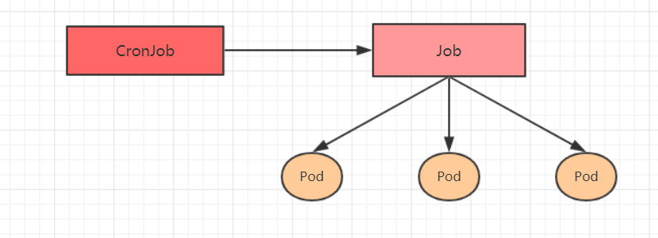

CronJob的资源清单文件：

```yaml
apiVersion: batch/v1beta1 # 版本号
kind: CronJob # 类型       
metadata: # 元数据
  name: # rs名称 
  namespace: # 所属命名空间 
  labels: #标签
    controller: cronjob
spec: # 详情描述
  schedule: # cron格式的作业调度运行时间点,用于控制任务在什么时间执行
  concurrencyPolicy: # 并发执行策略，用于定义前一次作业运行尚未完成时是否以及如何运行后一次的作业
  failedJobHistoryLimit: # 为失败的任务执行保留的历史记录数，默认为1
  successfulJobHistoryLimit: # 为成功的任务执行保留的历史记录数，默认为3
  startingDeadlineSeconds: # 启动作业错误的超时时长
  jobTemplate: # job控制器模板，用于为cronjob控制器生成job对象;下面其实就是job的定义
    metadata:
    spec:
      completions: 1
      parallelism: 1
      activeDeadlineSeconds: 30
      backoffLimit: 6
      manualSelector: true
      selector:
        matchLabels:
          app: counter-pod
        matchExpressions: 规则
          - {key: app, operator: In, values: [counter-pod]}
      template:
        metadata:
          labels:
            app: counter-pod
        spec:
          restartPolicy: Never 
          containers:
          - name: counter
            image: busybox:1.30
            command: ["bin/sh","-c","for i in 9 8 7 6 5 4 3 2 1; do echo $i;sleep 20;done"]
```

```markdown
需要重点解释的几个选项：
schedule: cron表达式，用于指定任务的执行时间
    */1    *      *    *     *
    <分钟> <小时> <日> <月份> <星期>

    分钟 值从 0 到 59.
    小时 值从 0 到 23.
    日 值从 1 到 31.
    月 值从 1 到 12.
    星期 值从 0 到 6, 0 代表星期日
    多个时间可以用逗号隔开； 范围可以用连字符给出；*可以作为通配符； /表示每...
concurrencyPolicy:
    Allow:   允许Jobs并发运行(默认)
    Forbid:  禁止并发运行，如果上一次运行尚未完成，则跳过下一次运行
    Replace: 替换，取消当前正在运行的作业并用新作业替换它
```

创建pc-cronjob.yaml，内容如下：

```yaml
apiVersion: batch/v1beta1
kind: CronJob
metadata:
  name: pc-cronjob
  namespace: dev
  labels:
    controller: cronjob
spec:
  schedule: "*/1 * * * *"
  jobTemplate:
    metadata:
    spec:
      template:
        spec:
          restartPolicy: Never
          containers:
          - name: counter
            image: busybox:1.30
            command: ["bin/sh","-c","for i in 9 8 7 6 5 4 3 2 1; do echo $i;sleep 3;done"]
```

```shell
# 创建cronjob
[root@k8s-master01 ~]# kubectl create -f pc-cronjob.yaml
cronjob.batch/pc-cronjob created

# 查看cronjob
[root@k8s-master01 ~]# kubectl get cronjobs -n dev
NAME         SCHEDULE      SUSPEND   ACTIVE   LAST SCHEDULE   AGE
pc-cronjob   */1 * * * *   False     0        <none>          6s

# 查看job
[root@k8s-master01 ~]# kubectl get jobs -n dev
NAME                    COMPLETIONS   DURATION   AGE
pc-cronjob-1592587800   1/1           28s        3m26s
pc-cronjob-1592587860   1/1           28s        2m26s
pc-cronjob-1592587920   1/1           28s        86s

# 查看pod
[root@k8s-master01 ~]# kubectl get pods -n dev
pc-cronjob-1592587800-x4tsm   0/1     Completed   0          2m24s
pc-cronjob-1592587860-r5gv4   0/1     Completed   0          84s
pc-cronjob-1592587920-9dxxq   1/1     Running     0          24s


# 删除cronjob
[root@k8s-master01 ~]# kubectl  delete -f pc-cronjob.yaml
cronjob.batch "pc-cronjob" deleted
```

 

### 7. Service详解

#### 7.1 Service介绍

在kubernetes中，pod是应用程序的载体，我们可以通过pod的ip来访问应用程序，但是pod的ip地址不是固定的，这也就意味着不方便直接采用pod的ip对服务进行访问。

为了解决这个问题，kubernetes提供了Service资源，Service会对提供同一个服务的多个pod进行聚合，并且提供一个统一的入口地址。通过访问Service的入口地址就能访问到后面的pod服务。


Service在很多情况下只是一个概念，真正起作用的其实是kube-proxy服务进程，每个Node节点上都运行着一个kube-proxy服务进程。当创建Service的时候会通过api-server向etcd写入创建的service的信息，而kube-proxy会基于监听的机制发现这种Service的变动，然后**它会将最新的Service信息转换成对应的访问规则**。


```
# 10.97.97.97:80 是service提供的访问入口
# 当访问这个入口的时候，可以发现后面有三个pod的服务在等待调用，
# kube-proxy会基于rr（轮询）的策略，将请求分发到其中一个pod上去
# 这个规则会同时在集群内的所有节点上都生成，所以在任何一个节点上访问都可以。
[root@node1 ~]# ipvsadm -Ln
IP Virtual Server version 1.2.1 (size=4096)
Prot LocalAddress:Port Scheduler Flags
  -> RemoteAddress:Port           Forward Weight ActiveConn InActConn
TCP  10.97.97.97:80 rr
  -> 10.244.1.39:80               Masq    1      0          0
  -> 10.244.1.40:80               Masq    1      0          0
  -> 10.244.2.33:80               Masq    1      0          0
```

kube-proxy目前支持三种工作模式:

##### 7.1.1 userspace 模式

userspace模式下，kube-proxy会为每一个Service创建一个监听端口，发向Cluster IP的请求被Iptables规则重定向到kube-proxy监听的端口上，kube-proxy根据LB算法选择一个提供服务的Pod并和其建立链接，以将请求转发到Pod上。  该模式下，kube-proxy充当了一个四层负责均衡器的角色。由于kube-proxy运行在userspace中，在进行转发处理时会增加内核和用户空间之间的数据拷贝，虽然比较稳定，但是效率比较低。


##### 7.1.2 iptables 模式

iptables模式下，kube-proxy为service后端的每个Pod创建对应的iptables规则，直接将发向Cluster IP的请求重定向到一个Pod IP。  该模式下kube-proxy不承担四层负责均衡器的角色，只负责创建iptables规则。该模式的优点是较userspace模式效率更高，但不能提供灵活的LB策略，当后端Pod不可用时也无法进行重试。


##### 7.1.3 ipvs 模式

ipvs模式和iptables类似，kube-proxy监控Pod的变化并创建相应的ipvs规则。ipvs相对iptables转发效率更高。除此以外，ipvs支持更多的LB算法。


```shell
# 此模式必须安装ipvs内核模块，否则会降级为iptables
# 开启ipvs
[root@k8s-master01 ~]# kubectl edit cm kube-proxy -n kube-system
# 修改mode: "ipvs"
[root@k8s-master01 ~]# kubectl delete pod -l k8s-app=kube-proxy -n kube-system
[root@node1 ~]# ipvsadm -Ln
IP Virtual Server version 1.2.1 (size=4096)
Prot LocalAddress:Port Scheduler Flags
  -> RemoteAddress:Port           Forward Weight ActiveConn InActConn
TCP  10.97.97.97:80 rr
  -> 10.244.1.39:80               Masq    1      0          0
  -> 10.244.1.40:80               Masq    1      0          0
  -> 10.244.2.33:80               Masq    1      0          0
```

#### 7.2 Service类型

Service的资源清单文件：

```yaml
kind: Service  # 资源类型
apiVersion: v1  # 资源版本
metadata: # 元数据
  name: service # 资源名称
  namespace: dev # 命名空间
spec: # 描述
  selector: # 标签选择器，用于确定当前service代理哪些pod
    app: nginx
  type: # Service类型，指定service的访问方式 有ClusterIP、NodePort、LoadBalancer、ExternalName四种类型
  clusterIP:  # 虚拟服务的ip地址
  sessionAffinity: # session亲和性，支持ClientIP、None两个选项
  ports: # 端口信息
    - protocol: TCP 
      port: 3017  # service端口
      targetPort: 5003 # pod端口
      nodePort: 31122 # 主机端口
```

- ClusterIP：默认值，它是Kubernetes系统自动分配的虚拟IP，只能在集群内部访问
- NodePort：将Service通过指定的Node上的端口暴露给外部，通过此方法，就可以在集群外部访问服务
- LoadBalancer：使用外接负载均衡器完成到服务的负载分发，注意此模式需要外部云环境支持
- ExternalName： 把集群外部的服务引入集群内部，直接使用

#### 7.3 Service使用

##### 7.3.1 实验环境准备

在使用service之前，首先利用Deployment创建出3个pod，注意要为pod设置`app=nginx-pod`的标签

创建deployment.yaml，内容如下：

```yaml
apiVersion: apps/v1
kind: Deployment      
metadata:
  name: pc-deployment
  namespace: dev
spec: 
  replicas: 3
  selector:
    matchLabels:
      app: nginx-pod
  template:
    metadata:
      labels:
        app: nginx-pod
    spec:
      containers:
      - name: nginx
        image: nginx:1.17.1
        ports:
        - containerPort: 80
```

```shell
[root@k8s-master01 ~]# kubectl create -f deployment.yaml
deployment.apps/pc-deployment created

# 查看pod详情
[root@k8s-master01 ~]# kubectl get pods -n dev -o wide --show-labels
NAME                             READY   STATUS     IP            NODE     LABELS
pc-deployment-66cb59b984-8p84h   1/1     Running    10.244.1.39   node1    app=nginx-pod
pc-deployment-66cb59b984-vx8vx   1/1     Running    10.244.2.33   node2    app=nginx-pod
pc-deployment-66cb59b984-wnncx   1/1     Running    10.244.1.40   node1    app=nginx-pod

# 为了方便后面的测试，修改下三台nginx的index.html页面（三台修改的IP地址不一致）
# kubectl exec -it pc-deployment-66cb59b984-8p84h -n dev /bin/sh
# echo "10.244.1.39" > /usr/share/nginx/html/index.html

#修改完毕之后，访问测试
[root@k8s-master01 ~]# curl 10.244.1.39
10.244.1.39
[root@k8s-master01 ~]# curl 10.244.2.33
10.244.2.33
[root@k8s-master01 ~]# curl 10.244.1.40
10.244.1.40
```

##### 7.3.2 ClusterIP类型的Service

创建service-clusterip.yaml文件

```yaml
apiVersion: v1
kind: Service
metadata:
  name: service-clusterip
  namespace: dev
spec:
  selector:
    app: nginx-pod
  clusterIP: 10.97.97.97 # service的ip地址，如果不写，默认会生成一个
  type: ClusterIP # ClusterIP 指的是当前 Service 在集群内可以被所有人发现，默认给这个 Service 分配一个集群内的网络。
  ports:
  - port: 80  # Service端口       
    targetPort: 80 # pod端口
```

```shell
# 创建service
[root@k8s-master01 ~]# kubectl create -f service-clusterip.yaml
service/service-clusterip created

# 查看service
[root@k8s-master01 ~]# kubectl get svc -n dev -o wide
NAME                TYPE        CLUSTER-IP    EXTERNAL-IP   PORT(S)   AGE   SELECTOR
service-clusterip   ClusterIP   10.97.97.97   <none>        80/TCP    13s   app=nginx-pod

# 查看service的详细信息
# 在这里有一个Endpoints列表，里面就是当前service可以负载到的服务入口
[root@k8s-master01 ~]# kubectl describe svc service-clusterip -n dev
Name:              service-clusterip
Namespace:         dev
Labels:            <none>
Annotations:       <none>
Selector:          app=nginx-pod
Type:              ClusterIP
IP:                10.97.97.97
Port:              <unset>  80/TCP
TargetPort:        80/TCP
Endpoints:         10.244.1.39:80,10.244.1.40:80,10.244.2.33:80
Session Affinity:  None
Events:            <none>

# 查看ipvs的映射规则
[root@k8s-master01 ~]# ipvsadm -Ln
TCP  10.97.97.97:80 rr
  -> 10.244.1.39:80               Masq    1      0          0
  -> 10.244.1.40:80               Masq    1      0          0
  -> 10.244.2.33:80               Masq    1      0          0

# 访问10.97.97.97:80观察效果
[root@k8s-master01 ~]# curl 10.97.97.97:80
10.244.2.33
```

##### 7.3.3 Endpoint

Endpoint是kubernetes中的一个资源对象，存储在etcd中，用来记录一个service对应的所有pod的访问地址，它是根据service配置文件中selector描述产生的。

一个Service由一组Pod组成，这些Pod通过Endpoints暴露出来，**Endpoints是实现实际服务的端点集合**。换句话说，service和pod之间的联系是通过endpoints实现的。


**负载分发策略**

对Service的访问被分发到了后端的Pod上去，目前kubernetes提供了两种负载分发策略：

- 如果不定义，默认使用kube-proxy的策略，比如随机、轮询

- 基于客户端地址的会话保持模式，即来自同一个客户端发起的所有请求都会转发到固定的一个Pod上

  此模式可以使在spec中添加`sessionAffinity:ClientIP`选项

```shell
# 查看ipvs的映射规则【rr 轮询】
[root@k8s-master01 ~]# ipvsadm -Ln
TCP  10.97.97.97:80 rr
  -> 10.244.1.39:80               Masq    1      0          0
  -> 10.244.1.40:80               Masq    1      0          0
  -> 10.244.2.33:80               Masq    1      0          0

# 循环访问测试
[root@k8s-master01 ~]# while true;do curl 10.97.97.97:80; sleep 5; done;
10.244.1.40
10.244.1.39
10.244.2.33
10.244.1.40
10.244.1.39
10.244.2.33

# 修改分发策略----sessionAffinity:ClientIP

# 查看ipvs规则【persistent 代表持久】
[root@k8s-master01 ~]# ipvsadm -Ln
TCP  10.97.97.97:80 rr persistent 10800
  -> 10.244.1.39:80               Masq    1      0          0
  -> 10.244.1.40:80               Masq    1      0          0
  -> 10.244.2.33:80               Masq    1      0          0

# 循环访问测试
[root@k8s-master01 ~]# while true;do curl 10.97.97.97; sleep 5; done;
10.244.2.33
10.244.2.33
10.244.2.33
  
# 删除service
[root@k8s-master01 ~]# kubectl delete -f service-clusterip.yaml
service "service-clusterip" deleted
```

##### 7.3.4 HeadLiness类型的Service

所谓的无头服务，即不想kubernetes集群分配IP，针对这种情况，kubernetes提供了HeadLiness Service，这类Service不会分配Cluster IP，如果想要访问service，只能通过service的域名进行查询，一般配合StatefulSet 使用。

创建service-headliness.yaml

```yaml
apiVersion: v1
kind: Service
metadata:
  name: service-headliness
  namespace: dev
spec:
  selector:
    app: nginx-pod
  clusterIP: None # 将clusterIP设置为None，即可创建headliness Service
  type: ClusterIP # ClusterIP 指的是当前 Service 在集群内可以被所有人发现，默认给这个 Service 分配一个集群内的网络。
  ports:
  - port: 80    
    targetPort: 80
```

```shell
# 创建service
[root@k8s-master01 ~]# kubectl create -f service-headliness.yaml
service/service-headliness created

# 获取service， 发现CLUSTER-IP未分配
[root@k8s-master01 ~]# kubectl get svc service-headliness -n dev -o wide
NAME                 TYPE        CLUSTER-IP   EXTERNAL-IP   PORT(S)   AGE   SELECTOR
service-headliness   ClusterIP   None         <none>        80/TCP    11s   app=nginx-pod

# 查看service详情
[root@k8s-master01 ~]# kubectl describe svc service-headliness  -n dev
Name:              service-headliness
Namespace:         dev
Labels:            <none>
Annotations:       <none>
Selector:          app=nginx-pod
Type:              ClusterIP
IP:                None
Port:              <unset>  80/TCP
TargetPort:        80/TCP
Endpoints:         10.244.1.39:80,10.244.1.40:80,10.244.2.33:80
Session Affinity:  None
Events:            <none>

# 查看域名的解析情况
[root@k8s-master01 ~]# kubectl exec -it pc-deployment-66cb59b984-8p84h -n dev /bin/sh
/ # cat /etc/resolv.conf
nameserver 10.96.0.10
search dev.svc.cluster.local svc.cluster.local cluster.local

[root@k8s-master01 ~]# dig @10.96.0.10 service-headliness.dev.svc.cluster.local
service-headliness.dev.svc.cluster.local. 30 IN A 10.244.1.40
service-headliness.dev.svc.cluster.local. 30 IN A 10.244.1.39
service-headliness.dev.svc.cluster.local. 30 IN A 10.244.2.33
```

##### 7.3.5 NodePort类型的Service

在之前的样例中，创建的Service的ip地址只有集群内部才可以访问，如果希望将Service暴露给集群外部使用，那么就要使用到另外一种类型的Service，称为NodePort类型。NodePort的工作原理其实就是**将service的端口映射到Node的一个端口上**，然后就可以通过`NodeIp:NodePort`来访问service了。


创建service-nodeport.yaml

```yaml
apiVersion: v1
kind: Service
metadata:
  name: service-nodeport
  namespace: dev
spec:
  selector:
    app: nginx-pod
  type: NodePort # service类型
  ports:
  - port: 80
    nodePort: 30002 # 指定绑定的node的端口(默认的取值范围是：30000-32767), 如果不指定，会默认分配
    targetPort: 80
```

```shell
# 创建service
[root@k8s-master01 ~]# kubectl create -f service-nodeport.yaml
service/service-nodeport created

# 查看service
[root@k8s-master01 ~]# kubectl get svc -n dev -o wide
NAME               TYPE       CLUSTER-IP      EXTERNAL-IP   PORT(S)       SELECTOR
service-nodeport   NodePort   10.105.64.191   <none>        80:30002/TCP  app=nginx-pod

# 接下来可以通过电脑主机的浏览器去访问集群中任意一个nodeip的30002端口，即可访问到pod
```

##### 7.3.6 LoadBalancer类型的Service

LoadBalancer和NodePort很相似，目的都是向外部暴露一个端口，区别在于LoadBalancer会在集群的外部再来做一个负载均衡设备，而这个设备需要外部环境支持的，外部服务发送到这个设备上的请求，会被设备负载之后转发到集群中。


##### 7.3.7 ExternalName类型的Service

ExternalName类型的Service用于引入集群外部的服务，它通过`externalName`属性指定外部一个服务的地址，然后在集群内部访问此service就可以访问到外部的服务了。


```shell
apiVersion: v1
kind: Service
metadata:
  name: service-externalname
  namespace: dev
spec:
  type: ExternalName # service类型
  externalName: www.baidu.com  #改成ip地址也可以
```

```shell
# 创建service
[root@k8s-master01 ~]# kubectl  create -f service-externalname.yaml
service/service-externalname created

# 域名解析
[root@k8s-master01 ~]# dig @10.96.0.10 service-externalname.dev.svc.cluster.local
service-externalname.dev.svc.cluster.local. 30 IN CNAME www.baidu.com.
www.baidu.com.          30      IN      CNAME   www.a.shifen.com.
www.a.shifen.com.       30      IN      A       39.156.66.18
www.a.shifen.com.       30      IN      A       39.156.66.14
```

##### 7.3.8 Pod指定自己的主机名

Pod 中还可以设置 hostname 和 subdomain 字段，需要注意的是，一旦设置了 hostname ，那么该 Pod 的主机名就被设置为 hostname 的值，而 subdomain  需要和 service 中的 name 相同。 

```YAML
apiVersion: v1
kind: Service
metadata:
  name: default-subdomain
  namespace: default
spec:
  selector:
    app: nginx
  type: ClusterIP
  clusterIP: None 
  ports:
  - name: foo
    protocol: TCP
    port: 1234
    targetPort: 1234

---
apiVersion: v1
kind: Pod
metadata:
  name: nginx1
  namespace: default
  labels:
    app: nginx
spec:
  hostname: nginx1
  subdomain: default-subdomain # 必须和 service 的 name 相同，才可以使用 hostname.subdomain.名称空间.svc.cluster.local 访问，否则访问不到指定的 Pod 。
  containers:
  - name: nginx
    image: nginx:1.20.2
    resources:
      limits:
        cpu: 250m
        memory: 500Mi
      requests:
        cpu: 100m
        memory: 200Mi
    ports:
    - containerPort:  80
      name:  nginx
    volumeMounts:
    - name: localtime
      mountPath: /etc/localtime
  volumes:
    - name: localtime
      hostPath:
        path: /usr/share/zoneinfo/Asia/Shanghai
  restartPolicy: Always

---
apiVersion: v1
kind: Pod
metadata:
  name: nginx2
  namespace: default
  labels:
    app: nginx
spec:
  hostname: nginx2
  subdomain: default-subdomain # 必须和 svc 的 name 相同，才可以使用 hostname.subdomain.名称空间.svc.cluster.local 访问，否则访问不到指定的 Pod 。
  containers:
  - name: nginx
    image: nginx:1.20.2
    resources:
      limits:
        cpu: 250m
        memory: 500Mi
      requests:
        cpu: 100m
        memory: 200Mi
    ports:
    - containerPort:  80
      name:  nginx
    volumeMounts:
    - name: localtime
      mountPath: /etc/localtime
  volumes:
    - name: localtime
      hostPath:
        path: /usr/share/zoneinfo/Asia/Shanghai
  restartPolicy: Always
```


#### 7.4 Ingress介绍

为什么需要Ingress：

- Service 可以使用 NodePort 暴露集群外访问端口，NodePort方式的缺点是性能低、不安全且端口的范围有限
- Service 可以使用 LB 暴露集群外访问端口，LB方式的缺点是每个service需要一个LB，浪费、麻烦，并且需要kubernetes之外设备的支持
- Service 缺少七层（OSI 网络模型）的统一访问入口，负载均衡能力很低，不能做限流、验证非法用户、链路追踪等等

- Ingress 公开了从集群外部到集群内服务的 HTTP 和 HTTPS 路由。流量路由由 Ingress 资源上定义的规则控制

基于这种现状，kubernetes提供了Ingress资源对象，Ingress只需要一个NodePort或者一个LB就可以满足暴露多个Service的需求，我们使用 Ingress 作为整个集群统一的入口，配置 Ingress 规则转发到对应的 Service 。工作机制大致如下图表示：


实际上，Ingress相当于一个7层的负载均衡器，是kubernetes对反向代理的一个抽象，它的工作原理类似于Nginx，可以理解成在**Ingress里建立诸多映射规则，Ingress Controller通过监听这些配置规则并转化成Nginx的反向代理配置 , 然后对外部提供服务**。在这里有两个核心概念：

- ingress：kubernetes中的一个对象，作用是定义请求如何转发到service的规则
- ingress controller：具体实现反向代理及负载均衡的程序，对ingress定义的规则进行解析，根据配置的规则来实现请求转发，实现方式有很多，比如Nginx, Contour, Haproxy等等

Ingress（以Nginx为例）的工作原理如下：

1. 用户编写Ingress规则，说明哪个域名对应kubernetes集群中的哪个Service
2. Ingress控制器动态感知Ingress服务规则的变化，然后生成一段对应的Nginx反向代理配置
3. Ingress控制器会将生成的Nginx配置写入到一个运行着的Nginx服务中，并动态更新
4. 到此为止，其实真正在工作的就是一个Nginx了，内部配置了用户定义的请求转发规则


#### 7.5 Ingress使用

##### 7.5.1 环境准备 搭建ingress环境

```makefile
# 创建文件夹
[root@k8s-master01 ~]# mkdir ingress-controller
[root@k8s-master01 ~]# cd ingress-controller/

# 安装ingress,不特别说明，ingress=ingress nginx
[root@k8s-master01 ingress-controller]# wget https://raw.githubusercontent.com/kubernetes/ingress-nginx/controller-v1.1.2/deploy/static/provider/baremetal/deploy.yaml
# 需要做如下修改：
# 1、修改 k8s.gcr.io/ingress-nginx/controller:v1.1.2 镜像为 registry.cn-hangzhou.aliyuncs.com/google_containers/nginx-ingress-controller:v1.1.2
# 2、修改 k8s.gcr.io/ingress-nginx/kube-webhook-certgen:v1.1.1 镜像为 registry.cn-hangzhou.aliyuncs.com/google_containers/kube-webhook-certgen:v1.1.1
# 3、修改 Service 为 ClusterIP，无需 NodePort 模式
# 4、修改 Deployment 为 DaemonSet 
# 5、修改 Container 使用主机网络，直接在主机上开辟 80 、443 端口，无需中间解析，速度更快，所有各个节点的 80 和 443 端口不能被其它进程占用
# 6、Container 使用主机网络，对应的 dnsPolicy 策略也需要改为主机网络的
# 7、修改 DaemonSet 的 nodeSelector: ingress-node=true 。这样只需要给 node 节点打上 ingress-node=true 标签，即可快速的加入或剔除 ingress-controller的数量

# 给Node节点打标签
[root@k8s-master01 ingress-controller]# kubectl label node k8s-node1 node-role=ingress
[root@k8s-master01 ingress-controller]# kubectl label node k8s-node2 node-role=ingress
# 当然，也可以给 Master 节点打标签，但是 kubeadm 安装 k8s 集群的时候，会给 Master 节点打上污点，即使我们打上标签，也不会进行 Pod 的调度；换言之，Ingress 也不会在 Master 节点上安装，后面再讲。

# 最后安装 Ingress （需要关闭 Node 节点的 80 和 443 端口，不能有其他进程占用）
[root@k8s-master01 ingress-controller]# kubectl apply -f deploy.yaml

# 验证是否安装成功：只需要在部署了 ingress 的主机，执行如下的命令：
[root@k8s-master01 ingress-controller]# netstat -ntlp | grep 80
[root@k8s-master01 ingress-controller]# netstat -ntlp | grep 443

# 卸载
[root@k8s-master01 ingress-controller]# kubectl delete -f deploy.yaml
```

 deploy.yaml修改的内容如下：

```YAML
#GENERATED FOR K8S 1.20
apiVersion: v1
kind: Namespace
metadata:
  labels:
    app.kubernetes.io/instance: ingress-nginx
    app.kubernetes.io/name: ingress-nginx
  name: ingress-nginx
---
apiVersion: v1
automountServiceAccountToken: true
kind: ServiceAccount
metadata:
  labels:
    app.kubernetes.io/component: controller
    app.kubernetes.io/instance: ingress-nginx
    app.kubernetes.io/managed-by: Helm
    app.kubernetes.io/name: ingress-nginx
    app.kubernetes.io/part-of: ingress-nginx
    app.kubernetes.io/version: 1.1.2
    helm.sh/chart: ingress-nginx-4.0.18
  name: ingress-nginx
  namespace: ingress-nginx
---
apiVersion: v1
kind: ServiceAccount
metadata:
  annotations:
    helm.sh/hook: pre-install,pre-upgrade,post-install,post-upgrade
    helm.sh/hook-delete-policy: before-hook-creation,hook-succeeded
  labels:
    app.kubernetes.io/component: admission-webhook
    app.kubernetes.io/instance: ingress-nginx
    app.kubernetes.io/managed-by: Helm
    app.kubernetes.io/name: ingress-nginx
    app.kubernetes.io/part-of: ingress-nginx
    app.kubernetes.io/version: 1.1.2
    helm.sh/chart: ingress-nginx-4.0.18
  name: ingress-nginx-admission
  namespace: ingress-nginx
---
apiVersion: rbac.authorization.k8s.io/v1
kind: Role
metadata:
  labels:
    app.kubernetes.io/component: controller
    app.kubernetes.io/instance: ingress-nginx
    app.kubernetes.io/managed-by: Helm
    app.kubernetes.io/name: ingress-nginx
    app.kubernetes.io/part-of: ingress-nginx
    app.kubernetes.io/version: 1.1.2
    helm.sh/chart: ingress-nginx-4.0.18
  name: ingress-nginx
  namespace: ingress-nginx
rules:
- apiGroups:
  - ""
  resources:
  - namespaces
  verbs:
  - get
- apiGroups:
  - ""
  resources:
  - configmaps
  - pods
  - secrets
  - endpoints
  verbs:
  - get
  - list
  - watch
- apiGroups:
  - ""
  resources:
  - services
  verbs:
  - get
  - list
  - watch
- apiGroups:
  - networking.k8s.io
  resources:
  - ingresses
  verbs:
  - get
  - list
  - watch
- apiGroups:
  - networking.k8s.io
  resources:
  - ingresses/status
  verbs:
  - update
- apiGroups:
  - networking.k8s.io
  resources:
  - ingressclasses
  verbs:
  - get
  - list
  - watch
- apiGroups:
  - ""
  resourceNames:
  - ingress-controller-leader
  resources:
  - configmaps
  verbs:
  - get
  - update
- apiGroups:
  - ""
  resources:
  - configmaps
  verbs:
  - create
- apiGroups:
  - ""
  resources:
  - events
  verbs:
  - create
  - patch
---
apiVersion: rbac.authorization.k8s.io/v1
kind: Role
metadata:
  annotations:
    helm.sh/hook: pre-install,pre-upgrade,post-install,post-upgrade
    helm.sh/hook-delete-policy: before-hook-creation,hook-succeeded
  labels:
    app.kubernetes.io/component: admission-webhook
    app.kubernetes.io/instance: ingress-nginx
    app.kubernetes.io/managed-by: Helm
    app.kubernetes.io/name: ingress-nginx
    app.kubernetes.io/part-of: ingress-nginx
    app.kubernetes.io/version: 1.1.2
    helm.sh/chart: ingress-nginx-4.0.18
  name: ingress-nginx-admission
  namespace: ingress-nginx
rules:
- apiGroups:
  - ""
  resources:
  - secrets
  verbs:
  - get
  - create
---
apiVersion: rbac.authorization.k8s.io/v1
kind: ClusterRole
metadata:
  labels:
    app.kubernetes.io/instance: ingress-nginx
    app.kubernetes.io/managed-by: Helm
    app.kubernetes.io/name: ingress-nginx
    app.kubernetes.io/part-of: ingress-nginx
    app.kubernetes.io/version: 1.1.2
    helm.sh/chart: ingress-nginx-4.0.18
  name: ingress-nginx
rules:
- apiGroups:
  - ""
  resources:
  - configmaps
  - endpoints
  - nodes
  - pods
  - secrets
  - namespaces
  verbs:
  - list
  - watch
- apiGroups:
  - ""
  resources:
  - nodes
  verbs:
  - get
- apiGroups:
  - ""
  resources:
  - services
  verbs:
  - get
  - list
  - watch
- apiGroups:
  - networking.k8s.io
  resources:
  - ingresses
  verbs:
  - get
  - list
  - watch
- apiGroups:
  - ""
  resources:
  - events
  verbs:
  - create
  - patch
- apiGroups:
  - networking.k8s.io
  resources:
  - ingresses/status
  verbs:
  - update
- apiGroups:
  - networking.k8s.io
  resources:
  - ingressclasses
  verbs:
  - get
  - list
  - watch
---
apiVersion: rbac.authorization.k8s.io/v1
kind: ClusterRole
metadata:
  annotations:
    helm.sh/hook: pre-install,pre-upgrade,post-install,post-upgrade
    helm.sh/hook-delete-policy: before-hook-creation,hook-succeeded
  labels:
    app.kubernetes.io/component: admission-webhook
    app.kubernetes.io/instance: ingress-nginx
    app.kubernetes.io/managed-by: Helm
    app.kubernetes.io/name: ingress-nginx
    app.kubernetes.io/part-of: ingress-nginx
    app.kubernetes.io/version: 1.1.2
    helm.sh/chart: ingress-nginx-4.0.18
  name: ingress-nginx-admission
rules:
- apiGroups:
  - admissionregistration.k8s.io
  resources:
  - validatingwebhookconfigurations
  verbs:
  - get
  - update
---
apiVersion: rbac.authorization.k8s.io/v1
kind: RoleBinding
metadata:
  labels:
    app.kubernetes.io/component: controller
    app.kubernetes.io/instance: ingress-nginx
    app.kubernetes.io/managed-by: Helm
    app.kubernetes.io/name: ingress-nginx
    app.kubernetes.io/part-of: ingress-nginx
    app.kubernetes.io/version: 1.1.2
    helm.sh/chart: ingress-nginx-4.0.18
  name: ingress-nginx
  namespace: ingress-nginx
roleRef:
  apiGroup: rbac.authorization.k8s.io
  kind: Role
  name: ingress-nginx
subjects:
- kind: ServiceAccount
  name: ingress-nginx
  namespace: ingress-nginx
---
apiVersion: rbac.authorization.k8s.io/v1
kind: RoleBinding
metadata:
  annotations:
    helm.sh/hook: pre-install,pre-upgrade,post-install,post-upgrade
    helm.sh/hook-delete-policy: before-hook-creation,hook-succeeded
  labels:
    app.kubernetes.io/component: admission-webhook
    app.kubernetes.io/instance: ingress-nginx
    app.kubernetes.io/managed-by: Helm
    app.kubernetes.io/name: ingress-nginx
    app.kubernetes.io/part-of: ingress-nginx
    app.kubernetes.io/version: 1.1.2
    helm.sh/chart: ingress-nginx-4.0.18
  name: ingress-nginx-admission
  namespace: ingress-nginx
roleRef:
  apiGroup: rbac.authorization.k8s.io
  kind: Role
  name: ingress-nginx-admission
subjects:
- kind: ServiceAccount
  name: ingress-nginx-admission
  namespace: ingress-nginx
---
apiVersion: rbac.authorization.k8s.io/v1
kind: ClusterRoleBinding
metadata:
  labels:
    app.kubernetes.io/instance: ingress-nginx
    app.kubernetes.io/managed-by: Helm
    app.kubernetes.io/name: ingress-nginx
    app.kubernetes.io/part-of: ingress-nginx
    app.kubernetes.io/version: 1.1.2
    helm.sh/chart: ingress-nginx-4.0.18
  name: ingress-nginx
roleRef:
  apiGroup: rbac.authorization.k8s.io
  kind: ClusterRole
  name: ingress-nginx
subjects:
- kind: ServiceAccount
  name: ingress-nginx
  namespace: ingress-nginx
---
apiVersion: rbac.authorization.k8s.io/v1
kind: ClusterRoleBinding
metadata:
  annotations:
    helm.sh/hook: pre-install,pre-upgrade,post-install,post-upgrade
    helm.sh/hook-delete-policy: before-hook-creation,hook-succeeded
  labels:
    app.kubernetes.io/component: admission-webhook
    app.kubernetes.io/instance: ingress-nginx
    app.kubernetes.io/managed-by: Helm
    app.kubernetes.io/name: ingress-nginx
    app.kubernetes.io/part-of: ingress-nginx
    app.kubernetes.io/version: 1.1.2
    helm.sh/chart: ingress-nginx-4.0.18
  name: ingress-nginx-admission
roleRef:
  apiGroup: rbac.authorization.k8s.io
  kind: ClusterRole
  name: ingress-nginx-admission
subjects:
- kind: ServiceAccount
  name: ingress-nginx-admission
  namespace: ingress-nginx
---
apiVersion: v1
data:
  allow-snippet-annotations: "true"
kind: ConfigMap
metadata:
  labels:
    app.kubernetes.io/component: controller
    app.kubernetes.io/instance: ingress-nginx
    app.kubernetes.io/managed-by: Helm
    app.kubernetes.io/name: ingress-nginx
    app.kubernetes.io/part-of: ingress-nginx
    app.kubernetes.io/version: 1.1.2
    helm.sh/chart: ingress-nginx-4.0.18
  name: ingress-nginx-controller
  namespace: ingress-nginx
---
apiVersion: v1
kind: Service
metadata:
  labels:
    app.kubernetes.io/component: controller
    app.kubernetes.io/instance: ingress-nginx
    app.kubernetes.io/managed-by: Helm
    app.kubernetes.io/name: ingress-nginx
    app.kubernetes.io/part-of: ingress-nginx
    app.kubernetes.io/version: 1.1.2
    helm.sh/chart: ingress-nginx-4.0.18
  name: ingress-nginx-controller
  namespace: ingress-nginx
spec:
  ipFamilies:
  - IPv4
  ipFamilyPolicy: SingleStack
  ports:
  - appProtocol: http
    name: http
    port: 80
    protocol: TCP
    targetPort: http
  - appProtocol: https
    name: https
    port: 443
    protocol: TCP
    targetPort: https
  selector:
    app.kubernetes.io/component: controller
    app.kubernetes.io/instance: ingress-nginx
    app.kubernetes.io/name: ingress-nginx
  type: ClusterIP # NodePort
---
apiVersion: v1
kind: Service
metadata:
  labels:
    app.kubernetes.io/component: controller
    app.kubernetes.io/instance: ingress-nginx
    app.kubernetes.io/managed-by: Helm
    app.kubernetes.io/name: ingress-nginx
    app.kubernetes.io/part-of: ingress-nginx
    app.kubernetes.io/version: 1.1.2
    helm.sh/chart: ingress-nginx-4.0.18
  name: ingress-nginx-controller-admission
  namespace: ingress-nginx
spec:
  ports:
  - appProtocol: https
    name: https-webhook
    port: 443
    targetPort: webhook
  selector:
    app.kubernetes.io/component: controller
    app.kubernetes.io/instance: ingress-nginx
    app.kubernetes.io/name: ingress-nginx
  type: ClusterIP
---
apiVersion: apps/v1
kind: DaemonSet # Deployment
metadata:
  labels:
    app.kubernetes.io/component: controller
    app.kubernetes.io/instance: ingress-nginx
    app.kubernetes.io/managed-by: Helm
    app.kubernetes.io/name: ingress-nginx
    app.kubernetes.io/part-of: ingress-nginx
    app.kubernetes.io/version: 1.1.2
    helm.sh/chart: ingress-nginx-4.0.18
  name: ingress-nginx-controller
  namespace: ingress-nginx
spec:
  minReadySeconds: 0
  revisionHistoryLimit: 10
  selector:
    matchLabels:
      app.kubernetes.io/component: controller
      app.kubernetes.io/instance: ingress-nginx
      app.kubernetes.io/name: ingress-nginx
  template:
    metadata:
      labels:
        app.kubernetes.io/component: controller
        app.kubernetes.io/instance: ingress-nginx
        app.kubernetes.io/name: ingress-nginx
    spec:
      dnsPolicy: ClusterFirstWithHostNet # dns 调整为主机网络 ，原先为 ClusterFirst
      hostNetwork: true # 直接让 nginx 占用本机的 80 和 443 端口，这样就可以使用主机网络
      containers:
      - args:
        - /nginx-ingress-controller
        - --election-id=ingress-controller-leader
        - --controller-class=k8s.io/ingress-nginx
        - --ingress-class=nginx
        - --report-node-internal-ip-address=true
        - --configmap=$(POD_NAMESPACE)/ingress-nginx-controller
        - --validating-webhook=:8443
        - --validating-webhook-certificate=/usr/local/certificates/cert
        - --validating-webhook-key=/usr/local/certificates/key
        env:
        - name: POD_NAME
          valueFrom:
            fieldRef:
              fieldPath: metadata.name
        - name: POD_NAMESPACE
          valueFrom:
            fieldRef:
              fieldPath: metadata.namespace
        - name: LD_PRELOAD
          value: /usr/local/lib/libmimalloc.so
        image: registry.cn-hangzhou.aliyuncs.com/google_containers/nginx-ingress-controller:v1.1.2 # 修改 k8s.gcr.io/ingress-nginx/controller:v1.1.2@sha256:28b11ce69e57843de44e3db6413e98d09de0f6688e33d4bd384002a44f78405c
        imagePullPolicy: IfNotPresent
        lifecycle:
          preStop:
            exec:
              command:
              - /wait-shutdown
        livenessProbe:
          failureThreshold: 5
          httpGet:
            path: /healthz
            port: 10254
            scheme: HTTP
          initialDelaySeconds: 10
          periodSeconds: 10
          successThreshold: 1
          timeoutSeconds: 1
        name: controller
        ports:
        - containerPort: 80
          name: http
          protocol: TCP
        - containerPort: 443
          name: https
          protocol: TCP
        - containerPort: 8443
          name: webhook
          protocol: TCP
        readinessProbe:
          failureThreshold: 3
          httpGet:
            path: /healthz
            port: 10254
            scheme: HTTP
          initialDelaySeconds: 10
          periodSeconds: 10
          successThreshold: 1
          timeoutSeconds: 1
        resources: # 资源限制
          requests:
            cpu: 100m
            memory: 90Mi
          limits: 
            cpu: 500m
            memory: 500Mi     
        securityContext:
          allowPrivilegeEscalation: true
          capabilities:
            add:
            - NET_BIND_SERVICE
            drop:
            - ALL
          runAsUser: 101
        volumeMounts:
        - mountPath: /usr/local/certificates/
          name: webhook-cert
          readOnly: true
      nodeSelector:
        node-role: ingress # 以后只需要给某个 node 打上这个标签就可以部署 ingress-nginx 到这个节点上了
        # kubernetes.io/os: linux
      serviceAccountName: ingress-nginx
      terminationGracePeriodSeconds: 300
      volumes:
      - name: webhook-cert
        secret:
          secretName: ingress-nginx-admission
---
apiVersion: batch/v1
kind: Job
metadata:
  annotations:
    helm.sh/hook: pre-install,pre-upgrade
    helm.sh/hook-delete-policy: before-hook-creation,hook-succeeded
  labels:
    app.kubernetes.io/component: admission-webhook
    app.kubernetes.io/instance: ingress-nginx
    app.kubernetes.io/managed-by: Helm
    app.kubernetes.io/name: ingress-nginx
    app.kubernetes.io/part-of: ingress-nginx
    app.kubernetes.io/version: 1.1.2
    helm.sh/chart: ingress-nginx-4.0.18
  name: ingress-nginx-admission-create
  namespace: ingress-nginx
spec:
  template:
    metadata:
      labels:
        app.kubernetes.io/component: admission-webhook
        app.kubernetes.io/instance: ingress-nginx
        app.kubernetes.io/managed-by: Helm
        app.kubernetes.io/name: ingress-nginx
        app.kubernetes.io/part-of: ingress-nginx
        app.kubernetes.io/version: 1.1.2
        helm.sh/chart: ingress-nginx-4.0.18
      name: ingress-nginx-admission-create
    spec:
      containers:
      - args:
        - create
        - --host=ingress-nginx-controller-admission,ingress-nginx-controller-admission.$(POD_NAMESPACE).svc
        - --namespace=$(POD_NAMESPACE)
        - --secret-name=ingress-nginx-admission
        env:
        - name: POD_NAMESPACE
          valueFrom:
            fieldRef:
              fieldPath: metadata.namespace
        image: registry.cn-hangzhou.aliyuncs.com/google_containers/kube-webhook-certgen:v1.1.1 # k8s.gcr.io/ingress-nginx/kube-webhook-certgen:v1.1.1@sha256:64d8c73dca984af206adf9d6d7e46aa550362b1d7a01f3a0a91b20cc67868660
        imagePullPolicy: IfNotPresent
        name: create
        securityContext:
          allowPrivilegeEscalation: false
      nodeSelector:
        kubernetes.io/os: linux
      restartPolicy: OnFailure
      securityContext:
        fsGroup: 2000
        runAsNonRoot: true
        runAsUser: 2000
      serviceAccountName: ingress-nginx-admission
---
apiVersion: batch/v1
kind: Job
metadata:
  annotations:
    helm.sh/hook: post-install,post-upgrade
    helm.sh/hook-delete-policy: before-hook-creation,hook-succeeded
  labels:
    app.kubernetes.io/component: admission-webhook
    app.kubernetes.io/instance: ingress-nginx
    app.kubernetes.io/managed-by: Helm
    app.kubernetes.io/name: ingress-nginx
    app.kubernetes.io/part-of: ingress-nginx
    app.kubernetes.io/version: 1.1.2
    helm.sh/chart: ingress-nginx-4.0.18
  name: ingress-nginx-admission-patch
  namespace: ingress-nginx
spec:
  template:
    metadata:
      labels:
        app.kubernetes.io/component: admission-webhook
        app.kubernetes.io/instance: ingress-nginx
        app.kubernetes.io/managed-by: Helm
        app.kubernetes.io/name: ingress-nginx
        app.kubernetes.io/part-of: ingress-nginx
        app.kubernetes.io/version: 1.1.2
        helm.sh/chart: ingress-nginx-4.0.18
      name: ingress-nginx-admission-patch
    spec:
      containers:
      - args:
        - patch
        - --webhook-name=ingress-nginx-admission
        - --namespace=$(POD_NAMESPACE)
        - --patch-mutating=false
        - --secret-name=ingress-nginx-admission
        - --patch-failure-policy=Fail
        env:
        - name: POD_NAMESPACE
          valueFrom:
            fieldRef:
              fieldPath: metadata.namespace
        image: registry.cn-hangzhou.aliyuncs.com/google_containers/kube-webhook-certgen:v1.1.1 # k8s.gcr.io/ingress-nginx/kube-webhook-certgen:v1.1.1@sha256:64d8c73dca984af206adf9d6d7e46aa550362b1d7a01f3a0a91b20cc67868660
        imagePullPolicy: IfNotPresent
        name: patch
        securityContext:
          allowPrivilegeEscalation: false
      nodeSelector:
        kubernetes.io/os: linux
      restartPolicy: OnFailure
      securityContext:
        fsGroup: 2000
        runAsNonRoot: true
        runAsUser: 2000
      serviceAccountName: ingress-nginx-admission
---
apiVersion: networking.k8s.io/v1
kind: IngressClass
metadata:
  labels:
    app.kubernetes.io/component: controller
    app.kubernetes.io/instance: ingress-nginx
    app.kubernetes.io/managed-by: Helm
    app.kubernetes.io/name: ingress-nginx
    app.kubernetes.io/part-of: ingress-nginx
    app.kubernetes.io/version: 1.1.2
    helm.sh/chart: ingress-nginx-4.0.18
  name: nginx
spec:
  controller: k8s.io/ingress-nginx
---
apiVersion: admissionregistration.k8s.io/v1
kind: ValidatingWebhookConfiguration
metadata:
  labels:
    app.kubernetes.io/component: admission-webhook
    app.kubernetes.io/instance: ingress-nginx
    app.kubernetes.io/managed-by: Helm
    app.kubernetes.io/name: ingress-nginx
    app.kubernetes.io/part-of: ingress-nginx
    app.kubernetes.io/version: 1.1.2
    helm.sh/chart: ingress-nginx-4.0.18
  name: ingress-nginx-admission
webhooks:
- admissionReviewVersions:
  - v1
  clientConfig:
    service:
      name: ingress-nginx-controller-admission
      namespace: ingress-nginx
      path: /networking/v1/ingresses
  failurePolicy: Fail
  matchPolicy: Equivalent
  name: validate.nginx.ingress.kubernetes.io
  rules:
  - apiGroups:
    - networking.k8s.io
    apiVersions:
    - v1
    operations:
    - CREATE
    - UPDATE
    resources:
    - ingresses
  sideEffects: None
```


##### 7.5.2 准备service和pod

为了后面的实验比较方便，创建如下图所示的模型


创建实验所需的Service和Pod等：

```shell
[root@k8s-master01 ~]# vi k8s-prepare.yaml
```

```yaml
apiVersion: apps/v1
kind: Deployment
metadata:
  name: nginx-deploy
  namespace: default
  labels:
    app: nginx
spec:
  selector:
    matchLabels:
      app: nginx
  replicas: 3
  template:
    metadata:
      labels:
        app: nginx
    spec:
      containers:
        - name: nginx
          image: nginx:1.20.2
          resources:
            requests:
              cpu: 100m
              memory: 100Mi
            limits:
              cpu: 250m
              memory: 500Mi
          ports:
            - containerPort: 80
              name: nginx
          volumeMounts:
            - name: localtime
              mountPath: /etc/localtime
      volumes:
        - name: localtime
          hostPath:
            path: /usr/share/zoneinfo/Asia/Shanghai
      restartPolicy: Always

---
apiVersion: apps/v1
kind: Deployment
metadata:
  name: tomcat-deploy
  namespace: default
  labels:
    app: tomcat
spec:
  selector:
    matchLabels:
      app: tomcat
  replicas: 3
  template:
    metadata:
      labels:
        app: tomcat
    spec:
      containers:
        - name: tomcat
          image: tomcat:9-jre8
          env:
            - name: JAVA_OPTS
              value: "-XX:+UnlockExperimentalVMOptions -XX:+UseCGroupMemoryLimitForHeap"
          resources:
            requests:
              cpu: 500m
              memory: 256Mi
            limits:
              cpu: 500m
              memory: 500Mi
          ports:
            - containerPort: 8080
              name: tomcat
          volumeMounts:
            - name: localtime
              mountPath: /etc/localtime
      volumes:
        - name: localtime
          hostPath:
            path: /usr/share/zoneinfo/Asia/Shanghai
      restartPolicy: Always

---
apiVersion: v1
kind: Service
metadata:
  name: nginx-svc
  namespace: default
spec:
  selector:
    app: nginx
  type: ClusterIP
  ports:
    - name: nginx
      protocol: TCP
      port: 80
      targetPort: 80

---
apiVersion: v1
kind: Service
metadata:
  name: tomcat-svc
spec:
  selector:
    app: tomcat
  type: ClusterIP
  ports:
    - name: tomcat
      protocol: TCP
      port: 8080
      targetPort: 8080
```

```shell
# 创建
[root@k8s-master01 ~]# kubectl apply -f k8s-prepare.yaml

# 查看
[root@k8s-master01 ~]# kubectl get svc -n dev
NAME             TYPE        CLUSTER-IP   EXTERNAL-IP   PORT(S)    AGE
nginx-svc    ClusterIP   None         <none>        80/TCP     48s
tomcat-svc   ClusterIP   None         <none>        8080/TCP   48s
```

##### 7.5.3 Http代理

基本配置语法：

```yaml
apiVersion: networking.k8s.io/v1
kind: Ingress 
metadata:
  name: ingress-http
  namespace: default
spec:
  rules: # 规则
  - host: it.nginx.com # 指定的监听的主机域名，相当于 nginx.conf 的 server { xxx }
    http: # 指定路由规则
      paths:
      - path: /
        pathType: Prefix # 匹配规则，Prefix 前缀匹配 it.nginx.com/* 都可以匹配到
        backend: # 指定路由的后台服务的 service 名称
          service:
            name: nginx-svc # 服务名
            port:
              number: 80 # 服务的端口
```

- [pathType](https://kubernetes.io/zh/docs/concepts/services-networking/ingress/#path-types) 说明： 

- - Prefix：基于以 `/` 分隔的 URL 路径前缀匹配。匹配区分大小写，并且对路径中的元素逐个完成。 路径元素指的是由 `/` 分隔符分隔的路径中的标签列表。 如果每个 p 都是请求路径 p 的元素前缀，则请求与路径 p 匹配。

- - Exact：精确匹配 URL 路径，且区分大小写。

- - ImplementationSpecific：对于这种路径类型，匹配方法取决于 IngressClass。 具体实现可以将其作为单独的 pathType 处理或者与 Prefix 或 Exact 类型作相同处理

**注意：ingress 规则会生效到所有安装了 IngressController 的机器的 nginx 配置。**

创建ingress-http.yaml

```yaml
apiVersion: networking.k8s.io/v1
kind: Ingress 
metadata:
  name: ingress-http
  namespace: dev
  annotations: 
    kubernetes.io/ingress.class: "nginx"
    nginx.ingress.kubernetes.io/backend-protocol: "HTTP"  
spec:
  rules: # 规则
  - host: nginx.lyb.com # 指定的监听的主机域名，相当于 nginx.conf 的 server { xxx }
    http: # 指定路由规则
      paths:
      - path: /
        pathType: Prefix # 匹配规则，Prefix 前缀匹配 nginx.xudaxian.com/* 都可以匹配到
        backend: # 指定路由的后台服务的 service 名称
          service:
            name: nginx-svc # 服务名
            port:
              number: 80 # 服务的端口
  - host: tomcat.lyb.com # 指定的监听的主机域名，相当于 nginx.conf 的 server { xxx }
    http: # 指定路由规则
      paths:
      - path: /
        pathType: Prefix # 匹配规则，Prefix 前缀匹配 tomcat.xudaxian.com/* 都可以匹配到
        backend: # 指定路由的后台服务的 service 名称
          service:
            name: tomcat-svc # 服务名
            port:
              number: 8080 # 服务的端口
```

```shell
# 创建
[root@k8s-master01 ~]# kubectl apply -f ingress-http.yaml
ingress.networking.k8s.io/ingress-http created

# 查看
[root@k8s-master01 ~]# kubectl get ing ingress-http -n dev
NAME           HOSTS                                  ADDRESS   PORTS   AGE
ingress-http   nginx.lyb.com,tomcat.lyb.com             80      22s

# 查看详情
[root@k8s-master01 ~]# kubectl describe ing ingress-http  -n dev
...
Rules:
Host                Path  Backends
----                ----  --------
nginx.lyb.com   / nginx-service:80 (10.244.1.96:80,10.244.1.97:80,10.244.2.112:80)
tomcat.lyb.com  / tomcat-service:8080(10.244.1.94:8080,10.244.1.95:8080,10.244.2.111:8080)
...

# 接下来,在本地电脑上配置host文件,解析上面的两个域名到192.168.109.100(master)上
# 然后,就可以分别访问tomcat.lyb.com:32240  和  nginx.lyb.com:32240 查看效果了
```

- 测试示例（后面有更简单的测试方法）： 

- ① 在本地 win 中的 hosts文件（`C:\Windows\System32\drivers\etc\hosts`） 文件中添加如下的信息，解析上面的两个域名到192.168.109.100(master)：

- ```shell
  # 用来模拟 DNS ，其中 192.168.109.100 是 ingress 部署的机器，nginx.xudaxian.com 和 tomcat.xudaxian.com 是 ingress 文件中监听的域名
  192.168.109.100 nginx.lyb.com
  192.168.109.100 tomcat.lyb.com
  ```

​       ②  在 win 中使用 curl 命令或在浏览器访问域名

##### 7.5.4 默认后端

```yaml
apiVersion: networking.k8s.io/v1
kind: Ingress
metadata:
  name: ingress-http
  namespace: default
  annotations: 
    kubernetes.io/ingress.class: "nginx"
    nginx.ingress.kubernetes.io/backend-protocol: "HTTP"  
spec:
  defaultBackend: # 指定所有未匹配的默认后端
    service:
      name: nginx-svc
      port:
        number: 80
  rules: 
    - host: tomcat.com 
      http: 
        paths:
          - path: /abc
            pathType: Prefix 
            backend: 
              service:
                name: tomcat-svc
                port:
                  number: 8080
```

效果：

- tomcat.com 域名的 非 `/abc` 开头的请求，都会转到 defaultBackend 。

- 非 tomcat.com 域名下的所有请求，也会转到 defaultBackend 。

##### 7.5.5 Https代理

-  [官方地址](https://kubernetes.github.io/ingress-nginx/user-guide/tls/)。 

-  生成证书语法：

```shell
$ openssl req -x509 -nodes -days 365 -newkey rsa:2048 -keyout ${KEY_FILE} -out ${CERT_FILE} -subj "/CN=${HOST:baidu.com}/O=${HOST:baidu.com}"
```

```shell
kubectl create secret tls ${CERT_NAME:baidu-tls} --key ${KEY_FILE:tls.key} --cert ${CERT_FILE:tls.cert}
```

创建证书

注意：实际开发的时候，需要自己购买证书。

```shell
# 生成证书
openssl req -x509 -sha256 -nodes -days 365 -newkey rsa:2048 -keyout tls.key -out tls.crt -subj "/C=CN/ST=BJ/L=BJ/O=nginx/CN=itheima.com"

# 创建密钥
kubectl create secret tls tls-secret --key tls.key --cert tls.crt
```

创建ingress-https.yaml

```yaml
apiVersion: extensions/v1beta1
kind: Ingress
metadata:
  name: ingress-https
  namespace: dev
spec:
  tls:
    - hosts:
      - nginx.lyb.com # 通过浏览器访问 https://nginx.lyb.com
      - tomcat.lyb.com # 通过浏览器访问 https://tomcat.lyb.com
      secretName: tls-secret # 指定秘钥
  rules:
  - host: nginx.lyb.com
    http:
      paths:
      - path: /
        pathType: Prefix
        backend:
          service:
            name: nginx-svc
            port:
              number: 80
  - host: tomcat.lyb.com
    http:
      paths:
      - path: /
        pathType: Prefix
        backend:
          service:
            name: tomcat-svc
            port:
              number: 8080
```

```shell
# 创建
[root@k8s-master01 ~]# kubectl create -f ingress-https.yaml
ingress.extensions/ingress-https created

# 查看
[root@k8s-master01 ~]# kubectl get ing ingress-https -n dev
NAME            HOSTS                                  ADDRESS         PORTS     AGE
ingress-https   nginx.itheima.com,tomcat.itheima.com   10.104.184.38   80, 443   2m42s

# 查看详情
[root@k8s-master01 ~]# kubectl describe ing ingress-https -n dev
...
TLS:
  tls-secret terminates nginx.itheima.com,tomcat.itheima.com
Rules:
Host              Path Backends
----              ---- --------
nginx.itheima.com  /  nginx-service:80 (10.244.1.97:80,10.244.1.98:80,10.244.2.119:80)
tomcat.itheima.com /  tomcat-service:8080(10.244.1.99:8080,10.244.2.117:8080,10.244.2.120:8080)
...

# 下面可以通过浏览器访问https://nginx.itheima.com:31335 和 https://tomcat.itheima.com:31335来查看了
```

##### 7.5.6 Ingress中的nginx全局配置

-  [官方文档](https://kubernetes.github.io/ingress-nginx/user-guide/nginx-configuration/configmap/)。 

-  方式一：在安装的时候，添加配置。

  ```yaml
  apiVersion: v1
  data:
    allow-snippet-annotations: "true" # Nginx 的全局配置
  kind: ConfigMap
  metadata:
    labels:
      app.kubernetes.io/component: controller
      app.kubernetes.io/instance: ingress-nginx
      app.kubernetes.io/managed-by: Helm
      app.kubernetes.io/name: ingress-nginx
      app.kubernetes.io/part-of: ingress-nginx
      app.kubernetes.io/version: 1.1.2
      helm.sh/chart: ingress-nginx-4.0.18
    name: ingress-nginx-controller
    namespace: ingress-nginx
  ```

- 方式二：编辑 cm ：

  ```yaml
  kubectl edit cm ingress-nginx-controller -n ingress-nginx
  # 配置项加上 
  data:
    map-hash-bucket-size: "128" # Nginx 的全局配置
    ssl-protocols: SSLv2
  ```

##### 7.5.7 限流

   [官方文档](https://kubernetes.github.io/ingress-nginx/user-guide/nginx-configuration/annotations/#rate-limiting)。 

● 示例： 

```yaml
apiVersion: networking.k8s.io/v1
kind: Ingress
metadata:
  name: rate-ingress
  namespace: default
  annotations: # https://kubernetes.github.io/ingress-nginx/user-guide/nginx-configuration/annotations/#rate-limiting
    kubernetes.io/ingress.class: "nginx"
    nginx.ingress.kubernetes.io/backend-protocol: "HTTP"  
    nginx.ingress.kubernetes.io/limit-rps: "1" # 限流
spec:
  rules:
  - host: nginx.xudaxian.com
    http:
      paths:
      - path: /
        pathType: Prefix
        backend:
          service:
            name: nginx-svc
            port:
              number: 80
```

##### 7.5.8 路径重写

- [官方文档](https://kubernetes.github.io/ingress-nginx/examples/rewrite/)。

路径重写，经常用于前后端分离


- 示例：将 /api 重定向到 /

  ```yaml
  apiVersion: networking.k8s.io/v1
  kind: Ingress
  metadata:
    name: ingress-rewrite
    namespace: default
    annotations:
     nginx.ingress.kubernetes.io/rewrite-target: /$2 # 路径重写
  spec:
    ingressClassName: nginx
    rules:
    - host: baidu.com
      http:
        paths:
        - path: /api(/|$)(.*) # 两个括号用于分组，第一个括号中表示匹配/或者无（/就代表/，|代表或的关系，$表示结束），第二个括号表示任意请求。结合上面的 /$2 就是匹配到 /api(/|$)(.*) 的请求会转发到以 / 开始拼接第二组内容，这样就去掉了api
          pathType: Prefix
          backend:
            service:
              name: nginx-svc
              port:
                number: 80
  ```

##### 7.5.9 基于cookie的会话保持技术

  Service 只能基于 ClientIP，但是 ingress 是七层负载均衡，可以基于 Cookie 实现会话保持。 

● 示例： 

```yaml
apiVersion: networking.k8s.io/v1
kind: Ingress
metadata:
  name: rate-ingress
  namespace: default
  annotations: # https://kubernetes.github.io/ingress-nginx/user-guide/nginx-configuration/annotations/#rate-limiting
    kubernetes.io/ingress.class: "nginx"
    nginx.ingress.kubernetes.io/backend-protocol: "HTTP"  
    nginx.ingress.kubernetes.io/affinity: "cookie"
spec:
  rules:
  - host: nginx.xudaxian.com
    http:
      paths:
      - path: /
        pathType: Prefix
        backend:
          service:
            name: nginx-svc
            port:
              number: 80
```

 ##### 7.5.10 Ingress金丝雀发布

###### 7.5.10.1 准备工作

- 以前使用 Kubernetes 的 Service 配合 Deployment 进行金丝雀的部署，原理如下所示：

  

但是，也是有缺点的，就是不能自定义灰度逻辑，如：指定用户进行灰度（新功能只让 VIP 先体验一个月，一个月之后再将新功能解锁，让所有用户都体验到）。

- Ingress 金丝雀发布的原理如下所示：

  

- 部署 Service  和 Deployment：

  ```shell
  vi k8s-ingress-canary-deploy.yaml
  ```

  ```yaml
  apiVersion: apps/v1
  kind: Deployment
  metadata:
    name: v1-deployment
    labels:
      app: v1-deployment
  spec:
    replicas: 2
    selector:
      matchLabels:
        app: v1-pod
    template:
      metadata:
        name: nginx
        labels:
          app: v1-pod
      spec:
        initContainers:
          - name: alpine
            image: alpine
            imagePullPolicy: IfNotPresent
            command: ["/bin/sh","-c","echo v1-pod > /app/index.html;"]
            volumeMounts:
              - mountPath: /app
                name: app    
        containers:
          - name: nginx
            image: nginx:1.17.2
            imagePullPolicy: IfNotPresent
            ports:
              - containerPort: 80
            resources:
              requests:
                cpu: 100m
                memory: 100Mi
              limits:
                cpu: 250m
                memory: 500Mi 
            volumeMounts:
              - name: app
                mountPath: /usr/share/nginx/html             
        volumes:
          - name: app
            emptyDir: {}       
        restartPolicy: Always
  ---
  apiVersion: v1
  kind: Service
  metadata:
    name: v1-service
    namespace: default
  spec:
    selector:
      app: v1-pod
    type: ClusterIP
    ports:
    - name: nginx
      protocol: TCP
      port: 80
      targetPort: 80
  ---
  apiVersion: apps/v1
  kind: Deployment
  metadata:
    name: v2-deployment
    labels:
      app: v2-deployment
  spec:
    replicas: 3
    selector:
      matchLabels:
        app: v2-pod
    template:
      metadata:
        name: v2-pod
        labels:
          app: v2-pod
      spec:
        containers:
          - name: nginx
            image: nginx:1.17.2
            imagePullPolicy: IfNotPresent
            ports:
              - containerPort: 80
            resources:
              requests:
                cpu: 100m
                memory: 100Mi
              limits:
                cpu: 250m
                memory: 500Mi 
        restartPolicy: Always
  ---
  apiVersion: v1
  kind: Service
  metadata:
    name: v2-service
    namespace: default
  spec:
    selector:
      app: v2-pod
    type: ClusterIP
    ports:
    - name: nginx
      protocol: TCP
      port: 80
      targetPort: 80
  ```

  ```shell
  kubectl apply -f k8s-ingress-canary-deploy.yaml
  ```

  

部署普通的ingress
```shell
vi k8s-ingress-v1.yaml
```

```yaml
apiVersion: networking.k8s.io/v1
kind: Ingress
metadata:
  name: ingress-v1
  namespace: default
spec:
  ingressClassName: "nginx"
  rules:
  - host: nginx.lyb.com
    http:
      paths:
      - path: /
        pathType: Prefix
        backend:
          service:
            name: v1-service
            port:
              number: 80
```

```shell
kubectl apply -f k8s-ingress-v1.yaml
```

测试ingress:

```shell
# curl 来模拟请求
curl -H "Host: canary.example.com" http://EXTERNAL-IP # EXTERNAL-IP 替换为 Nginx Ingress 自身对外暴露的 IP
```

```shell
curl -H "Host: nginx.lyb.com" http://192.168.109.100
```

###### 7.5.10.2 基于header的流量切分

```shell
vi k8s-ingress-header.yaml
```

```yaml
apiVersion: networking.k8s.io/v1
kind: Ingress
metadata:
  name: ingress-canary
  namespace: default
  annotations:
    nginx.ingress.kubernetes.io/canary: "true" # 开启金丝雀 
    nginx.ingress.kubernetes.io/canary-by-header: "Region" # 基于请求头
    # 如果 请求头 Region = always ，就路由到金丝雀版本；如果 Region = never ，就永远不会路由到金丝雀版本。
    nginx.ingress.kubernetes.io/canary-by-header-value: "sz" # 自定义值
    # 如果 请求头 Region = sz ，就路由到金丝雀版本；如果 Region != sz ，就永远不会路由到金丝雀版本。
    # nginx.ingress.kubernetes.io/canary-by-header-pattern: "sh|sz"
    # 如果 请求头 Region = sh 或 Region = sz ，就路由到金丝雀版本；如果 Region != sz 并且 Region != sz ，就永远不会路由到金丝雀版本。
spec:
  ingressClassName: "nginx"
  rules:
  - host: nginx.lyb.com
    http:
      paths:
      - path: /
        pathType: Prefix
        backend:
          service:
            name: v2-service
            port:
              number: 80
```

```shell
kubectl apply -f k8s-ingress-header.yaml
```

测试：

```shell
curl -H "Host: nginx.lyb.com" http://192.168.109.100
```

```shell
curl -H "Host: nginx.lyb.com" -H "Region: sz" http://192.168.109.100
```

```shell
curl -H "Host: nginx.lyb.com" -H "Region: sh" http://192.168.109.100
```

###### 7.5.10.3 基于Cookie的流量切分

```yaml
apiVersion: networking.k8s.io/v1
kind: Ingress
metadata:
  name: ingress-canary
  namespace: default
  annotations:
    nginx.ingress.kubernetes.io/canary: "true" # 开启金丝雀 
    nginx.ingress.kubernetes.io/canary-by-cookie: "vip" # 如果 cookie 是 vip = always ，就会路由到到金丝雀版本；如果 cookie 是 vip = never ，就永远不会路由到金丝雀的版本。
spec:
  ingressClassName: "nginx"
  rules:
  - host: nginx.lyb.com
    http:
      paths:
      - path: /
        pathType: Prefix
        backend:
          service:
            name: v2-service
            port:
              number: 80
```

测试：

```shell
curl -H "Host: nginx.xudaxian.com" --cookie "vip=always" http://192.168.109.100
```

###### 7.5.10.4 基于服务权重的流量切分

```yaml
apiVersion: networking.k8s.io/v1
kind: Ingress
metadata:
  name: ingress-canary
  namespace: default
  annotations:
    nginx.ingress.kubernetes.io/canary: "true" # 开启金丝雀 
    nginx.ingress.kubernetes.io/canary-weight: "10" # 基于服务权重
spec:
  ingressClassName: "nginx"
  rules:
  - host: nginx.lyb.com
    http:
      paths:
      - path: /
        pathType: Prefix
        backend:
          service:
            name: v2-service
            port:
              number: 80
```

```shell
for i in {1..10}; do curl -H "Host: nginx.lyb.com" http://192.168.109.100; done;
```


### 8. 数据存储

在前面已经提到，容器的生命周期可能很短，会被频繁地创建和销毁。那么容器在销毁时，保存在容器中的数据也会被清除。这种结果对用户来说，在某些情况下是不乐意看到的。为了持久化保存容器的数据，kubernetes引入了Volume的概念。和 Docker 中的卷管理（匿名卷、具名卷、自定义挂载目录，都是挂载在本机，功能非常有限）不同的是，Kubernetes 天生就是集群，所以为了方便管理，Kubernetes 将卷抽取为一个对象资源，这样可以更方便的管理和存储数据。

Volume是Pod中能够被多个容器访问的共享目录，它被定义在Pod上，然后被一个Pod里的多个容器挂载到具体的文件目录下，kubernetes通过Volume实现同一个Pod中不同容器之间的数据共享以及数据的持久化存储。Volume的生命容器不与Pod中单个容器的生命周期相关，当容器终止或者重启时，Volume中的数据也不会丢失。

kubernetes的Volume支持多种类型：


细分类型：

- Kubernetes 目前支持多达 28 种数据卷类型（其中大部分特定于具体的云环境如 GCE/AWS/Azure 等） 

-  非持久性存储： 

- - emptyDir

- - HostPath

-  网络连接性存储： 

- - SAN：iSCSI、ScaleIO Volumes、FC (Fibre Channel)

- - NFS：nfs，cfs

-  分布式存储 

- - Glusterfs

- - RBD (Ceph Block Device)

- - CephFS

- - Portworx Volumes

- - Quobyte Volumes

-  云端存储 

- - GCEPersistentDisk

- - AWSElasticBlockStore

- - AzureFile

- - AzureDisk

- - Cinder (OpenStack block storage)

- - VsphereVolume

- - StorageOS

-  自定义存储 

- - FlexVolume

#### 8.1 配置存储

##### 8.1.1 最佳配置实战

- 云原生应用的 12 要素中，提出了配置分离。

- 在推送到集群之前，配置文件应该存储在版本控制系统中。这将允许我们在必要的时候快速回滚配置更改，它有助于集群重新创建和恢复。

- 使用 YAML 而不是 JSON 编写配置文件，虽然这些格式几乎可以在所有场景中互换使用，但是 YAML 往往更加用户友好。

- 建议相关对象分组到一个文件，一个文件通常比几个文件更容易管理。请参阅 [guestbook-all-in-one.yaml](https://github.com/kubernetes/examples/tree/master/guestbook/all-in-one/guestbook-all-in-one.yaml) 文件作为此语法的示例。

- 除非必要，否则不指定默认值（简单的最小配置会降低错误的可能性）。

- 将对象描述放在注释中，以便更好的内省。

##### 8.1.2 Secret

- Secret 对象类型用来保存敏感信息，如：密码、OAuth2 令牌以及 SSH 密钥等。将这些信息放到 Secret 中比放在 Pod 的定义或者容器镜像中更加安全和灵活。

- 由于创建 Secret 可以独立于使用它们的 Pod， 因此在创建、查看和编辑 Pod 的工作流程中暴露 Secret（及其数据）的风险较小。 Kubernetes 和在集群中运行的应用程序也可以对 Secret 采取额外的预防措施，如：避免将机密数据写入非易失性存储。

- Secret 类似于 [ConfigMap](https://kubernetes.io/zh/docs/tasks/configure-pod-container/configure-pod-configmap/) 但专门用于保存机密数据
- 注意：Secret 和 ConfigMap 是保存在 etcd 中。

##### 8.1.3 Secret的种类


| 内置类型                              | 用法                                     |
| ------------------------------------- | ---------------------------------------- |
| `Opaque`                              | 用户定义的任意数据                       |
| `kubernetes.io/service-account-token` | 服务账号令牌                             |
| `kubernetes.io/dockercfg`             | `~/.dockercfg` 文件的序列化形式          |
| `kubernetes.io/dockerconfigjson`      | `~/.docker/config.json` 文件的序列化形式 |
| `kubernetes.io/basic-auth`            | 用于基本身份认证的凭据                   |
| `kubernetes.io/ssh-auth`              | 用于 SSH 身份认证的凭据                  |
| `kubernetes.io/tls`                   | 用于 TLS 客户端或者服务器端的数据        |
| `bootstrap.kubernetes.io/token`       | 启动引导令牌数据                         |

##### 8.1.4 Pod如何引用

- 要使用 Secret，Pod 需要引用 Secret。 Pod 可以用三种方式之一来使用 Secret ： 

- - 作为挂载到一个或多个容器上的 [卷](https://kubernetes.io/zh/docs/concepts/storage/volumes/) 中的[文件](https://kubernetes.io/zh/docs/concepts/configuration/secret/#using-secrets-as-files-from-a-pod)。（volume进行挂载）

- - 作为[容器的环境变量](https://kubernetes.io/zh/docs/concepts/configuration/secret/#using-secrets-as-environment-variables)（envFrom字段引用）

- - 由 [kubelet 在为 Pod 拉取镜像时使用](https://kubernetes.io/zh/docs/concepts/configuration/secret/#using-imagepullsecrets)（此时Secret是docker-registry类型的）

- Secret 对象的名称必须是合法的 [DNS 子域名](https://kubernetes.io/zh/docs/concepts/overview/working-with-objects/names#dns-subdomain-names)。 在为创建 Secret 编写配置文件时，你可以设置 `data` 与/或 `stringData` 字段。 `data` 和 `stringData` 字段都是可选的。`data` 字段中所有键值都必须是 base64 编码的字符串。如果不希望执行这种 base64 字符串的转换操作，你可以选择设置 `stringData` 字段，其中可以使用任何字符串作为其取值。

##### 8.1.5 创建Secret

- 命令行创建Secret：

```shell
kubectl create secret generic secret-1 \
   --from-literal=username=admin \
   --from-literal=password=123456
```


- 使用base64对数据进行编码：

```shell
# 准备username YWRtaW4=
echo -n "admin" | base64
# MTIzNDU2
echo -n "123456" | base64
```

- 使用yaml格式创建Secret：

```shell
vi k8s-secret.yaml
```

```yaml
apiVersion: v1
kind: Secret
metadata:
  name: k8s-secret
  namespace: default
type: Opaque
data:
  username: YWRtaW4=
  password: MTIzNDU2
```

```shell
kubectl apply -f k8s-secret.yaml
```

- 觉得手动将数据编码，再配置到 yaml 文件的方式太繁琐，那么也可以将数据编码交给 Kubernetes ：

```yaml
apiVersion: v1
kind: Secret
metadata:
  name: k8s-secret-string-data
  namespace: default
type: Opaque
stringData: 
  username: admin
  password: "123456"
```

**注意：如果同时使用 data 和 stringData ，那么 data 会被忽略**。

- 根据文件创建Secret：

```shell
echo -n 'admin' > username.txt

echo -n '123456' > password.txt

kubectl create secret generic k8s-secret-file \
  --from-file=username.txt \
  --from-file=password.txt
```

**注意：密钥 的 Key 默认是文件名的名称。**

- 根据文件创建Secret（自定义密钥的key）

```shell
echo -n 'admin' > username.txt

echo -n '123456' > password.txt

kubectl create secret generic k8s-secret-file \
  --from-file=username=username.txt \
  --from-file=password=password.txt
```

##### 8.1.6 查看Secret

```shell
# 以 JSON 形式提取data
kubectl get secret k8s-secret-file  -o jsonpath='{.data}'

# 以 yaml 的格式
kubectl get secret k8s-secret-file  -o yaml
```

##### 8.1.7 使用Secret之环境变量引用

```yaml
apiVersion: v1
kind: Secret
metadata:
  name: my-secret
  namespace: default
type: Opaque
stringData: 
  username: admin
  password: "1234556"
---
apiVersion: v1
kind: Pod
metadata:
  name: pod-secret
  namespace: default
  labels:
    app: pod-secret
spec:
  containers:
  - name: alpine
    image: alpine
    command: ["/bin/sh","-c","sleep 3600"]
    resources:
      limits:
        cpu: 200m
        memory: 500Mi
      requests:
        cpu: 100m
        memory: 200Mi
    env:
    - name: SECRET_USERNAME # 容器中的环境变量名称
      valueFrom:
        secretKeyRef: 
          name: my-secret #  指定 secret 的名称
          key: username # secret 中 key 的名称，会自动 base64 解码
    - name: SECRET_PASSWORD # 容器中的环境变量名称
      valueFrom:
        secretKeyRef:
          name: my-secret #  指定 secret 的名称
          key: password # secret 中 key 的名称   
    - name: POD_NAME
      valueFrom: 
        fieldRef:  # 属性引用
          fieldPath: metadata.name
    - name: POD_LIMITS_MEMORY
      valueFrom:
        resourceFieldRef:  # 资源限制引用 
          containerName: alpine  
          resource: limits.memory       
    ports:
    - containerPort:  80
      name:  http
    volumeMounts:
    - name: localtime
      mountPath: /etc/localtime
  volumes:
    - name: localtime
      hostPath:
        path: /usr/share/zoneinfo/Asia/Shanghai
  restartPolicy: Always
```

**注意：环境变量引用的方式不会被自动更新。**

##### 8.1.8 使用Secret之卷挂载

```yaml
apiVersion: v1
kind: Secret
metadata:
  name: my-secret
  namespace: default
type: Opaque
stringData: 
  username: admin
  password: "1234556"
---
apiVersion: v1
kind: Pod
metadata:
  name: pod-secret
  namespace: default
  labels:
    app: pod-secret
spec:
  containers:
  - name: alpine
    image: alpine
    command: ["/bin/sh","-c","sleep 3600"]
    resources:
      limits:
        cpu: 200m
        memory: 500Mi
      requests:
        cpu: 100m
        memory: 200Mi     
    ports:
    - containerPort:  80
      name:  http
    volumeMounts:
    - name: app
      mountPath: /app  
  volumes:
    - name: app
      secret:
        secretName: my-secret # secret 的名称，Secret 中的所有 key 全部挂载出来
  restartPolicy: Always
```

**注意：**

- **如果 Secret 以卷挂载的方式，Secret 里面的所有 key 都是文件名，内容就是 key 对应的值。**

- **如果 Secret 以卷挂载的方式，Secret 的内容更新，那么容器对应的值也会被更新（subPath 引用除外）。**

- **如果 Secret 以卷挂载的方式，默认情况下，挂载出来的文件是只读的。**


指定挂载的文件名:

```yaml
apiVersion: v1
kind: Secret
metadata:
  name: my-secret
  namespace: default
type: Opaque
stringData: 
  username: admin
  password: "1234556"
---
apiVersion: v1
kind: Pod
metadata:
  name: pod-secret
  namespace: default
  labels:
    app: pod-secret
spec:
  containers:
  - name: alpine
    image: alpine
    command: ["/bin/sh","-c","sleep 3600"]
    resources:
      limits:
        cpu: 200m
        memory: 500Mi
      requests:
        cpu: 100m
        memory: 200Mi     
    ports:
    - containerPort:  80
      name:  http
    volumeMounts:
    - name: app
      mountPath: /app  
  volumes:
    - name: app
      secret:
        secretName: my-secret # secret 的名称，Secret 中的所有 key 全部挂载出来
        items:
          - key: username # secret 中 key 的名称，Secret 中的 username 的内容挂载出来
            path: username.md # 在容器内挂载出来的文件的路径
  restartPolicy: Always
```

##### 8.1.9 ConfigMap

ConfigMap 和 Secret 非常类似，只不过 Secret 会将信息进行 base64 编码和解码，而 ConfigMap 却不会。

```yaml
#创建 ConfigMap、环境变量引用、卷挂载
kind: ConfigMap
apiVersion: v1
metadata:
  name: cm
  namespace: default
data:
  # 类属性键；每一个键都映射到一个简单的值
  player_initial_lives: "3"
  ui_properties_file_name: "user-interface.properties"
  # 类文件键
  game.properties: |
    enemy.types=aliens,monsters
    player.maximum-lives=5    
  user-interface.properties: |
    color.good=purple
    color.bad=yellow
    allow.textmode=true 
---
apiVersion: v1
kind: Pod
metadata:
  name: "pod-cm"
  namespace: default
  labels:
    app: "pod-cm"
spec:
  containers:
  - name: alpine
    image: "alpine"
    command: ["/bin/sh","-c","sleep 3600"]
    resources:
      limits:
        cpu: 200m
        memory: 500Mi
      requests:
        cpu: 100m
        memory: 200Mi
    env:
    - name: PLAYER_INITIAL_LIVES
      valueFrom:
        configMapKeyRef:
          name: cm
          key: player_initial_lives
    ports:
    - containerPort:  80
      name:  http
    volumeMounts:
    - name: app
      mountPath: /app  
  volumes:
    - name: app
      configMap:
        name: cm # secret 的名称，Secret 中的所有 key 全部挂载出来
        items:
          - key: ui_properties_file_name # secret 中 key 的名称，Secret 中的 ui_properties_file_name 的内容挂载出来
            path: ui_properties_file_name.md # 在容器内挂载出来的文件的路径
  restartPolicy: Always
```


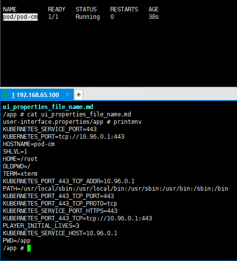

注意：

- ConfigMap 和 Secret 一样，环境变量引用不会热更新，而卷挂载是可以热更新的。

- 最新版本的 ConfigMap 和 Secret 提供了不可更改的功能，即禁止热更新，只需要在 Secret 或 ConfigMap 中设置 `immutable = true` 。

  

**ConfigMap结合SpringBoot做到生产配置无感知**


#### 8.2 临时存储

-  Kubernetes 为了不同的目的，支持几种不同类型的临时卷： 

- - [emptyDir](https://kubernetes.io/zh/docs/concepts/storage/volumes/#emptydir)： Pod 启动时为空，存储空间来自本地的 kubelet 根目录（通常是根磁盘）或内存

- - [configMap](https://kubernetes.io/zh/docs/concepts/storage/volumes/#configmap)、 [downwardAPI](https://kubernetes.io/zh/docs/concepts/storage/volumes/#downwardapi)、 [secret](https://kubernetes.io/zh/docs/concepts/storage/volumes/#secret)： 将不同类型的 Kubernetes 数据注入到 Pod 中

- - [CSI 临时卷](https://kubernetes.io/zh/docs/concepts/storage/volumes/#csi-ephemeral-volumes)： 类似于前面的卷类型，但由专门[支持此特性](https://kubernetes-csi.github.io/docs/drivers.html) 的指定 [CSI 驱动程序](https://github.com/container-storage-interface/spec/blob/master/spec.md)提供

- - [通用临时卷](https://kubernetes.io/zh/docs/concepts/storage/ephemeral-volumes/#generic-ephemeral-volumes)： 它可以由所有支持持久卷的存储驱动程序提供

- `emptyDir`、`configMap`、`downwardAPI`、`secret` 是作为 [本地临时存储](https://kubernetes.io/zh/docs/concepts/configuration/manage-resources-containers/#local-ephemeral-storage) 提供的。它们由各个节点上的 kubelet 管理。

- CSI 临时卷 `必须` 由第三方 CSI 存储驱动程序提供。

- 通用临时卷 `可以`  由第三方 CSI 存储驱动程序提供，也可以由支持动态配置的任何其他存储驱动程序提供。 一些专门为 CSI 临时卷编写的 CSI 驱动程序，不支持动态供应：因此这些驱动程序不能用于通用临时卷。

- 使用第三方驱动程序的优势在于，它们可以提供 Kubernetes 本身不支持的功能， 例如，与 kubelet 管理的磁盘具有不同运行特征的存储，或者用来注入不同的数据。

##### 8.2.1 emptyDir

- Pod 分派到某个 Node 上时，`emptyDir` 卷会被创建，并且在 Pod 在该节点上运行期间，卷一直存在。

- 就像其名称表示的那样，卷最初是空的。

- 尽管 Pod 中的容器挂载 `emptyDir` 卷的路径可能相同也可能不同，这些容器都可以读写 `emptyDir` 卷中相同的文件。

- 当 Pod 因为某些原因被从节点上删除时，`emptyDir` 卷中的数据也会被永久删除。

注意： 容器崩溃并不会导致 Pod 被从节点上移除，因此容器崩溃期间 `emptyDir` 卷中的数据是安全的。

- `emptyDir` 的一些用途： 
- - 临时空间，例如用于某些应用程序运行时所需的临时目录，且无须永久保留。
- - 一个容器需要从另一个容器中获取数据的目录（多容器共享目录）。
- `emptyDir` 卷存储在该节点的磁盘或内存中，如果设置 `emptyDir.medium = Memory` ，那么就告诉 Kubernetes 将数据保存在内存中，并且在 Pod 被重启或删除前，所写入的所有文件都会计入容器的内存消耗，受到容器内存限制约束。

```yaml
apiVersion: v1
kind: Pod
metadata:
  name: nginx-empty-dir
  namespace: default
  labels:
    app: nginx-empty-dir
spec:
  containers:
  - name: nginx
    image: nginx:1.20.2
    resources:
      limits:
        cpu: 200m
        memory: 500Mi
      requests:
        cpu: 100m
        memory: 200Mi    
    ports:
    - containerPort:  80
      name:  http
    volumeMounts:
    - name: app
      mountPath: /usr/share/nginx/html
  - name: alpine
    image: alpine
    command: ["/bin/sh","-c","while true;do sleep 1; date > /app/index.html;done"]
    resources:
      limits:
        cpu: 200m
        memory: 500Mi
      requests:
        cpu: 100m
        memory: 200Mi    
    volumeMounts:
    - name: app
      mountPath: /app     
  volumes:
    - name: app
      emptyDir: {} # emptyDir 临时存储
  restartPolicy: Always
```

##### 8.2.2 hostPath

- emptyDir 中的数据不会被持久化，它会随着 Pod 的结束而销毁，如果想要`简单`的将数据持久化到主机中，可以选择 hostPath 。

- hostPath  就是将 Node 主机中的一个实际目录挂载到 Pod 中，以供容器使用，这样的设计就可以保证 Pod 销毁了，但是数据依旧可以保存在 Node 主机上。

**注意：hostPath 之所以被归为临时存储，是因为实际开发中，我们一般都是通过 Deployment 部署 Pod 的，一旦 Pod 被 Kubernetes 杀死或重启拉起等，并不一定会部署到原来的 Node 节点中。**

- 除了必需的 `path` 属性之外，用户可以选择性地为 `hostPath` 卷指定 `type`。

| 取值                | 行为                                                         |
| ------------------- | ------------------------------------------------------------ |
|                     | 空字符串（默认）用于向后兼容，这意味着在安装 hostPath 卷之前不会执行任何检查。 |
| `DirectoryOrCreate` | 如果在给定路径上什么都不存在，那么将根据需要创建空目录，权限设置为 0755，具有与 kubelet 相同的组和属主信息。 |
| `Directory`         | 在给定路径上必须存在的目录。                                 |
| `FileOrCreate`      | 如果在给定路径上什么都不存在，那么将在那里根据需要创建空文件，权限设置为 0644，具有与 kubelet 相同的组和所有权。 |
| `File`              | 在给定路径上必须存在的文件。                                 |
| `Socket`            | 在给定路径上必须存在的 UNIX 套接字。                         |
| `CharDevice`        | 在给定路径上必须存在的字符设备。                             |
| `BlockDevice`       | 在给定路径上必须存在的块设备。                               |

hostPath 的典型应用就是时间同步：通常而言，Node 节点的时间是同步的（云厂商提供的云服务器的时间都是同步的），但是，Pod 中的容器的时间就不一定了，有 UTC 、CST 等；同一个 Pod ，如果部署到中国，就必须设置为 CST 了。 

```yaml
apiVersion: v1
kind: Pod
metadata:
  name: nginx-host-path
  namespace: default
  labels:
    app: nginx
spec:
  containers:
  - name: nginx    
    image: nginx:1.20.2
    resources:
      limits:
        cpu: 200m
        memory: 500Mi
      requests:
        cpu: 100m
        memory: 200Mi
    ports:
    - containerPort:  80
      name:  http
    volumeMounts:
    - name: localtime
      mountPath: /etc/localtime
  volumes:
    - name: localtime
      hostPath: # hostPath
        path: /usr/share/zoneinfo/Asia/Shanghai
  restartPolicy: Always
```

#### 8.3 持久化存储

##### 8.3.1 VOLUME

- Kubernetes 支持很多类型的卷。 [Pod](https://kubernetes.io/docs/concepts/workloads/pods/pod-overview/) 可以同时使用任意数目的卷类型。

- 临时卷类型的生命周期与 Pod 相同，但持久卷可以比 Pod 的存活期长。

- 当 Pod 不再存在时，Kubernetes 也会销毁临时卷。

- Kubernetes 不会销毁 `持久卷` 。

- 对于给定 Pod 中 `任何类型的卷` ，在容器重启期间数据都不会丢失。

- 使用卷时, 在 `.spec.volumes` 字段中设置为 Pod 提供的卷，并在 `.spec.containers[*].volumeMounts` 字段中声明卷在容器中的挂载位置。

**1）subPath**

有时，在单个 Pod 中共享卷以供多方使用是很有用的。 `volumeMounts.subPath` 属性可用于指定所引用的卷内的子路径，而不是其根路径。

**注意：ConfigMap 和 Secret 使用子路径挂载是无法热更新的。**

**2）安装NFS**

NFS 的简介：网络文件系统，英文Network File System(NFS)，是由 [SUN ](https://baike.baidu.com/item/SUN/69463)公司研制的[UNIX](https://baike.baidu.com/item/UNIX/219943)[表示层](https://baike.baidu.com/item/%E8%A1%A8%E7%A4%BA%E5%B1%82/4329716)协议(presentation layer protocol)，能使使用者访问网络上别处的文件就像在使用自己的计算机一样。

```shell
# 以 Master节点（192.168.65.100）作为 NFS 服务端：
yum install -y nfs-utils

# 在Master节点创建 /etc/exports 文件：
# * 表示暴露权限给所有主机；* 也可以使用 192.168.0.0/16 代替，表示暴露给所有主机
echo "/nfs/data/ *(insecure,rw,sync,no_root_squash)" > /etc/exports
```


```shell
# 在 Master（192.168.65.100）节点创建 /nfs/data/ （共享目录）目录，并设置权限：
mkdir -pv /nfs/data/
chmod 777 -R /nfs/data/ # -R 会让操作递归进入子目录中

# Master（192.168.65.100）节点启动 NFS ：
systemctl enable rpcbind
systemctl enable nfs-server
systemctl start rpcbind
systemctl start nfs-server

# 在 Master（192.168.65.100）节点加载配置：
exportfs -r

# 在 Master（192.168.65.100）节点检查配置是否生效：
exportfs

# 在 Node（192.168.65.101、192.168.65.102）节点安装 nfs-utils ：
# 服务器端防火墙开放111、662、875、892、2049的 tcp / udp 允许，否则远端客户无法连接。
yum install -y nfs-utils

# 在 Node（192.168.65.101、192.168.65.102）节点，执行以下命令检查 nfs 服务器端是否有设置共享目录：
# showmount -e $(nfs服务器的IP)
showmount -e 192.168.65.100

# 在 Node（192.168.65.101、192.168.65.102）节点，执行以下命令挂载 nfs 服务器上的共享目录到本机路径 /root/nd：
mkdir /nd
# mount -t nfs $(nfs服务器的IP):/root/nfs_root /root/nfsmount
mount -t nfs 192.168.65.100:/nfs/data /nd

# 在 Node （192.168.65.101）节点写入一个测试文件：
echo "hello nfs server" > /nd/test.txt

# 在 Master（192.168.65.100）节点验证文件是否写入成功：
cat /nfs/data/test.txt
```

使用NFS提供存储，上面安装了NFS，现在在 yaml中配置NFS：

```shell
vi k8s-nginx-nfs.yaml
```

```yaml
apiVersion: v1
kind: Pod
metadata:
  name: nginx
  namespace: default
  labels:
    app: nginx
spec:
  containers:
  - name: nginx
    image: nginx:1.20.2
    resources:
      limits:
        cpu: 200m
        memory: 500Mi
      requests:
        cpu: 100m
        memory: 200Mi
    ports:
    - containerPort: 80
      name:  http
    volumeMounts:
    - name: localtime
      mountPath: /etc/localtime
    - name: html  
      mountPath: /usr/share/nginx/html/ # / 一定是文件夹
  volumes:
    - name: localtime
      hostPath:
        path: /usr/share/zoneinfo/Asia/Shanghai
    - name: html 
      nfs: # 使用 nfs 存储驱动
        path: /nfs/data  # nfs 共享的目录
        server:  192.168.65.100  # nfs 服务端的 IP 地址或 hostname 
  restartPolicy: Always
```

```shell
kubectl apply -f k8s-nginx-nfs.yaml
```

##### 8.3.2 PV和PVC

我们已经学习了使用 NFS 提供存储，此时就要求用户会搭建 NFS 系统，并且会在 yaml 配置 NFS，这就带来的一些问题： 

- ① 开发人员对 Pod 很熟悉，非常清楚 Pod 中的容器那些位置适合挂载出去。但是，由于 Kubernetes 支持的存储系统非常之多，开发人员并不清楚底层的存储系统，而且要求开发人员全部熟悉，不太可能（术业有专攻，运维人员比较熟悉存储系统）。

- ② 在 yaml 中配置存储系统，就意味着将存储系统的配置信息暴露，非常不安全（容易造成泄露）。

为了能够屏蔽底层存储实现的细节，方便用户使用，Kubernetes 引入了 PV 和 PVC 两种资源对象。


- PV（Persistent Volume）是持久化卷的意思，是对底层的共享存储的一种抽象。一般情况下 PV 由 Kubernetes 管理员进行创建和配置，它和底层具体的共享存储技术有关，并通过插件完成和共享存储的对接。

- PVC（Persistent Volume Claim）是持久化卷声明的意思，是用户对于存储需求的一种声明。换言之，PVC 其实就是用户向Kubernetes 系统发出的一种资源需求申请。

PV 的缺点：

- ① 需要运维事先准备好 PV 池。

- ② 资源浪费：没有办法预估合适的 PV，假设运维向 k8s 申请了 20m 、50m、10G 的 PV，而开发人员申请 2G 的 PVC ，那么就会匹配到 10G 的PV ，这样会造成 8G 的空间浪费。

也有人称 PV 为静态供应。

**PVC 和 PV 的基本演示**

```shell
# 创建 PV （一般是运维人员操作）：
mkdir -pv /nfs/data/10m
mkdir -pv /nfs/data/20m
mkdir -pv /nfs/data/500m
mkdir -pv /nfs/data/1Gi
```

```shell
vi k8s-pv.yaml
```

```yaml
apiVersion: v1
kind: PersistentVolume
metadata:
  name: nfs-pv-10m
spec:
  storageClassName: nfs-storage # 用于分组
  capacity:
    storage: 10m
  accessModes:
    - ReadWriteOnce
  nfs: # 使用 nfs 存储驱动
    path: /nfs/data/10m # nfs 共享的目录，mkdir -pv /nfs/data/10m
    server: 192.168.65.100 # nfs 服务端的 IP 地址或 hostname
---
apiVersion: v1
kind: PersistentVolume
metadata:
  name: nfs-pv-20m
spec:
  storageClassName: nfs-storage # 用于分组
  capacity:
    storage: 20m
  accessModes:
    - ReadWriteOnce
  nfs: # 使用 nfs 存储驱动
    path: /nfs/data/20m # nfs 共享的目录，mkdir -pv /nfs/data/20m
    server: 192.168.65.100 # nfs 服务端的 IP 地址或 hostname
--- 
apiVersion: v1
kind: PersistentVolume
metadata:
  name: nfs-pv-500m
spec:
  storageClassName: nfs-storage # 用于分组
  capacity:
    storage: 500m
  accessModes:
    - ReadWriteOnce
  nfs: # 使用 nfs 存储驱动
    path: /nfs/data/500m # nfs 共享的目录，mkdir -pv /nfs/data/500m
    server: 192.168.65.100 # nfs 服务端的 IP 地址或 hostname
---
apiVersion: v1
kind: PersistentVolume
metadata:
  name: nfs-pv-1g
spec:
  storageClassName: nfs-storage # 用于分组
  capacity:
    storage: 1Gi
  accessModes:
    - ReadWriteOnce
  nfs: # 使用 nfs 存储驱动
    path: /nfs/data/1Gi # nfs 共享的目录，mkdir -pv /nfs/data/1Gi
    server: 192.168.65.100 # nfs 服务端的 IP 地址或 hostname
```

```shell
kubectl apply -f k8s-pv.yaml
```

```shell
# 创建 PVC (一般是开发人员)：
vi k8s-pvc.yaml
```

```yaml
apiVersion: v1
kind: PersistentVolumeClaim
metadata:
  name: nginx-pvc-500m
  namespace: default
  labels:
    app: nginx-pvc-500m
spec:
  storageClassName: nfs-storage
  accessModes:
  - ReadWriteOnce
  resources:
    requests:
      storage: 500m
---
apiVersion: v1
kind: Pod
metadata:
  name: nginx
  namespace: default
  labels:
    app: nginx
spec:
  containers:
  - name: nginx
    image: nginx:1.20.2
    resources:
      limits:
        cpu: 200m
        memory: 500Mi
      requests:
        cpu: 100m
        memory: 200Mi
    ports:
    - containerPort:  80
      name:  http
    volumeMounts:
    - name: localtime
      mountPath: /etc/localtime
    - name: html
      mountPath: /usr/share/nginx/html/ 
  volumes:
    - name: localtime
      hostPath:
        path: /usr/share/zoneinfo/Asia/Shanghai
    - name: html    
      persistentVolumeClaim:
        claimName:  nginx-pvc-500m
        readOnly: false  
  restartPolicy: Always
```

```shell
kubectl apply -f k8s-pvc.yaml
```

注意：

- pv 和 pvc 的 accessModes 和 storageClassName 必须一致。

- pvc 申请的空间大小不小于 pv 的空间大小。

- storageClassName  就相当于分组的组名，通过 storageClassName 可以区分不同类型的存储驱动，主要是为了方便管理。

  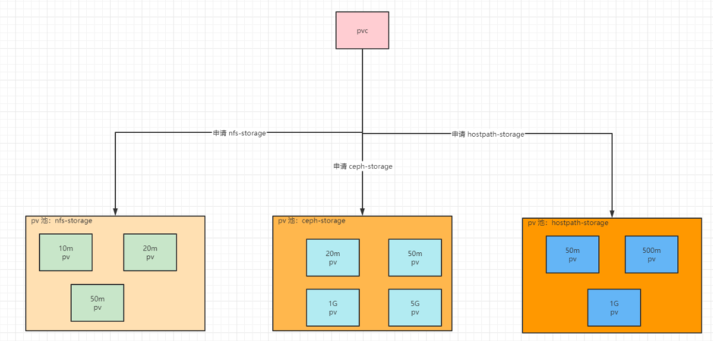

注意： 

- Pod 的删除，并不会影响 PVC；换言之，PVC 可以独立于 Pod 存在，PVC 也是 K8s 的系统资源。不过，推荐将 PVC 和 Pod 也在一个 yaml 文件中。

- PVC 删除会不会影响到 PV，要根据 PV 的回收策略决定。

**PV 的回收策略:**

- 目前的回收策略有： 

- - Retain：手动回收（默认）。

- - Recycle：基本擦除 (`rm -rf /thevolume/*`)。

- - Delete：诸如 AWS EBS、GCE PD、Azure Disk 或 OpenStack Cinder 卷这类关联存储资产也被删除。

-  目前，仅 NFS 和 HostPath 支持回收（Recycle）。 AWS EBS、GCE PD、Azure Disk 和 Cinder 卷都支持删除（Delete）。 


-  示例：演示 Retain 

还是上面创建的PV

```shell
echo 111 > /nfs/data/500m/index.html
```

```shell
vi k8s-pvc.yaml
```

```yaml
apiVersion: v1
kind: PersistentVolumeClaim
metadata:
  name: nginx-pvc-500m
  namespace: default
  labels:
    app: nginx-pvc-500m
spec:
  storageClassName: nfs-storage
  accessModes:
  - ReadWriteOnce
  resources:
    requests:
      storage: 500m
```

```shell
kubectl apply -f k8s-pvc.yaml
kubectl delete -f k8s-pvc.yaml
```

- 示例：演示 Recycle:

```shell
mkdir -pv /nfs/data/10m
mkdir -pv /nfs/data/20m
mkdir -pv /nfs/data/500m
mkdir -pv /nfs/data/1Gi
```

```shell
vi k8s-pv.yaml
```

```yaml
apiVersion: v1
kind: PersistentVolume
metadata:
  name: nfs-pv-10m
spec:
  storageClassName: nfs-storage # 用于分组
  capacity:
    storage: 10m
  accessModes:
    - ReadWriteOnce
  nfs: # 使用 nfs 存储驱动
    path: /nfs/data/10m # nfs 共享的目录，mkdir -pv /nfs/data/10m
    server: 192.168.65.100 # nfs 服务端的 IP 地址或 hostname
  persistentVolumeReclaimPolicy: Recycle  # 回收策略
---
apiVersion: v1
kind: PersistentVolume
metadata:
  name: nfs-pv-20m
spec:
  storageClassName: nfs-storage # 用于分组
  capacity:
    storage: 20m
  accessModes:
    - ReadWriteOnce
  nfs: # 使用 nfs 存储驱动
    path: /nfs/data/20m # nfs 共享的目录，mkdir -pv /nfs/data/20m
    server: 192.168.65.100 # nfs 服务端的 IP 地址或 hostname
  persistentVolumeReclaimPolicy: Recycle  # 回收策略  
--- 
apiVersion: v1
kind: PersistentVolume
metadata:
  name: nfs-pv-500m
spec:
  storageClassName: nfs-storage # 用于分组
  capacity:
    storage: 500m
  accessModes:
    - ReadWriteOnce
  nfs: # 使用 nfs 存储驱动
    path: /nfs/data/500m # nfs 共享的目录，mkdir -pv /nfs/data/500m
    server: 192.168.65.100 # nfs 服务端的 IP 地址或 hostname
  persistentVolumeReclaimPolicy: Recycle  # 回收策略  
---
apiVersion: v1
kind: PersistentVolume
metadata:
  name: nfs-pv-1g
spec:
  storageClassName: nfs-storage # 用于分组
  capacity:
    storage: 20m
  accessModes:
    - ReadWriteOnce
  nfs: # 使用 nfs 存储驱动
    path: /nfs/data/1Gi # nfs 共享的目录，mkdir -pv /nfs/data/1Gi
    server: 192.168.65.100 # nfs 服务端的 IP 地址或 hostname
  persistentVolumeReclaimPolicy: Recycle  # 回收策略
```

```shell
kubectl apply -f k8s-pv.yaml
```

```shell
echo 111 > /nfs/data/500m/index.html
```

```shell
vi k8s-pvc.yaml
```

```shell
apiVersion: v1
kind: PersistentVolumeClaim
metadata:
  name: nginx-pvc-500m
  namespace: default
  labels:
    app: nginx-pvc-500m
spec:
  storageClassName: nfs-storage
  accessModes:
  - ReadWriteOnce
  resources:
    requests:
      storage: 500m
```

```shell
kubectl apply -f k8s-pvc.yaml
```

```shell
kubectl delete -f k8s-pvc.yaml
```

**PV 的生命周期**

-  一个 PV 的生命周期，可能会处于 4 种不同的阶段： 

- -  Available（可用）：表示可用状态，还未被任何 PVC 绑定。 

- -  Bound（已绑定）：表示 PV 已经被 PVC 绑定。 

- -  Released（已释放）：表示 PVC 被删除，但是资源还没有被集群重新释放。 

- -  Failed（失败）：表示该 PV 的自动回收失败。 


- PVC 和 PV 是一一对应的，PV 和 PVC 之间的相互作用遵循如下的生命周期： 

-  ① 资源供应：管理员手动创建底层存储和 PV。 

-  ② 资源绑定： 

- -  用户创建 PVC ，Kubernetes 负责根据 PVC 声明去寻找 PV ，并绑定在用户定义好 PVC 之后，系统将根据 PVC 对存储资源的请求在以存在的 PV 中选择一个满足条件的。 

- - -  一旦找到，就将该 PV 和用户定义的 PVC 进行绑定，用户的应用就可以使用这个 PVC 了。 

- - -  如果找不到，PVC 就会无限期的处于 Pending 状态，直到系统管理员创建一个符合其要求的 PV 。 

- -  PV 一旦绑定到某个 PVC 上，就会被这个 PVC 独占，不能再和其他的 PVC 进行绑定了。 

-  ③ 资源使用：用户可以在 Pod 中像 Volume 一样使用 PVC ，Pod 使用 Volume 的定义，将 PVC 挂载到容器内的某个路径进行使用。 

-  ④ 资源释放： 

- -  用户删除 PVC 来释放 PV 。 

- -  当存储资源使用完毕后，用户可以删除 PVC，和该 PVC 绑定的 PV 将会标记为 `已释放` ，但是还不能立刻和其他的 PVC 进行绑定。通过之前 PVC 写入的数据可能还留在存储设备上，只有在清除之后该 PV 才能再次使用。 

-  ⑤ 资源回收： 

- - Kubernetes 根据 PV 设置的回收策略进行资源的回收。

- - 对于 PV，管理员可以设定回收策略，用于设置与之绑定的 PVC 释放资源之后如何处理遗留数据的问题。只有 PV 的存储空间完成回收，才能供新的 PVC 绑定和使用。

**PV** **的访问模式**

- 访问模式（accessModes）：用来描述用户应用对存储资源的访问权限，访问权限包括下面几种方式： 

- - ReadWriteOnce（RWO）：读写权限，但是只能被单个节点挂载。

- - ReadOnlyMany（ROX）：只读权限，可以被多个节点挂载。

- - ReadWriteMany（RWX）：读写权限，可以被多个节点挂载。

##### 8.3.3 动态供应

- 静态供应：集群管理员创建若干 PV 卷。这些卷对象带有真实存储的细节信息，并且对集群用户可用（可见）。PV 卷对象存在于 Kubernetes API 中，可供用户消费（使用）。

- 动态供应：集群自动根据 PVC 创建出对应 PV 进行使用。

**动态供应的完整流程：**


- ① 集群管理员预先创建存储类（StorageClass）。

- ② 用户创建使用存储类的持久化存储声明(PVC：PersistentVolumeClaim)。

- ③ 存储持久化声明通知系统，它需要一个持久化存储(PV: PersistentVolume)。

- ④ 系统读取存储类的信息。

- ⑤ 系统基于存储类的信息，在后台自动创建 PVC 需要的 PV 。

- ⑥ 用户创建一个使用 PVC 的 Pod 。

- ⑦ Pod 中的应用通过 PVC 进行数据的持久化。

- ⑧ PVC 使用 PV 进行数据的最终持久化处理。


  **设置 NFS 动态供应**

注意：不一定需要设置 NFS 动态供应，可以直接使用云厂商提供的 StorageClass 。

● [官网地址](https://github.com/kubernetes-sigs/nfs-subdir-external-provisioner)。 
● 部署 NFS 动态供应： 

```yaml
apiVersion: storage.k8s.io/v1
kind: StorageClass
metadata:
  name: nfs-client
provisioner: k8s-sigs.io/nfs-subdir-external-provisioner # 指定一个供应商的名字 
# or choose another name, 必须匹配 deployment 的 env PROVISIONER_NAME'
parameters:
  archiveOnDelete: "false" # 删除 PV 的时候，PV 中的内容是否备份
---
apiVersion: apps/v1
kind: Deployment
metadata:
  name: nfs-client-provisioner
  labels:
    app: nfs-client-provisioner
  namespace: default
spec:
  replicas: 1
  strategy:
    type: Recreate
  selector:
    matchLabels:
      app: nfs-client-provisioner
  template:
    metadata:
      labels:
        app: nfs-client-provisioner
    spec:
      serviceAccountName: nfs-client-provisioner
      containers:
        - name: nfs-client-provisioner
          image: ccr.ccs.tencentyun.com/gcr-containers/nfs-subdir-external-provisioner:v4.0.2
          volumeMounts:
            - name: nfs-client-root
              mountPath: /persistentvolumes
          env:
            - name: PROVISIONER_NAME
              value: k8s-sigs.io/nfs-subdir-external-provisioner
            - name: NFS_SERVER
              value: 192.168.65.100 # NFS 服务器的地址
            - name: NFS_PATH
              value: /nfs/data # NFS 服务器的共享目录
      volumes:
        - name: nfs-client-root
          nfs:
            server: 192.168.65.100
            path: /nfs/data
---
apiVersion: v1
kind: ServiceAccount
metadata:
  name: nfs-client-provisioner
  namespace: default
---
kind: ClusterRole
apiVersion: rbac.authorization.k8s.io/v1
metadata:
  name: nfs-client-provisioner-runner
rules:
  - apiGroups: [""]
    resources: ["nodes"]
    verbs: ["get", "list", "watch"]
  - apiGroups: [""]
    resources: ["persistentvolumes"]
    verbs: ["get", "list", "watch", "create", "delete"]
  - apiGroups: [""]
    resources: ["persistentvolumeclaims"]
    verbs: ["get", "list", "watch", "update"]
  - apiGroups: ["storage.k8s.io"]
    resources: ["storageclasses"]
    verbs: ["get", "list", "watch"]
  - apiGroups: [""]
    resources: ["events"]
    verbs: ["create", "update", "patch"]
---
kind: ClusterRoleBinding
apiVersion: rbac.authorization.k8s.io/v1
metadata:
  name: run-nfs-client-provisioner
subjects:
  - kind: ServiceAccount
    name: nfs-client-provisioner
    namespace: default
roleRef:
  kind: ClusterRole
  name: nfs-client-provisioner-runner
  apiGroup: rbac.authorization.k8s.io
---
kind: Role
apiVersion: rbac.authorization.k8s.io/v1
metadata:
  name: leader-locking-nfs-client-provisioner
  namespace: default
rules:
  - apiGroups: [""]
    resources: ["endpoints"]
    verbs: ["get", "list", "watch", "create", "update", "patch"]
---
kind: RoleBinding
apiVersion: rbac.authorization.k8s.io/v1
metadata:
  name: leader-locking-nfs-client-provisioner
  namespace: default
subjects:
  - kind: ServiceAccount
    name: nfs-client-provisioner
    namespace: default
roleRef:
  kind: Role
  name: leader-locking-nfs-client-provisioner
  apiGroup: rbac.authorization.k8s.io
```

- 测试动态供应:

```yaml
apiVersion: v1
kind: PersistentVolumeClaim
metadata:
  name: nginx-pvc
  namespace: default
  labels:
    app: nginx-pvc
spec:
  storageClassName: nfs-client # 注意此处
  accessModes:
  - ReadWriteOnce
  resources:
    requests:
      storage: 2Gi
---
apiVersion: v1
kind: Pod
metadata:
  name: nginx
  namespace: default
  labels:
    app: nginx
spec:
  containers:
  - name: nginx
    image: nginx:1.20.2
    resources:
      limits:
        cpu: 200m
        memory: 500Mi
      requests:
        cpu: 100m
        memory: 200Mi
    ports:
    - containerPort:  80
      name:  http
    volumeMounts:
    - name: localtime
      mountPath: /etc/localtime
    - name: html
      mountPath: /usr/share/nginx/html/ 
  volumes:
    - name: localtime
      hostPath:
        path: /usr/share/zoneinfo/Asia/Shanghai
    - name: html    
      persistentVolumeClaim:
        claimName:  nginx-pvc
        readOnly: false  
  restartPolicy: Always
```


**设置 SC 为默认驱动：**

```
# 命令
kubectl patch storageclass <your-class-name> -p '{"metadata": {"annotations":{"storageclass.kubernetes.io/is-default-class":"true"}}}'
# 设置 SC 为默认驱动：
kubectl patch storageclass nfs-client -p '{"metadata": {"annotations":{"storageclass.kubernetes.io/is-default-class":"true"}}}'
```

测试默认驱动：

```yaml
apiVersion: v1
kind: PersistentVolumeClaim
metadata:
  name: nginx-pvc
  namespace: default
  labels:
    app: nginx-pvc
spec:
  # storageClassName: nfs-client 不写，就使用默认的
  accessModes:
  - ReadWriteOnce
  resources:
    requests:
      storage: 2Gi
---
apiVersion: v1
kind: Pod
metadata:
  name: nginx
  namespace: default
  labels:
    app: nginx
spec:
  containers:
  - name: nginx
    image: nginx:1.20.2
    resources:
      limits:
        cpu: 200m
        memory: 500Mi
      requests:
        cpu: 100m
        memory: 200Mi
    ports:
    - containerPort:  80
      name:  http
    volumeMounts:
    - name: localtime
      mountPath: /etc/localtime
    - name: html
      mountPath: /usr/share/nginx/html/ 
  volumes:
    - name: localtime
      hostPath:
        path: /usr/share/zoneinfo/Asia/Shanghai
    - name: html    
      persistentVolumeClaim:
        claimName:  nginx-pvc
        readOnly: false  
  restartPolicy: Always
```


### 9. 安全认证

#### 9.1 访问控制概述

Kubernetes作为一个分布式集群的管理工具，保证集群的安全性是其一个重要的任务。所谓的安全性其实就是保证对Kubernetes的各种**客户端**进行**认证和鉴权**操作。

**客户端**

在Kubernetes集群中，客户端通常有两类：

- **User Account**：一般是独立于kubernetes之外的其他服务管理的用户账号。
- **Service Account**：kubernetes管理的账号，用于为Pod中的服务进程在访问Kubernetes时提供身份标识。

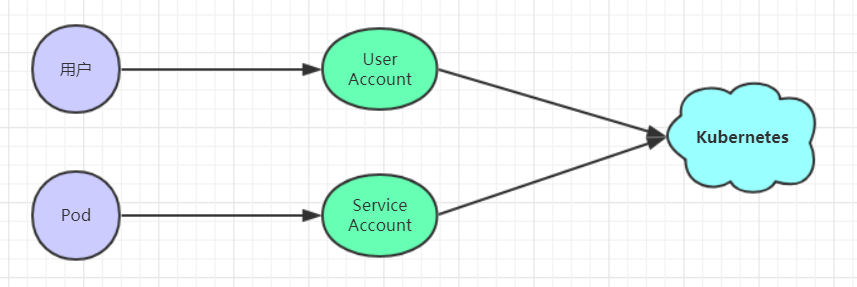

**认证、授权与准入控制**

ApiServer是访问及管理资源对象的唯一入口。任何一个请求访问ApiServer，都要经过下面三个流程：

- Authentication（认证）：身份鉴别，只有正确的账号才能够通过认证
- Authorization（授权）： 判断用户是否有权限对访问的资源执行特定的动作
- Admission Control（准入控制）：用于补充授权机制以实现更加精细的访问控制功能。


**访问控制流程：**

- 用户携带令牌或者证书给 Kubernetes 的 api-server 发送请求，要求修改集群资源。

- Kubernetes 开始认证。

- Kubernetes 认证通过之后，会查询用户的授权（有哪些权限）。

- 用户执行操作的过程中（操作 CPU、内存、硬盘、网络……），利用准入控制来判断是否可以执行这样的操作。

#### 9.2 认证管理

Kubernetes集群安全的最关键点在于如何识别并认证客户端身份，它提供了3种客户端身份认证方式：

- HTTP Base认证：通过用户名+密码的方式认证

  ```
      这种认证方式是把“用户名:密码”用BASE64算法进行编码后的字符串放在HTTP请求中的Header的 Authorization域里发送给服务端。服务端收到后进行解码，获取用户名及密码，然后进行用户身份认证的过程。
  ```

- HTTP Token认证：通过一个Token来识别合法用户

  ```
      这种认证方式是用一个很长的难以被模仿的字符串--Token来表明客户身份的一种方式。每个Token对应一个用户名，当客户端发起API调用请求时，需要在HTTP Header里放入Token，API Server接到Token后会跟服务器中保存的token进行比对，然后进行用户身份认证的过程。
  ```

- HTTPS证书认证：基于CA根证书签名的双向数字证书认证方式

  ```
      这种认证方式是安全性最高的一种方式，但是同时也是操作起来最麻烦的一种方式。
  ```


**HTTPS证书认证大体分为3个过程：**

1. 证书申请和下发

   ```
     HTTPS通信双方的服务器向CA机构申请证书，CA机构下发根证书、服务端证书及私钥给申请者
   ```

2. 客户端和服务端的双向认证

   ```
     1> 客户端向服务器端发起请求，服务端下发自己的证书给客户端，
        客户端接收到证书后，通过私钥解密证书，在证书中获得服务端的公钥，
        客户端利用服务器端的公钥认证证书中的信息，如果一致，则认可这个服务器
     2> 客户端发送自己的证书给服务器端，服务端接收到证书后，通过私钥解密证书，
        在证书中获得客户端的公钥，并用该公钥认证证书信息，确认客户端是否合法
   ```

3. 服务器端和客户端进行通信

   ```
     服务器端和客户端协商好加密方案后，客户端会产生一个随机的秘钥并加密，然后发送到服务器端。
     服务器端接收这个秘钥后，双方接下来通信的所有内容都通过该随机秘钥加密
   ```

> 注意: Kubernetes允许同时配置多种认证方式，只要其中任意一个方式认证通过即可

#### 9.3 授权管理

授权发生在认证成功之后，通过认证就可以知道请求用户是谁， 然后Kubernetes会根据事先定义的授权策略来决定用户是否有权限访问，这个过程就称为授权。

每个发送到ApiServer的请求都带上了用户和资源的信息：比如发送请求的用户、请求的路径、请求的动作等，授权就是根据这些信息和授权策略进行比较，如果符合策略，则认为授权通过，否则会返回错误。

API Server目前支持以下几种授权策略：

- AlwaysDeny：表示拒绝所有请求，一般用于测试

- AlwaysAllow：允许接收所有请求，相当于集群不需要授权流程（Kubernetes默认的策略）

- ABAC：基于属性的访问控制，表示使用用户配置的授权规则对用户请求进行匹配和控制

- Webhook：通过调用外部REST服务对用户进行授权

- Node：是一种专用模式，用于对kubelet发出的请求进行访问控制

- RBAC：基于角色的访问控制（kubeadm安装方式下的默认选项）

  ```shell
  # kubeadm 安装方式的默认授权策略查看命令
  cat /etc/kubernetes/manifests/kube-apiserver.yaml | grep -i rbac
  ```

  

RBAC(Role-Based Access Control) 基于角色的访问控制，主要是在描述一件事情：**给哪些对象授予了哪些权限**

其中涉及到了下面几个概念：

- 对象：User、Groups、ServiceAccount
- 角色：代表着一组定义在资源上的可操作动作(权限)的集合
- 绑定：将定义好的角色跟用户绑定在一起


RBAC引入了4个顶级资源对象：

- Role：角色，用于指定一组权限，限定名称空间下的权限。

- ClusterRole：集群角色，用于指定一组权限，限定集群范围下的权限。

- RoleBinding：角色绑定，用于将角色 Role（权限的集合）赋予给对象（User、Group、ServiceAccount）。

- ClusterRoleBinding：集群角色绑定，用于将集群角色 Role（权限的集合）赋予给对象（User、Group、ServiceAccount）。

  说明：为什么 Kubernetes 要设计 Role 、 ClusterRole ？

  答：有些资源对象本身就不是 namespace（名称空间）的 ，所以 Kubernetes 增加了 ClusterRole，并且 ClusterRole 也可以管理名称空间下的资源对象。

**Role、ClusterRole资源清单文件**

一个角色就是一组权限的集合，这里的权限都是许可形式的（白名单）。

```yaml
## Role 的资源清单文件：
# Role只能对命名空间内的资源进行授权，需要指定nameapce
kind: Role
apiVersion: rbac.authorization.k8s.io/v1beta1
metadata:
  namespace: dev
  name: authorization-role
rules:
- apiGroups: [""]  # 支持的API组列表,"" 空字符串，表示核心API群
  resources: ["pods"] # 支持的资源对象列表，通过 kubectl api-resources 查看。
  verbs: ["get", "watch", "list"] # 允许的对资源对象的操作方法列表，通过 kubectl api-resources -o wide 查看。

```

```yaml
## ClusterRole 的资源清单文件： 
# ClusterRole可以对集群范围内资源、跨namespaces的范围资源、非资源类型进行授权
kind: ClusterRole
apiVersion: rbac.authorization.k8s.io/v1beta1
metadata:
 name: authorization-clusterrole
rules:
- apiGroups: [""] # "" 标明 core API 组，默认留空即可。
  resources: ["pods"]
  verbs: ["get", "watch", "list"]
```

需要详细说明的是ClusterRole  不需要设置 namespace

rules中的参数：

- apiGroups: 支持的API组列表

  ```bash
  "","apps", "autoscaling", "batch"
  ```

- resources：支持的资源对象列表

  ```bash
  "services", "endpoints", "pods","secrets","configmaps","crontabs","deployments","jobs",
  "nodes","rolebindings","clusterroles","daemonsets","replicasets","statefulsets",
  "horizontalpodautoscalers","replicationcontrollers","cronjobs"
  ```

- verbs：对资源对象的操作方法列表

  ```bash
  "get", "list", "watch", "create", "update", "patch", "delete", "exec"
  ```

**RoleBinding、ClusterRoleBinding资源清单文件**

角色绑定用来把一个角色绑定到一个目标对象上，绑定目标可以是User、Group或者ServiceAccount。

```yaml
## RoleBinding  资源清单文件： 
# RoleBinding可以将同一namespace中的subject绑定到某个Role下，则此subject即具有该Role定义的权限
kind: RoleBinding
apiVersion: rbac.authorization.k8s.io/v1beta1
metadata:
  name: authorization-role-binding
  namespace: dev
subjects:
- kind: User
  name: heima # "name" 是区分大小写的
roleRef:
  kind: Role
  name: authorization-role
  apiGroup: rbac.authorization.k8s.io
```

```yaml
## ClusterRoleBinding 资源清单文件：
# ClusterRoleBinding在整个集群级别和所有namespaces将特定的subject与ClusterRole绑定，授予权限
kind: ClusterRoleBinding
apiVersion: rbac.authorization.k8s.io/v1beta1
metadata:
 name: authorization-clusterrole-binding
subjects:
- kind: User
  name: heima
  namespace: default # 如果资源是某个 namespace 下的，那么就需要设置 namespace
roleRef:
  kind: ClusterRole
  name: authorization-clusterrole
  apiGroup: rbac.authorization.k8s.io
```

**RoleBinding引用ClusterRole进行授权**

RoleBinding可以引用ClusterRole，对属于同一命名空间内ClusterRole定义的资源主体进行授权。

```
    一种很常用的做法就是，集群管理员为集群范围预定义好一组角色（ClusterRole），然后在多个命名空间中重复使用这些ClusterRole。这样可以大幅提高授权管理工作效率，也使得各个命名空间下的基础性授权规则与使用体验保持一致。
```

```yaml
# 虽然authorization-clusterrole是一个集群角色，但是因为使用了RoleBinding
# 所以heima只能读取dev命名空间中的资源
kind: RoleBinding
apiVersion: rbac.authorization.k8s.io/v1beta1
metadata:
  name: authorization-role-binding-ns
  namespace: dev
subjects:
- kind: User
  name: heima
  apiGroup: rbac.authorization.k8s.io
roleRef:
  kind: ClusterRole
  name: authorization-clusterrole
  apiGroup: rbac.authorization.k8s.io
```

**RBAC实战1：创建一个只能管理dev空间下Pods资源的账号**

1) 创建账号

```shell
# 1) 创建证书
[root@k8s-master01 pki]# cd /etc/kubernetes/pki/
[root@k8s-master01 pki]# (umask 077;openssl genrsa -out devman.key 2048)

# 2) 用apiserver的证书去签署
# 2-1) 签名申请，申请的用户是devman,组是devgroup
[root@k8s-master01 pki]# openssl req -new -key devman.key -out devman.csr -subj "/CN=devman/O=devgroup"     
# 2-2) 签署证书
[root@k8s-master01 pki]# openssl x509 -req -in devman.csr -CA ca.crt -CAkey ca.key -CAcreateserial -out devman.crt -days 3650

# 3) 设置集群、用户、上下文信息
[root@k8s-master01 pki]# kubectl config set-cluster kubernetes --embed-certs=true --certificate-authority=/etc/kubernetes/pki/ca.crt --server=https://192.168.109.100:6443

[root@k8s-master01 pki]# kubectl config set-credentials devman --embed-certs=true --client-certificate=/etc/kubernetes/pki/devman.crt --client-key=/etc/kubernetes/pki/devman.key

[root@k8s-master01 pki]# kubectl config set-context devman@kubernetes --cluster=kubernetes --user=devman

# 切换账户到devman
[root@k8s-master01 pki]# kubectl config use-context devman@kubernetes
Switched to context "devman@kubernetes".

# 查看dev下pod，发现没有权限
[root@k8s-master01 pki]# kubectl get pods -n dev
Error from server (Forbidden): pods is forbidden: User "devman" cannot list resource "pods" in API group "" in the namespace "dev"

# 切换到admin账户
[root@k8s-master01 pki]# kubectl config use-context kubernetes-admin@kubernetes
Switched to context "kubernetes-admin@kubernetes".
```

2） 创建Role和RoleBinding，为devman用户授权

```yaml
kind: Role
apiVersion: rbac.authorization.k8s.io/v1beta1
metadata:
  namespace: dev
  name: dev-role
rules:
- apiGroups: [""]
  resources: ["pods"]
  verbs: ["get", "watch", "list"]
  
---

kind: RoleBinding
apiVersion: rbac.authorization.k8s.io/v1beta1
metadata:
  name: authorization-role-binding
  namespace: dev
subjects:
- kind: User
  name: devman
  apiGroup: rbac.authorization.k8s.io
roleRef:
  kind: Role
  name: dev-role
  apiGroup: rbac.authorization.k8s.io
```

```shell
[root@k8s-master01 pki]# kubectl create -f dev-role.yaml
role.rbac.authorization.k8s.io/dev-role created
rolebinding.rbac.authorization.k8s.io/authorization-role-binding created
```

3) 切换账户，再次验证

```shell
# 切换账户到devman
[root@k8s-master01 pki]# kubectl config use-context devman@kubernetes
Switched to context "devman@kubernetes".

# 再次查看
[root@k8s-master01 pki]# kubectl get pods -n dev
NAME                                 READY   STATUS             RESTARTS   AGE
nginx-deployment-66cb59b984-8wp2k    1/1     Running            0          4d1h
nginx-deployment-66cb59b984-dc46j    1/1     Running            0          4d1h
nginx-deployment-66cb59b984-thfck    1/1     Running            0          4d1h

# 为了不影响后面的学习,切回admin账户
[root@k8s-master01 pki]# kubectl config use-context kubernetes-admin@kubernetes
Switched to context "kubernetes-admin@kubernetes".
```

**RBAC实战2：创建 ServiceAccount 的时候，系统会在底层默认创建一个含 ServiceAccount 名称的 Secret 。**

```yaml
# 名称空间角色
apiVersion: rbac.authorization.k8s.io/v1
kind: Role
metadata:
  name: xudaxian-role
  namespace: default # 所属的名称空间
rules: # 当前角色的规则
- apiGroups: [""] # "" 标明 core API 组，默认留空即可。
  resources: ["pods"] # 指定能操作的资源 ，通过 kubectl api-resources 查看即可。
  # resourceNames: [""] #  指定只能操作某个名字的资源
  verbs: ["get", "watch", "list"] # 操作动作，通过 kubectl api-resources -o wide 查看即可。 
---
# 集群角色
apiVersion: rbac.authorization.k8s.io/v1
kind: ClusterRole
metadata:
  name: xudaxian-clusterrole
rules:
- apiGroups: [""] # "" 标明 core API 组，默认留空即可。
  resources: ["namespaces"]
  verbs: ["get", "watch", "list"]
---
# ServiceAccount
apiVersion: v1
kind: ServiceAccount
metadata:
  name: xudaxian # ServiceAccount 的名称
  namespace: default
---
# 账号和角色绑定
apiVersion: rbac.authorization.k8s.io/v1
kind: RoleBinding
metadata:
  name: xudaxian-rolebinding
  namespace: default
subjects:
- kind: ServiceAccount
  name: xudaxian # "name" 是区分大小写的
roleRef:
  kind: Role
  name: xudaxian-role
  apiGroup: rbac.authorization.k8s.io
---
# 账号和集群角色绑定
apiVersion: rbac.authorization.k8s.io/v1
kind: ClusterRoleBinding
metadata:
  name: xudaxian-clusterrolebinding
subjects:
- kind: ServiceAccount
  name: xudaxian # "name" 是区分大小写的
  namespace: default # 如果资源是某个 namespace 下的，那么就需要设置 namespace
roleRef:
  kind: ClusterRole
  name: xudaxian-clusterrole
  apiGroup: rbac.authorization.k8s.io
```

温馨提示：

① 动态供应（NFS）、DashBoard 等底层都使用了 Role、ClusterRole、RoleBinding、ClusterRoleBinding 。

② 我们可以创建一个 ServiceAccount ，并将自定义的 ServiceAccount 绑定 cluster-admin （ClusterRole，Kubernetes 底层提供的），然后通过暴露的 [API](https://kubernetes.io/zh/docs/tasks/administer-cluster/access-cluster-api/) 进行 Kubernetes 管理平台的开发（如：Kubersphere 等）。

#### 9.4 准入控制

通过了前面的认证和授权之后，还需要经过准入控制处理通过之后，apiserver才会处理这个请求。

准入控制是一个可配置的控制器列表，可以通过在Api-Server上通过命令行设置选择执行哪些准入控制器：

```shell
--enable-admission-plugins=NamespaceLifecycle,LimitRanger,ServiceAccount,PersistentVolumeLabel,DefaultStorageClass,ResourceQuota,DefaultTolerationSeconds
```

只有当所有的准入控制器都检查通过之后，apiserver才执行该请求，否则返回拒绝。

当前可配置的Admission Control准入控制如下：

- AlwaysAdmit：允许所有请求
- AlwaysDeny：禁止所有请求，一般用于测试
- AlwaysPullImages：在启动容器之前总去下载镜像
- DenyExecOnPrivileged：它会拦截所有想在Privileged Container上执行命令的请求
- ImagePolicyWebhook：这个插件将允许后端的一个Webhook程序来完成admission controller的功能。
- Service Account：实现ServiceAccount实现了自动化
- SecurityContextDeny：这个插件将使用SecurityContext的Pod中的定义全部失效
- ResourceQuota：用于资源配额管理目的，观察所有请求，确保在namespace上的配额不会超标
- LimitRanger：用于资源限制管理，作用于namespace上，确保对Pod进行资源限制
- InitialResources：为未设置资源请求与限制的Pod，根据其镜像的历史资源的使用情况进行设置
- NamespaceLifecycle：如果尝试在一个不存在的namespace中创建资源对象，则该创建请求将被拒绝。当删除一个namespace时，系统将会删除该namespace中所有对象。
- DefaultStorageClass：为了实现共享存储的动态供应，为未指定StorageClass或PV的PVC尝试匹配默认的StorageClass，尽可能减少用户在申请PVC时所需了解的后端存储细节
- DefaultTolerationSeconds：这个插件为那些没有设置forgiveness tolerations并具有notready:NoExecute和unreachable:NoExecute两种taints的Pod设置默认的“容忍”时间，为5min
- PodSecurityPolicy：这个插件用于在创建或修改Pod时决定是否根据Pod的security context和可用的PodSecurityPolicy对Pod的安全策略进行控制

### 10. Helm

#### 10.1 Helm简介

##### 10.1.1 为什么需要Helm？

-  Kubernetes 上的应用对象，都是由特定的资源描述组成，包括 Deployment、Service 等，都保存在各自的文件中或者集中写在一个配置文件，然后通过 `kubectl apply -f` 部署。 

-  如果应用只由一个或几个这样的服务组成，上面的部署方式就足够了。 

-  但是对于一个复杂的应用，会有很多类似上面的资源描述文件，如：微服务架构应用，组成应用的服务可能多达几十、上百个，如果有更新或回滚应用的需求，可能要修改和维护所涉及到大量的资源文件，而这种组织和管理应用的方式就显得力不从心了。并且由于缺少对发布过的应用进行版本管理和控制，使得 Kubernetes 上的应用维护和更新面临诸多的挑战，主要面临以下的问题： 

- - ① 如何将这些服务作为一个整体管理？

- - ② 这些资源文件如何高效复用？

- - ③ 应用级别的版本如何管理？

##### 10.1.2 Helm介绍

Helm是 Kubernetes 的包管理工具，就像 Linux 下的包管理器，如：yum、apt 等，可以很方便的将之前打包好的 yaml 文件部署到 Kubernetes 上。


##### 10.1.3 Helm的三大概念

- `Chart` Helm使用的打包格式，代表着 Helm 包。它包含在 Kubernetes 集群内部运行应用程序，工具或服务所需的所有资源定义。你可以把它看作是 Homebrew formula，Apt dpkg，或 Yum RPM 在Kubernetes 中的等价物。Chart有特定的文件目录结构，如果开发者想自定义一个新的 Chart，只需要使用Helm create命令生成一个目录结构即可进行开发。

- `Repository（仓库）` 是用来存放和共享 charts 的地方。它就像 Perl 的 [CPAN 档案库网络](https://www.cpan.org/) 或是 Fedora 的 [软件包仓库](https://src.fedoraproject.org/)，只不过它是供 Kubernetes 包所使用的。

- `Release` 通过Helm将Chart部署到 K8s集群时创建的特定实例，是运行在 Kubernetes 集群中的 chart 的实例。一个 chart 通常可以在同一个集群中安装多次。每一次安装都会创建一个新的 release 。以 MySQL chart为例，如果你想在你的集群中运行两个数据库，你可以安装该 chart 两次。每一个数据库都会拥有它自己的 release 和 release name 。

注意：

- Helm 安装 charts 到 Kubernetes 集群中，每次安装都会创建一个新的 release。你可以在 Helm 的 chart repositories 中寻找新的 chart。

- 可以类比 Docker 来理解，Chart 就类似于 Docker 中的镜像（Docker 中的镜像就是一系列文件的集合，Chart 也是一系列文件的集合），Repository（仓库）就类似于 Docker Hub，Release 就类似于 Docker 中的容器（可以根据镜像 run 多个容器）。

#### 10.2 Helm的安装

##### 10.2.1 安装的先决条件

- 想成功和正确地使用 Helm ，需要以下前置条件： 

- - ① 一个 Kubernetes 集群。

- - ② 确定你安装版本的安全配置。

- - ③ 安装和配置 Helm 。

-  安装或者使用现有的 Kubernetes 集群： 

- - 使用 Helm ，需要一个 Kubernetes 集群。对于 Helm 的最新版本，我们建议使用 Kubernetes 的最新稳定版， 在大多数情况下，它是 `倒数第二个次版本`。

- - 应该有一个本地的 `kubectl` 。

-  [查看 Helm 和对应支持的 Kubernetes 版本](https://helm.sh/zh/docs/topics/version_skew/)： 


##### 10.2.2 Helm的安装

1) 下载Helm

```shell
wget https://get.helm.sh/helm-v3.6.3-linux-amd64.tar.gz
```

2）解压 Helm

```shell
tar -zxvf helm-v3.6.3-linux-amd64.tar.gz
```


3）移动到指定目录

```
mv linux-amd64/helm /usr/local/bin/helm
```


4）helm命令补全

```shell
helm completion bash | sudo tee /etc/bash_completion.d/helm > /dev/null

source /usr/share/bash-completion/bash_completion
```

##### 10.2.3 Helm常用命令

| 命令       |                             描述                             |
| ---------- | :----------------------------------------------------------: |
| create     |                   创建一个chart并指定名字                    |
| dependency |                        管理chart依赖                         |
| get        | 下载一个release。可用的子命令：all、hooks、manifest、notes、values。 |
| history    |                      获取release历史。                       |
| install    |                       安装一个chart。                        |
| list       |                        列出release。                         |
| package    |              将chart目录打包到chart存档文件中。              |
| pull       | 从远程仓库中下载chart并解压到本地。比如：helm install stable/mysql --untar。 |
| repo       | 添加、列出、移除、更新和索引chart仓库。可用的子命令：add、index、list、remove、update。 |
| rollback   |                      从之前的版本回退。                      |
| search     | 根据关键字搜索chart。可用的子命令：all、chart、readme、values。 |
| show       | 查看chart的详细信息。可用的子命令：all、chart、readme、values。 |
| status     |                    显示已命名版本的状态。                    |
| template   |                        本地呈现模板。                        |
| uninstall  |                      卸载一个release。                       |
| upgrade    |                      更新一个release。                       |
| version    |                     查看Helm客户端版本。                     |

##### 10.2.4 Helm的chart仓库

- 微软仓库：http://mirror.azure.cn/kubernetes/charts，推荐。

- 阿里云仓库：https://kubernetes.oss-cn-hangzhou.aliyuncs.com/charts。

```shell
# 1、添加 chart 仓库
# 命令
helm repo add 仓库名 仓库URL地址
# 示例
helm repo add stable http://mirror.azure.cn/kubernetes/charts
helm repo add aliyun https://kubernetes.oss-cn-hangzhou.aliyuncs.com/charts
```


```shell
# 2、查看chart仓库
# 命令
helm repo list

# 3、从 chart 仓库中更新本地可用 chart 的信息
helm repo update
# 更新从各自chart仓库中获取的有关 chart 的最新信息。信息会缓存在本地，被诸如 'helm search' 等命令使用
# git 有对应的代码仓库 github ，docker 有对应的镜像仓库 dockerHub，而 helm 也有自己的制品仓库 ArtifactHub

# 4、删除chart仓库
# 命令
helm repo remove 仓库名
# 示例
helm repo remove aliyun
```

#### 10.3 Helm的基本使用

##### 10.3.1 使用chart部署一个应用

```shell
# 1、准备工作——安装nfs：略。

# 2、查找chart
# 命令
# 在Artifact Hub https://artifacthub.io/ 或自己的hub实例中搜索chart
helm search hub xxx
# 在本地 helm 客户端中的仓库中搜索chart
helm search repo xxx
# 示例
helm search repo mysql
```


```shell
# 3、查看 chart 信息
# 命令
# 检查chart(目录、文件或URL)并显示所有的内容（values.yaml, Chart.yaml, README）
helm show all [CHART]
# 检查chart(目录、文件或URL)并显示Chart.yaml文件的内容
helm show chart [CHART]
# 检查chart(目录、文件或URL)并显示values.yaml文件的内容
helm show values [CHART]
# 检查chart(目录、文件或URL)并显示README文件内容
helm show readme [CHART] [flags]
# 示例
helm show chart stable/mysql

# 4、安装chart，形成release
# 命令
helm install [NAME] [CHART]
# 注意：
# 每执行一次 install 命令，就会形成一个 release 。
# mysql 是有状态的应用，如果要想执行成功，必须设置持久化存储，并设置默认的动态供应。
# 示例
helm install db1 stable/mysql

# 5、查看release列表
# 状态可能是  unknown, deployed, uninstalled, superseded, failed, uninstalling, pending-install, pending-upgrade 或 pending-rollback 
helm list

# 6、查看release状态
状态包括：
最后部署时间
发布版本所在的k8s命名空间
发布状态(可以是： unknown, deployed, uninstalled, superseded, failed, uninstalling, pending-install, pending-upgrade 或 pending-rollback)
发布版本修订
发布版本描述(可以是完成信息或错误信息，需要用--show-desc启用)
列举版本包含的资源，按类型排序
最后一次测试套件运行的详细信息（如果使用）
chart提供的额外的注释
# 命令
helm status RELEASE_NAME
# 示例
helm status db1
```


##### 10.3.2 安装前自定义chart配置选项

- 自定义选项是因为并不是所有的 chart 都能按照默认配置运行成功，可能会需要一些环境依赖，例如 PV 。

- 所以我们需要自定义 chart 配置选项，安装过程中有两种方法可以传递配置数据： 

- - ①`--values`（或`-f`）：指定带有覆盖的 YAML 文件。这里可以多次指定，最右边的文件优先。

- - ②`--set`：在命令行上指定替代。如果两种都用，那么`--set`的优先级高。

**——values的使用**

- 先将修改的变量写到一个文件中

  ```shell
  helm show values stable/mysql > config.yaml
  ```


- 修改文件：

  ```
  vi config.yaml
  
  -- 修改部分
  persistence:
    enabled: true
    accessMode: ReadWriteOnce
    size: 8Gi
  
  mysqlUser: "k8s"
  mysqlPassword: "123456"
  mysqlDatabase: "k8s"
  ```


- 使用 --values 来替换默认的配置：

  ```shell
  helm install db stable/mysql -f config.yaml
  ```


可以根据提示，去 Pod 中查看。

**——set 的使用**

```shell
helm install db --set persistence.storageClass="nfs-client" stable/mysql
```

**其它技巧**

- 也可以将 chart 包下载下来，查看并修改：

```shell
# --untar 表示下载并解压
helm pull stable/mysql --untar
```

-  helm install 命令可以从多个来源安装： 

- - ① chart 存储库。

- - ② 本地 chart 压缩包。

- - ③ chart 目录。

- - ④ 完整的 URL。

```
# 示例：从 chart 存储库安装 chart 
helm install db stable/mysql

# 示例：从本地 chart 压缩包安装 chart
helm pull stable/mysql
helm install db mysql-1.6.9.tgz

# 示例：从 chart 目录安装 chart
helm pull stable/mysql --untar
helm install db mysql/

# 示例：从远程 URL 安装 chart
helm install db http://mirror.azure.cn/kubernetes/charts/mysql-1.6.9.tgz
```

##### 10.3.3 构建一个chart

**1）Chart的文件结构**

chart是一个组织在文件目录中的集合。目录名称就是 chart 名称（没有版本信息），因此描述 wordpress 的 chart 可以存储在  `wordpress/` 目录中。

```shell
wordpress/
├── charts # 包含chart依赖的其他chart
├── Chart.yaml # 用于描述这个 Chart 的基本信息，包括名字、描述信息以及版本等。
├── templates # 模板目录， 当和 values 结合时，可生成有效的Kubernetes manifest文件
│   ├── deployment.yaml
│   ├── _helpers.tpl # 放置可以通过 chart 复用的模板辅助对象
│   ├── hpa.yaml
│   ├── ingress.yaml
│   ├── NOTES.txt # 用于介绍 Chart 帮助信息， helm install 部署后展示给用户。例如：如何使用这个 Chart、列出缺省的设置等。
│   ├── serviceaccount.yaml
│   ├── service.yaml
│   └── tests
│       └── test-connection.yaml
└── values.yaml # chart 默认的配置值
```

**2）创建自定义chart**

```shell
# 命令 这个命令就如同前端的 vue 、react 生成一个脚手架项目一样，后续我们自定义 chart 就是在这个基础上进行修改。
helm create chart的名称
# 示例
helm create nginx
```


**3）安装自定义chart**

```shell
# 命令
helm install [NAME] [CHART]
# 示例
helm install nginx-demo nginx
```


**4）对自定义chart进行打包**

```shell
# 命令 之所以会对自定义的 chart 进行打包，主要的目的是：方便传输（节省带宽）等。
helm package [CHART_PATH]
# 示例
helm package nginx
```


**5）查看实际模板被渲染后的文件**

- Kubernetes 目前是不支持在 yaml 中定义变量的，这也是 Helm 出现的意义，Helm 可以有效的管理变量，并使用模板渲染技术（目前，各种语言都有提供，如：Java 的 JSP 本质上就是一种模板渲染技术）将变量渲染到文件中。

- 有的时候，我们想知道模板（template 目录中的 `*.yaml` 文件）渲染后的效果是什么？那么，就需要使用下面的命令：

  ```shell
  helm get manifest RELEASE_NAME
  ```

  注意：

  - 看到 RELEASE_NAME ，就应该知道该命令需要先执行 helm install 命令。

  - 该命令其实是将 value.yaml 中的变量的值填充到 template 目录中的 `*.yaml` 文件对应的变量中。

```shell
# 示例
helm get manifest nginx-demo
```


**升级**

有的时候，我们修改了 chart 的配置，那么就需要对 chart 进行升级了，可以使用 `helm upgrade` 命令：

```shell
# 命令 这边的 xxx=xxx ，就是就是 chart 目录中的 values.yaml 的值
helm upgrade --set xxx=xxx [RELEASE] [CHART]
# 命令
helm upgrade -f values.yaml [RELEASE] [CHART]
```


```shell
# 示例
helm upgrade --set image.tag=1.17 nginx-demo nginx
```


```shell
# 示例
helm upgrade -f values.yaml nginx-demo nginx
```


**6）查看升级的版本**

```shell
# 命令
helm history RELEASE_NAME
# 示例
helm history nginx-demo
```

**7）回滚**

```
# 命令
helm rollback <RELEASE> [REVISION]
# 示例
helm rollback nginx-demo 1
```


**8）卸载**

```shell
# 命令
helm uninstall RELEASE_NAME
# 示例
helm uninstall nginx-demo
```

#### 10.4 chart模板

##### 10.4.1 概述

Helm 最核心的就是 Chart 模板，即模板化的 K8s manifests 文件。它本质上就是一个 Go 的 template 模板。Helm 在 Go template 模板的基础上，增加了很多东西。如一些自定义的元数据信息、扩展的库以及一些类似于编程形式的工作流，例如条件语句、管道等等。这些东西都会使得我们的模板变得更加丰富。

##### 10.4.2 chart入门

1）创建一个chart模板

```shell
helm create mychart
```

- 默认 mychart/templates/ 目录下，会存在一些文件： 

- - `NOTES.txt`: chart 的 帮助文本。这会在用户执行 `helm install` 时展示给他们。

- - `deployment.yaml`: 创建Kubernetes [工作负载](https://kubernetes.io/docs/user-guide/deployments/)的基本清单。

- - `service.yaml`: 为你的工作负载创建一个 [service终端](https://kubernetes.io/docs/user-guide/services/)基本清单。

- - `_helpers.tpl`: 放置可以通过 char t复用的模板辅助对象。

2）在我们将 templates 目录下的文件全部删除：

```shell
rm -rf mychart/templates/*
```

在实际的生产级别的 chart ，基础版本的 chart 信息还是很有用的，此处只是防止干扰而全部删除。

3）在template 目录下创建一个 configmap.yaml 文件，用于创建 ConfigMap 对象

```shell
vi mychart/templates/configmap.yaml
```

```yaml
kind: ConfigMap
apiVersion: v1
metadata:
  name: mychart-configmap
  namespace: default
data:
  myvalue: "Hello World"
```

建议使用 `.yaml` 作为 YAML 文件的后缀，以 `.tpl` 作为 helper 文件的后缀。

4）安装chart

```shell
helm install demo mychart
```

5）查看 Helm 实际加载的模板：

```shell
helm get manifest demo
```


- 可以注意到，每个文件都是以 `---` 开头（YAML 文件的开头），然后是自定生成的注释行，表示那个模板文件生成了这个 YAML 文档。

- 现在，我们就可以看到 YAML 数据确实是 configmap.yaml 文件中的内容、

6）卸载

```shell
helm uninstall demo
```


- **helm的功能当然不能就这么点，模板文件 configmap.yaml 中的 `metadata.name` 目前是硬编码，不是很好：**

```yaml
kind: ConfigMap
apiVersion: v1
metadata:
  name: {{ .Release.Name }}-configmap # {{ .Release.Name }}
  namespace: default
data:
  myvalue: "Hello World"
```

> 注意：由于 DNS 系统的限制，`name:`字段长度限制为 63 个字符，所以 helm install [NAME] [CHART] 中的 NAME 不要太长。

> - `{{ .Release.Name }}-configmap` 中的 `{{ xxx }}` 是模板语法，很像 Vue 中的插值语法。
>
> - 模板命令 `{{ .Release.Name }}` 将发布名称注入了模板，值作为了一个名称空间对象传递给了模板，用点（`.`）分隔每个名称空间的元素。
>
> - `Release`前面的点表示从作用域最顶层的命名空间开始（后面会谈作用域）。这样`.Release.Name`就可解读为 `通过顶层名称空间开始查找 Release对象，然后在其中找 Name 对象` 。
>
> - `Release`是一个 Helm 的内置对象。稍后会更深入地讨论。但现在足够说明它可以显示从库中赋值的发布名称。

```shell
# 安装 Chart ，查看模板命令的结果：
helm install demo1 mychart
# 查看 Helm 实际加载的模板：
helm get manifest demo1
```

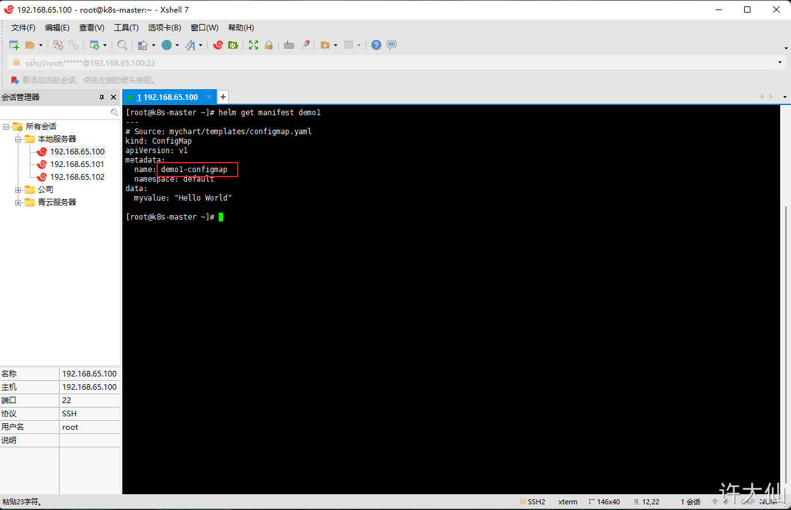

> 注意：此时 `configmap.yaml` 文件的 `metadata.name` 是 `demo1-configmap` 而不是原来的 `mychart-configmap` 。

- **k8s 还有 dry-run（干跑），Helm 当然也有这个功能，可能加速模板的构建速度（我们想测试模板渲染的内容但是又不想安装实际应用，只会将模板渲染的内容输出到控制台上）**

```shell
helm install --dry-run demo3 mychart/
```

> 注意：helm 干跑命令仅仅用来查看模板渲染的结果，不能保证 k8s 会正常接收生成的模板。

##### 10.4.3 内置对象

- 对象可以通过模板引用传递到模板中，当然我们也可以通过代码传递对象（如：`with`、`range`）。

- 对象可以非常简单仅仅有一个值，也可以包含其他对象或方法。如：`Release` 对象可以包含其他对象（如：`Release.Name`），`File` 对象有一组方法。

**Release对象**

Release 对象是我们可以在模板中访问的顶层对象之一，Release 对象描述了 版本发布本身，包含如下对象。

| 对象                |                        说明                         |
| ------------------- | :-------------------------------------------------: |
| `Release.Name`      |                    release 名称                     |
| `Release.Namespace` |  版本中包含的命名空间(如果 manifest 没有覆盖的话)   |
| `Release.IsUpgrade` | 如果当前操作是升级或回滚的话，该值将被设置为`true`  |
| `Release.IsInstall` |    如果当前操作是安装的话，该值将被设置为`true`     |
| `Release.Revision`  | 此次修订的版本号。安装时是1，每次升级或回滚都会自增 |
| `Release.Service`   |                 release 服务的名称                  |

**Value 对象**

Value 对象是从 values.yaml 文件和用户提供的文件传进模板的。如：values.yaml 中的值是 `favoriteDrink: coffee`，那么在 template 目录中的模板文件中，就可以使用 `{{ .Values.favoriteDrink }}`获取到该值。

**Chart 对象**

- Chart 对象是从 Chart.yaml 文件传进模板的。Chart.yaml 里面的所有数据都可以通过 Chart 获取到，如：`{{ .Chart.Name }}-{{ .Chart.Version }}`。

- Chart.yaml 的内容如下：

```yaml
apiVersion: chart API 版本 （必需）
name: chart名称 （必需）
version: 语义化2 版本（必需）
kubeVersion: 兼容Kubernetes版本的语义化版本（可选）
description: 一句话对这个项目的描述（可选）
type: chart类型 （可选）
keywords:
  - 关于项目的一组关键字（可选）
home: 项目home页面的URL （可选）
sources:
  - 项目源码的URL列表（可选）
dependencies: # chart 必要条件列表 （可选）
  - name: chart名称 (nginx)
    version: chart版本 ("1.2.3")
    repository: （可选）仓库URL ("https://example.com/charts") 或别名 ("@repo-name")
    condition: （可选） 解析为布尔值的yaml路径，用于启用/禁用chart (e.g. subchart1.enabled )
    tags: # （可选）
      - 用于一次启用/禁用 一组chart的tag
    import-values: # （可选）
      - ImportValue 保存源值到导入父键的映射。每项可以是字符串或者一对子/父列表项
    alias: （可选） chart中使用的别名。当你要多次添加相同的chart时会很有用
maintainers: # （可选）
  - name: 维护者名字 （每个维护者都需要）
    email: 维护者邮箱 （每个维护者可选）
    url: 维护者URL （每个维护者可选）
icon: 用做icon的SVG或PNG图片URL （可选）
appVersion: 包含的应用版本（可选）。不需要是语义化，建议使用引号
deprecated: 不被推荐的chart （可选，布尔值）
annotations:
  example: 按名称输入的批注列表 （可选）.
```

**Files 对象**

- `Files`： 在chart中提供访问所有的非特殊文件的对象。你不能使用它访问`Template`对象，只能访问其他文件。 请查看这个 [文件访问](https://helm.sh/zh/docs/chart_template_guide/accessing_files)部分了解更多信息。 

- - `Files.Get` 通过文件名获取文件的方法。 （`.Files.Getconfig.ini`）

- - `Files.GetBytes` 用字节数组代替字符串获取文件内容的方法。 对图片之类的文件很有用

- - `Files.Glob` 用给定的shell glob模式匹配文件名返回文件列表的方法

- - `Files.Lines` 逐行读取文件内容的方法。迭代文件中每一行时很有用

- - `Files.AsSecrets` 使用Base 64编码字符串返回文件体的方法

- - `Files.AsConfig` 使用YAML格式返回文件体的方法

**Capabilities 对象**

- `Capabilities`： 提供关于 Kubernetes 集群支持功能的信息。 

- - `Capabilities.APIVersions` 是一个版本列表

- - `Capabilities.APIVersions.Has $version` 说明集群中的版本 (比如,`batch/v1`) 或是资源 (比如, `apps/v1/Deployment`) 是否可用

- - `Capabilities.KubeVersion` 和`Capabilities.KubeVersion.Version` 是Kubernetes的版本号

- - `Capabilities.KubeVersion.Major` Kubernetes的主版本

- - `Capabilities.KubeVersion.Minor` Kubernetes的次版本

- - `Capabilities.HelmVersion` 包含Helm版本详细信息的对象，和 `helm version` 的输出一致

- - `Capabilities.HelmVersion.Version` 是当前Helm语义格式的版本

- - `Capabilities.HelmVersion.GitCommit` Helm的git sha1值

- - `Capabilities.HelmVersion.GitTreeState` 是Helm git树的状态

- - `Capabilities.HelmVersion.GoVersion` 是使用的Go编译器版本

**Template 对象**

- `Template`： 包含当前被执行的当前模板信息。 

- - `Template.Name`: 当前模板的命名空间文件路径 (如： `mychart/templates/mytemplate.yaml`)

- - `Template.BasePath`: 当前chart模板目录的路径 (如： `mychart/templates`)

**建议**

- 内置对象都是以大写字母开始，符合 Go 的命名规范；自定义名称的时候，按照团队约定即可，一般建议首字母小写，以便和内置对象区分。

##### 10.4.4 values.yaml 文件

Value 对象来源于多个位置： 
  ① chart 中的 values.yaml 文件。
  ② 父 chart 中的 values.yaml 文件。
  ③ 使用 -f 参数（helm install -f myvals.yaml ./mychart）传递到 helm install 或 helm upgrade 的 values 文件。
  ④ 使用 --set 传递的单个参数。

 以上列表有明确的顺序：默认使用 values.yaml ，可以被父 chart 的 values.yaml 覆盖，继而被用户提供的 values 文件覆盖，最后会被 --set 参数覆盖。 

  ● 示例： 
  ● 删除 values.yaml 中的默认内容，并设置一个参数： 

```shell
echo "" > values.yaml
echo "favoriteDrink: coffee" > values.yaml
```

- 编辑configmap.yaml 文件，读取 values.yaml 文件中配置的值：

```shell
vi configmap.yaml
```

```yaml
kind: ConfigMap
apiVersion: v1
metadata:
  name: {{ .Release.Name }}-configmap
  namespace: default
data:
  myvalue: "Hello World"
  drink: {{ .Values.favoriteDrink }} # 注意 favoriteDrink是Values的一个属性: {{ .Values.favoriteDrink }}
```

- 使用 `helm install --dry-run` 测试：

```shell
helm install test mychart --dry-run
```


- 使用 `--set` 参数覆盖 values.yaml 中的值：

```shell
helm install --set favoriteDrink=slurm test mychart --dry-run
```


- 示例：values.yaml 设置多结构

- 编辑 values.yaml 文件，并设置内容：

```shell
vi values.yaml
```

```yaml
favorite:
  drink: coffee
  food: pizza
```

- 编辑 configmap.yaml 文件，读取 values.yaml 文件中配置的值：

```shell
vi configmap.yaml
```

```yaml
apiVersion: v1
kind: ConfigMap
metadata:
  name: {{ .Release.Name }}-configmap
data:
  myvalue: "Hello World"
  drink: {{ .Values.favorite.drink }}
  food: {{ .Values.favorite.food }}
```

- 使用 helm install --dry-run 测试：

```shell
helm install test mychart --dry-run
```

  ##### 10.4.5 管道和函数

**1、函数**

目前为止，我们已经知道了如何将信息传到模板中，但是传入的信息并不能被修改。 而有时我们又希望以一种更有用的方式来转换所提供的数据。

可以调用模板指令中的 quote 函数将 .values 对象中的字符串属性用引号引起来，然后放到模板中。

```shell
vi configmap.yaml
```

```yaml
apiVersion: v1
kind: ConfigMap
metadata:
  name: {{ .Release.Name }}-configmap
data:
  myvalue: "Hello World"
  drink: {{ quote .Values.favorite.drink }} # 注意此处，使用了 quote 函数
  food: {{ quote .Values.favorite.food }} # 注意此处，使用了 quote 函数
```

```shell
helm install test mychart --dry-run
```


- 模板函数的语法是 `functionName arg1 arg2...`。在上面的代码片段中，`quote .Values.favorite.drink`调用了`quote`函数并传递了一个参数(`.Values.favorite.drink`)。

- Helm 有超过60个可用函数。其中有些通过 [Go模板语言](https://godoc.org/text/template)本身定义。其他大部分都是 [Sprig 模板库](https://masterminds.github.io/sprig/)。我们可以在示例看到其中很多函数。

**2、管道**

模板语言其中一个强大功能是 **管道** 概念。借鉴UNIX中的概念，管道符是将一系列的模板语言紧凑地将多个流式处理结果合并的工具。换句话说，管道符是按顺序完成一系列任务的方式。

现在使用管道父重写上面的示例：

```shell
vi configmap.yaml
```

```yaml
apiVersion: v1
kind: ConfigMap
metadata:
  name: {{ .Release.Name }}-configmap
data:
  myvalue: "Hello World"
  drink: {{ .Values.favorite.drink | quote }}
  food: {{ .Values.favorite.food | quote }}
```

在这个示例中，并不是调用`quote 参数`，而是倒置了命令。使用管道符(`|`)将参数“发送”给函数： `.Values.favorite.drink | quote`。使用管道符可以将很多函数链接在一起：

```yaml
apiVersion: v1
kind: ConfigMap
metadata:
  name: {{ .Release.Name }}-configmap
data:
  myvalue: "Hello World"
  drink: {{ .Values.favorite.drink | quote }}
  food: {{ .Values.favorite.food | upper | quote }}
```

> 倒置命令是模板中的常见做法。可以经常看到 `.val | quote` 而不是 `quote .val`。实际上两种操作都是可以的。

**3、default函数**

模板中频繁使用的一个函数是`default`： `default DEFAULT_VALUE GIVEN_VALUE`。 这个函数允许你在模板中指定一个默认值，以防这个值被忽略。

使用 default 函数重写上面的示例：

```shell
vi configmap.yaml
```

```yaml
apiVersion: v1
kind: ConfigMap
metadata:
  name: {{ .Release.Name }}-configmap
data:
  myvalue: "Hello World"
  drink: {{ .Values.favorite.drink | default "tea" | quote }}  # 注意此处
  food: {{ .Values.favorite.food | upper | quote }}
```


```shell
helm install test mychart --dry-run
```


从`values.yaml`中移除设置：

```shell
vi values.yaml
```

```yaml
favorite:
  #drink: coffee
  food: pizza
```


> 注意：
>
> - 在实际的 chart 中，所有的静态默认值应该设置在 values.yaml 文件中，且不应该重复使用 default 命令（容易出现冗余），但是这个 default 函数很适合计算值，不能声明在 values.yaml 文件中。
>
> - [模板函数列表](https://helm.sh/zh/docs/chart_template_guide/function_list/)。
>
> - 对于模板来说，运算符(`eq`, `ne`, `lt`, `gt`, `and`, `or`等等) 都是作为函数来实现的。 在管道符中，操作可以按照圆括号分组。

##### 10.4.6 流程控制

- Helm 提供了如下的三种流程控制： 

- - `if/else`， 用来创建条件语句。

- - `with`， 用来指定范围。

- - `range`， 提供 `"for each"` 类型的循环。

- 除了这些之外，还提供了一些声明和使用命名模板的关键字： 

- - `define` 在模板中声明一个新的命名模板。

- - `template` 导入一个命名模板。

- - `block` 声明一种特殊的可填充的模板块。

**1）if-else**

```shell
# 语法
{{ if PIPELINE }}
  # Do something
{{ else if OTHER PIPELINE }}
  # Do something else
{{ else }}
  # Default case
{{ end }}
```

> 注意我们讨论的是 `管道` 而不是值。这样做的原因是要清楚地说明控制结构可以执行整个管道，而不仅仅是计算一个值。

如果是以下值，管道会被认为是false：

 - 布尔值false
 - 数字0
 - 空字符串
 - nil(空或null)
 - 空集合（map，slice，tuple，dict，array）

示例：修改configmap.yaml 文件：

```yaml
apiVersion: v1
kind: ConfigMap
metadata:
  name: {{ .Release.Name }}-configmap
data:
  myvalue: "Hello World"
  drink: {{ .Values.favorite.drink | default "tea" | quote }}
  food: {{ .Values.favorite.food | upper | quote }}
  {{ if .Values.favorite.drink }}mug: "true"{{ end }}
```

此时的 values.yaml 文件的内容如下：

```yaml
favorite:
  # drink: coffee
  food: pizza
```

  使用 helm install --dry-run 测试：

```shell
helm install test mychart --dry-run
```

  修改 values.yaml 文件，将 `drink: coffee` 打开：

```yaml
favorite:
  drink: coffee # 此处原来的注释关闭了
  food: pizza
```

```shell
helm install test mychart --dry-run
```


我们不可能 `{ if }} xxx {{ end }}` 总写在一行，那么我们对其格式化一下：

```shell
vi configmap.yaml
```

```yaml
apiVersion: v1
kind: ConfigMap
metadata:
  name: {{ .Release.Name }}-configmap
data:
  myvalue: "Hello World"
  drink: {{ .Values.favorite.drink | default "tea" | quote }}
  food: {{ .Values.favorite.food | upper | quote }}
  {{ if .Values.favorite.drink }}
    mug: "true"
  {{ end }}
```


取消缩进，重新执行下：

```shell
apiVersion: v1
kind: ConfigMap
metadata:
  name: {{ .Release.Name }}-configmap
data:
  myvalue: "Hello World"
  drink: {{ .Values.favorite.drink | default "tea" | quote }}
  food: {{ .Values.favorite.food | upper | quote }}
  {{ if .Values.favorite.drink }}
  mug: "true" # 注意，此处取消的缩进
  {{ end }}
```


- 此时，又有问题，那就是出现了空行。因为当模板引擎运行时，`{{` 和 `}}` 里面的内容，但是留下的空白完全保持原样。

- YAML 认为空白是有意义的，但是此时的结果和我们预想的有所不同，我们不希望出现这多余的空行。而 Helm 是可以处理此类问题的。

- 模板声明的大括号语法可以通过特殊的字符修改，并通知模板引擎取消空白。`{{-`(包括添加的横杠和空格)表示向左删除空白， 而`-}}`表示右边的空格应该被去掉。

> 要确保`-`和其他命令之间有一个空格。 `{{- 3 }}` 表示“删除左边空格并打印3”，而`{{-3 }}`表示“打印-3”。

使用这个语法，修改我们的模板，去掉新加的空白行，重新执行下：

```shell
vi configmap.yaml
```

```yaml
apiVersion: v1
kind: ConfigMap
metadata:
  name: {{ .Release.Name }}-configmap
data:
  myvalue: "Hello World"
  drink: {{ .Values.favorite.drink | default "tea" | quote }}
  food: {{ .Values.favorite.food | upper | quote }}
  {{- if .Values.favorite.drink }} # 注意，此处向左删除空白
  mug: "true" 
  {{- end }} # 注意，此处取消的缩进，# 注意，此处向左删除空白
```

```shell
helm install test mychart --dry-run
```


- 解释上面是如何删除的，用一个`*`来代替每个遵循此规则被删除的空白， 在行尾的`*`表示删除新行的字符：

```yaml
apiVersion: v1
kind: ConfigMap
metadata:
  name: {{ .Release.Name }}-configmap
data:
  myvalue: "Hello World"
  drink: {{ .Values.favorite.drink | default "tea" | quote }}
  food: {{ .Values.favorite.food | upper | quote }}*
**{{- if eq .Values.favorite.drink "coffee" }}
  mug: "true"*
**{{- end }}
```

那么，如果我们在 `{{ }}` 左边和右边都添加 `-`，并重新执行：

```yaml
apiVersion: v1
kind: ConfigMap
metadata:
  name: {{ .Release.Name }}-configmap
data:
  myvalue: "Hello World"
  drink: {{ .Values.favorite.drink | default "tea" | quote }}
  food: {{ .Values.favorite.food | upper | quote }}
  {{- if .Values.favorite.drink -}} # 注意，此处向左删除空白
  mug: "true" 
  {{- end -}} # 注意，此处取消的缩进，# 注意，此处向左删除空白
```


- `出现了错误`，是因为将两边的新行都删除了，就像 `food: "PIZZA"mug:"true"`，所以，使用 `-}}`需谨慎。

**2、with**

- `with`操作。这个用来控制变量范围。回想一下，`.`是对 `当前作用域` 的引用。因此 `.Values`就是告诉模板在当前作用域查找`Values`对象。

```
{{ with PIPELINE }}
  # restricted scope
{{ end }}
```

> `with`允许我们为特定对象设定当前作用域(`.`)，比如我们前面一直使用的 `.Values.favorite`，我们可以使用 `with`来将 `.`范围指向 `.Values.favorite`。

```yaml
apiVersion: v1
kind: ConfigMap
metadata:
  name: {{ .Release.Name }}-configmap
data:
  myvalue: "Hello World"
  {{- with .Values.favorite }}
  drink: {{ .drink }}
  food: {{ .food }}
  {{- end }}
```

> 此时的 `.` 的作用域已经改变了，指向了 `.Values.favorite` 。

- 可以优化一下：

```yaml
apiVersion: v1
kind: ConfigMap
metadata:
  name: {{ .Release.Name }}-configmap
data:
  myvalue: "Hello World"
  {{- with .Values.favorite }}
{{- toYaml . | nindent 2  }}
  {{- end }}
```

> with 已经将 `.` 指向了 `.Values.favorite`，`toYaml .`就相当于 `toYaml .Values.favorite`，将 value.yaml 中的 favorite 下面的值原模原样放到模板中，`nindent 2` 的意思是，在字符串的开头添加新行，并缩进 2 个空格。


**3、range**

很多编程语言支持使用`for`循环，`foreach`循环，或者类似的方法机制。 在Helm的模板语言中，在一个集合中迭代的方式是使用`range`操作符。

```
{{- range .Values.test }}
    {{ . }}
{{- end }}
```

 修改values.yaml 文件，并增加如下的内容：

```yaml
favorite:
  drink: coffee
  food: pizza 
pizzaToppings: # 增加的内容
  - mushrooms
  - cheese
  - peppers
  - onions
```

在模板中，使用 range 遍历，并执行一下：

```shell
vi configmap.yaml
```

```yaml
apiVersion: v1
kind: ConfigMap
metadata:
  name: {{ .Release.Name }}-configmap
data:
  myvalue: "Hello World"
  {{- with .Values.favorite }}
{{- toYaml . | nindent 2  }}
  {{- end }}
  toppings: |-
    {{- range .Values.pizzaToppings }}
    - {{ . | title | quote }}   
    {{- end }}
```


##### 10.4.7 变量

函数、管道符、对象和控制结构都可以控制，我们转向很多编程语言中更基本的思想之一：变量。 在模板中，很少被使用。但是我们可以使用变量简化代码，并更好地使用`with`和`range`。 

```shell
vi values.yaml
```

```yaml
favorite:
  drink: coffee
  food: pizza
```

```shell
vi configmap.yaml
```

```yaml
apiVersion: v1
kind: ConfigMap
metadata:
  name: {{ .Release.Name }}-configmap
data:
  myvalue: "Hello World"
  {{- range $key, $val := .Values.favorite }} # 注意这里
  {{ $key }}: {{ $val | quote }}
  {{- end }}
```

```shell
helm install test mychart --dry-run
```

- 示例：解决 with 中不能使用内置对象（使用变量对另一个对象进行命名引用）

```shell
vi configmap.yaml
```

```yaml
apiVersion: v1
kind: ConfigMap
metadata:
  name: {{ .Release.Name }}-configmap
data:
  myvalue: "Hello World"
  {{- $relname := .Release.Name -}} # 提前将对象赋值给变量
  {{- with .Values.favorite }}
  drink: {{ .drink | default "tea" | quote }}
  food: {{ .food | upper | quote }}
  release: {{ $relname }} # 使用 $变量 的方式
  {{- end }}
```

```shell
helm install test mychart --dry-run
```


##### 10.4.8 命名模板

k8s 是通过标签 Label 来匹配和筛选资源的，如：Service 和 Deployment 都是通过 label 来匹配 Pod 的，那么这部分也是重复的。在 Helm 中，这类在模板中重复的地方，也可以被抽取取来，放在命名模板中（命名模板是全局的，换言之，所有的模板都可以使用）。

常见的命名惯例是用chart名称作为模板前缀：`{{ define "mychart.labels" }}`。使用特定chart名称作为前缀可以避免可能因为 两个不同chart使用了相同名称的模板而引起的冲突。

- 目前为止，我们已经使用了单个文件，且单个文件中包含了单个模板。但Helm的模板语言允许你创建命名的嵌入式模板， 这样就可以在其他位置按名称访问。

- 在编写模板细节之前，文件的命名惯例需要注意： 

- - `templates/`中的大多数文件被视为包含Kubernetes清单

- - `NOTES.txt`是个例外

- - 命名以下划线(`_`)开始的文件则假定 *没有* 包含清单内容。这些文件不会渲染为Kubernetes对象定义，但在其他chart模板中都可用。

- 这些文件用来存储局部和辅助对象，实际上当我们第一次创建`mychart`时，会看到一个名为`_helpers.tpl`的文件，这个文件是模板局部的默认位置。

1、`define`操作允许我们在模板文件中创建一个命名模板，语法如下：

```
{{- define "MY.NAME" -}}
  # body of template here
{{- end -}}
```

我们将模板嵌入到了已有的配置映射中，然后使用`template`包含进来：

```yaml
apiVersion: v1
kind: ConfigMap
metadata:
  name: {{ .Release.Name }}-configmap
  {{- template "mychart.labels" . }}
data:
  myvalue: "Hello World"
  {{- range $key, $val := .Values.favorite }}
  {{ $key }}: {{ $val | quote }}
  {{- end }}
```

示例：

```shell
vi _helpers.tpl
```

```yaml
{{- define "mychart.labels" -}}
  labels: # 注意，这里空了2个字符
    generator: helm
    date: {{ now | htmlDate }}
{{- end -}}
```


```shell
vi configmap.yaml
```

```yaml
apiVersion: v1
kind: ConfigMap
metadata:
  name: {{ .Release.Name }}-configmap
  {{- template "mychart.labels" . }}
data:
  myvalue: "Hello World"
  {{- range $key, $val := .Values.favorite }}
  {{ $key }}: {{ $val | quote }}
  {{- end }}
```

```shell
helm install test mychart --dry-run
```


- template 指令是将一个模板包含在另一个模板中的方法。但是，template 函数不能用于模板管道。为了解决该问题，增加include 功能。

```shell
vi _helpers.tpl
```

```yaml
{{- define "mychart.labels" -}}
labels: # 注意，此处没有空格
  generator: helm
  date: {{ now | htmlDate }}
{{- end -}}
```

```shell
vi configmap.yaml
```

```yaml
apiVersion: v1
kind: ConfigMap
metadata:
  name: {{ .Release.Name }}-configmap
  {{- include  "mychart.labels" . | nindent 2 }}
data:
  myvalue: "Hello World"
  {{- range $key, $val := .Values.favorite }}
  {{ $key }}: {{ $val | quote }}
  {{- end }}
```

```shell
helm install test mychart --dry-run
```


##### 10.4.9 NOTES.txt文件

- 在`helm install` 或 `helm upgrade`命令的最后，Helm 会打印出对用户有用的信息。 使用模板可以高度自定义这部分信息。 

-  要在chart添加安装说明，只需创建`templates/NOTES.txt`文件即可。该文件是纯文本，但会像模板一样处理， 所有正常的模板函数和对象都是可用的。

 示例： 

```shell
Thank you for installing {{ .Chart.Name }}.

Your release is named {{ .Release.Name }}.

To learn more about the release, try:

  $ helm status {{ .Release.Name }}
  $ helm get all {{ .Release.Name }}
```

##### 10.4.10 在模板内部访问文件

**1、概述**

- 有时想导入的是不是模板的文件并注入其内容，而无需通过模板渲染发送内容。

- Helm 提供了通过`.Files`对象访问文件的方法。不过，在我们使用模板示例之前，有些事情需要注意： 

- - 可以添加额外的文件到chart中。虽然这些文件会被绑定。但是要小心，由于Kubernetes对象的限制，Chart必须小于1M。

- - 通常处于安全考虑，一些文件无法通过 `.Files` 对象访问： 

- - - 无法访问`templates/`中的文件

- - - 无法访问使用`.helmignore`排除的文件

- - Chart 不能保留 UNIX 模式信息，因此当文件涉及到 `.Files` 对象时，文件级权限不会影响文件的可用性。

**2、基本示例**

我们来写一个读取三个文件到配置映射 ConfigMap 的模板。开始之前，我们会在 chart 中添加三个文件， 直接放到`mychart/`目录中。

- config1.toml:

```shell
message = Hello from config 1
```

- config2.toml:

```shell
message = This is config 2
```

- config3.toml:

```shell
message = This is config 3
```

每个都是简单的 TOML 文件（类似于 windows 老式的 INI 文件）。我们知道这些文件的名称，因此我们使用`range`功能遍历它们并将它们的内容注入到我们的 ConfigMap 中。 

```yaml
apiVersion: v1
kind: ConfigMap
metadata:
  name: {{ .Release.Name }}-configmap
data:
  {{- $files := .Files }}
  {{- range tuple "config1.toml" "config2.toml" "config3.toml" }}
  {{ . }}: |-
        {{ $files.Get . }}
  {{- end }}
```

- 这个配置映射使用了之前章节讨论过的技术。比如，我们创建了一个`$files`变量来引用`.Files`对象。我们也使用了`tuple`方法创建了一个可遍历的文件列表。 然后我们打印每个文件的名字(`{{ . }}: |-`)，然后通过`{{ $files.Get . }}`打印文件内容。

- 执行这个模板会生成包含了三个文件所有内容的单个配置映射：

```yaml
# Source: mychart/templates/configmap.yaml
apiVersion: v1
kind: ConfigMap
metadata:
  name: quieting-giraf-configmap
data:
  config1.toml: |-
        message = Hello from config 1

  config2.toml: |-
        message = This is config 2

  config3.toml: |-
        message = Goodbye from config 3
```

**3、Path辅助对象**

- 使用文件时，对文件路径本身执行一些标准操作会很有用。为了实现这些，Helm 从Go的 [path](https://golang.org/pkg/path/)包中导入了一些功能。 都使用了与Go包中一样的名称就可以访问。但是第一个字符使用了小写，比如`Base`变成了`base`等等。

- 导入的功能包括： 

- - Base

- - Dir

- - Ext

- - IsAbs

- - Clean

**4、Glob patterns**

- 当你的 chart 不断变大时，你会发现你强烈需要组织你的文件，所以我们提供了一个 `Files.Glob(pattern string)`方法来使用 [全局模式](https://godoc.org/github.com/gobwas/glob)的灵活性读取特定文件。

- `.Glob`返回一个`Files`类型，因此你可以在返回对象上调用任意的`Files`方法。

- 比如，假设有这样的目录结构：

```yaml
foo/:
  foo.txt foo.yaml

bar/:
  bar.go bar.conf baz.yaml
```

- 全局模式下您有多种选择：

```yaml
{{ $currentScope := .}}
{{ range $path, $_ :=  .Files.Glob  "**.yaml" }}
    {{- with $currentScope}}
        {{ .Files.Get $path }}
    {{- end }}
{{ end }}
```

```yaml
# 或者
{{ range $path, $_ :=  .Files.Glob  "**.yaml" }}
      {{ $.Files.Get $path }}
{{ end }}
```

**5、ConfigMap and Secrets utility functions**

> 在 Helm 2.0.2 及后续版本可用。

- 把文件内容放入配置映射和密钥是很普遍的功能，为了运行时挂载到你的pod上。为了实现它，我们提供了一些基于`Files`类型的实用方法。

- 为了进一步组织文件，这些方法结合`Glob`方法使用时尤其有用。

- 上面的文件结构使用 [Glob](https://helm.sh/zh/docs/chart_template_guide/accessing_files/#glob-patterns)时的示例如下：

```yaml
apiVersion: v1
kind: ConfigMap
metadata:
  name: conf
data:
{{ (.Files.Glob "foo/*").AsConfig | indent 2 }}
---
apiVersion: v1
kind: Secret
metadata:
  name: very-secret
type: Opaque
data:
{{ (.Files.Glob "bar/*").AsSecrets | indent 2 }}
```

**6、Encoding**

可以导入一个文件并使用模板的base-64方式对其进行编码来保证成功传输：

```yaml
apiVersion: v1
kind: Secret
metadata:
  name: {{ .Release.Name }}-secret
type: Opaque
data:
  token: |-
        {{ .Files.Get "config1.toml" | b64enc }}
```

- 上面的内容使用我们之前使用的相同的`config1.toml`文件进行编码：

```yaml
# Source: mychart/templates/secret.yaml
apiVersion: v1
kind: Secret
metadata:
  name: lucky-turkey-secret
type: Opaque
data:
  token: |-
        bWVzc2FnZSA9IEhlbGxvIGZyb20gY29uZmlnIDEK
```

**7、Lines**

- 有时需要访问模板中的文件的每一行。我们提供了一个方便的`Lines`方法。

- 可以使用`range`方法遍历`Lines`：

```yaml
data:
  some-file.txt: {{ range .Files.Lines "foo/bar.txt" }}
    {{ . }}{{ end }}
```

- 在`helm install`过程中无法将文件传递到chart外。因此如果你想请求用户提供数据，必须使用`helm install -f`或`helm install --set`加载。

#### 10.5 开发自己的Chart

##### 10.5.1 单体项目

- 开发步骤： 

- - ① 使用 helm create 命令创建 chart 。

- - ② 进行 chart 目录中的 templates 目录，修改其中的文件，如：deployment.yaml 、service.yaml 等文件。

- - ③ 使用 `helm install --dry-run demo3 mychart` 干跑 helm，如果测试没有错误，就执行步骤 ④，否则重复执行步骤 ② 和 ③。

- - ④ 使用 helm install 命令安装。

##### 10.5.2 微服务项目

-  [官网](https://helm.sh/zh/docs/chart_template_guide/subcharts_and_globals/)。 

-  假设商城微服务的结构如下所示： 


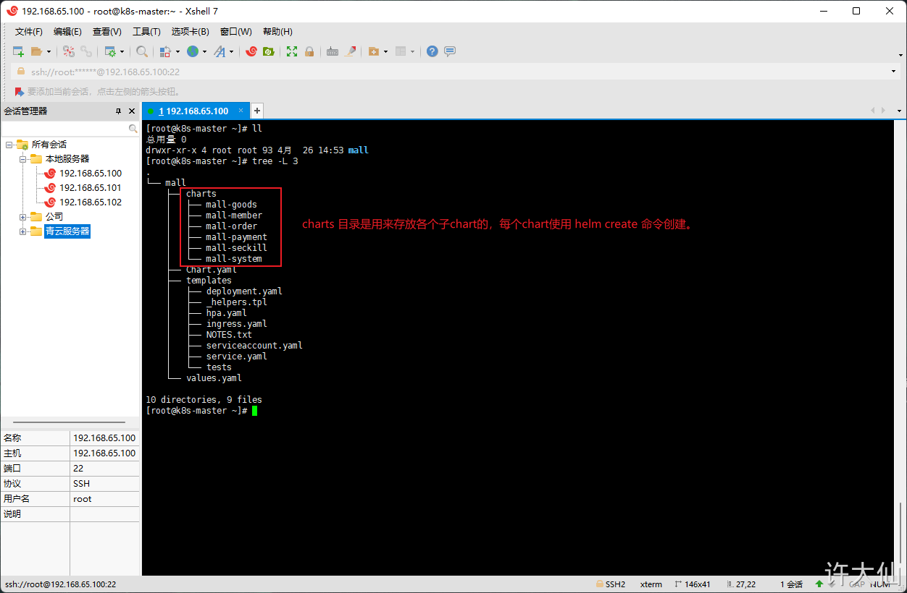

- 创建过程如下所示：


> 需要注意子 chart 的重要细节：
>
> - 子chart被认为是“独立的”，意味着子chart从来不会显示依赖它的父chart。
>
> - 因此，子chart无法访问父chart的值。
>
> - 父chart可以覆盖子chart的值。
>
> - Helm有一个 `全局值` 的概念，所有的chart都可以访问。

### 11 Helm 下

#### 11.1 Harbor

##### 11.1.1安装Harbor前提条件

① Kubernetes版本：v 1.21.10。

② Helm 版本：v 3.6.3 。

③ 动态供应，如：nfs 等，需要设置默认的动态供应。

③ Ingress （本人是在每个 Node 节点上都安装 Ingress 的）。

##### 11.1.2 Harbor 核心组件

- Nginx(Proxy)：用于代理 Harbor 的 registry、UI、token 等服务。

- db：负责储存用户权限、审计日志、Docker image 分组信息等数据。

- UI：提供图形化界面，帮助用户管理 registry 上的镜像, 并对用户进行授权。

- jobsevice：负责镜像复制工作的，他和 registry 通信，从一个 registry pull 镜像，然后 push 到另一个 registry ，并记录 job_log 。

- adminserver：是系统的配置管理中心附带检查存储用量，ui 和 jobsevice 启动时候需要加载 adminserver 的配置。

- Registry：原生的 docker 镜像仓库，负责存储镜像文件。

- Log：为了帮助监控 Harbor 运行，负责收集其他组件的 log，记录到 syslog 中。

##### 11.1.3 安装Harbor

- 生成 TLS 证书：

```shell
openssl req -x509 -nodes -days 3650 -newkey rsa:4096 -keyout tls.key -out tls.crt -subj "/CN=*.xudaxian.com/O=*.xudaxian.com" \
  -extensions san \
  -config <(echo '[req]'; echo 'distinguished_name=req';
            echo '[san]'; echo 'subjectAltName=DNS:*.xudaxian.com,DNS:www.xudaxian.com,DNS:harbor.xudaxian.com')
```

> 注意：
>
> - 生成证书的 xudaxian.com 域名是顶级域名，像 harbor.xudaxian.com 为二级域名。
>
> - 实际开发中，需要自己购买域名，而不是这样手动伪造证书。

- 创建命名空间和 secret ：

```shell
kubectl create ns devops

kubectl create secret tls xudaxian.com --cert=tls.crt --key=tls.key  -n devops
```

- 添加 Harbor 的 chart 仓库：

```shell
helm repo add harbor https://helm.goharbor.io
```

- 更新本地可用 chart 信息：

```
helm repo update
```

- 下载 Harbor ：

```shell
helm pull harbor/harbor --version 1.9.0 --untar
```


- 进入到 harbor 目录：


- 创建 override.yaml 文件：

```yaml
expose:  #web浏览器访问用的证书
  type: ingress
  tls:
    certSource: "secret"
    secret:
      secretName: "xudaxian.com"
      notarySecretName: "xudaxian.com"
  ingress:
    hosts:
      core: harbor.xudaxian.com
      notary: notary-harbor.xudaxian.com
    annotations:
      kubernetes.io/ingress.class: "nginx" # 此处一定要配置
externalURL: https://harbor.xudaxian.com
internalTLS:  #harbor内部组件用的证书
  enabled: true
  certSource: "auto"
persistence:
  enabled: true
  resourcePolicy: "keep"
metrics:
  enabled: true
#开启 chartmuseum，使 Harbor 能够存储 Helm 的 chart
chartmuseum:
  enabled: true
  resources:
    requests:
     memory: 256Mi
     cpu: 500m
```

> 注意：
>
> - ① 这个文件是根据实际需要对 values.yaml 增删改之后形成的。
>
> - ② 我们完全可以使用 `cp values.yaml override.yaml` 命令，复制为新的 override.yaml 文件，然后增删改即可。
>
> - ③ 在新版本的 Harbor 中，Harbor 内部组件使用的是自己默认的证书，而 Ingress 需要用我们生成的证书。

- 安装 Harbor ：

```shell
helm install harbor -f values.yaml -f override.yaml . -n devops
```

  

- 需要等所有的组件都启动完毕

- 查看 ingress ：

```shell
kubectl get ing -n devops
```

  开一台虚拟机（IP 地址是 192.168.65.137 ）作为测试，并在 /etc/hosts 中配置：

```shell
192.168.65.101 harbor.xudaxian.com
```

- 登录到 Harbor ，默认的用户名是 `admin` ，默认的密码是 `Harbor12345` ：


##### 11.1.4 Harbor使用

- Harbor 是以项目为单位的，所以需要新建项目：


- Docker 推送镜像到 Harbor 仓库中

 由于Harbor 使用的是 https 通信，所以需要让 Docker 信任这个 https （即 Docker 不信任自定义的域名（自签证书））：

 将192.168.65.100 上生成的 tls 证书复制到测试的机器上：

```shell
scp tls.crt root@192.168.65.137:/root
```

在测试机器上使得 Docker 受信自定义域名：

```shell
cd /etc/docker/

# certs.d 是固定的名字，harbor.xudaxian.tom 和域名同名的文件夹
mkdir -pv certs.d/harbor.xudaxian.com

# 进入这个目录
cd certs.d/harbor.xudaxian.com

# 将证书文件复制到这个文件夹中
cp ~/tls.crt .

# 重启 Docker
systemctl restart docker
```

> 注意：
>
> - 如果是自己购买的域名，上面的步骤就可以省略了。
>
> - 在 192.168.65.137 机器上的 /etc/hosts 文件增加 `192.168.65.102 harbor.xudaxian.com`，其中 `192.168.65.102` 表示部署了 Ingress 的 Node 机器的 IP 地址。

Docker 登录：

```shell
docker login -u admin harbor.xudaxian.com
```

Docker 推送镜像：

```
docker pull nginx
docker tag nginx harbor.xudaxian.com/mall/nginx:v1.0
docker push harbor.xudaxian.com/mall/nginx:v1.0
```

Harbor 中查看镜像是否推送完毕。

#### 11.2 推送chart

- 阿里云、腾讯云等云厂商都提供了 Chart 仓库的功能，但是这些都是企业版的，需要收费；所以，我采取将 Chart 推送到 Helm 的 [中央仓库](https://artifacthub.io/) 以及使用 Harbor 作为演示。

> 注意：
>
> - 推送到 Helm 的中央仓库需要配合 Github 使用。
>
> - 也可以使用 Harbor 作为 Helm 的仓库。

- 在 GitHub 中新建 mall 的仓库：操作步骤略。

**开源项目将 Chart 推送到 Helm 的中央仓库：**

1、下载 Github 的项目

2、制作 chart :

```shell
# 为什么要创建 docs ，主要是为了做 github Page。
cd mall && mkdir -pv docs && cd docs

helm create mall
```

> 注意：如果是微服务项目，只需要在 docs/mall/charts 目录中继续创建对应的微服务 chart 即可，此处不再展开。

3、  将 chart 打包到 chart/ 目录中

```shell
# 命令
helm package [CHART_PATH] -d charts/ [--version 1.0.0]
# 示例
helm package mall -d charts/
```

>   注意：
> ● CHART_PATH：表示 chart 的路径。 
> ● --version ：指定打包的版本号。 

4、对于每个 Helm 存储库，都必须有 index.yaml 文件，该文件保存当前存储库中的图表信息


> 注意：
>
> - 每次向在仓库中添加一个新的 chart 的时候，都需要重新生成 index 。`helm repo index`命令会完全无痕重建`index.yaml`文件。只包括在本地找到的 chart 。
>
> - 不过，我们可以使用 `-merge` 参数增量添加新的 chart 到现有的 `index.yaml` 文件中。

5、提交代码到 GitHub 中：略。

6、GitHub 设置 Pages ：


7、Helm 中央仓库中增加 Repository ：


8、添加仓库：

```shell
helm repo add xudaxian https://aurorxa.github.io/mall/charts/
```

9、安装应用：

```shell
helm install mall xudaxian/mall
```

10、提交到github中，并重复执行步骤2后的步骤。

> 注意：
>
> - Helm 官方其实推荐是建立一个项目，名为 charts ，所有的 Helm 的 chart 都推送到此项目中，这样方便管理，可以参考 [Bitnami](https://github.com/bitnami) 。
>
> - 如果使用 GitHub ，最好结合 GitHub 的 Action（CI/CD），这样效率更高，我上面的示例为手动版。

**Helm 3.7 及以下客户端版本推送 Chart 到 Harbor**

```shell
# 1、开启 Helm 3 的客户端实验特性：
export HELM_EXPERIMENTAL_OCI=1
# 2、登录到 Harbor：--insecure 192.168.86.5 ：表示不以 https 的方式登录。host：仓库的地址。u：用户名。
helm registry login [--insecure host] -u xxx
helm registry login --insecure http://harbor.xudaxian.com -u admin
# 3、制作 Chart 包：
helm create mall
# 4、给 chart 打包：path：chart 的路径。ref：harbor的域名/项目/chart名称:tag。
helm chart save [path] [ref] [flags]
helm chart save mall/ harbor.xudaxian.com/mall/mall:1.0
# 5、推送 Chart ：ref：harbor的域名/项目/chart名称:tag。
helm chart push [ref] [flags]
helm chart push harbor.xudaxian.com/mall/mall:1.0
```

**Helm 3.8 推送 Chart 到 Harbor**

```shell
# 1、登录
helm registry login [host] [flags]
# 2、将 chart 目录打包成压缩包：
helm package [CHART_PATH] [...] [flags]
# 3、推送
helm push CHART_PACKAGE oci://域名/项目名
```

