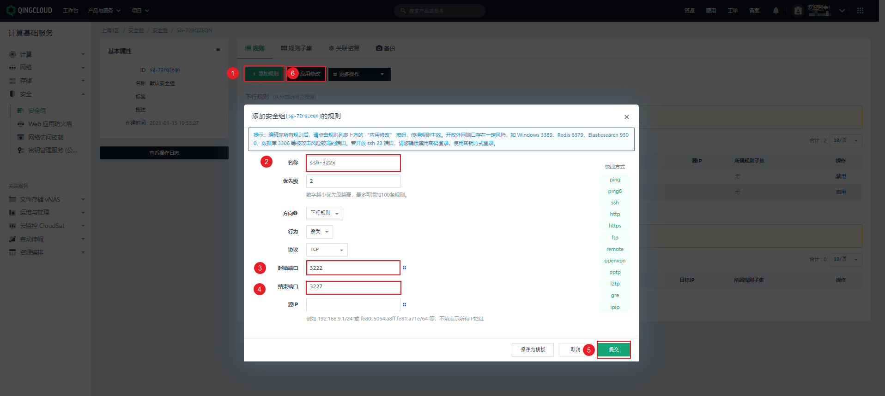
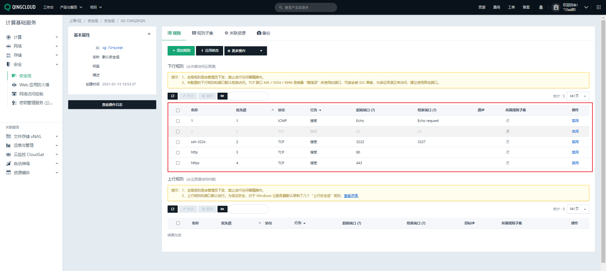

## 第一章 开通服务器

## 1.1 创建VPC网络


## 1.2 开通三台master、三台Node（网络选择VPC私有网络）

|    机器     |      IP      | 配置  |
| :---------: | :----------: | :---: |
| k8s-master1 | 192.168.0.10 | 2核4G |
| k8s-master2 | 192.168.0.11 | 2核4G |
| k8s-master3 | 192.168.0.12 | 2核4G |

|   机器    |      IP      | 配置  |
| :-------: | :----------: | :---: |
| k8s-node1 | 192.168.0.13 | 4核8G |
| k8s-node2 | 192.168.0.14 | 4核8G |
| k8s-node3 | 192.168.0.15 | 4核8G |

## 1.3 设置安全组的组内互信

## 1.4 添加 VPC 的端口转发规则

- 因为只有 VPC 有公网 IP 地址，所以为了能够远程连接 VPC 下的子网的云服务器，我们需要配置端口转发规则。


## 1.5 安全组开放 VPC 转发的端口




- 除此之外，还需要开放 http 的 80 端口以及 https 的 443 端口。



- 但是，因为 VPC 网络和云服务器都是使用的一个安全组，而安全组我有禁止 22 端口，那么一定会出现虽然我配置了 VPC 的端口转发规则，但是远程就是连接不上，怎么办？ 

- - ① 重新创建新的服务器，但是不配置安全组。

- - ② 重新创建新的服务器，选择新的安全组。

- - ③ 将安全组从云服务器上解绑（其实，使用的是默认的安全组）。

# 第二章 集群搭建

## 2.1 准备工作

### 2.1.1 升级内核

默认的 Centos 7.9 的内核是 3.10 ，在大规模集群中不稳定，所以需要升级内核。 

```shell
# 查看内核
uname -sr
# 升级软件包，不升级内核
yum update -y --exclude=kernel*
# 在 CentOS 7.x 上启用 ELRepo 仓库
rpm --import https://www.elrepo.org/RPM-GPG-KEY-elrepo.org
rpm -Uvh https://www.elrepo.org/elrepo-release-7.0-4.el7.elrepo.noarch.rpm
# 安装镜像加速
yum install -y yum-plugin-fastestmirror
# 列出可用的内核相关包：kernel-lt：long term support：长期支持版。kernel-ml： mainline stable： 主线稳定版。
yum --disablerepo="*" --enablerepo="elrepo-kernel" list available
# 安装内核
yum -y --enablerepo=elrepo-kernel install kernel-ml
uname -sr
# 查看内核的位置
awk -F\' '$1=="menuentry " {print $2}' /etc/grub2.cfg
####
CentOS Linux 7 Rescue 6e7213ddfcb53de7a920d7c702595fc8 (5.17.1-1.el7.elrepo.x86_64) # 第0个
CentOS Linux (5.17.1-1.el7.elrepo.x86_64) 7 (Core)# 我们自己安装的在第1个
CentOS Linux (3.10.0-1160.el7.x86_64) 7 (Core)
CentOS Linux (0-rescue-cc2c86fe566741e6a2ff6d399c5d5daa) 7 (Core)
####
# 重新创建内核配置
grub2-mkconfig -o /boot/grub2/grub.cfg
# 查看内核的位置
awk -F\' '$1=="menuentry " {print $2}' /etc/grub2.cfg
####
CentOS Linux (5.17.1-1.el7.elrepo.x86_64) 7 (Core)
CentOS Linux (3.10.0-1160.el7.x86_64) 7 (Core)
CentOS Linux (0-rescue-57dd577c800933a5a43274612b265d43) 7 (Core)
CentOS Linux (0-rescue-cc2c86fe566741e6a2ff6d399c5d5daa) 7 (Core)
####
# 修改使用默认内核
vi /etc/default/grub
####
GRUB_TIMEOUT=5
GRUB_DISTRIBUTOR="$(sed 's, release .*$,,g' /etc/system-release)"
GRUB_DEFAULT=0 # 修改此处，原来是 saved
GRUB_DISABLE_SUBMENU=true
GRUB_TERMINAL_OUTPUT="console"
GRUB_CMDLINE_LINUX="crashkernel=auto rd.lvm.lv=centos/root rd.lvm.lv=centos/swap rhgb quiet"
GRUB_DISABLE_RECOVERY="true"
####
# 重新整理下内核
grub2-mkconfig -o /boot/grub2/grub.cfg
# 重启系统
reboot
```

### 2.1.2 设置主机名

```shell
hostnamectl set-hostname <hostname>
```

### 2.1.3 主机名解析

- 为了方便后面集群节点间的直接调用，需要配置一下主机名解析，企业中推荐使用内部的 DNS 服务器。

```shell
cat >> /etc/hosts << EOF
192.168.0.10 k8s-master1
192.168.0.11 k8s-master2
192.168.0.12 k8s-master3
192.168.0.13 k8s-node1
192.168.0.14 k8s-node2
192.168.0.15 k8s-node3
192.168.0.250 k8s-master-lb # master 负载均衡器的 ip，这个使用 keepalive 配置
EOF
```

### 2.1.4 时间同步（可以不做）

> 因为云服务器默认就是时间同步的，所以可以不做此步骤。

- Kubernetes 要求集群中的节点时间必须精确一致，所以在每个节点上添加时间同步：

```shell
yum install ntpdate -y
ntpdate time.windows.com
```

### 2.1.5 关闭selinux

```shell
# 查看 SELinux 是否开启
getenforce
# 永久关闭 SELinux ，需要重启：
sed -i 's#SELINUX=enforcing#SELINUX=disabled#g' /etc/sysconfig/selinux
sed -i 's#SELINUX=enforcing#SELINUX=disabled#g' /etc/selinux/config
# 关闭当前会话的 SELinux ，重启之后无效：
setenforce 0
```

### 2.1.6 关闭swap分区

```shell
# 关闭当前会话的 swap 
swapoff -a && sysctl -w vm.swappiness=0
# 永久关闭 swap ，需要重启
sed -ri 's/.*swap.*/#&/' /etc/fstab
```

### 2.1.7 修改limit

```shell
ulimit -SHn 65535

vi /etc/security/limits.conf
# 末尾添加如下内容
* soft nofile 655360
* hard nofile 131072
* soft nproc 655350
* hard nproc 655350
* soft memlock unlimited
* hard memlock unlimited
```

### 2.1.8 配置ssh免密连接

```shell
ssh-keygen -t rsa

for i in k8s-master1 k8s-master2 k8s-master3 k8s-node1 k8s-node2 k8s-node3;do ssh-copy-id -i .ssh/id_rsa.pub $i;done
```

### 2.1.9 安装一些工具

```shell
yum -y install wget git jq psmisc net-tools yum-utils device-mapper-persistent-data lvm2
```

### 2.1.10 安装ipvs

- 在 Kubernetes 中 service 有两种代理模型，一种是基于 iptables ，另一种是基于 ipvs 的。ipvs 的性能要高于 iptables 的，但是如果要使用它，需要手动载入 ipvs 模块。 

-  命令： 

```shell
# 安装ipvs工具,方便以后操作ipvs，ipset，conntrack等
yum install ipvsadm ipset sysstat conntrack libseccomp -y
```

```shell
# 所有节点配置ipvs模块,执行以下命令，在内核4.19+版本改为nf_conntrack， 4.18下改为nf_conntrack_ipv4
modprobe -- ip_vs
modprobe -- ip_vs_rr
modprobe -- ip_vs_wrr
modprobe -- ip_vs_sh
modprobe -- nf_conntrack
```

```shell
# 修改ipvs配置，加入以下内容
cat >> /etc/modules-load.d/ipvs.conf << EOF
ip_vs
ip_vs_lc
ip_vs_wlc
ip_vs_rr
ip_vs_wrr
ip_vs_lblc
ip_vs_lblcr
ip_vs_dh
ip_vs_sh
ip_vs_fo
ip_vs_nq
ip_vs_sed
ip_vs_ftp
ip_vs_sh
nf_conntrack
ip_tables
ip_set
xt_set
ipt_set
ipt_rpfilter
ipt_REJECT
ipip
EOF
```

```shell
# 执行命令
systemctl enable --now systemd-modules-load.service  #--now = enable+start
```

```shell
#检测是否加载
lsmod | grep -e ip_vs -e nf_conntrack
```

### 2.1.11 将桥接的 IPv4 流量传递到 iptables 的链

命令：

```shell
## 所有节点
cat <<EOF > /etc/sysctl.d/k8s.conf
net.ipv4.ip_forward = 1
net.bridge.bridge-nf-call-iptables = 1
net.bridge.bridge-nf-call-ip6tables = 1
fs.may_detach_mounts = 1
vm.overcommit_memory=1
net.ipv4.conf.all.route_localnet = 1

vm.panic_on_oom=0
fs.inotify.max_user_watches=89100
fs.file-max=52706963
fs.nr_open=52706963
net.netfilter.nf_conntrack_max=2310720

net.ipv4.tcp_keepalive_time = 600
net.ipv4.tcp_keepalive_probes = 3
net.ipv4.tcp_keepalive_intvl =15
net.ipv4.tcp_max_tw_buckets = 36000
net.ipv4.tcp_tw_reuse = 1
net.ipv4.tcp_max_orphans = 327680
net.ipv4.tcp_orphan_retries = 3
net.ipv4.tcp_syncookies = 1
net.ipv4.tcp_max_syn_backlog = 16768
net.ipv4.ip_conntrack_max = 65536
net.ipv4.tcp_timestamps = 0
net.core.somaxconn = 16768
EOF
```

```shell
sysctl --system
```

### 2.1.12 重启机器

```
reboot
```

## 2.2 安装Docker

```shell
# 卸载旧版本
sudo yum remove docker \
                  docker-client \
                  docker-client-latest \
                  docker-common \
                  docker-latest \
                  docker-latest-logrotate \
                  docker-logrotate \
                  docker-engine
```

```shell
# yum 安装 gcc 相关
yum -y install gcc
yum -y install gcc-c++
# 安装所需要的软件包
yum -y install yum-utils
# 设置 stable 镜像仓库
yum-config-manager --add-repo https://mirrors.aliyun.com/docker-ce/linux/centos/docker-ce.repo
# 更新 yum 软件包索引
yum makecache fast
# 安装指定版本的 Docker（v20.10）
yum -y install docker-ce-3:20.10.8-3.el7.x86_64 docker-ce-cli-3:20.10.8-3.el7.x86_64 containerd.io
# 启动 Docker
systemctl start docker
# 开启自动启动
systemctl enable docker
# 阿里云镜像加速
sudo mkdir -p /etc/docker
sudo tee /etc/docker/daemon.json <<-'EOF'
{
  "exec-opts": ["native.cgroupdriver=systemd"],	
  "registry-mirrors": [
    "https://du3ia00u.mirror.aliyuncs.com",
    "https://hub-mirror.c.163.com",
    "https://mirror.baidubce.com"
  ],
  "live-restore": true,
  "log-driver":"json-file",
  "log-opts": {"max-size":"500m", "max-file":"3"},
  "max-concurrent-downloads": 10,
  "max-concurrent-uploads": 5,
  "storage-driver": "overlay2"
}
EOF
sudo systemctl daemon-reload
sudo systemctl restart docker
```

## 2.3 etcd高可用搭建

### 2.3.1 下载和解压 etcd

- 给所有 master 节点，发送 etcd 包，以便部署 etcd 高可用：

- 下载 etcd （k8s-master1）:

```shell
wget https://github.com/etcd-io/etcd/releases/download/v3.4.16/etcd-v3.4.16-linux-amd64.tar.gz
```

- 将 etcd 包复制到其他节点（k8s-master1）：

```shell
for i in k8s-master1 k8s-master2 k8s-master3;do scp etcd-* root@$i:/root/;done
```

- 解压 etcd 包到 `/usr/local/bin`（所有 master 节点）：

```shell
tar -zxvf etcd-v3.4.16-linux-amd64.tar.gz --strip-components=1 -C /usr/local/bin etcd-v3.4.16-linux-amd64/etcd{,ctl}
```

- 验证：

```
etcdctl
```

### 2.3.2 etcd 证书

- 创建目录（k8s-master1）：

```shell
mkdir -pv /etc/kubernetes/pki/etcd
```

- 创建 etcd 根配置（k8s-master1）：

```shell
sudo tee /etc/kubernetes/pki/etcd-ca-csr.json <<-'EOF'
{
  "CN": "etcd",
  "key": {
    "algo": "rsa",
    "size": 2048
  },
  "names": [
    {
      "C": "CN",
      "ST": "Beijing",
      "L": "Beijing",
      "O": "etcd",
      "OU": "etcd"
    }
  ],
  "ca": {
    "expiry": "87600h"
  }
}
EOF
```

-  生成 etcd 根 ca 证书（k8s-master1）：

```shell
cfssl gencert -initca \
/etc/kubernetes/pki/etcd-ca-csr.json | cfssljson -bare /etc/kubernetes/pki/etcd/ca -
```

- 创建 etcd-cluster 配置（k8s-master1）:

```shell
sudo tee /etc/kubernetes/pki/etcd-cluster-csr.json <<-'EOF'
{
    "CN": "etcd-cluster",
    "key": {
        "algo": "rsa",
        "size": 2048
    },
    "hosts": [  
        "127.0.0.1",
        "k8s-master1",
        "k8s-master2",
        "k8s-master3",
        "192.168.0.10",
        "192.168.0.11",
        "192.168.0.12"
    ],
    "names": [
        {
            "C": "CN",
            "L": "beijing",
            "O": "etcd",
            "ST": "beijing",
            "OU": "System"
        }
    ]
}
EOF
```

> 注意：hosts 中配置的是 etcd 所在机器的主机名和 IP 地址，表示只能在这些机器受信。

- 创建 ca-config.json 文件（k8s-master1）：

```shell
sudo tee /etc/kubernetes/pki/ca-config.json <<-'EOF'
{
    "signing": {
        "default": {
            "expiry": "87600h"
        },
        "profiles": {
            "server": {
                "expiry": "87600h",
                "usages": [
                    "signing",
                    "key encipherment",
                    "server auth"
                ]
            },
            "client": {
                "expiry": "87600h",
                "usages": [
                    "signing",
                    "key encipherment",
                    "client auth"
                ]
            },
            "peer": {
                "expiry": "87600h",
                "usages": [
                    "signing",
                    "key encipherment",
                    "server auth",
                    "client auth"
                ]
            },
            "kubernetes": {
                "expiry": "87600h",
                "usages": [
                    "signing",
                    "key encipherment",
                    "server auth",
                    "client auth"
                ]
            },
            "etcd": {
                "expiry": "87600h",
                "usages": [
                    "signing",
                    "key encipherment",
                    "server auth",
                    "client auth"
                ]
            }
        }
    }
}
EOF
```

- 签发 cluster 的 etcd 证书（k8s-master1）：

```shell
cfssl gencert \
   -ca=/etc/kubernetes/pki/etcd/ca.pem \
   -ca-key=/etc/kubernetes/pki/etcd/ca-key.pem \
   -config=/etc/kubernetes/pki/ca-config.json \
   -profile=etcd \
   /etc/kubernetes/pki/etcd-cluster-csr.json | cfssljson -bare /etc/kubernetes/pki/etcd/etcd
```

- 给 k8s-master2 和 k8s-master3 创建目录：

```shell
mkdir -pv /etc/kubernetes/pki
```

- 将生成的 etcd 证书复制到其他 master 机器（k8s-master1）：

```shell
for i in k8s-master2 k8s-master3;do scp -r /etc/kubernetes/pki/etcd root@$i:/etc/kubernetes/pki;done
```

### 2.3.3 etcd 高可用安装

- 为了保证启动配置一致性，我们编写 etcd 配置文件，并将 etcd 做成 service 启动。 

-  三台 master 机器创建 `/etc/etcd` 目录： 

```shell
mkdir -pv /etc/etcd
```

- k8s-master1 的 etcd 配置文件：

```shell
sudo tee /etc/etcd/etcd.yaml <<-'EOF'
name: 'etcd-master1'  #每个机器可以写自己的域名,不能重复
data-dir: /var/lib/etcd
wal-dir: /var/lib/etcd/wal
snapshot-count: 5000
heartbeat-interval: 100
election-timeout: 1000
quota-backend-bytes: 0
listen-peer-urls: 'https://192.168.0.10:2380'  # 本机ip+2380端口，代表和集群通信
listen-client-urls: 'https://192.168.0.10:2379,http://127.0.0.1:2379' #改为自己的
max-snapshots: 3
max-wals: 5
cors:
initial-advertise-peer-urls: 'https://192.168.0.10:2380' #自己的ip
advertise-client-urls: 'https://192.168.0.10:2379'  #自己的ip
discovery:
discovery-fallback: 'proxy'
discovery-proxy:
discovery-srv:
initial-cluster: 'etcd-master1=https://192.168.0.10:2380,etcd-master2=https://192.168.0.11:2380,etcd-master3=https://192.168.0.12:2380' #这里不一样
initial-cluster-token: 'etcd-k8s-cluster'
initial-cluster-state: 'new'
strict-reconfig-check: false
enable-v2: true
enable-pprof: true
proxy: 'off'
proxy-failure-wait: 5000
proxy-refresh-interval: 30000
proxy-dial-timeout: 1000
proxy-write-timeout: 5000
proxy-read-timeout: 0
client-transport-security:
  cert-file: '/etc/kubernetes/pki/etcd/etcd.pem'
  key-file: '/etc/kubernetes/pki/etcd/etcd-key.pem'
  client-cert-auth: true
  trusted-ca-file: '/etc/kubernetes/pki/etcd/ca.pem'
  auto-tls: true
peer-transport-security:
  cert-file: '/etc/kubernetes/pki/etcd/etcd.pem'
  key-file: '/etc/kubernetes/pki/etcd/etcd-key.pem'
  peer-client-cert-auth: true
  trusted-ca-file: '/etc/kubernetes/pki/etcd/ca.pem'
  auto-tls: true
debug: false
log-package-levels:
log-outputs: [default]
force-new-cluster: false
EOF
```

- k8s-master2 的 etcd 配置文件：

```shell
sudo tee /etc/etcd/etcd.yaml <<-'EOF'
name: 'etcd-master2'  #每个机器可以写自己的域名,不能重复
data-dir: /var/lib/etcd
wal-dir: /var/lib/etcd/wal
snapshot-count: 5000
heartbeat-interval: 100
election-timeout: 1000
quota-backend-bytes: 0
listen-peer-urls: 'https://192.168.0.11:2380'  # 本机ip+2380端口，代表和集群通信
listen-client-urls: 'https://192.168.0.11:2379,http://127.0.0.1:2379' #改为自己的
max-snapshots: 3
max-wals: 5
cors:
initial-advertise-peer-urls: 'https://192.168.0.11:2380' #自己的ip
advertise-client-urls: 'https://192.168.0.11:2379'  #自己的ip
discovery:
discovery-fallback: 'proxy'
discovery-proxy:
discovery-srv:
initial-cluster: 'etcd-master1=https://192.168.0.10:2380,etcd-master2=https://192.168.0.11:2380,etcd-master3=https://192.168.0.12:2380' #这里不一样
initial-cluster-token: 'etcd-k8s-cluster'
initial-cluster-state: 'new'
strict-reconfig-check: false
enable-v2: true
enable-pprof: true
proxy: 'off'
proxy-failure-wait: 5000
proxy-refresh-interval: 30000
proxy-dial-timeout: 1000
proxy-write-timeout: 5000
proxy-read-timeout: 0
client-transport-security:
  cert-file: '/etc/kubernetes/pki/etcd/etcd.pem'
  key-file: '/etc/kubernetes/pki/etcd/etcd-key.pem'
  client-cert-auth: true
  trusted-ca-file: '/etc/kubernetes/pki/etcd/ca.pem'
  auto-tls: true
peer-transport-security:
  cert-file: '/etc/kubernetes/pki/etcd/etcd.pem'
  key-file: '/etc/kubernetes/pki/etcd/etcd-key.pem'
  peer-client-cert-auth: true
  trusted-ca-file: '/etc/kubernetes/pki/etcd/ca.pem'
  auto-tls: true
debug: false
log-package-levels:
log-outputs: [default]
force-new-cluster: false
EOF
```

- k8s-master3 的 etcd 配置文件：

```shell
sudo tee /etc/etcd/etcd.yaml <<-'EOF'
name: 'etcd-master3'  #每个机器可以写自己的域名,不能重复
data-dir: /var/lib/etcd
wal-dir: /var/lib/etcd/wal
snapshot-count: 5000
heartbeat-interval: 100
election-timeout: 1000
quota-backend-bytes: 0
listen-peer-urls: 'https://192.168.0.12:2380'  # 本机ip+2380端口，代表和集群通信
listen-client-urls: 'https://192.168.0.12:2379,http://127.0.0.1:2379' #改为自己的
max-snapshots: 3
max-wals: 5
cors:
initial-advertise-peer-urls: 'https://192.168.0.12:2380' #自己的ip
advertise-client-urls: 'https://192.168.0.12:2379'  #自己的ip
discovery:
discovery-fallback: 'proxy'
discovery-proxy:
discovery-srv:
initial-cluster: 'etcd-master1=https://192.168.0.10:2380,etcd-master2=https://192.168.0.11:2380,etcd-master3=https://192.168.0.12:2380' #这里不一样
initial-cluster-token: 'etcd-k8s-cluster'
initial-cluster-state: 'new'
strict-reconfig-check: false
enable-v2: true
enable-pprof: true
proxy: 'off'
proxy-failure-wait: 5000
proxy-refresh-interval: 30000
proxy-dial-timeout: 1000
proxy-write-timeout: 5000
proxy-read-timeout: 0
client-transport-security:
  cert-file: '/etc/kubernetes/pki/etcd/etcd.pem'
  key-file: '/etc/kubernetes/pki/etcd/etcd-key.pem'
  client-cert-auth: true
  trusted-ca-file: '/etc/kubernetes/pki/etcd/ca.pem'
  auto-tls: true
peer-transport-security:
  cert-file: '/etc/kubernetes/pki/etcd/etcd.pem'
  key-file: '/etc/kubernetes/pki/etcd/etcd-key.pem'
  peer-client-cert-auth: true
  trusted-ca-file: '/etc/kubernetes/pki/etcd/ca.pem'
  auto-tls: true
debug: false
log-package-levels:
log-outputs: [default]
force-new-cluster: false
EOF
```

- 三台机器的 etcd 做成 Service ，开机启动：

```shell
# 以下命令在三台master上执行
sudo tee /usr/lib/systemd/system/etcd.service <<-'EOF'
[Unit]
Description=Etcd Service
Documentation=https://etcd.io/docs/v3.4/op-guide/clustering/
After=network.target

[Service]
Type=notify
ExecStart=/usr/local/bin/etcd --config-file=/etc/etcd/etcd.yaml
Restart=on-failure
RestartSec=10
LimitNOFILE=65536

[Install]
WantedBy=multi-user.target
Alias=etcd3.service
EOF
```

- 加载并开机启动：

```
systemctl daemon-reload
systemctl enable --now etcd
systemctl status etcd
```

### 2.3.4 测试 etcd 是否可用

- 命令行方式测试：

```shell
# 查看 etcd 集群状态
etcdctl --endpoints="192.168.0.10:2379,192.168.0.11:2379,192.168.0.12:2379" --cacert=/etc/kubernetes/pki/etcd/ca.pem --cert=/etc/kubernetes/pki/etcd/etcd.pem --key=/etc/kubernetes/pki/etcd/etcd-key.pem  endpoint status --write-out=table
```

- 导出环境变量的方式测试：

```shell
export ETCDCTL_API=3
HOST_1=192.168.0.10
HOST_2=192.168.0.11
HOST_3=192.168.0.12
ENDPOINTS=$HOST_1:2379,$HOST_2:2379,$HOST_3:2379

export ETCDCTL_DIAL_TIMEOUT=3s
export ETCDCTL_CACERT=/etc/kubernetes/pki/etcd/ca.pem
export ETCDCTL_CERT=/etc/kubernetes/pki/etcd/etcd.pem
export ETCDCTL_KEY=/etc/kubernetes/pki/etcd/etcd-key.pem
export ETCDCTL_ENDPOINTS=$HOST_1:2379,$HOST_2:2379,$HOST_3:2379

etcdctl  member list --write-out=table
```

## 2.4 Kubernetes 组件和证书

### 2.4.1 Kubernetes 离线安装包

- [官网](https://github.com/kubernetes/kubernetes/tree/master/CHANGELOG)


- 下载 Kubernetes 离线安装包（k8s-master1）：

```shell
wget https://dl.k8s.io/v1.21.1/kubernetes-server-linux-amd64.tar.gz
```

- 将 Kubernetes 离线安装包发送到所有节点（k8s-master1）：

```shell
for i in k8s-master1 k8s-master2 k8s-master3  k8s-node1 k8s-node2 k8s-node3;do scp kubernetes-server-* root@$i:/root/;done
```

- master 节点（k8s-master1、k8s-master2、k8s-master3）解压 kubelet，kubectl 等到 `/usr/local/bin`：

```
tar -xvf kubernetes-server-linux-amd64.tar.gz  --strip-components=3 -C /usr/local/bin kubernetes/server/bin/kube{let,ctl,-apiserver,-controller-manager,-scheduler,-proxy}
```

- node 节点（k8s-node1、k8s-node2、k8s-node3）解压 kubelet，kube-proxy 等到 `/usr/local/bin`：

```shell
tar -xvf kubernetes-server-linux-amd64.tar.gz  --strip-components=3 -C /usr/local/bin kubernetes/server/bin/kube{let,-proxy}
```

### 2.4.2 api-server 证书生成

- 新建 apiserver-csr.json  文件（k8s-master1）：

```shell
sudo tee /etc/kubernetes/pki/apiserver-csr.json <<-'EOF'
{
    "CN": "kube-apiserver",
    "hosts": [
      "10.96.0.1",
      "127.0.0.1",
      "192.168.0.250",
      "192.168.0.10",
      "192.168.0.11",
      "192.168.0.12",
      "192.168.0.13",
      "192.168.0.14",
      "192.168.0.15",
      "192.168.0.16",
      "kubernetes",
      "kubernetes.default",
      "kubernetes.default.svc",
      "kubernetes.default.svc.cluster",
      "kubernetes.default.svc.cluster.local"
    ],
    "key": {
        "algo": "rsa",
        "size": 2048
    },
    "names": [
        {
            "C": "CN",
            "L": "BeiJing",
            "ST": "BeiJing",
            "O": "Kubernetes",
            "OU": "Kubernetes"
        }
    ]
}
EOF
```

> hosts 中配置的是各个节点的 ip 地址（192.168.0.250 是负载均衡器的地址，负载均衡器可以自己创建，也可以使用云厂商提供的 LB），以及 Service 的地址，其中 10.96.0.x 为 Service 的网段，当然，你也可以自定义。

- 生成 Kubernetes 的 CA 机构（k8s-master1）

```shell
sudo tee /etc/kubernetes/pki/ca-csr.json <<-'EOF'
{
  "CN": "kubernetes",
  "key": {
    "algo": "rsa",
    "size": 2048
  },
  "names": [
    {
      "C": "CN",
      "ST": "Beijing",
      "L": "Beijing",
      "O": "Kubernetes",
      "OU": "Kubernetes"
    }
  ],
  "ca": {
    "expiry": "87600h"
  }
}
EOF
```

```shell
cfssl gencert -initca /etc/kubernetes/pki/ca-csr.json | cfssljson -bare /etc/kubernetes/pki/ca -
```

- 生成 api-server 证书：

```shell
cfssl gencert   \
-ca=/etc/kubernetes/pki/ca.pem \
-ca-key=/etc/kubernetes/pki/ca-key.pem \
-config=/etc/kubernetes/pki/ca-config.json \
-profile=kubernetes \
/etc/kubernetes/pki/apiserver-csr.json | cfssljson -bare /etc/kubernetes/pki/apiserver
```

### 2.4.3 front-proxy 证书生成

- front-proxy 是 api-server 的聚合层，后来支持 CRD。

> 注意：
>
> - front-proxy 不建议用新的 CA 机构签发证书，可能导致通过他代理的组件如 metrics-server 权限不可用。
> - 如果用新的，api-server 配置添加 --requestheader-allowed-names=front-proxy-client。

- 新建 front-proxy-ca-csr.json 文件（k8s-master1）：

```shell
sudo tee /etc/kubernetes/pki/front-proxy-ca-csr.json <<-'EOF'
{
  "CN": "kubernetes",
  "key": {
     "algo": "rsa",
     "size": 2048
  }
}
EOF
```

- 生成 front-proxy 的 CA 机构（k8s-master1）：

```shell
cfssl gencert  -initca /etc/kubernetes/pki/front-proxy-ca-csr.json | cfssljson -bare /etc/kubernetes/pki/front-proxy-ca
```

- 新建 front-proxy-client-csr.json 文件（k8s-master1）：

```shell
sudo tee /etc/kubernetes/pki/front-proxy-client-csr.json <<-'EOF'
{
  "CN": "front-proxy-client",
  "key": {
     "algo": "rsa",
     "size": 2048
  }
}
EOF
```

- 生成 front-proxy 证书（k8s-master1）：

```shell
cfssl gencert \
-ca=/etc/kubernetes/pki/front-proxy-ca.pem \
-ca-key=/etc/kubernetes/pki/front-proxy-ca-key.pem \
-config=/etc/kubernetes/pki/ca-config.json \
-profile=kubernetes \
/etc/kubernetes/pki/front-proxy-client-csr.json | cfssljson -bare /etc/kubernetes/pki/front-proxy-client
```

### 2.4.4 controller-manager 证书生成和配置

- 新建 controller-manager-csr.json 文件（k8s-master1）：

```shell
sudo tee /etc/kubernetes/pki/controller-manager-csr.json <<-'EOF'
{
  "CN": "system:kube-controller-manager",
  "key": {
    "algo": "rsa",
    "size": 2048
  },
  "names": [
    {
      "C": "CN",
      "ST": "Beijing",
      "L": "Beijing",
      "O": "system:kube-controller-manager",
      "OU": "Kubernetes"
    }
  ]
}
EOF
```

- 生成证书（k8s-master1）：

```shell
cfssl gencert \
   -ca=/etc/kubernetes/pki/ca.pem \
   -ca-key=/etc/kubernetes/pki/ca-key.pem \
   -config=/etc/kubernetes/pki/ca-config.json \
   -profile=kubernetes \
  /etc/kubernetes/pki/controller-manager-csr.json | cfssljson -bare /etc/kubernetes/pki/controller-manager
```

- 生成配置（k8s-master1）：

```shell
# set-cluster：设置一个集群项，
kubectl config set-cluster kubernetes \
     --certificate-authority=/etc/kubernetes/pki/ca.pem \
     --embed-certs=true \
     --server=https://192.168.0.250:6443 \
     --kubeconfig=/etc/kubernetes/controller-manager.conf
```

> 注意，如果不是高可用集群，192.168.0.250:6443 改为 master01 的地址，6443 为 apiserver 的默认端口。

```shell
# 设置一个环境项，一个上下文
kubectl config set-context system:kube-controller-manager@kubernetes \
    --cluster=kubernetes \
    --user=system:kube-controller-manager \
    --kubeconfig=/etc/kubernetes/controller-manager.conf
```

```shell
# set-credentials 设置一个用户项
kubectl config set-credentials system:kube-controller-manager \
     --client-certificate=/etc/kubernetes/pki/controller-manager.pem \
     --client-key=/etc/kubernetes/pki/controller-manager-key.pem \
     --embed-certs=true \
     --kubeconfig=/etc/kubernetes/controller-manager.conf
```

```shell
# 使用某个环境当做默认环境
kubectl config use-context system:kube-controller-manager@kubernetes \
     --kubeconfig=/etc/kubernetes/controller-manager.conf
```

### 2.4.5 scheduler 证书生成与配置

- 新建 scheduler-csr.json 文件（k8s-master1）：

```shell
sudo tee /etc/kubernetes/pki/scheduler-csr.json <<-'EOF'
{
  "CN": "system:kube-scheduler",
  "key": {
    "algo": "rsa",
    "size": 2048
  },
  "names": [
    {
      "C": "CN",
      "ST": "Beijing",
      "L": "Beijing",
      "O": "system:kube-scheduler",
      "OU": "Kubernetes"
    }
  ]
}
EOF
```

- 生成证书（k8s-master1）：

```shell
cfssl gencert \
   -ca=/etc/kubernetes/pki/ca.pem \
   -ca-key=/etc/kubernetes/pki/ca-key.pem \
   -config=/etc/kubernetes/pki/ca-config.json \
   -profile=kubernetes \
   /etc/kubernetes/pki/scheduler-csr.json | cfssljson -bare /etc/kubernetes/pki/scheduler
```

- 生成配置（k8s-master1）：

```shell
kubectl config set-cluster kubernetes \
     --certificate-authority=/etc/kubernetes/pki/ca.pem \
     --embed-certs=true \
     --server=https://192.168.0.250:6443 \
     --kubeconfig=/etc/kubernetes/scheduler.conf
```

> 注意，如果不是高可用集群，192.168.0.250:6443 改为 master01 的地址，6443 是 api-server 默认端口。

```shell
kubectl config set-credentials system:kube-scheduler \
     --client-certificate=/etc/kubernetes/pki/scheduler.pem \
     --client-key=/etc/kubernetes/pki/scheduler-key.pem \
     --embed-certs=true \
     --kubeconfig=/etc/kubernetes/scheduler.conf
```

```shell
kubectl config set-context system:kube-scheduler@kubernetes \
     --cluster=kubernetes \
     --user=system:kube-scheduler \
     --kubeconfig=/etc/kubernetes/scheduler.conf
```

```shell
kubectl config use-context system:kube-scheduler@kubernetes \
     --kubeconfig=/etc/kubernetes/scheduler.conf
```

### 2.4.6 admin 证书生成与配置

- 新建 admin-csr.json 文件（k8s-master1）：

```shell
sudo tee /etc/kubernetes/pki/admin-csr.json <<-'EOF'
{
  "CN": "admin",
  "key": {
    "algo": "rsa",
    "size": 2048
  },
  "names": [
    {
      "C": "CN",
      "ST": "Beijing",
      "L": "Beijing",
      "O": "system:masters",
      "OU": "Kubernetes"
    }
  ]
}
EOF
```

- 生成证书（k8s-master1）：

```shell
cfssl gencert \
   -ca=/etc/kubernetes/pki/ca.pem \
   -ca-key=/etc/kubernetes/pki/ca-key.pem \
   -config=/etc/kubernetes/pki/ca-config.json \
   -profile=kubernetes \
   /etc/kubernetes/pki/admin-csr.json | cfssljson -bare /etc/kubernetes/pki/admin
```

- 生成配置（k8s-master1）：

```
kubectl config set-cluster kubernetes \
--certificate-authority=/etc/kubernetes/pki/ca.pem \
--embed-certs=true \
--server=https://192.168.0.250:6443 \
--kubeconfig=/etc/kubernetes/admin.conf
```

> 注意，如果不是高可用集群，192.168.0.250:6443 改为 master01 的地址，6443 为 apiserver 的默认端口。

```shell
kubectl config set-credentials kubernetes-admin \
--client-certificate=/etc/kubernetes/pki/admin.pem \
--client-key=/etc/kubernetes/pki/admin-key.pem \
--embed-certs=true \
--kubeconfig=/etc/kubernetes/admin.conf
```

```shell
kubectl config set-context kubernetes-admin@kubernetes \
--cluster=kubernetes \
--user=kubernetes-admin \
--kubeconfig=/etc/kubernetes/admin.conf
```

```shell
kubectl config use-context kubernetes-admin@kubernetes \
--kubeconfig=/etc/kubernetes/admin.conf
```

> 注意：kubelet 将使用 bootstrap 引导机制，自动颁发证书，所以我们不需要配置。否则，一万台机器，一万个 kubelet ，就需要配置一万次证书，太麻烦了。

### 2.4.7 ServiceAccount Key 生成

- Kubernetes 底层，每创建一个 ServiceAccount ，都会分配一个 Secret，而 Secret 里面有秘钥，秘钥就是由我们接下来的 sa 生成的，所以我们提前创建出 sa 信息：

- 命令（k8s-master1）：

```shell
openssl genrsa -out /etc/kubernetes/pki/sa.key 2048
```

```shell
openssl rsa -in /etc/kubernetes/pki/sa.key -pubout -out /etc/kubernetes/pki/sa.pub
```

### 2.4.8 发送证书到其他节点

- 命令（k8s-master1）：

```shell
for NODE in k8s-master2 k8s-master3
do
	for FILE in admin.conf controller-manager.conf scheduler.conf
	do
	scp /etc/kubernetes/${FILE} $NODE:/etc/kubernetes/${FILE}
	done
done
```

## 2.5 高可用配置

- 高可用配置有很多可选方案： 

- - ① nginx。

- - ② haproxy。

- - ③ keepalived。

- - ④ 云厂商提供的负载均衡产品。

-  如果不是在创建高可用集群，则无需配置 haproxy 和 keepalived 。 

-  云上安装注意事项： 

- - 云上安装可以直接使用云上的 lb ，如：阿里云 slb ，腾讯云 elb 等。

- - 公有云要用公有云自带的负载均衡，比如阿里云的 SLB，腾讯云的 ELB，用来替代 haproxy 和 keepalived ，因为公有云大部分都是不支持 keepalived 的。

- - 阿里云的话，kubectl 控制端不能放在 master 节点，推荐使用腾讯云，因为阿里云的 slb 有回环的问题，也就是 slb 代理的服务器不能反向访问 SLB ，但是腾讯云修复了这个问题。

创建负载均衡器，指定 IP 地址为我们之前预留的地址 `192.168.0.250` 。


进入负载均衡器，创建监听器，选择TCP的6443端口。


添加后端服务器地址和端口。


## 2.6 组件启动

### 2.6.1 创建目录

- 创建目录（k8s-master1、k8s-master2、k8s-master3）：

```shell
mkdir -pv /etc/kubernetes/manifests/ /etc/systemd/system/kubelet.service.d /var/lib/kubelet /var/log/kubernetes
```

### 2.6.2 将证书复制到其他 Master 节点

- 命令（k8s-master1）：

```shell
for NODE in k8s-master2 k8s-master3
do
	scp -r /etc/kubernetes/* root@$NODE:/etc/kubernetes/
done
```

### 2.6.3 配置 api-server 服务

- k8s-master1 节点创建 kube-apiserver.service ，命令如下：

```shell
# --advertise-address： 需要改为本master节点的ip
# --service-cluster-ip-range=10.96.0.0/16： 需要改为自己规划的service网段
# --etcd-servers： 改为自己etcd-server的所有地址
sudo tee /usr/lib/systemd/system/kube-apiserver.service <<-'EOF'
[Unit]
Description=Kubernetes API Server
Documentation=https://github.com/kubernetes/kubernetes
After=network.target

[Service]
ExecStart=/usr/local/bin/kube-apiserver \
      --v=2  \
      --logtostderr=true  \
      --allow-privileged=true  \
      --bind-address=0.0.0.0  \
      --secure-port=6443  \
      --insecure-port=0  \
      --advertise-address=192.168.0.10 \
      --service-cluster-ip-range=10.96.0.0/16  \
      --service-node-port-range=30000-32767  \
      --etcd-servers=https://192.168.0.10:2379,https://192.168.0.11:2379,https://192.168.0.12:2379 \
      --etcd-cafile=/etc/kubernetes/pki/etcd/ca.pem  \
      --etcd-certfile=/etc/kubernetes/pki/etcd/etcd.pem  \
      --etcd-keyfile=/etc/kubernetes/pki/etcd/etcd-key.pem  \
      --client-ca-file=/etc/kubernetes/pki/ca.pem  \
      --tls-cert-file=/etc/kubernetes/pki/apiserver.pem  \
      --tls-private-key-file=/etc/kubernetes/pki/apiserver-key.pem  \
      --kubelet-client-certificate=/etc/kubernetes/pki/apiserver.pem  \
      --kubelet-client-key=/etc/kubernetes/pki/apiserver-key.pem  \
      --service-account-key-file=/etc/kubernetes/pki/sa.pub  \
      --service-account-signing-key-file=/etc/kubernetes/pki/sa.key  \
      --service-account-issuer=https://kubernetes.default.svc.cluster.local \
      --kubelet-preferred-address-types=InternalIP,ExternalIP,Hostname  \
      --enable-admission-plugins=NamespaceLifecycle,LimitRanger,ServiceAccount,DefaultStorageClass,DefaultTolerationSeconds,NodeRestriction,ResourceQuota  \
      --authorization-mode=Node,RBAC  \
      --enable-bootstrap-token-auth=true  \
      --requestheader-client-ca-file=/etc/kubernetes/pki/front-proxy-ca.pem  \
      --proxy-client-cert-file=/etc/kubernetes/pki/front-proxy-client.pem  \
      --proxy-client-key-file=/etc/kubernetes/pki/front-proxy-client-key.pem  \
      --requestheader-allowed-names=aggregator,front-proxy-client  \
      --requestheader-group-headers=X-Remote-Group  \
      --requestheader-extra-headers-prefix=X-Remote-Extra-  \
      --requestheader-username-headers=X-Remote-User
      # --token-auth-file=/etc/kubernetes/token.csv

Restart=on-failure
RestartSec=10s
LimitNOFILE=65535

[Install]
WantedBy=multi-user.target

EOF
```

> 注意：
>
> - 如果不是高可用集群，192.168.0.250 改为 master1 的地址。
>
> - 使用的 k8s service 网段为 `10.96.0.0/16`，该网段不能和宿主机的网段、Pod 网段的重复。
>
> - 需要注意，docker 的网桥默认为 `172.17.0.1/16`。不要使用这个网段。

- k8s-master2 节点创建 kube-apiserver.service ，命令如下：

```shell
# --advertise-address： 需要改为本master节点的ip
# --service-cluster-ip-range=10.96.0.0/16： 需要改为自己规划的service网段
# --etcd-servers： 改为自己etcd-server的所有地址
sudo tee /usr/lib/systemd/system/kube-apiserver.service <<-'EOF'
[Unit]
Description=Kubernetes API Server
Documentation=https://github.com/kubernetes/kubernetes
After=network.target

[Service]
ExecStart=/usr/local/bin/kube-apiserver \
      --v=2  \
      --logtostderr=true  \
      --allow-privileged=true  \
      --bind-address=0.0.0.0  \
      --secure-port=6443  \
      --insecure-port=0  \
      --advertise-address=192.168.0.11 \
      --service-cluster-ip-range=10.96.0.0/16  \
      --service-node-port-range=30000-32767  \
      --etcd-servers=https://192.168.0.10:2379,https://192.168.0.11:2379,https://192.168.0.12:2379 \
      --etcd-cafile=/etc/kubernetes/pki/etcd/ca.pem  \
      --etcd-certfile=/etc/kubernetes/pki/etcd/etcd.pem  \
      --etcd-keyfile=/etc/kubernetes/pki/etcd/etcd-key.pem  \
      --client-ca-file=/etc/kubernetes/pki/ca.pem  \
      --tls-cert-file=/etc/kubernetes/pki/apiserver.pem  \
      --tls-private-key-file=/etc/kubernetes/pki/apiserver-key.pem  \
      --kubelet-client-certificate=/etc/kubernetes/pki/apiserver.pem  \
      --kubelet-client-key=/etc/kubernetes/pki/apiserver-key.pem  \
      --service-account-key-file=/etc/kubernetes/pki/sa.pub  \
      --service-account-signing-key-file=/etc/kubernetes/pki/sa.key  \
      --service-account-issuer=https://kubernetes.default.svc.cluster.local \
      --kubelet-preferred-address-types=InternalIP,ExternalIP,Hostname  \
      --enable-admission-plugins=NamespaceLifecycle,LimitRanger,ServiceAccount,DefaultStorageClass,DefaultTolerationSeconds,NodeRestriction,ResourceQuota  \
      --authorization-mode=Node,RBAC  \
      --enable-bootstrap-token-auth=true  \
      --requestheader-client-ca-file=/etc/kubernetes/pki/front-proxy-ca.pem  \
      --proxy-client-cert-file=/etc/kubernetes/pki/front-proxy-client.pem  \
      --proxy-client-key-file=/etc/kubernetes/pki/front-proxy-client-key.pem  \
      --requestheader-allowed-names=aggregator,front-proxy-client  \
      --requestheader-group-headers=X-Remote-Group  \
      --requestheader-extra-headers-prefix=X-Remote-Extra-  \
      --requestheader-username-headers=X-Remote-User
      # --token-auth-file=/etc/kubernetes/token.csv

Restart=on-failure
RestartSec=10s
LimitNOFILE=65535

[Install]
WantedBy=multi-user.target

EOF
```

- k8s-master3 节点创建 kube-apiserver.service ，命令如下：

```shell
# --advertise-address： 需要改为本master节点的ip
# --service-cluster-ip-range=10.96.0.0/16： 需要改为自己规划的service网段
# --etcd-servers： 改为自己etcd-server的所有地址
sudo tee /usr/lib/systemd/system/kube-apiserver.service <<-'EOF'
[Unit]
Description=Kubernetes API Server
Documentation=https://github.com/kubernetes/kubernetes
After=network.target

[Service]
ExecStart=/usr/local/bin/kube-apiserver \
      --v=2  \
      --logtostderr=true  \
      --allow-privileged=true  \
      --bind-address=0.0.0.0  \
      --secure-port=6443  \
      --insecure-port=0  \
      --advertise-address=192.168.0.12 \
      --service-cluster-ip-range=10.96.0.0/16  \
      --service-node-port-range=30000-32767  \
      --etcd-servers=https://192.168.0.10:2379,https://192.168.0.11:2379,https://192.168.0.12:2379 \
      --etcd-cafile=/etc/kubernetes/pki/etcd/ca.pem  \
      --etcd-certfile=/etc/kubernetes/pki/etcd/etcd.pem  \
      --etcd-keyfile=/etc/kubernetes/pki/etcd/etcd-key.pem  \
      --client-ca-file=/etc/kubernetes/pki/ca.pem  \
      --tls-cert-file=/etc/kubernetes/pki/apiserver.pem  \
      --tls-private-key-file=/etc/kubernetes/pki/apiserver-key.pem  \
      --kubelet-client-certificate=/etc/kubernetes/pki/apiserver.pem  \
      --kubelet-client-key=/etc/kubernetes/pki/apiserver-key.pem  \
      --service-account-key-file=/etc/kubernetes/pki/sa.pub  \
      --service-account-signing-key-file=/etc/kubernetes/pki/sa.key  \
      --service-account-issuer=https://kubernetes.default.svc.cluster.local \
      --kubelet-preferred-address-types=InternalIP,ExternalIP,Hostname  \
      --enable-admission-plugins=NamespaceLifecycle,LimitRanger,ServiceAccount,DefaultStorageClass,DefaultTolerationSeconds,NodeRestriction,ResourceQuota  \
      --authorization-mode=Node,RBAC  \
      --enable-bootstrap-token-auth=true  \
      --requestheader-client-ca-file=/etc/kubernetes/pki/front-proxy-ca.pem  \
      --proxy-client-cert-file=/etc/kubernetes/pki/front-proxy-client.pem  \
      --proxy-client-key-file=/etc/kubernetes/pki/front-proxy-client-key.pem  \
      --requestheader-allowed-names=aggregator,front-proxy-client  \
      --requestheader-group-headers=X-Remote-Group  \
      --requestheader-extra-headers-prefix=X-Remote-Extra-  \
      --requestheader-username-headers=X-Remote-User
      # --token-auth-file=/etc/kubernetes/token.csv

Restart=on-failure
RestartSec=10s
LimitNOFILE=65535

[Install]
WantedBy=multi-user.target

EOF
```

### 2.6.4 启动 api-server 服务

```shell
# 启动 api-server 服务（k8s-master1、k8s-master2、k8s-master3）：
systemctl daemon-reload && systemctl enable --now kube-apiserver
# 查看状态
systemctl status kube-apiserver
```

- 此时，负载均衡器的状态将变为活跃状态。


### 2.6.5 配置 controller-manager 服务

- k8s-master1 、k8s-master2 、k8s-master3 节点创建 kube-controller-manager.service ，命令如下：

```shell
## --cluster-cidr=196.16.0.0/16 ： 为Pod的网段。修改成自己想规划的网段
sudo tee /usr/lib/systemd/system/kube-controller-manager.service <<-'EOF'
[Unit]
Description=Kubernetes Controller Manager
Documentation=https://github.com/kubernetes/kubernetes
After=network.target

[Service]
ExecStart=/usr/local/bin/kube-controller-manager \
      --v=2 \
      --logtostderr=true \
      --address=127.0.0.1 \
      --root-ca-file=/etc/kubernetes/pki/ca.pem \
      --cluster-signing-cert-file=/etc/kubernetes/pki/ca.pem \
      --cluster-signing-key-file=/etc/kubernetes/pki/ca-key.pem \
      --service-account-private-key-file=/etc/kubernetes/pki/sa.key \
      --kubeconfig=/etc/kubernetes/controller-manager.conf \
      --leader-elect=true \
      --use-service-account-credentials=true \
      --node-monitor-grace-period=40s \
      --node-monitor-period=5s \
      --pod-eviction-timeout=2m0s \
      --controllers=*,bootstrapsigner,tokencleaner \
      --allocate-node-cidrs=true \
      --cluster-cidr=196.16.0.0/16 \
      --requestheader-client-ca-file=/etc/kubernetes/pki/front-proxy-ca.pem \
      --node-cidr-mask-size=24
      
Restart=always
RestartSec=10s

[Install]
WantedBy=multi-user.target
EOF
```

> 注意：
>
> - k8s Pod 网段为`196.16.0.0/16`，该网段不能和宿主机的网段、k8s Service 网段的重复，请按需修改;
>
> - 特别注意：docker的网桥默认为 `172.17.0.1/16`。不要使用这个网段。

### 2.6.6 启动 controller-manager 服务

- 启动 controller-manager 服务（k8s-master1、k8s-master2、k8s-master3）：

```shell
systemctl daemon-reload && systemctl enable --now kube-controller-manager
```

```shell
# 查看状态
systemctl status kube-controller-manager
```

### 2.6.7 配置 scheduler

- k8s-master1 、k8s-master2 、k8s-master3 节点创建 kube-scheduler.service ，命令如下：

```shell
sudo tee /usr/lib/systemd/system/kube-scheduler.service  <<-'EOF'
[Unit]
Description=Kubernetes Scheduler
Documentation=https://github.com/kubernetes/kubernetes
After=network.target

[Service]
ExecStart=/usr/local/bin/kube-scheduler \
      --v=2 \
      --logtostderr=true \
      --address=127.0.0.1 \
      --leader-elect=true \
      --kubeconfig=/etc/kubernetes/scheduler.conf

Restart=always
RestartSec=10s

[Install]
WantedBy=multi-user.target
EOF
```

### 2.6.8 启动 scheduler

```shell
# 启动 scheduler 服务（k8s-master1、k8s-master2、k8s-master3）：
systemctl daemon-reload && systemctl enable --now kube-scheduler
# 查看状态
systemctl status kube-scheduler
```

### 2.6.9 配置 kubelet

- 生成 bootstrap-kubelet.conf 文件（k8s-master1）：

```shell
#设置集群
kubectl config set-cluster kubernetes \
--certificate-authority=/etc/kubernetes/pki/ca.pem \
--embed-certs=true \
--server=https://192.168.0.250:6443 \
--kubeconfig=/etc/kubernetes/bootstrap-kubelet.conf
```

> 注意：如果不是高可用集群，`192.168.0.250:6443`改为 master1 的地址，6443 为apiserver的默认端口。 

```shell
#设置秘钥
kubectl config set-credentials tls-bootstrap-token-user \
--token=l6fy8c.d683399b7a553977 \
--kubeconfig=/etc/kubernetes/bootstrap-kubelet.conf
```

```shell
#设置上下文
kubectl config set-context tls-bootstrap-token-user@kubernetes \
--cluster=kubernetes \
--user=tls-bootstrap-token-user \
--kubeconfig=/etc/kubernetes/bootstrap-kubelet.conf
```

```shell
#使用设置
kubectl config use-context tls-bootstrap-token-user@kubernetes \
--kubeconfig=/etc/kubernetes/bootstrap-kubelet.conf
```

### 2.6.10 配置 kubectl

- kubectl 能不能操作集群是看 `/root/.kube` 下有没有 config 文件，而 config 就是我们之前生成的 admin.conf，admin.conf 是具有操作权限的（k8s-master1，当然也可以在所有 master 节点执行如下的命令）：

```shell
# 只在 master1 生成，因为生产集群，我们只能让一台机器具有操作集群的权限，这样好控制
mkdir -pv /root/.kube 
cp /etc/kubernetes/admin.conf /root/.kube/config
```

- 需要将负载均衡器所在的安全组开放 6443 端口，以便 api-server 能访问：


- 验证 kubectl 是否可用：

```shell
kubectl get pod
```

> 注意：
>
> - 如果输入 `kubectl get nodes` 命令返回 `No resources found` ，说明已经可以连接 apiserver 并获取资源了。

### 2.6.11 创建并应用权限引导文件

- 创建权限引导文件（k8s-master1）：

```shell
sudo tee /etc/kubernetes/bootstrap.secret.yaml  <<-'EOF'
apiVersion: v1
kind: Secret
metadata:
  name: bootstrap-token-l6fy8c
  namespace: kube-system
type: bootstrap.kubernetes.io/token
stringData:
  description: "The default bootstrap token generated by 'kubelet '."
  token-id: l6fy8c
  token-secret: d683399b7a553977
  usage-bootstrap-authentication: "true"
  usage-bootstrap-signing: "true"
  auth-extra-groups:  system:bootstrappers:default-node-token,system:bootstrappers:worker,system:bootstrappers:ingress
 
---
apiVersion: rbac.authorization.k8s.io/v1
kind: ClusterRoleBinding
metadata:
  name: kubelet-bootstrap
roleRef:
  apiGroup: rbac.authorization.k8s.io
  kind: ClusterRole
  name: system:node-bootstrapper
subjects:
- apiGroup: rbac.authorization.k8s.io
  kind: Group
  name: system:bootstrappers:default-node-token
---
apiVersion: rbac.authorization.k8s.io/v1
kind: ClusterRoleBinding
metadata:
  name: node-autoapprove-bootstrap
roleRef:
  apiGroup: rbac.authorization.k8s.io
  kind: ClusterRole
  name: system:certificates.k8s.io:certificatesigningrequests:nodeclient
subjects:
- apiGroup: rbac.authorization.k8s.io
  kind: Group
  name: system:bootstrappers:default-node-token
---
apiVersion: rbac.authorization.k8s.io/v1
kind: ClusterRoleBinding
metadata:
  name: node-autoapprove-certificate-rotation
roleRef:
  apiGroup: rbac.authorization.k8s.io
  kind: ClusterRole
  name: system:certificates.k8s.io:certificatesigningrequests:selfnodeclient
subjects:
- apiGroup: rbac.authorization.k8s.io
  kind: Group
  name: system:nodes
---
apiVersion: rbac.authorization.k8s.io/v1
kind: ClusterRole
metadata:
  annotations:
    rbac.authorization.kubernetes.io/autoupdate: "true"
  labels:
    kubernetes.io/bootstrapping: rbac-defaults
  name: system:kube-apiserver-to-kubelet
rules:
  - apiGroups:
      - ""
    resources:
      - nodes/proxy
      - nodes/stats
      - nodes/log
      - nodes/spec
      - nodes/metrics
    verbs:
      - "*"
---
apiVersion: rbac.authorization.k8s.io/v1
kind: ClusterRoleBinding
metadata:
  name: system:kube-apiserver
  namespace: ""
roleRef:
  apiGroup: rbac.authorization.k8s.io
  kind: ClusterRole
  name: system:kube-apiserver-to-kubelet
subjects:
  - apiGroup: rbac.authorization.k8s.io
    kind: User
    name: kube-apiserver
EOF
```

- 应用权限引导文件（k8s-master1）：

```shell
kubectl create -f /etc/kubernetes/bootstrap.secret.yaml
```

## 2.7 引导 Node 节点启动

### 2.7.1 创建相关目录

- 所有节点创建相关目录（k8s-master1、k8s-master2、k8s-master3、k8s-node1、k8s-node2、k8s-node3）：

```shell
mkdir -pv /var/lib/kubelet /var/log/kubernetes /etc/systemd/system/kubelet.service.d /etc/kubernetes/manifests/
```

### 2.7.2 发送证书到其他节点

- k8s-master1 发送证书到其他节点：

```shell
for NODE in k8s-master2 k8s-master3 k8s-node3 k8s-node1 k8s-node2; do
     scp -r /etc/kubernetes/* root@$NODE:/etc/kubernetes/
 done
```

### 2.7.3 所有节点配置 kubelet

- 所有节点创建 kubelet.service 文件（k8s-master1、k8s-master2、k8s-master3、k8s-node1、k8s-node2、k8s-node3）：

```shell
sudo tee /usr/lib/systemd/system/kubelet.service  <<-'EOF'
[Unit]
Description=Kubernetes Kubelet
Documentation=https://github.com/kubernetes/kubernetes
After=docker.service
Requires=docker.service

[Service]
ExecStart=/usr/local/bin/kubelet

Restart=always
StartLimitInterval=0
RestartSec=10

[Install]
WantedBy=multi-user.target
EOF
```

- 所有节点配置 kubelet service 配置文件（k8s-master1、k8s-master2、k8s-master3、k8s-node1、k8s-node2、k8s-node3）：

```shell
sudo tee /etc/systemd/system/kubelet.service.d/10-kubelet.conf  <<-'EOF'
[Service]
Environment="KUBELET_KUBECONFIG_ARGS=--bootstrap-kubeconfig=/etc/kubernetes/bootstrap-kubelet.conf --kubeconfig=/etc/kubernetes/kubelet.conf"
Environment="KUBELET_SYSTEM_ARGS=--network-plugin=cni --cni-conf-dir=/etc/cni/net.d --cni-bin-dir=/opt/cni/bin"
Environment="KUBELET_CONFIG_ARGS=--config=/etc/kubernetes/kubelet-conf.yml --pod-infra-container-image=registry.cn-hangzhou.aliyuncs.com/google_containers/pause:3.4.1"
Environment="KUBELET_EXTRA_ARGS=--node-labels=node.kubernetes.io/node='' "
ExecStart=
ExecStart=/usr/local/bin/kubelet $KUBELET_KUBECONFIG_ARGS $KUBELET_CONFIG_ARGS $KUBELET_SYSTEM_ARGS $KUBELET_EXTRA_ARGS
EOF
```

- 所有节点配置 kubelet-conf.yml 文件（k8s-master1、k8s-master2、k8s-master3、k8s-node1、k8s-node2、k8s-node3）：

```shell
sudo tee /etc/kubernetes/kubelet-conf.yml <<-'EOF'
apiVersion: kubelet.config.k8s.io/v1beta1
kind: KubeletConfiguration
address: 0.0.0.0
port: 10250
readOnlyPort: 10255
authentication:
  anonymous:
    enabled: false
  webhook:
    cacheTTL: 2m0s
    enabled: true
  x509:
    clientCAFile: /etc/kubernetes/pki/ca.pem
authorization:
  mode: Webhook
  webhook:
    cacheAuthorizedTTL: 5m0s
    cacheUnauthorizedTTL: 30s
cgroupDriver: systemd
cgroupsPerQOS: true
clusterDNS:
- 10.96.0.10 # clusterDNS 为service网络的第10个ip值,改成自己的。如：10.96.0.10
clusterDomain: cluster.local
containerLogMaxFiles: 5
containerLogMaxSize: 10Mi
contentType: application/vnd.kubernetes.protobuf
cpuCFSQuota: true
cpuManagerPolicy: none
cpuManagerReconcilePeriod: 10s
enableControllerAttachDetach: true
enableDebuggingHandlers: true
enforceNodeAllocatable:
- pods
eventBurst: 10
eventRecordQPS: 5
evictionHard:
  imagefs.available: 15%
  memory.available: 100Mi
  nodefs.available: 10%
  nodefs.inodesFree: 5%
evictionPressureTransitionPeriod: 5m0s  #缩小相应的配置
failSwapOn: true
fileCheckFrequency: 20s
hairpinMode: promiscuous-bridge
healthzBindAddress: 127.0.0.1
healthzPort: 10248
httpCheckFrequency: 20s
imageGCHighThresholdPercent: 85
imageGCLowThresholdPercent: 80
imageMinimumGCAge: 2m0s
iptablesDropBit: 15
iptablesMasqueradeBit: 14
kubeAPIBurst: 10
kubeAPIQPS: 5
makeIPTablesUtilChains: true
maxOpenFiles: 1000000
maxPods: 110
nodeStatusUpdateFrequency: 10s
oomScoreAdj: -999
podPidsLimit: -1
registryBurst: 10
registryPullQPS: 5
resolvConf: /etc/resolv.conf
rotateCertificates: true
runtimeRequestTimeout: 2m0s
serializeImagePulls: true
staticPodPath: /etc/kubernetes/manifests
streamingConnectionIdleTimeout: 4h0m0s
syncFrequency: 1m0s
volumeStatsAggPeriod: 1m0s
EOF
```

- 所有节点启动 kubelet ：

```shell
systemctl daemon-reload && systemctl enable --now kubelet
```

- 查看状态：

```shell
systemctl status kubelet
```

> 如果提示 Unable to update cni config ，说明还需要部署 CNI 网络插件。

### 2.7.4 kube-proxy 配置

- 生成 kube-proxy.conf 文件（k8s-master1）：

```shell
# 创建 kube-proxy 的 sa
kubectl -n kube-system create serviceaccount kube-proxy
```

```shell
# 创建角色绑定
kubectl create clusterrolebinding system:kube-proxy \
--clusterrole system:node-proxier \
--serviceaccount kube-system:kube-proxy
```

```shell
# 导出变量，方便后面使用
SECRET=$(kubectl -n kube-system get sa/kube-proxy --output=jsonpath='{.secrets[0].name}')
JWT_TOKEN=$(kubectl -n kube-system get secret/$SECRET --output=jsonpath='{.data.token}' | base64 -d)
PKI_DIR=/etc/kubernetes/pki
K8S_DIR=/etc/kubernetes
```

```shell
# 生成kube-proxy配置
# --server: 指定自己的apiserver地址或者lb地址
kubectl config set-cluster kubernetes \
--certificate-authority=/etc/kubernetes/pki/ca.pem \
--embed-certs=true \
--server=https://192.168.0.250:6443 \
--kubeconfig=${K8S_DIR}/kube-proxy.conf
```

> 注意，如果不是高可用集群，`192.168.0.250:6443`改为master1的地址，6443 改为 apiserver 的默认端口.

```shell
# kube-proxy秘钥设置
kubectl config set-credentials kubernetes \
--token=${JWT_TOKEN} \
--kubeconfig=/etc/kubernetes/kube-proxy.conf
```

```shell
kubectl config set-context kubernetes \
--cluster=kubernetes \
--user=kubernetes \
--kubeconfig=/etc/kubernetes/kube-proxy.conf
```

```shell
kubectl config use-context kubernetes \
--kubeconfig=/etc/kubernetes/kube-proxy.conf
```

- k8s-master1 发送证书到其他节点：

```shell
for NODE in k8s-master2 k8s-master3 k8s-node1 k8s-node2 k8s-node3; do
      scp /etc/kubernetes/kube-proxy.conf $NODE:/etc/kubernetes/
 done
```

- 所有节点配置 kube-proxy.service 文件（k8s-master1、k8s-master2、k8s-master3、k8s-node1、k8s-node2、k8s-node3）：

```shell
sudo tee /usr/lib/systemd/system/kube-proxy.service <<-'EOF'
[Unit]
Description=Kubernetes Kube Proxy
Documentation=https://github.com/kubernetes/kubernetes
After=network.target

[Service]
ExecStart=/usr/local/bin/kube-proxy \
  --config=/etc/kubernetes/kube-proxy.yaml \
  --v=2

Restart=always
RestartSec=10s

[Install]
WantedBy=multi-user.target
EOF
```

- 所有节点创建 kube-proxy.yaml 文件（k8s-master1、k8s-master2、k8s-master3、k8s-node1、k8s-node2、k8s-node3）：

```shell
sudo tee /etc/kubernetes/kube-proxy.yaml <<-'EOF'
apiVersion: kubeproxy.config.k8s.io/v1alpha1
bindAddress: 0.0.0.0
clientConnection:
  acceptContentTypes: ""
  burst: 10
  contentType: application/vnd.kubernetes.protobuf
  kubeconfig: /etc/kubernetes/kube-proxy.conf   #kube-proxy引导文件
  qps: 5
clusterCIDR: 196.16.0.0/16  #修改为自己的Pod-CIDR
configSyncPeriod: 15m0s
conntrack:
  max: null
  maxPerCore: 32768
  min: 131072
  tcpCloseWaitTimeout: 1h0m0s
  tcpEstablishedTimeout: 24h0m0s
enableProfiling: false
healthzBindAddress: 0.0.0.0:10256
hostnameOverride: ""
iptables:
  masqueradeAll: false
  masqueradeBit: 14
  minSyncPeriod: 0s
  syncPeriod: 30s
ipvs:
  masqueradeAll: true
  minSyncPeriod: 5s
  scheduler: "rr"
  syncPeriod: 30s
kind: KubeProxyConfiguration
metricsBindAddress: 127.0.0.1:10249
mode: "ipvs"
nodePortAddresses: null
oomScoreAdj: -999
portRange: ""
udpIdleTimeout: 250ms
EOF
```

- 所有节点启动 kube-proxy （k8s-master1、k8s-master2、k8s-master3、k8s-node1、k8s-node2、k8s-node3）：

```shell
systemctl daemon-reload && systemctl enable --now kube-proxy
```

- 查看状态：

```shell
systemctl status kube-proxy
```

## 2.8 部署 calico    

- 下载 calico（k8s-master1）：

```shell
curl https://docs.projectcalico.org/v3.19/manifests/calico-etcd.yaml -o calico.yaml
```

- 修改 etcd 集群地址（k8s-master1）：

```shell
sed -i 's#etcd_endpoints: "http://<ETCD_IP>:<ETCD_PORT>"#etcd_endpoints: "https://192.168.0.10:2379,https://192.168.0.11:2379,https://192.168.0.12:2379"#g' calico.yaml
```

- etcd 的证书内容，需要 base64 编码设置到 yaml 中（k8s-master1）：

```shell
ETCD_CA=`cat /etc/kubernetes/pki/etcd/ca.pem | base64 -w 0 `
ETCD_CERT=`cat /etc/kubernetes/pki/etcd/etcd.pem | base64 -w 0 `
ETCD_KEY=`cat /etc/kubernetes/pki/etcd/etcd-key.pem | base64 -w 0 `
```

- 替换 etcd 中的证书 base64 编码后的内容（k8s-master1）：

```shell
sed -i "s@# etcd-key: null@etcd-key: ${ETCD_KEY}@g; s@# etcd-cert: null@etcd-cert: ${ETCD_CERT}@g; s@# etcd-ca: null@etcd-ca: ${ETCD_CA}@g" calico.yaml
```

- 打开 etcd_ca 等默认设置（calico启动后自己生成，k8s-master1）:

```shell
sed -i 's#etcd_ca: ""#etcd_ca: "/calico-secrets/etcd-ca"#g; s#etcd_cert: ""#etcd_cert: "/calico-secrets/etcd-cert"#g; s#etcd_key: "" #etcd_key: "/calico-secrets/etcd-key" #g' calico.yaml
```

- 修改自己的 Pod 网段（196.16.0.0/16，k8s-master1）：

```shell
POD_SUBNET="196.16.0.0/16"
sed -i 's@# - name: CALICO_IPV4POOL_CIDR@- name: CALICO_IPV4POOL_CIDR@g; s@#   value: "192.168.0.0/16"@  value: '"${POD_SUBNET}"'@g' calico.yaml
```

- 确认calico是否修改好（k8s-master1）：

```shell
grep "CALICO_IPV4POOL_CIDR" calico.yaml -A 1
```

- 应用 calico 配置（k8s-master1）：

```shell
kubectl apply -f calico.yaml
```

- 镜像下载比较慢，可以提前下载镜像（所有节点）：

```shell
docker pull calico/cni:v3.22.1
docker pull calico/pod2daemon-flexvol:v3.22.1
docker pull calico/node:v3.22.1
docker pull calico/kube-controllers:v3.22.1
```

- 查看 Calico 是否安装完毕（k8s-master1）：

```shell
kubectl get pod -A
```


## 2.9 部署 coreDNS

- 命令（k8s-master1）：

```shell
git clone https://github.com/coredns/deployment.git
cd deployment/kubernetes
#10.96.0.10 改为 service 网段的 第 10 个ip
./deploy.sh -s -i 10.96.0.10 | kubectl apply -f -
```

- 查看是否安装成功（k8s-master1）：

```shell
kubectl get pod -A
```


## 2.10 给机器打上 role 标签

- 命令（k8s-master1）：

```shell
kubectl label node k8s-master1 node-role.kubernetes.io/master=''
kubectl label node k8s-master2 node-role.kubernetes.io/master=''
kubectl label node k8s-master3 node-role.kubernetes.io/master=''
kubectl label node k8s-node1 node-role.kubernetes.io/worker=''
kubectl label node k8s-node2 node-role.kubernetes.io/worker=''
kubectl label node k8s-node3 node-role.kubernetes.io/worker=''
```

```shell
kubectl taint nodes k8s-master1 node-role.kubernetes.io/master=:NoSchedule
kubectl taint nodes k8s-master2 node-role.kubernetes.io/master=:NoSchedule
```

```shell
 # 查看所有节点的污点
 kubectl describe node | grep -i taints
```

## 2.11 集群验证

- 部署以下的内容进行测试：

```yaml
apiVersion: apps/v1
kind: Deployment
metadata:
  name:  nginx-01
  namespace: default
  labels:
    app:  nginx-01
spec:
  selector:
    matchLabels:
      app: nginx-01
  replicas: 1
  template:
    metadata:
      labels:
        app:  nginx-01
    spec:
      containers:
      - name:  nginx-01
        image:  nginx
---
apiVersion: v1
kind: Service
metadata:
  name: nginx-svc
  namespace: default
spec:
  selector:
    app:  nginx-01
  type: ClusterIP
  ports:
  - name: nginx-svc
    port: 80
    targetPort: 80
    protocol: TCP
---
apiVersion: v1
kind: Namespace
metadata:
  name: hello
spec: {}
---
apiVersion: apps/v1
kind: Deployment
metadata:
  name:  nginx-hello
  namespace: hello
  labels:
    app:  nginx-hello
spec:
  selector:
    matchLabels:
      app: nginx-hello
  replicas: 1
  template:
    metadata:
      labels:
        app:  nginx-hello
    spec:
      containers:
      - name:  nginx-hello
        image:  nginx
---
apiVersion: v1
kind: Service
metadata:
  name: nginx-svc-hello
  namespace: hello
spec:
  selector:
    app:  nginx-hello
  type: ClusterIP
  ports:
  - name: nginx-svc-hello
    port: 80
    targetPort: 80
    protocol: TCP
```

# 第三章 集群优化

## 3.1 优化 kubelet

-  [官网](https://kubernetes.io/zh/docs/reference/config-api/kubelet-config.v1beta1/)

-  示例：

```shell
vi /etc/kubernetes/kubelet-conf.yml
```

```yaml
# 其余略
# kubeReserved： kubelet预留资源
kubeReserved:
  cpu: "500m"
  memory: 300m
  ephemeral-storage: 3Gi
systemReserved:
  cpu: "200m"
  memory: 500m
  ephemeral-storage: 3Gi
```

- 验证集群 kube-proxy 使用 ipvs 模式工作； 10249 是每个节点 kube-proxy 的 metrics 信息端口，可以访问 /proxyMode 或者 /metrics 等。

```shell
curl 127.0.0.1:10249/proxyMode
```

